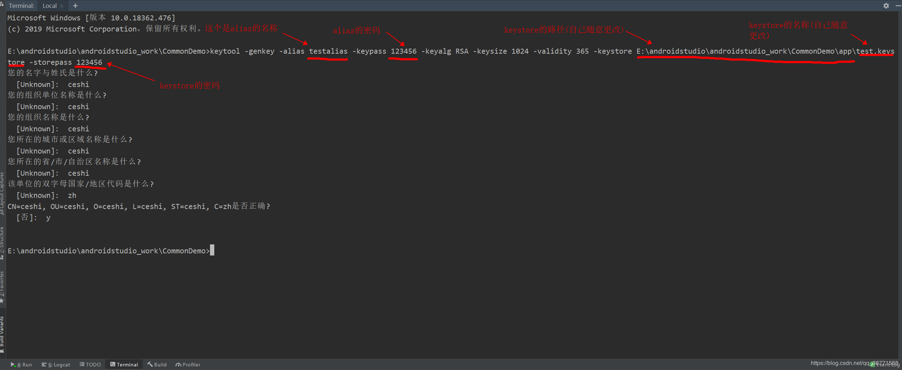

# APK的打包 与 反编译
apk的本质是一个压缩包，查看一个文件属于什么类型可以**通过查看文件的前几个字节进行判断**。比如JPRG图片的文件头是FFD8FF PNG图片的文件头是89504E47，ZIP文件头是504B0304

## 打包apk
打包成apk有两种方式，一种是通过Android studio 工具进行打包，另一种是通过Gradle进行打包

###  使用Android studio工具打包
1. 选择Build ->Generate Signed Bundle/APK
2. 使用命令行生成keystore文件，生成过程中可能会遇到报错 密码库格式不对错误
3. 生成之后包的位置在app->release目录下
4. 最后一步，选中release或者debug包，选中 V1、V2 ，点击完成

如果使用 AS 工具生成 keystore 文件出现下面错误时，使用命令行进行生成

```
JKS 密钥库使用专用格式。建议使用 "keytool -importkeystore -srckeystore E:\androidstudio\androidstudio_work\CommonDemo\app\fast_keystore.jks -destkeystore E:\androidstudio\androidstudio_work\CommonDemo\app\fast_keystore.jks -deststoretype pkcs12" 迁移到行业标准格式 PKCS12。
```

#### 使用命令行工具生成keystore文件
```
keytool -genkey -alias testalias -keypass 123456 -keyalg RSA -keysize 2048 -validity 36500 -keystore /Users/mlive/Desktop/test.keystore -storepass 123456 
点击确定之后会出现让你输入详细信息的，可以直接回车，最后确定时输入y, keypass和storepass两个密码需要一致，不然打包会有问题
```


column0 | column1 |
------- | ------- |
 genkey | 生成文件
 alias | 别名- testalias
 keypass | alias文件密码- 123456
 keyalg | 加密算法- RSA
 validity | 有效期,以天为单位
 keystore | 文件输出路径，文件名称是- test.keystore
 storepass | 文件密码- 123456

  1.  查看证书信息`keytool -list -v -keystore "test.keystore"`
  2.  修改keystore密码：keytool -storepasswd -keystore 文件名  执行后会提示输入证书的当前密码，和新密码以及重复新密码 确认。
  3.  修改别名：keytool -changealias -keystore my.keystore 文件名 -alias 别名 -destalias 新别名
  
### 使用Gradle打包
1. 在项目根目录下的`gradle.properties`文件下配置数据
  ```Kotlin
  KEY_PATH=/Users/mlive/Desktop/test.keystore //keystore文件路径
  KEY_PASS=123456 //keystore密码
  ALIAS_NAME=testalias  //alias 别名
  ALIAS_PASS=123456  //alias密码
  ```
2. 编辑 `app/build.gradle`文件，在`android`闭包中添加闭包内容
  ```Kotlin
      signingConfigs{   //这个闭包是新添加的配置
            config{
                storeFile file(KEY_PATH)
                storePassword KEY_PASS
                keyAlias ALIAS_NAME
                keyPassword ALIAS_PASS
            }
        }
        buildTypes {
            release {
                minifyEnabled false
                proguardFiles getDefaultProguardFile('proguard-android-optimize.txt'), 'proguard-rules.pro'
                signingConfig signingConfigs.config  //这里设置打包的配置
            }
        }
  ```
3. 配置完成之后，选择右侧Gradle工具->项目名称->app->Tasks->build. 双击`assembleAndroidTest`是只打测试包，双击`assemble`测试包和正式包都会打，打包之前双击`clean`,清除掉之前的打包信息
#### 使用Gradle打多个渠道包
1. 编辑 `app/build.gradle`文件，在`android`闭包中添加闭包内容 添加以下内容
```kotlin
   flavorDimensions "default"
    productFlavors{
        qihoo{
            // 这里可以重写defaultConfig里面配置的东西
            applicationId "com.beautiful.livephoto"
        }
        baidu{
             // 这里可以重写defaultConfig里面配置的东西
            applicationId "com.beautiful.livephoto.baidu"
        }
    }
```
2. 配置完成之后，选择右侧Gradle工具->项目名称->app->Tasks->build,可以看到新增了`assembleBaidu` 和`assembleQihoo`两个渠道
3. 如果是需要差异化的内容，可以在src目录下新建一个baidu文件夹，文件夹下增加res文件和java文件来进行区分

## 代码混淆
打包的时候为了避免别人轻易破解我们的apk，通常的做法是加上代码混淆，注意混淆有一定的规则，四大组件是不允许被混淆的。`minifyEnabled = true`是开启混淆，混淆的具体规则是在
```xml
<!-- 如果debug的时候没有崩溃，release打包之后崩溃，通过配置debug进行混淆可以检查是否是打包混淆代码时出现问题 -->
buildTypes {
    release {
        minifyEnabled false
        shrinkResources false
        proguardFiles getDefaultProguardFile('proguard-android.txt'), 'proguard-rules.pro'
    }

    debug{
        minifyEnabled false
        shrinkResources false
        proguardFiles getDefaultProguardFile('proguard-android.txt'), 'proguard-rules.pro'
    }
}
```
* `proguard-android.txt`：代表系统默认的混淆规则配置文件，该文件在`<Android SDK目录>/tools/proguard`下，一般不要更改该配置文件，因为也会作用于其它项目。
* `proguard-rules.pro`：代码表当前Project的混淆配置文件，在app module下，可以通过修改该文件来添加适用当前项目的混淆规则。


## 反编译
使用 apktool 工具对 apk 包进行反编译，目前我掌握的方式有两种

### 第一种方式
* `jadx`:  下载`jadx`,[点击下载](https://github.com/skylot/jadx/releases)

apk包后缀改成`.zip`，解压之后会看到`classes.dex`文件
下载文件之后解压,运行bin文件夹下的`jadx-gui`文件，把`classes.dex`文件放到对应的界面中，可以直接查看。


### 第二种方式
* `apktool` : 获取资源文件，提取图片和布局文件， [点击下载](https://ibotpeaches.github.io/Apktool/install/)
* `dex2jar` : 将apk包反编译成java源码 (classes.dex文件转化成jar文件) [点击下载](https://github.com/pxb1988/dex2jar/releases)
* `JD-GUI` : 查看apk总 classes.dex转化出来的jar文件，即源码文件 [点击下载](http://java-decompiler.github.io/)

### apktool
1. 根据系统不同下载对应的`script`，因为是`shell`语法，文件名改为`apktool.sh`
2. 下载和`apktool.jar`文件(下载的jar文件名必须是apktool.jar，不能是apktool-2.0.1.jar这样的形式)
3. 把`apktool.sh` 和`apktool.jar`文件放在系统目录`/usr/local/bin`文件下，给对应的文件赋予运行权限
```shell
chmod a+x apktool.sh
chmod a+x apktool.jar
```
4. 运行`/usr/local/bin/apktool.sh`命令查看 apktool是否安装成功 
5. 执行`apktool.sh d xxx.apk`命令,该方法会反编译出**资源文件和smail文件**，注意日志，**反编译出的文件会放在当前目录下**


### dex2jar
1. 解压下载好的`dex2.jar`文件
2. 将获取的apk文件后缀名改为`.zip`,解压之后获取到`classes.dex文件`
3. 运行命令行 `./d2j-dex2jar.sh  classes.dex`
4. 如果解压成功，会出现`classes-dex2jar.jar`文件，运行`JD-GUI`查看该文件即可

>如果出现 Permission Denied 异常，是因为当前运行的文件缺少权限，一般报哪个文件就修改对应文件权限即可 `chmod a+x ./dex2jar-2.0/d2j_invoke.sh`

如果出现`Detail Error Information in File ./classes-error.zip`
`Please report this file to http://code.google.com/p/dex2jar/issues/entry if possible.` 的错误提示，是因为下载的dex2版本不是最新版本.   [点击跳转到最新版本](https://github.com/pxb1988/dex2jar/releases)


### JD-GUI
解压 JD-GUI 压缩包，双击 JD-GUI 图标打开，把`classes.dex`转化出来的 jar 文件放进去即可