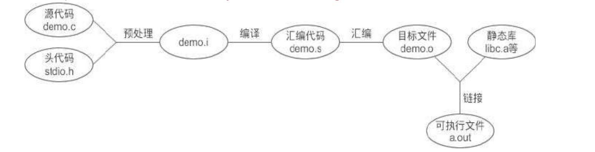

# 编译过程
对于平常应用程序的开发，很少有人会关注编译和链接的过程，因为我们使用的工具一般都是流行的集成开发环境（IDE），比如 `Visual Studio`、`Dev C++`、`C-Free` 等。这些功能强大的 IDE 通常将编译和链接合并到一起，也就是构建（Build）或运行（Run）。即使在 Linux 下使用命令行来编译一个源文件，简单的一句`$gcc demo.c` 也包含了非常复杂的过程。

比如经典的“Hello World”,使用最简单的$gcc demo.c 命令，就可以在当前目录下看到 a.out。
```c
#include <stdio.h>
int main(){
    printf("Hello World\n");
    return 0;
}
```

事实上，从源代码生成可执行文件可以分为四个步骤，分别是`预处理（Preprocessing）` -> `编译（Compilation）` -> `汇编（Assembly）` -> `链接（Linking）`。下图是 GCC 生成 a.out 的过程：


## 预处理（Preprocessing）
预处理过程主要是处理那些源文件和头文件中以#开头的命令，比如 #include、#define、#ifdef 等。预处理
的规则一般如下：
```markdown
* 将所有的 `#define` 删除，并展开所有的宏定义。
* 处理所有条件编译命令，比如 `#if、#ifdef、#elif、#else、#endif` 等。
* 处理 `#include` 命令，将被包含文件的内容插入到该命令所在的位置，这与复制粘贴的效果一样。注意，这个过程是递归进行的，也就是说被包含的文件可能还会包含其他的文件。
* 删除所有的注释`//和/* ... */`。
* 添加行号和文件名标识，便于在调试和出错时给出具体的代码位置。
* 保留所有的`#pragma`命令，因为编译器需要使用它们。
```

预处理的结果是生成`.i` 文件。`.i`文件也是包含 C 语言代码的源文件，只不过所有的宏已经被展开，所有包含的文件已经被插入到当前文件中。当你无法判断宏定义是否正确，或者文件包含是否有效时，可以查看`.i `文件来确定问题。

在 GCC 中，可以通过下面的命令生成.i 文件,：
```shell
gcc -E main.c -o main.i # -E 表示只进行预编译。-o 表示输出的文件
```
在 Visual Studio 中，在当前工程的属性面板中将“预处理到文件”设置为“是”。然后点击“运行（Run）”或者“构建（Build）”按钮，就能在当前工程目录中看到 demo.i 。

## 编译（Compilation）
编译就是把预处理完的文件进行一些列的词法分析、语法分析、语义分析以及优化后生成相应的汇编代码文件。编译是整个程序构建的核心部分，也是最复杂的部分之一，涉及到的算法较多，有兴趣的读者请查看《编译原理》。
在 GCC 中，可以使用下面的命令生成.s 文件：
```shell
$gcc -S demo.i -o demo.s
# 或者
$gcc -S demo.c -o demo.s
```
在 Visual Studio 中，不用进行任何设置就可以在工程目录下看到 demo.asm 文件。

## 汇编（Assembly）
汇编的过程就是将汇编代码转换成可以执行的机器指令。大部分汇编语句对应一条机器指令，有的汇编语句对应多条机器指令。

汇编过程相对于编译来说比较简单，没有复杂的语法，也没有语义，也不需要做指令优化，只是根据汇编语句和机器指令的对照表一一翻译就可以了。

汇编的结果是产生目标文件，在 GCC 下的后缀为.o，在 Visual Studio 下的后缀为.obj。

## 链接（Linking）
目标文件已经是二进制文件，与可执行文件的组织形式类似，只是有些函数和全局变量的地址还未找到，程序不能执行。**链接的作用就是找到这些目标地址，将所有的目标文件组织成一个可以执行的二进制文件**。

预处理和汇编的过程都比较简单，有了上面的介绍，相信大家很容易理解。

编译的过程最为复杂，可以细分为词法分析、语法分析、语义分析和指令优化，这里涉及到诸多算法以及正则表达式，我们并不打算深入分析，也没必要，有兴趣的读者请自行查阅《编译原理》。

**而目标文件的结构、可执行文件的结构、链接的过程是我们要重点研究的，它能够让我们明白多文件编程以及模块化开发的原理，这是大型项目开发的基石。**

最后需要说明的是：汇编的过程非常简单，仅仅是查表翻译，我们通常把它作为编译过程的一部分，不再单独提及。这样，源文件经过预处理、编译和链接就生成了可执行文件。