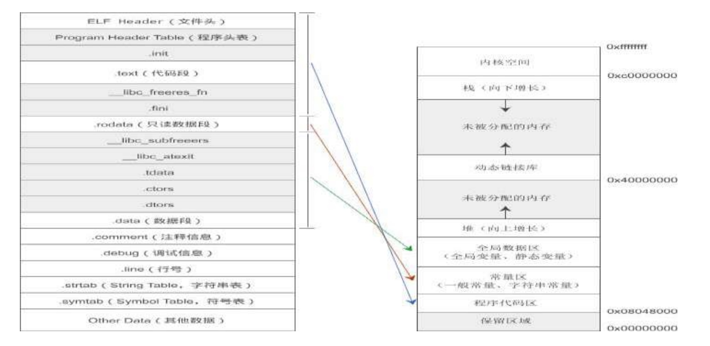
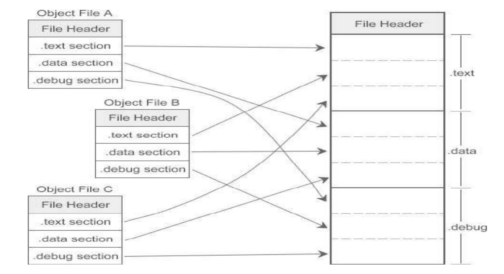

# 目标文件和可执行文件里面都有什么？
编译器编译源代码后生成的文件叫做目标文件`（Object File）`，例如 Visual Studio 下的`.obj`，或者 GCC 下的`.o`。

从文件结构上来讲，目标文件已经是二进制文件，它与可执行文件的组织形式非常类似，只是有些变量和函数的地址还未确定，程序不能执行。链接的一个重要作用就是找到这些变量和函数的地址。

另外需要明确的是：编译是针对单个源文件的，有几个源文件就会生成几个目标文件，并且在生成过程中不受其他源文件的影响。也就是说，不管当前工程中有多少个源文件，编译器每次只编译一个源文件、生成一个目标文件。

## Windows 和 Linux 下的文件格式
现在 PC 平台上流行的可执行文件格式主要是 Windows 下的 `PE（Portable Executable）`和 Linux 下的 `ELF（Executable Linkable Format）`，它们都是 `COFF（Common File Format）`格式的变种。

COFF 是 Unix V3 首先提出的规范，微软在此基础上制定了 PE 格式标准，并将它用于 Windows。后来 Unix V4 又在 COFF 的基础上引入了 ELF 格式，被 Linux 广泛使用。这也就是为什么 Windows 和 Linux 上的可执行文件如此相似的主要原因，因为它们都是源于同一种可执行文件格式 COFF。

从广义上讲，目标文件与可执行文件的存储格式几乎是一样的，我们可以将它们看成是同一种类型的文件，在Windows 下，将它们统称为 PE 文件，在 Linux 下，将它们统称为 ELF 文件。

另外，动态链接库`（DLL，Dynamic Linking Library）`（Windows 下的.dll和 Linux 下的.so）和静态链接库`（Static Linking Library）`（Windows 下的.lib 和 Linux 下的.a）也是按照可执行文件的格式存储的。

静态链接库稍有不同，它是把多个目标文件捆绑在一起形成一个文件，再加上一些索引，你可以简单地把它理解为一个包含了很多目标文件的包。

其他不太常见的可执行文件格式还有 Intel/Microsoft 的 OMF（Object Module Format）、Unix a.out、MS-DOS .COM 等

----
在 Linux 的 ELF 标准中，主要包含以下四类文件:

文件类型 | 说明 | 实例
------- | ------- | -------
可重定位文件`（Relocatable File）` | 这类文件包含了代码和数据，可以被用来链接成为可执行文件或动态链接库。静态链接库其实也是可重定位文件。 | Linux 下的 .o 和 .a，Windows 下的 .obj 和 .lib。
可执行文件`（Executable File）` | 这类文件包含了可以直接执行的程序 | Windows 下的 .exe，Linux 下的可执行文件没有固定的后缀，一般不写。
共享目标文件`（Shared Object File）` | 这种文件包含了代码和数据，可以在以下两种情况下使用：一种是链接器可以使用这种文件跟其他的可重定位文件和共享目标文件链接，产生新的目标文件；第二种是动态连接器可以将几个共享目标文件与可执行文件结合，作为进程的一部分来运行。 | Linux 下的 .so，Windows 下的 .dll。
核心转储文件`（Core Dump File）` | 当进程意外终止时，系统可以将该进程的地址空间的内容以及其他信息保存到核心转储文件。|  Linux 下的 core dump

## 目标文件的组织形式
从整体上看，编译生成的目标文件被划分成了多个部分，每个部分叫做一个段（Section）。下图是 Linux GCC
生成的目标文件的格式：


段名大都以`.`作为前缀，表示这些名字是系统保留的。下面是对各个部分的说明：

段 名 | 说 明
------- | -------
`ELF Header` | 文件头，描述了整个目标文件的属性，包括是否可执行、是动态链接还是静态链接?入口地址是什么?目标硬件、目标操作系统、段表偏移等信息。
`.text` | 代码段，存放编译后的机器指令，也即各个函数的二进制代码。一个 C 语言程序由多个函数构成，C 语言程序的执行就是函数之间的相互调用。
`.data` |  数据段，存放全局变量和静态变量。
`.rodata` | 只读数据段，存放一般的常量、字符串常量等。
`.rel.text.` |  重定位段，包含了目标文件中需要重定位的全局符号以及重定位入口。
`.comment` |  注释信息段，存放的是编译器的版本信息，比如“GCC:(GUN) 4.2.0”。
`.debug` |  调试信息。
`.line` |  调试时的行号表，即源代码行号与编译后指令的对应表。
`Section Table` | 段表，描述了 ELF 文件包含的所有段的信息，比如段的名字、段的长度、在文件中的偏移、读写权限以及其他属性。可以说，ELF 文件的段结构是由段表来决定的，编译器、链接器和装载器都是依靠段表来定位和访问各个段的。
`.strtab` |  字符串表，保存了 ELF 文件用到的字符串，比如变量名、函数名、段名等。因为字符串的长度往往是不定的，所以用固定的结构来表示它比较困难，常见的做法就是把字符串集中起来存放到一个表中，然后使用字符串在表中的偏移来引用字符串。
`.symtab` |  符号表，保存了全局变量名、局部变量名、函数名等在字符串表中的偏移。

除了这些系统保留的段名，应用程序也可以使用其它名字定义自己的段，比如可以在 ELF 文件中插入一个叫做 music 的段来保存 MP3 音乐。应用程序自定义的的段不建议使用`.`作为前缀，否则容易和系统保留段发生冲突。

## 可执行文件的组织形式
可执行文件的组织形式和目标文件非常类似，也被划分成多个部分，如下图所示：



图中左半部分是可执行文件的结构：带阴影的是可执行文件增加的一些段，另外可执行文件删除了可重定位段`（.rel.text 和.rel.data）`以及段表（`Section Table）`。

总体来说，目标文件包含了 10 个左右的段，而可执行文件包含了将近 30 个左右的段，上面的两张图只列出了一些关键段，剩下的段都隐藏在`“Other Data（其他数据）”`。

图中右半部分是进程的地址空间，这在《Linux 下 C 语言程序的内存布局（内存模型）》一节已经进行了详细讲解。

不同颜色的箭头表明了可执行文件应该被加载到地址空间的哪一个区域，可以发现，操作系统并不是为每个段都分配一个区域，而是将多个具有相同权限的段合并在一起，加载到同一个区域。

站在文件结构的角度，可执行文件包含了众多的段`（Section）`，每个段都有不同的作用；站在加载和执行的角度，所有的段都是数据，操作系统只关心数据的权限，只要把相同权限的数据加载到同一个内存区域，程序就能正确执行。

常见的数据权限无外乎三种：`只读（例如 .rodata 只读数据段`）、`读写（例如 .data 数据段）`、`读取和执行（例如 .text 代码段）`，我们将一块连续的、具有相同权限的数据称为一个 Segment，一个 Segment 由多个权限相同的 Section 构成。

不巧的是，“Segment”也被翻译为“段”，但这里的段（Segment）是针对加载和执行的过程。

----

在 Linux 下，相信很多读者都遇到过一种叫做 Segment fault（段错误）的错误，这种错误发生在程序执行期间，在编译和链接时无法检测，一般都是代码的权限不足导致的。例如：
```c
#include <stdio.h>
char *str = "c.biancheng.net";
int main(){
    str[1] = '@';
    return 0;
}
```
程序执行到 4 行时就会出现`“Segment fault（段错误）”`，这是因为字符串 str 保存在地址空间的常量区，只能读取，不能写入，而修改字符串显然是越权操作。

在目标文件中，段表`（Section Table）`用来描述各个 Section 的信息，包括它的名字、长度、在文件中的偏移、读写权限等，通过段表可以详细地了解目标文件的结构。

而在可执行文件中，段表被删除了，取代它的是`程序头表（Program Header Table）`；程序头表用来描述各个 Segment 的信息，包括它的类型、偏移、在进程虚拟地址空间中的起始地址、物理装载地址、长度、权限等。操作系统就是根据程序头表将可执行文件加载到内存，并为各个 Segment 分配内存空间、确定起止地址。

也就是说，可执行文件不再关注具体的文件结构，而是关注程序的加载和执行过程。

由于可执行文件在加载时实际上是被映射的虚拟地址空间，所以可执行文件很多时候又被叫做映像文件（Image）。

## 段（Section）的合并
编译器生成的是目标文件，而我们最终需要的是可执行文件，`链接（Linking）`的作用就是将多个目标文件合并成一个可执行文件。

在链接过程中，链接器会将多个目标文件中的代码段、数据段、调试信息等合并成可执行文件中的一个段。段的合并仅仅是一个简单的叠加过程，如下图所示：


除了合并有用的段（例如代码段、数据段等），链接器还会删除多余的段（例如重定位段、段表等），增加其他段（例如程序头表等）。