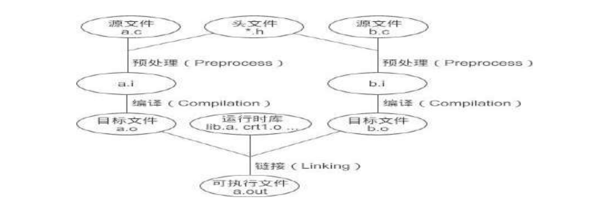

# 符号-链接的粘合剂
`链接（Linking`）就是通过符号将各个模块组合成一个独立的程序的过程。

链接的主要内容就是把各个模块之间的相互引用部分处理好，使得各个模块能够正确地衔接。链接器所做的主要工作跟前面提到的“人工调整地址”本质上没有什么两样，只不过现代的高级语言拥有诸多的特性，使得编译器和链接器更为复杂，功能更为强大，但从原理上来讲，无非是找到符号的地址，或者把指令中使用到的地址加以修正。这个过程称为`符号决议（Symbol Resolution`）或者`重定位（Relocation）`。

对于简单的 C 语言程序，链接过程如下图所示。每个模块的源文件（.c 和 .h）先被编译成目标文件，再和系统库一起链接成可执行文件。库（Library）其实是一组目标文件的包，是将一些最常用的代码编译成目标文件后打包存放。


系统库这个概念比较模糊，专业一点应该叫做运行时库`（Runtime Library）`。“运行时”就是程序运行期间，“运行时库”包含了程序运行期间所需要的基本函数，是程序运行不可或缺的，例如输入输出函数 printf()、scanf()，内存管理函数 malloc()、free() 等。

链接过程并没有想象中的复杂，它还是一个比较容易理解的概念。

--------

假设一个程序有两个模块 `main.c` 和` module.c`，我们在 module.c 中定义了函数 func()，并在 main.c 中进行了多次调用，当所有模块被编译成一个可执行文件后，每一处对 func() 函数的调用都会被替换为一个绝对地址。

但由于每个模块都是单独编译的，编译器在处理 main.c 时并不知道 func() 的地址，所以需要把这些调用 func() 的指令的目标地址搁置，等到最后链接的时候再由链接器将这些地址修正。

如果没有链接器，我们必须手工修正 func() 的地址。当 module.c 被修改并重新编译时，func() 的地址极有可能改变，那么在 main.c 中所有使用到 func() 函数的地方，都要全部重新调整地址。这些繁琐的工作将成为程序员的噩梦。

有了链接器，我们可以直接调用其他模块中的函数而无需知道它们的地址，因为在链接的时候，链接器会根据符号 func 自动去 module.c 模块查找 func 的地址，然后将 main.c 模块中所有使用到 func 的指令重新修正，让它们的目标地址成为真正的 func() 函数的地址。

**这种在程序运行之前确定符号地址的过程叫做`静态链接（Static Linking）`；如果需要等到程序运行期间再确定符号地址，就叫做`动态链接（Dynamic Linking）`。**

Windows 下的 .dll 或者 Linux 下的 .so 必须要嵌入到可执行程序、作为可执行程序的一部分运行，它们所包含的符号的地址就是在程序运行期间确定的，所以称为`动态链接库（Dynamic Linking Library）`。

变量和函数一样，都是符号，都需要确定它的地址。例如在 a.c 中有一个 int 类型的全局变量 var，现在需要在b.c 中对它赋值 42，对应的 C 语言代码是：
```c
var = 100;
```
对应的汇编代码为：
```c
mov 0x2a, var
```
mov 用来将一份数据移动到一个存储位置，这里表示将 0x2a 移动到 var 符号所代表的位置，也就是对 var 变量赋值。

当被编译成目标文件后，得到如下的机器指令：
```c
c705 00000000 0000002a
```
由于在编译时不知道变量 var 的地址，编译器将这条 mov 指令的目标地址设置为 0，等到将目标文件 a.o 和b.o 链接起来的时候，再由链接器对其进行修正。

假设生成可执行文件后变量 var 的地址为 0x1100，那么上面的机器指令就变为：
```c
c705 00001100 0000002a
```
这种地址修正的过程就是前面提到的重定位，每个需要被修正的地方叫做一个`重定位入口（Relocation Entry）`。重定位所做的工作就是给程序中每个这样的绝对地址引用的位置“打补丁”，使它们指向正确的地址。

## 符号的概念
函数和变量在本质上是一样的，都是地址的助记符，在链接过程中，它们被称为`符号（Symbol）`。链接器的一个重要任务就是找到符号的地址，并对每个重定位入口进行修正。

我们可以将符号看做是链接中的粘合剂，整个链接过程正是基于符号才能正确完成。

在《目标文件里面有什么，它是如何组织的》一节中讲到，目标文件被分成了多个部分，其中有一个叫做`符号表（Symbol Value）`，它的段名是.symtab。符号表记录了当前目标文件用到的所有符号，包括：
```markdown
1. `全局符号`，也就是函数和全局变量，它们可以被其他目标文件引用。
2. `外部符号（External Symbol`），也就是在当前文件中使用到、却没有在当前文件中定义的全局符号。
3. `局部符号`，也就是局部变量。它们只在函数内部可见，对链接过程没有作用，所以链接器往往也忽略它们。
4. `段名`，这种符号往往由编译器产生，它的值就是该段的起始地址，比如.text、.data 等。
```
对链接来说，最值得关注的是全局符号，也就是上面的第一类和第二类，其它符号都是次要的。

所有的符号都保存在`符号表.symtab` 中，它一个结构体数组，每个数组元素都包含了一个符号的信息，包括符号名、符号在段中的偏移、符号大小（符号所占用的字节数）、符号类型等。

确切地说，真正的符号名字是保存在`字符串表.strtab` 中的，符号表仅仅保存了当前符号在字符串表中的偏移。

## 符号决议（Symbol Resolution）
当要进行链接时，链接器首先扫描所有的目标文件，获得各个段的长度、属性、位置等信息，并将目标文件中的所有（符号表中的）符号收集起来，统一放到一个全局符号表。

在这一步中，链接器会将目标文件中的各个段合并到可执行文件，并计算出合并后的各个段的长度、位置、虚拟地址等。

在目标文件的符号表中，保存了各个符号在段内的偏移，生成可执行文件后，原来各个段（Section）起始位置的虚拟地址就确定了下来，这样，使用起始地址加上偏移量就能够得到符号的地址（在进程中的虚拟地址）。

>这种计算符号地址的过程被称为`符号决议（Symbol Resolution）`。


重定位表`.rel.text` 和`.rel.data` 中保存了需要重定位的全局符号以及重定位入口，完成了符号决议，链接器会根据重定位表调整代码中的地址，使它指向正确的内存位置。

至此，可执行文件就生成了，链接器完成了它的使命。

## 全局变量和局部变量
当程序被加载到内存后，全局变量要在数据区（全局数据区）分配内存，局部变量要在栈上分配内存。

数据区在程序运行期间一直存在，全局变量的位置不会改变，地址也是固定的，所以在链接时就能够计算出全局变量的地址。而栈区内存会随着函数的调用不断被分配和释放，局部变量的地址不能预先计算，必须等到发生函数调用时才能确定，所以链接过程会忽略局部变量。

关于局部变量的定位，在《一个函数在栈上到底是怎样的》中已经进行了讲解，就是 `ebp `加上偏移量，这在编译阶段就能给出计算公式（一条简单的语句），程序运行后，只要执行这条语句，就能够得到局部变量的地址。

>总结起来，链接的一项重要任务就是确定函数和全局变量的地址，并对每一个重定位入口进行修正。

## 强符号和弱符号
在编写代码的过程中经常会遇到一种叫做`符号重复定义（Multiple Definition）`的错误，这是因为在多个源文件中定义了名字相同的全局变量，并且都将它们初始化了。

例如，在 a.c 中定义了全局变量 global：
```c
int global = 10;
```
在 b.c 中又对 global 进行了定义：
```c
int global = 20;
```
那么在链接时就会出现下面的错误：
```
b.o: multiple definition of `global'
a.o: first defined here
```
这种符号的定义可以被称为强符号。

-----

**在 C 语言中，编译器默认函数和初始化了的全局变量为`强符号（Strong Symbol`），未初始化的全局变量为`弱符号（Weak Symbol）`。**强符号之所以强，是因为它们拥有确切的数据，变量有值，函数有函数体；弱符号之所以弱，是因为它们还未被初始化，没有确切的数据。

链接器会按照如下的规则处理被多次定义的强符号和弱符号：
```markdown
1. 不允许强符号被多次定义，也即不同的目标文件中不能有同名的强符号；如果有多个强符号，那么链接器会报符号重复定义错误。
2. 如果一个符号在某个目标文件中是强符号，在其他文件中是弱符号，那么选择强符号。
3. 如果一个符号在所有的目标文件中都是弱符号，那么选择其中占用空间最大的一个。
```

比如目标文件 a.o 定义全局变量 global 为 int 类型，占用 4 个字节，目标文件 b.o 定义 global 为 double 类型，占用 8 个字节，那么被链接后，符号 global 占用 8 个字节。请尽量不要使用多个不同类型的弱符号，否则有时候很难发现程序错误。

----

在 GCC 中，可以通过`__attribute__((weak))`来强制定义任何一个符号为弱符号。假设现在有下面的一段代码：
```c
extern int ext;
int weak1;
int strong = 100;
__attribute__((weak)) weak2 = 2;
int main(){
    return 0;
}
```
weak1 和 weak2 是弱符号，strong 和 main 是强符号，而 ext 既非强符号也非弱符号，它是一个对外部变量的引用（使用）。

为了加深理解，我们不妨再来看一个多文件编程的例子。main.c 源码：
```c
#include <stdio.h>
//弱符号
__attribute__((weak)) int a = 20;
__attribute__((weak)) void func(){
    printf("C Language\n");
}
int main(){
    printf("a = %d\n", a);
    func();
    return 0;
}
```
module.c 源码：
```c
#include <stdio.h>
//强符号
int a = 9999;
void func(){
    printf("c.biancheng.net\n");
}
```
在 GCC 中，使用下面的命令来运行程序：
```c
$gcc main.c module.c
$./a.out
a = 9999
c.biancheng.net
```
在 main.c 中，a 和 func 都是弱符号，在 module.c 中，a 和 func 都是强符号，强符号会覆盖弱符号，所以链接器最终会使用 module.c 中的符号，输出结果也印证了这一点。

> 需要注意的是，`__attribute__((weak))`只对链接器有效，对编译器不起作用。
 
编译器不区分强符号和弱符号，只要在一个源文件中定义两个相同的符号，不管它们是强是弱，都会报“重复定义”错误。请看下面代码：
```c
#include <stdio.h>
__attribute__((weak)) int a = 20;
int a = 9999;
int main(){
    printf("a = %d\n", a);
    return 0;
}
```
这段代码在编译阶段就会报错，编译器会认为变量 a 被定义了两次，属于重复定义。

>弱符号对于库来说十分有用，我们在开发库时，可以将某些符号定义为弱符号，这样就能够被用户定义的强符号覆盖，从而使得程序可以使用自定义版本的函数，增加了很大的灵活性。