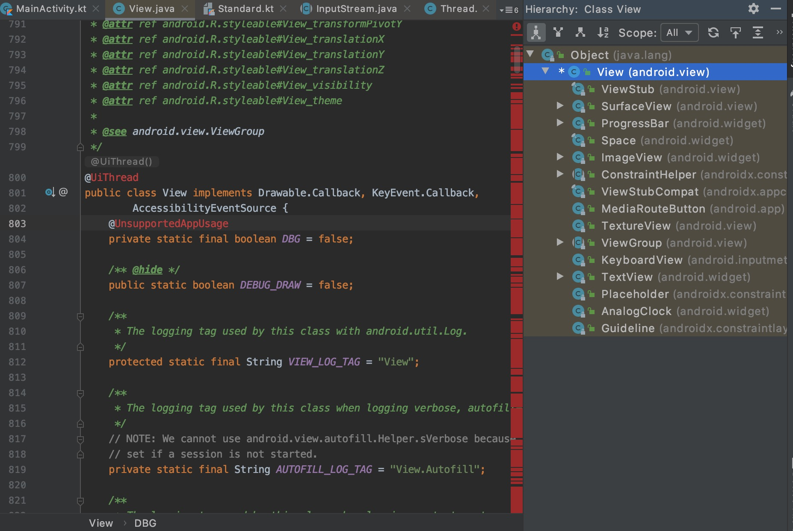

# 自定义控件
首先分清什么是View，什么是ViewGroup。

View的定义，只能自己单独使用的
ViewGroup的定义，可以包含View或者ViewGoup的

ViewGroup继承自View很多控件都继承自View，ctrl + shift + a, 搜索View，选中View类，control + h，查看继承关系


## 自定义View的类型
* 自定义组合控件
* 自定义View（包括对现有View的修改）
* 自定义ViewGrop


## 继承view
必须重写三个构造方法，xml中直接引用布局文件调用的是中间的构造方法,使用this方法调用最后的构造方法，使入口统一
```kotlin
class CustomView: RelativeLayout {

    constructor(context: Context?): this(context,null){

    }

    constructor(context: Context?, attrs: AttributeSet?): this(context,attrs,0){

    }

    constructor(context: Context?,attrs: AttributeSet?,defStyleAttr: Int): super(context,attrs,defStyleAttr){
        initPaint()
    }

    private fun initPaint() {
       val view = LayoutInflater.from(context).inflate(R.layout.custom_view,this,false)
        addView(view)
        // LayoutInflater.from(context).inflate(R.layout.custom_view,this,true)
        // LayoutInflater.from(context).inflate(R.layout.custom_view,this)
        // 这三句等价，默认是true
    }

}
```

LayoutInflater 方法详解
```kotlin
加载xml文件必须要用到LayoutInflater接口类，LayoutInflater.from(context)找到布局文件，调用inflate方法加载布局文件，
第一个参数是资源id
第二个参数是父控件
第三个参数如果是YES，直接添加到父布局，如果是false，是只创建一个view
public View inflate(@LayoutRes int resource, @Nullable ViewGroup root, boolean attachToRoot) { {
    
}
```

## 添加控件属性
创建控件属性三步，创建xml文件，初始化中获取属性，xml布局文件中赋值
### 创建xml文件
在res/value文件夹内创建attres.xml文件
```kotlin
<?xml version="1.0" encoding="utf-8"?>
<resources>
    <declare-styleable name="InputNumberView">
        <attr name="min" format="integer"></attr>
        <attr name="max" format="integer"></attr>
        <attr name="step" format="integer"></attr>
        <attr name="disable" format="boolean"></attr>
        <attr name="btnColor" format="color|reference"></attr> // 同时兼容多个属性
        <attr name="valueSize" format="dimension"></attr>
    </declare-styleable>
</resources>
```

#### fromat属性
| format属性 | 作用 |
| --- | --- |
| Integer | 行数，TextView的maxLine，就是Integer类型 |
| enum | 枚举类型，比如说gravity，left,top,bottom,center,right这些是枚举类型 |
| boolean | 布尔类型，比如说layout_alignParentRight |
| dimension | 尺寸比如说size,margin_left这些，单位为px,dp,sp这些 |
| color | 颜色 |
| flags | 标记，比如说我们学习activity声明周期时的configChanges |
| float | 浮点数，也就是小数，比如说，透明度alpha |
| fraction | 百分数，比如说动画的开始位置，fromDx |
| refrence | 引用，比如说background，src，有同学可能有疑问了，background可以是color又可以是refrence，怎么整呢？ 其实是可以多个的哈，比如说：name="switch_time" format="integer|float"，可以是Integer类型，或者float类型 |
| string | 文字 |

### 获取属性
在view的构造方法中，获取自定义属性
```kotlin
constructor(context: Context?,attrs: AttributeSet?,defStyleAttr: Int): super(context,attrs,defStyleAttr){
    // 获取属性值
    initAttres(context, attrs)
    // 初始化界面
    initView()
    // 添加点击事件
    initEvent()
}

private fun initAttres(context: Context?, attrs: AttributeSet?) {
    if (context?.obtainStyledAttributes(attrs, R.styleable.InputNumberView) != null) {
        // 获取相关属性
        val a = context.obtainStyledAttributes(attrs, R.styleable.InputNumberView)
        val min = a.getInteger(R.styleable.InputNumberView_min, 0)
        val max = a.getInteger(R.styleable.InputNumberView_max, 0)
        val step = a.getInteger(R.styleable.InputNumberView_step, 0)
        val disable = a.getBoolean(R.styleable.InputNumberView_disable, false)
        val valueSize = a.getDimension(R.styleable.InputNumberView_valueSize,16f)
        val btnColor = a.getResourceId(R.styleable.InputNumberView_btnColor,R.color.colorAccent)

        // 回收对象
        a.recycle()
    }
}
```

> getDimension()方法需要注意的是，获取到的值会根据屏幕进行缩放

| dpi | 分辨率 | 倍数 |
| --- | --- | --- |
| mdpi | 160dpi	| 1X |
| hdpi | 240dpi	| 1.5X |
| xhdpi | 320dpi | 2X |
| xxhdpi | 480dpi | 3X |
| xxxhdpi | 640dpi | 4X |

### 在xml布局文件中使用属性
```kotlin
<?xml version="1.0" encoding="utf-8"?>
<LinearLayout xmlns:android="http://schemas.android.com/apk/res/android"
    xmlns:tools="http://schemas.android.com/tools"
    android:layout_width="match_parent"
    android:layout_height="match_parent"
    xmlns:app="http://schemas.android.com/apk/res-auto" // 命名空间
    android:orientation="vertical"
    android:background="@color/colorPrimary"
    android:gravity="center"
    tools:context=".MainActivity">

  <com.cool.testfragment.InputNumberView // 自定义View，min、max等是自定义的属性值
      android:id="@+id/num_view"
      app:min="10"
      app:max="100"
      app:step="20"
      app:valueSize="20dp"
      app:disable="false"
      app:btnColor="@color/colorAccent"
      android:layout_width="wrap_content"
      android:layout_height="wrap_content"></com.cool.testfragment.InputNumberView>

</LinearLayout>
```


## 页面回调
自定义视图的回调都是通过定义接口类(Interface)来进行实现的，类似于iOS的代理
```kotlin
class InputNumberView: LinearLayout {

    private var value: Int = 0
    private  lateinit var numValue : EditText
    // 接口属性
    private lateinit var mOnNumberChangeListener: OnNumberChangeListener

    // 重写init方法
    constructor(context: Context?): super(context){
        initView()
        initEvent()
    }

    constructor(context: Context?, attrs: AttributeSet?): super(context,attrs){
        initView()
        initEvent()
    }

    constructor(context: Context?,attrs: AttributeSet?,defStyleAttr: Int): super(context,attrs,defStyleAttr){
        initView()
        initEvent()
    }

    private fun initEvent(){
        add_btn.setOnClickListener {
            value ++;
            updateText()
        }
    }

    private fun initView(){
        LayoutInflater.from(context).inflate(R.layout.input_number_view,this)
        numValue = findViewById(R.id.number_edit)
    }

    private fun updateText(){
        numValue.setText(value.toString())
        mOnNumberChangeListener.onNumberChange(value)
    }

    // 设置谁来实现接口回调
    fun setOnNumberChangeListener(listener: OnNumberChangeListener){
        this.mOnNumberChangeListener = listener
    }
    
    // 定义接口
    interface OnNumberChangeListener{
        // 定义接口方法
        fun onNumberChange(value:Int)
    }

}
```

实现接口
```kotlin

class MainActivity : AppCompatActivity(), InputNumberView.OnNumberChangeListener {

    override fun onCreate(savedInstanceState: Bundle?) {
        super.onCreate(savedInstanceState)
        setContentView(R.layout.activity_main)
        num_view.setOnNumberChangeListener(this)
    }

    override fun onNumberChange(value: Int) {
        Log.d("TAG", "$value")
    }
}
```