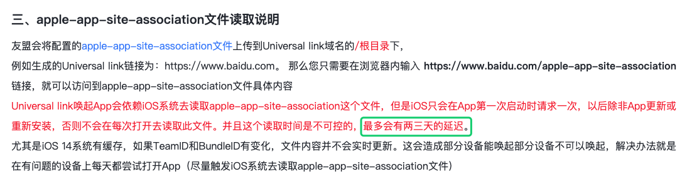
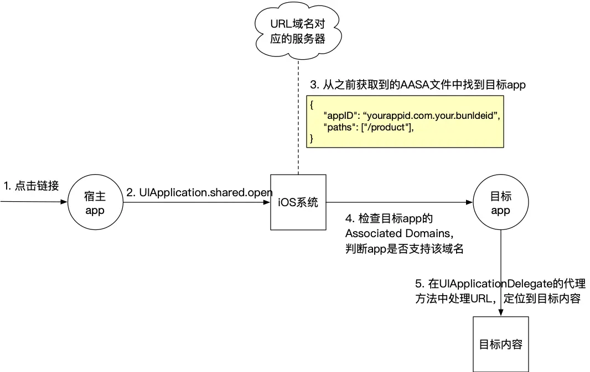
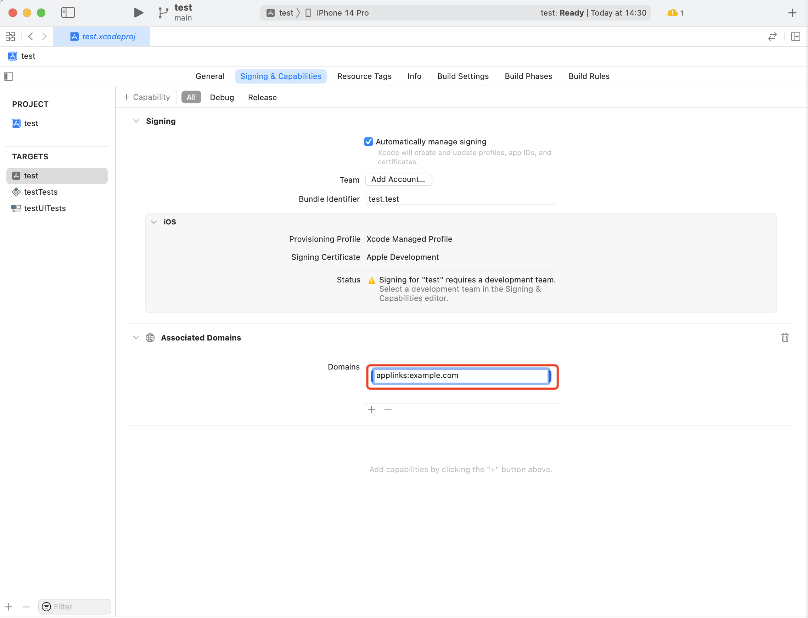

# 通用链接(Universal Link)

## 一、什么是 Universal Link？
**1.背景介绍**

Universal Link 是苹果在 WWDC 2015 上提出的 iOS 9 的新特性之一。此特性类似于深层链接，并能够方便地通过打开一个 Https 链接来直接启动您的客户端应用(手机有安装 App)。对比以往所使用的 URLSheme，这种新特性在实现 web-app 的无缝链接时，能够提供极佳的用户体验。使用前请阅读苹果官方文档 - Support Universal Links

由于苹果 iOS 13 系统版本安全升级，微信 SDK1.8.6 版本要求支持 Universal Links 方式跳转，以便进行合法性校验，提升安全性。详情请参考微信官方文档 - iOS 接入指南

**2.特点**

Universal Link 可以无缝链接到 app 或网页，主要应用场景有内容分享和广告投放。它有如下特点：

* 如果安装了 app，会直接打开 app，并定位到内容页；
* 如果没有安装 app，使用浏览器打开该链接；

**3.运行机制原理&流程图**

当 App 初次安装后或者更新版本后的第一次启动（第二次启动就不会），向工程配置的 applinks: 的域名请求 apple-app-site-association 配置文件；
App 自动的将 apple-app-site-association 配置文件向 iOS 系统配置；
当任何 WebView 发起 UniversalLink 的 url 的时候，系统遍历注册过的通用链接，如果命中则直接打开 App 触发 Delegate 方法；如果没命中，WebView 继续跳转加载 url。
以上都是系统默默替你做的，我们要做的就是确保配置的正确性。


## 二、 配置教程
### 1. 第一步：开启 `Associated Domains` 服务
### 2. 第二步：服务器配置 `apple-app-site-association（AASA）` 文件

>AASA（apple-app-site-association）文件是一个位于 根目录 或 /.well-known 文件夹下面的 json 文件 （例如: https://your_domain/apple-app-site-association 或 https://your_domain/.well-known/apple-app-site-association），里面描述了目标 app 的信息。AASA 文件和 entitlements 为网站和 app 提供了互相认证的机制。


#### 2.1  创建 `apple-app-site-association` 文件

创建 `apple-app-site-association` 文件,必须命名为 `apple-app-site-association`，切记没有后缀，有些人的电脑是隐藏文件后缀的，务必把 .json 后缀去掉。文件内容如下，根据自己真实信息进行配置
```json
{
  "applinks": {
    "apps": [], // apps：是限制只能在这几个app中使用，基本上不填写，所以是空数组
    "details": [ // 可以配置一个，也可配置多个
      {
        "appID": "9JA89QQLNQ.com.apple.wwdc", // appID：是由TeamId + . + BundleId组成
        "paths": ["*"] // paths：设定你的app支持的路径列表，只有这些指定路径的链接，才能被app所处理。"*"的写法代表了可识别域名下所有链接
      },
      {
        "appID": "ABCD1234.com.apple.wwdc",
        "paths": ["/app/*", "/qq_conn/appid/*"] // "/app/*"是自己定义的路径；"/qq_conn/appid/*"需要根据QQ互联平台设置，appid是QQ互联后台对应应用的APPID
      }
    ]
  }
}
```

#### 2.2 将 apple-app-site-association 文件上传到服务器
* 你的服务器必须支持 HTTPS 协议，并且拥有该域名下上传到根目录的权限；
* 将这个文件上传到你的服务器，可以将这个文件放到服务器的 `根目录` 下，也可以放到 `.well-known` 这个子目录下，这是为了苹果能获取到你上传的文件；
* 该文件的 `content-type` 需要设置成 `application/json`，可以直接在 oss 上进行修改；
* 上传完成后，对应的链接分别为`https://xxx/apple-app-site-association`或`https://xxx/.well-known/apple-app-site-association`（xxx 为服务端的域名），然后试着访问一下，看看是否能够获取到，当你在浏览器中输入这个文件链接后，可以直接看到文件内容或者直接下载文件
* 校验 AASA 文件的有效性，AASA 文件的格式和命名会直接影响到 iOS 系统能否正常拉取、识别里面的内容，现在有一些工具可以校验 AASA 文件有效性。[三方检测工具](https://branch.io/resources/aasa-validator/)

### 3. 第三步：配置 Associated Domains（域名）

* 在 Xcode 中打开项目，选择目录中的 `xxx.xcodeproj`（xxx 通常为项目名称），在 `xxx.xcodeproj -> Signing&Capabilites -> Capability -> Associated Domains` 这个路径下进行配置；
* 在 `Associated Domains` 里面配置的 `Universal Links`，必须以 `applinks:` 为前缀，格式为：`applinks:+配置的域名`，例如：`applinks:test.com`


### 4. 第四步：验证通用连接（Universal Link）是否配置正确
测试时手机上必须安装你需要跳转的应用并配置 `Associated Domains`。在 Safari 输入 `Universal Links`。在页面顶部能看到“在 xxx APP 中打开”字样，点击“打开”按钮可以打开 app；

>注意：服务器上 `apple-app-site-association` 的更新不会让 iOS 本地的 `apple-app-site-association` 同步更新，即 iOS 一般只会在 APP 下载完后初次启动才会下载这个文件，所以如果修改了 `apple-app-site-association` 文件，请删除 APP 后重新下载.


# 文章原文
*[iOS 配置通用链接(Universal Link)服务端和开发者后台都配置好了，还是跳转不到App](https://blog.csdn.net/IT_Scratch/article/details/133987117)