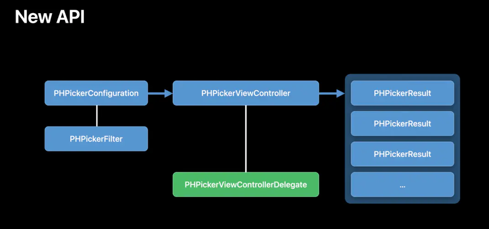

# iOS权限
在我们使用APP中，如果需要定位、相机、相册、蓝牙等权限时，需要首先在 info.plist 文件中添加对应的请求权限，在使用相关功能时，会先弹出对应的提示。

## info.plist文件
在开发中，如果要使用相关权限时，首先需要在 info.plist 文件中添加对应的请求权限，告诉用户我们为什么要使用这个权限。
```xml
麦克风权限：Privacy - Microphone Usage Description  是否允许此App使用你的麦克风？
相机权限： Privacy - Camera Usage Description  是否允许此App使用你的相机？
相册权限： Privacy - Photo Library Usage Description  是否允许此App访问你的媒体资料库？
保存图片到相册 ： Privacy - Photo Library Additions Usage Description
通讯录权限： Privacy - Contacts Usage Description  是否允许此App访问你的通讯录？
蓝牙权限：Privacy - Bluetooth Peripheral Usage Description  是否许允此App使用蓝牙？
语音转文字权限：Privacy - Speech Recognition Usage Description  是否允许此App使用语音识别？
定位权限 iOS8 - iOS10: Privacy - Location Always Usage Description
APP使用期间获取定位信息(仅限应用在前台)：Privacy - Location When In Use Usage Description
允许一直获取定位信息(包括前台和后台): Privacy - Location Always and When In Use Usage Description
日历权限：Privacy - Calendars Usage Description
媒体库权限：Privacy - Media Library Usage Description
健康分享权限：Privacy - Health Share Usage Description
健康更新权限：Privacy - Health Update Usage Description
运动使用权限：Privacy - Motion Usage Description
音乐权限：Privacy - Music Usage Description
提醒使用权限：Privacy - Reminders Usage Description
Siri使用权限：Privacy - Siri Usage Description
电视供应商使用权限：Privacy - TV Provider Usage Description
视频用户账号使用权限：Privacy - Video Subscriber Account Usage Description
面部ID权限 ：Privacy - Face ID Usage Description
使用NFC功能： Privacy - NFC Scan Usage Description
```

## 定位权限
使用定位权限，需要在info.plist文件中添加以下权限
```
定位权限 iOS8 - iOS10: Privacy - Location Always Usage Description
APP使用期间获取定位信息(仅限应用在前台)：Privacy - Location When In Use Usage Description
允许一直获取定位信息(包括前台和后台): Privacy - Location Always and When In Use Usage Description
```
项目中需要导入`#import <MapKit/MapKit.h>`库,`CLLocationManager`类进行定位，使用时必须在主线程进行调用，不能设置成局部变量进行使用。

定位的相关状态:
```
typedef NS_ENUM(int, CLAuthorizationStatus) {
	kCLAuthorizationStatusNotDetermined = 0, // 用户尚未选择
	kCLAuthorizationStatusRestricted, // 用户选择受限，可能没有亲自拒绝授权
	kCLAuthorizationStatusDenied, // 用户明确拒绝
	kCLAuthorizationStatusAuthorizedAlways , // 用户允许授权
};
```

相关的API:
```
@property(assign, nonatomic) CLLocationDistance distanceFilter; // 每隔多少米定位一次
@property(assign, nonatomic) CLLocationAccuracy desiredAccuracy; // 定位精确度（越精确就越耗电）
@property(assign, nonatomic) BOOL allowsBackgroundLocationUpdates;// 临时开始后台定位
-(void) startUpdatingLocation; // 开始用户定位
-(void) stopUpdatingLocation; // 停止用户定位
- (void)requestWhenInUseAuthorization; // 只有app在前台运行时,才可以定位
- (void)requestAlwaysAuthorization; // 无论app在前台还是后台运行,都可以定位
```
>临时开启后台定位需要在Xcode中的`Background Modes`勾选`Location updates`

相关代理:
```
// iOS14之前更新状态
- (void)locationManager:(CLLocationManager *)manager didChangeAuthorizationStatus:(CLAuthorizationStatus)status;
// iOS14以后更新授权状态
- (void)locationManagerDidChangeAuthorization:(CLLocationManager *)manager;
// 更新定位信息
- (void)locationManager:(CLLocationManager *)manager
	 didUpdateLocations:(NSArray<CLLocation *> *)locations;
```
### 完整代码示例
首先使用`CLLocationManager`类，设置调用精度，隔多少米调用，开始定位
```objc
-(void)startLocation
{
    if([CLLocationManager locationServicesEnabled] && [CLLocationManager authorizationStatus] != kCLAuthorizationStatusDenied)
    {
        _manager = [[CLLocationManager alloc] init];
        _manager.delegate = self;
        _manager.desiredAccuracy = kCLLocationAccuracyBest;
        [_manager requestAlwaysAuthorization];
        _manager.distanceFilter = 100;
        [_manager startUpdatingLocation];
    }
}
```
获取回调信息
```objc
- (void)locationManager:(CLLocationManager *)manager didChangeAuthorizationStatus:(CLAuthorizationStatus)status{
    // 定位权限变化通知 
}

- (void)locationManagerDidChangeAuthorization:(CLLocationManager *)manager{
    if (@available(iOS 14.0, *)) {
       // 定位权限变化通知 manager.authorizationStatus;
    }
}

- (void)locationManager:(CLLocationManager *)manager didUpdateLocations:(NSArray<CLLocation *> *)locations{
    // 获取当前经纬度
    float latitude = locations.firstObject.coordinate.latitude;
    float longitude = locations.firstObject.coordinate.longitude;

    // 获取经纬度之后停止定位
    [manager stopUpdatingLocation];
}

```

## 相机相册权限
iOS8 以后苹果逐渐使用 Photos 代替 AssetsLibrary,这里主要使用Photos实现访问系统相册。项目中需要引入Photos和PhotoUI库`#import <PhotosUI/PhotosUI.h>`。

在 iOS14 的时候苹果加强了对用户隐私的保护，增加了`Limited Photo Library Access`模式，用户可以对相册中的单张图片进行授权，不需要访问整个相册。访问相册权限时弹窗更改为：
* `Select Photo(选择照片)`: 限制访问，点击之后会弹出系统的图片选择界面选择资源，APP 只能访问用户选择的资源。
* `Allow Access to All Photos(允许访问所有照片)`: 可以访问所有的资源。
* `Don't Allow(不允许)`: 不允许访问资源

```objc
typedef NS_ENUM（NSInteger，PHAuthorizationStatus）{
    PHAuthorizationStatusNotDetermined = 0, // 用户尚未对此应用程序做出选择
    PHAuthorizationStatusRestricted, // 此应用程序无权访问照片数据。 用户无法更改此应用程序的状态，可能是由于活动限制。 例如家长控制到位。
    PHAuthorizationStatusDenied, // 用户已明确拒绝此应用程序访问照片数据。
    PHAuthorizationStatusAuthorized, // 用户已授权此应用程序访问照片数据。
    PHAuthorizationStatusLimited API_AVAILABLE(ios(14)), // 用户已授权此应用程序访问有限的照片库。
};
```
在 iOS14 中，请求权限的方法更改为:
```objc
typedef NS_ENUM(NSInteger, PHAccessLevel) {
    PHAccessLevelAddOnly = 1, // 仅允许添加
    PHAccessLevelReadWrite = 2, // 允许读写
} 
+ (PHAuthorizationStatus)authorizationStatusForAccessLevel:(PHAccessLevel)accessLevel
+ (void)requestAuthorizationForAccessLevel:(PHAccessLevel)accessLevel handler:(void(^)(PHAuthorizationStatus status))handler 
```
废弃的API：
```objc
+ (PHAuthorizationStatus)authorizationStatus 
+ (void)requestAuthorization:(void(^)(PHAuthorizationStatus status))handler 
```

iOS 14 中系统新增了一个图片选择器PHPicker，官方建议使用 PHPicker 来替代原有的UIImagePickerController(iOS14以下使用)进行图片选择 。UIImagePickerController只能选中一张图片已经不符合需求了，将逐渐被废弃替换。


`PHPickerConfiguration`配置 PHPicker，`selectionLimit `设置为0表示多选，大于1表示只可选中一张图片，默认值为1；`filter`设置想要的相册资源类型，包括imagesFilter、videosFilter、livePhotosFilter，亦可以设置为数组`@[videoFilter,livePhotosFilter]`显示多种类型。

将 `PHPhotoLibraryPreventAutomaticLimitedAccessAlert = YES` 添加到应用程序的 Info.plist 关闭系统自动弹窗。如果你想手动提醒用户可以选择更多图片使用`[[PHPhotoLibrary sharedPhotoLibrary] presentLimitedLibraryPickerFromViewController:self];`

* 查询权限
```objc
PHAuthorizationStatus status = [PHPhotoLibrary authorizationStatusForAccessLevel:PHAccessLevelReadWrite];
  switch (status) {
      case PHAuthorizationStatusLimited:
          NSLog(@"limited");
          break;
      case PHAuthorizationStatusDenied:
          NSLog(@"denied");
          break;
      case PHAuthorizationStatusAuthorized:
          NSLog(@"authorized");
          break;
      default:
          break;
}
```

* 请求权限
```objc
[PHPhotoLibrary requestAuthorizationForAccessLevel:PHAccessLevelReadWrite handler:^(PHAuthorizationStatus status) {
    switch (status) {
        case PHAuthorizationStatusLimited:
        {
            //用户选择Limited模式，限制App访问有限的相册资源
            NSMutableArray<UIImage *> *images = [NSMutableArray array];
            //获取可访问的图片配置选项
            PHFetchOptions *option = [[PHFetchOptions alloc] init];
            //根据图片的创建时间升序排序返回
            option.sortDescriptors = @[[NSSortDescriptor sortDescriptorWithKey:@"creationDate" ascending:YES]];
            //获取类型为image的资源
            PHFetchResult *result = [PHAsset fetchAssetsWithMediaType:PHAssetMediaTypeImage options:option];
                //遍历出每个PHAsset资源对象
            [result enumerateObjectsUsingBlock:^(id  _Nonnull obj, NSUInteger idx, BOOL * _Nonnull stop) {
                PHAsset *asset = (PHAsset *)obj;
                //将PHAsset解析为image的配置选项
                PHImageRequestOptions *requestOptions = [[PHImageRequestOptions alloc] init];
                //图像缩放模式
                requestOptions.resizeMode = PHImageRequestOptionsResizeModeExact;
                //图片质量
                requestOptions.deliveryMode = PHImageRequestOptionsDeliveryModeHighQualityFormat;
                //PHImageManager解析图片
                [[PHImageManager defaultManager] requestImageForAsset:asset targetSize:PHImageManagerMaximumSize contentMode:PHImageContentModeDefault options:requestOptions resultHandler:^(UIImage * _Nullable result, NSDictionary * _Nullable info) {
                    NSLog(@"图片 %@",result);
                    //在这里可以自定义一个显示可访问相册资源的viewController.
                    [images addObject:result];
                }];
            }];
            break;
        }
        case PHAuthorizationStatusDenied:
        {
            NSLog(@"denied");
        }
            break;
        case PHAuthorizationStatusAuthorized:
        {
            //用户选择"允许访问所有照片"，调用PHPickerViewController显示图片选择器
            dispatch_async(dispatch_get_main_queue(), ^{
                PHPickerConfiguration *configuration = [[PHPickerConfiguration alloc] init];
                //只获取image类型资源
                configuration.filter = [PHPickerFilter imagesFilter];
                    //可以多选
                configuration.selectionLimit = 0;
                PHPickerViewController *pickerVC = [[PHPickerViewController alloc] initWithConfiguration:configuration];
                pickerVC.delegate = self;
                pickerVC.modalPresentationStyle = UIModalPresentationFullScreen;
                [self presentViewController:pickerVC animated:YES completion:^{
                }];
            });  
        }
            break;
        default:
            break;
    }
}];
```

## 通讯录权限
通讯录权限首先要导入`#import <Contacts/Contacts.h>`库，首先需要请求对应的通讯录权限。

```objc
typedef NS_ENUM(NSInteger, CNAuthorizationStatus)
{
    CNAuthorizationStatusNotDetermined = 0, // 用户没有选择权限
    CNAuthorizationStatusRestricted,    // 因为其他原因无法访问通讯录权限，比如家长控制
    CNAuthorizationStatusDenied,    // 明确拒绝
    CNAuthorizationStatusAuthorized     //  授权允许
}
```
如果使用`CNContactFetchRequest`可以请求对应的权限，回调是在异步线程，如果需要更新UI，需要在主线程

请求权限
```objc
+ (void)mm_requestContacts:(void(^)(void))deniedBlock addres:(void(^)(NSArray*))addres{
    CNAuthorizationStatus status = [CNContactStore authorizationStatusForEntityType:CNEntityTypeContacts];
    if (status == CNAuthorizationStatusNotDetermined) {
        CNContactStore *store = [[CNContactStore alloc] init];
        [store requestAccessForEntityType:CNEntityTypeContacts completionHandler:^(BOOL granted, NSError*  _Nullable error) {
            if (error) {
                NSLog(@"授权失败");
                dispatch_async(dispatch_get_main_queue(), ^{
                    deniedBlock();
                });
            }else {
                NSLog(@"成功授权");
                [self openContact:addres];
            }
        }];
    }else if(status == CNAuthorizationStatusRestricted){
        NSLog(@"用户拒绝");
        dispatch_async(dispatch_get_main_queue(), ^{
            deniedBlock();
        });
    }else if (status == CNAuthorizationStatusDenied){
        NSLog(@"用户拒绝");
        dispatch_async(dispatch_get_main_queue(), ^{
            deniedBlock();
        });
    }else if (status == CNAuthorizationStatusAuthorized) { //有通讯录权限-- 进行下一步操作
        [self openContact:addres];
    }
}
```
用户允许权限之后，我们可以`CNContactStore`和`CNContactFetchRequest`获取通讯录信息，**注意回调这里还是子线程，如果需要更新UI或者其他操作，先回到主线程。**
```objc
+ (void)openContact:(void(^)(NSArray*))responseBlock{

    // 获取指定的字段,并不是要获取所有字段，需要指定具体的字段
    NSArray *keysToFetch = @[CNContactGivenNameKey, CNContactFamilyNameKey, CNContactPhoneNumbersKey];
    CNContactFetchRequest *fetchRequest = [[CNContactFetchRequest alloc] initWithKeysToFetch:keysToFetch];
    CNContactStore *contactStore = [[CNContactStore alloc] init];
    
    // 如果成功获取返回YES
    NSError *error;
    __block NSMutableArray *addresAry = [NSMutableArray array];
    BOOL isSuccess =  [contactStore enumerateContactsWithFetchRequest:fetchRequest error:&error usingBlock:^(CNContact * _Nonnull contact, BOOL * _Nonnull stop) {
        
        NSString *givenName = contact.givenName;
        NSString *familyName = contact.familyName;
          NSLog(@"givenName=%@, familyName=%@", givenName, familyName);
        //拼接姓名
        NSString *nameStr = [NSString stringWithFormat:@"%@%@",contact.familyName,contact.givenName];
        
        NSArray *phoneNumbers = contact.phoneNumbers;
        
        for (CNLabeledValue *labelValue in phoneNumbers) {
            //遍历一个人名下的多个电话号码
            NSString *label = labelValue.label;
            CNPhoneNumber *phoneNumber = labelValue.value;
            
            NSString * string = phoneNumber.stringValue ;
            
            //去掉电话中的特殊字符
            string = [string stringByReplacingOccurrencesOfString:@"+86" withString:@""];
            string = [string stringByReplacingOccurrencesOfString:@"-" withString:@""];
            string = [string stringByReplacingOccurrencesOfString:@"(" withString:@""];
            string = [string stringByReplacingOccurrencesOfString:@")" withString:@""];
            string = [string stringByReplacingOccurrencesOfString:@" " withString:@""];
            string = [string stringByReplacingOccurrencesOfString:@" " withString:@""];
            
            NSLog(@"姓名=%@, 电话号码是=%@", nameStr, string);
            NSDictionary *dict = @{@"name":nameStr,@"phone":string};
            [addresAry addObject:dict];
        }
        
        //    *stop = YES; // 停止循环，相当于break；
    }];
    
    if (isSuccess || error) { // 注意： 这里还是子线程
        dispatch_async(dispatch_get_main_queue(), ^{
            responseBlock([addresAry copy]);
        });
    }
}
```