# 下载IPA历史版本 - 2023 版
* Windows系统，可以是虚拟机，可以是ARM 版本
* iTunes 12.6.5 64bit，[下载地址](https://secure-appldnld.apple.com/itunes12/091-87819-20180912-69177170-B085-11E8-B6AB-C1D03409AD2A6/iTunes64Setup.exe)
* `Charles Proxy`，官网下载，免费试用就够用了

#### 操作步骤
首先，先安装`iTunes` 到 Windows 当中，我在Windows 11 ARM 64 版本会遇到错误讯息，但不影响操作，直接按忽略跳过就好了。
1. 打开`iTunes`，点选选单 -> 编辑菜单，把`Apps` 的选项打开，再切换到`Apps`。中文是应用
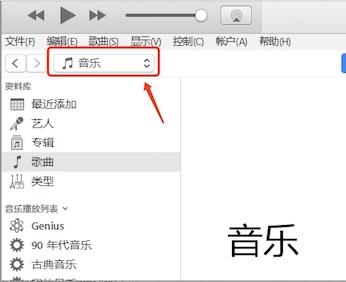
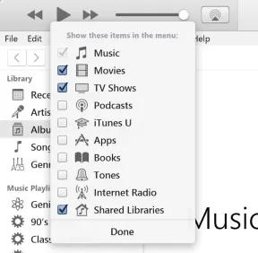

2. 接着登入`iCloud / iTunes` 帐号，然后搜寻你要降级的 App。找到 App 之后，`iTunes` 先停在这个画面就好。
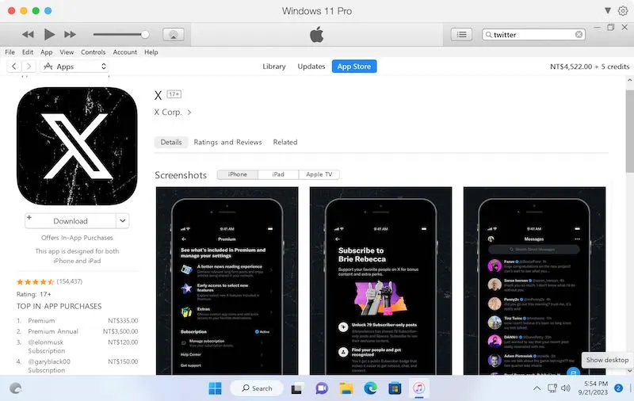
 
3. 接下来我们安装`Charles`，安装完毕开启，选择「`Help」→ 「SSL Proxying」→ 「Install Charles Root Certificate」`。
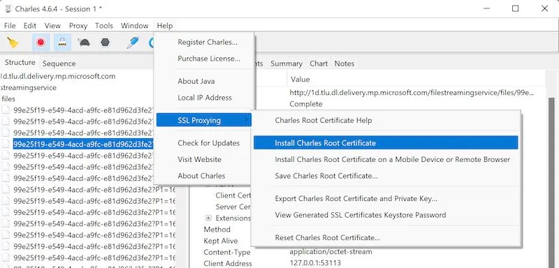

4. 之后在跳出的视窗按安装，选择**当前用户**，在下一个步骤要按下方图片的方式选择`「Trusted Root Certification Authorities」`（中文叫 受信任的根证书颁发机构），之后就一路`「下一步」`安装证书即可
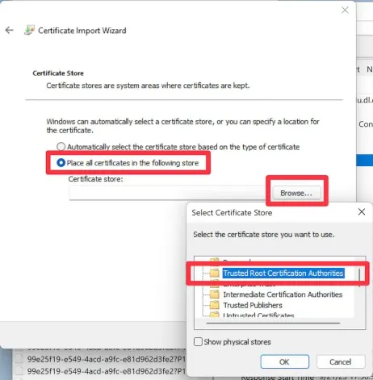

>回到`iTunes`，按下载 App，这时候`Charles` 左边会出现一个`「pxx-buy.itunes.apple.com」`的纪录，xx 的数字每个人会不一样。

5. 按右键对`「pxx-buy.itunes.apple.com」`选择`「Enable SSL Proxying」`跟`「Breakpoints」`
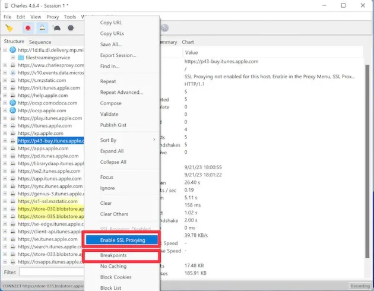

之后，回到iTunes，选择App 本地的资源库，把刚刚下载的App 删除，并选择丢到垃圾桶，然后再重新下载一次App
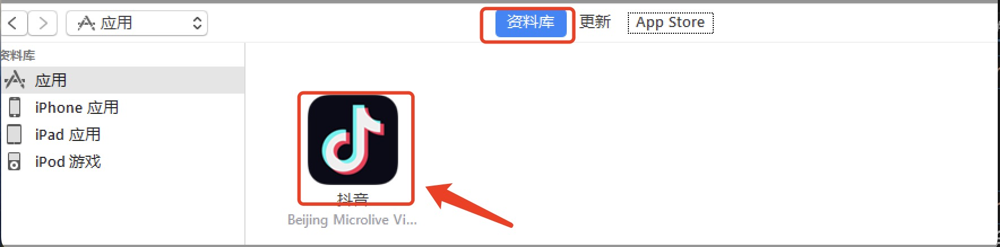

6. 这时候`Charles` 会跳出一个视窗，上面选择`「Edit Request」`，下面选择`「Text」`就会看到我们发出去的下载请求，这边有个`「appExtVrsId」`就是版本号，我们稍后会需要**修改这个版本号指定下载旧版**。不过因为目前我们还不知道旧版的号码是什么，所以这边就先不管他，按`「Execute」`继续执行。
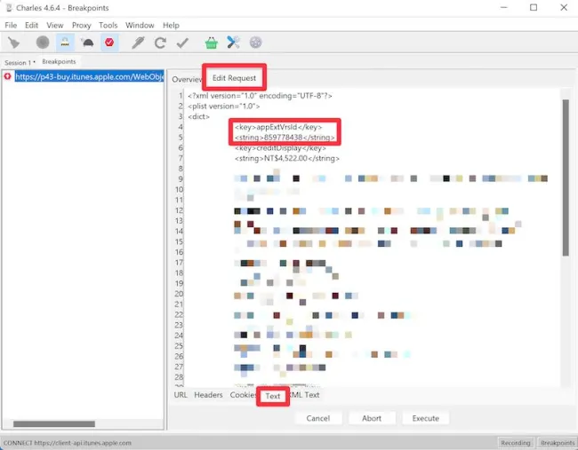

7. 接下来 Charles 又会再跳一次视窗，上面选择`「Edit Response」`，下面选择`「Text」`就会看到伺服器传回来的回应，这边有一个`「softwareVersionExternalIdentifiers」`就是各个版本的代号，越下面的数字越新，所以通常我们就是回推一下要降级的版本是倒数第几个号码就行了。

    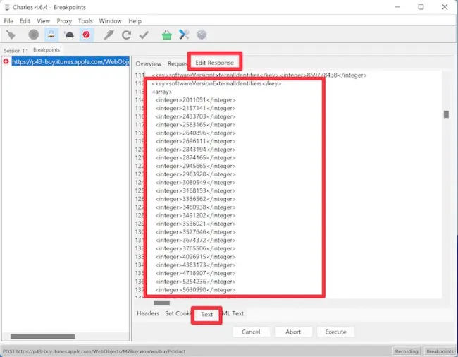

以最后一版图示还是鸟的Twitter 来说，版本是9.67，对应数字是「858502327」，这边先把数字记下来就好，然后Charles 就继续一直按「Execute」，直到App 下载回本地，我们再去资料库里面删除。 

8. 再来我们要第三次下载App，这一次在Charles 第一次跳视窗的时候，带入我们要的数字进去，改好之后一路Execute 到底，让 iTunes 去下载App
    
    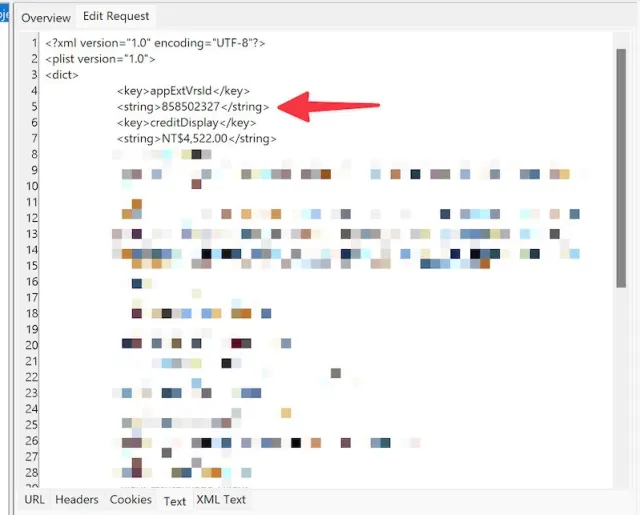

9. 下载完之后你会发现怎么图示还是「X」，这是因为iTunes 会去抓最新版本的图示，但若查看资讯的话，会看到确实下载的版本是9.67 版

    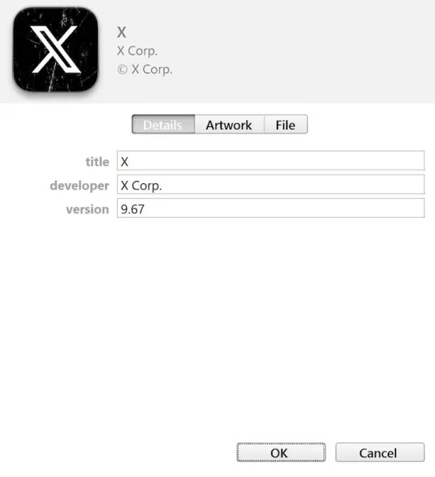

10. [非必须步骤] 因为IPA 档案其实都是zip 压缩档，所以可以用编辑zip 的软体打开，例如我用BetterZip。然后把`iTunesMetadata.plist` 删除，再储存整个IPA，这样当这个IPA 安装到手机上的时候，App Store 不会跳出关于这个App 的更新，也就是说可以不必担心误触更新把旧版App 洗掉了！

    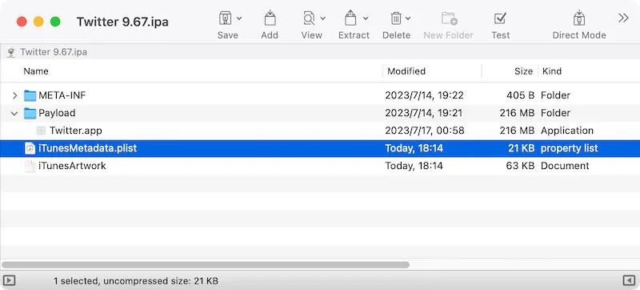

#### IPA 安装方式
1. 用`iMazing`，接上手机之后选择「Manage Apps」，然后把IPA 档案拖进去里面就好了
2. 手机连上爱思助手，点击我的设备 -> 打开应用游戏，直接把IPA拖进去就可以了
3. 通过这种方式下载的IPA，安装到其他手机,打开APP会提示需要登录下载的Apple ID

## 文章来源
* [旧版iOS App 下载方法- 2023 版](https://hiraku.dev/2023/09/7521/)