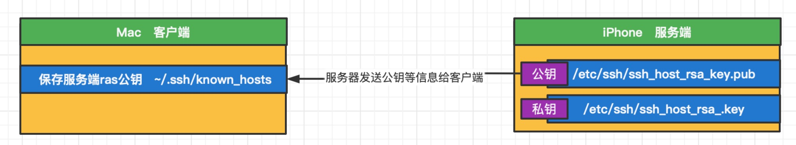
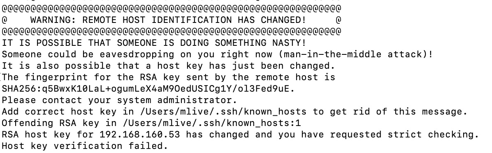
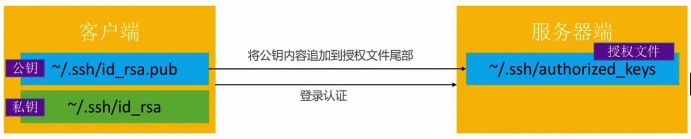
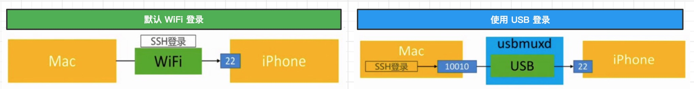

# SSH
iOS 和 Mac OSX 都是基于Darwin(苹果的一个基于Unix的开源系统内核)，所以iOS设备同样支持终端的命令行操作，在逆向工程中，我们经常会通过命令行来操作iPhone。

为了能够让Mac终端中的命令行能作用到iPhone设备上，我们首先需要让 Mac 和 iPhone 建立链接。当我们连接远程服务器时，可以通过 ssh 的方式进行连接，同样的操作适用于 iPhone。我们可以把 iPhone 当做一个远程服务端，通过 ssh 进行连接。

SSH 是`Secure Shell`的缩写，意为安全外壳协议，是一种可以为远程登录提供安全保障的协议。使用SSH，可以把所有传输的数据进行加密，中间人攻击的方式就不可能实现，并且 SSH 能够防止DNS欺骗和IP欺骗。

OpenSSH 是SSH协议的免费开源实现，可以通过OpenSSH的的方式让Mac远程登录到iPhone设备上。我们需要在越狱手机中通过Cydia商店安装OpenSSH。在商店首页有告诉我们如何使用OpenSSH登录iPhone,默认初始密码是`alpine`。

## SSH、OpenSSH - SSL、OpenSSL
在使用 Cydia 安装OpenSSH的过程中，我们会发现它首先安装了OpenSSl。这几个概念的关系是什么样的呢？

SSL 是`Secure Socket Layer`的缩写，是为网络通信提供安全及数据完整性的一种安全协议，在传输层对网络连接进行加密。`OpenSSL` 是 SSL 的开源实现，绝大部分HTTPS的请求等价于 `HTTP + OpenSSL`。

我们可以简单的理解为，SSH 和 SSL 是一种协议，OpenSSH 和 OpenSSL 是协议的具体实现。OpenSSH 的加密是通过 OpenSSL完成的。


## OpenSSH 登录服务端
SSH 是通过TCP协议通信，我们需要在Mac电脑通过命令行登录到手机，所以手机是服务端，电脑是客户端，后面的描述会使用客户端和服务端来代替电脑的手机。

我们需要保证Mac和iPhone在同一个局域网下，查看iPhone的IP地址可以通过 `设置->无限局域网->点击连接wifi右侧的感叹号图标` 进行查看。OpenSSH登录服务端的命令如下:
```markdown
1. ssh 用户名@IP地址 : 例如  `ssh root@192.168.2.1`
2. 如果是第一次登录手机会让你选择是否保存rsa秘钥   选择yes
3. 输入账号密码，默认初始密码是`alpine`。输入之后命令行左侧显示root表示登录成功
4. 退出登录: 输入`exit`
5. 修改root账号密码: 在登录成功之后输入`passwd`,输入新密码 、重复输入新密码 就可以了。下次登录需要输入新的密码。
6. 修改 mobile 账号密码: 在登录成功之后输入`passwd mobile`,输入新密码 、重复输入新密码 就可以了
```

iPhone设备上有`root` 和 `mobile`两个用户。mobile 是普通权限账户，只能操作一些普通文件，不能操作系统级别的文件,文件夹位置是`/var/mobile`,root 是最高权限账户,文件夹位置是`/var/root`。

登录 root 用户使用`ssh root@IP地址`,登录 mobile 用户是`ssh mobile@IP地址`。登录之后可以通过`pwd`查看当前路径，会发现两个用户的路径是不同的。下面是登录root用户的过程:
```shell
mlive@mliv .ssh % ssh root@192.168.16.119
The authenticity of host '192.168.16.119 (192.168.16.119)' can't be established.
RSA key fingerprint is SHA256:q5BwxK10LaL+ogumLeX4aM9OedUSICg1Y/ol3Fed9uE.
Are you sure you want to continue connecting (yes/no/[fingerprint])? yes
Warning: Permanently added '192.168.16.119' (RSA) to the list of known hosts.
root@192.168.16.119's password: 
senseitoutekiiPhone:~ root# 
```


## SSH的版本
SSH协议目前一共有2个版本,SSH-1 和 SSH-2。现在用的比较多的是SSH-2版本，客户端和服务端版本要保持一致才能通信。

客户端也就是Mac电脑查看 SSH 版本使用`cd /etc/ssh`切换到对应文件夹下,有`ssh_config`和`sshd_config`两个文件。
```markdown
* `ssh_config`文件表示当前客户端
* `sshd_config`文件表示当前是服务端
```
使用`cat ssh_config`查看ssh的版本号，在文件中会发现`Protocol 2`表示当前是SSH-2版本。

iPhone作为服务端，它的ssh文件位置同样在`/etc/ssh`目录下，使用`cat sshd_config`查看服务端的版本号，同样是`Protocol 2`,说明服务端和客户端SSH版本是一致的。

## SSH 连接过程
SSH 连接过程可以分为三步:
```markdown
1. 建立安全连接
2. 客户端认证
3. 数据传输
```
在建立安全连接的过程中，服务端会提供自己的身份证明，服务端的身份证明就是自己公钥的哈希,服务端的公钥信息是`/etc/ssh/ssh_host_rsa_key.pub`文件,私钥信息是`/etc/ssh/ssh_host_rsa_key`文件。

在我们第一次连接`ssh root@192.168.160.53`时，服务端将自己的公钥等信息发送给客户端，提示我们是否将服务器公钥信息保存在本地`~/.ssh/known_hosts`,输入 yes 同意保存之后,需要再输入服务端的密码，服务端校验通过后才会建立连接。如下图:

我们可以查看`known_hosts`文件保存的信息，文件内保存有 IP 和对应的 公钥信息。
```shell
192.168.160.53 ssh-rsa AAAAB3NzaC1yc2EAAAADAQABAAABgQC6ejv2Ef1AKz5ZRAJ4rCoOvb3atuUhEyY7PT03ay7NVwnDaPJywcN18G73P7Dvo576jpxrfgZsLQBZPHXp7XZXW1VnGaDPc/L6FlVEhrNXIRJeqfrPr7hsFS4lyJVvGkz5m3iSbGQImgJFoNZ+ck3RYSBjU9nc958Tau9sdk2IoDSqvGGiRUSnhJLUGsLRZioP1mor5La9PmEYPmxBdvqm+8Ap9ryX8hr7IY3WG/XzyQROK4LtEyHuAPYdG7fEboep3tQJ2epkbUrV35WDFHO9WiOuuyQLJSbnIuTxCbkJSZe9i4QQxsntYASTLKUzYw1ewOJmpl8JuDhsf+Nb3gyeAnlfVNRxDAQnjj1hFaH0LEKNVA2I0XhtcG6EUCu245Nx0oLRbPnVgih0VrdCqO85+/sUreWjvTPbmGQ2xnFAV8bMS4w6ofNyPqCAHq4QAVUgK4zelYH7zBAjt6PP5GGt+XhtT0FeAM7CUl6ws7lmaH5bsCX9ymZx3CARxdg5BiE=
```

每次我们通过电脑登录手机时，服务端都会将公钥信息发送过来让客户端进行检查，有时我们的手机会重新越狱，在IP不变的情况下,使用SSH登录的时候会提示我们可能存在中间人攻击的行为，如下图:

这是因为Mac电脑本地保存的服务端公钥和服务端本次发过来的公钥是不一致的,但是IP是一致的,SSH怀疑出现了中间人攻击的行为。出现这种情况时我们只要把本地保存的服务端公钥删除就可以了

客户端公钥保存的位置在`~/.ssh/known_hosts`, 删除有三种方法，一种是直接删除这个文件(这样会导致其他服务器的公钥信息也会被删除)，另一种是针对当前IP的公钥进行删除。选择`vim  ~/.ssh/known_hosts`,选中对应的行，连续按两次`dd`进行删除，另外一种是直接使用`ssh-keygen -R 服务器IP地址`的方式进行删除。

## 免密码登录
SSH-2提供了两种常用的客户端认证方式，一种是基于密码的客户端认证，客户端每次都要输入密码，另一种是基于密钥的客户端认证，登录时不需要输入密码。

>SSH-2默认会优先尝试`密钥认证`,如果认证失败，才会尝试`密码认证`。

密钥登录原理是客户端本地生成一套rsa文件,公钥是`~/.ssh/id_rsa.pub`文件,私钥是`~/.ssh/id_rsa`文件，将客户端公钥信息追加到服务端`~/.ssh/authorized_keys`授权文件的尾部。这样客户端连接服务器时，都会发送自己的公钥信息给服务端，经过一系列的验证之后，如果是对的，允许登录。如下图:


免密码登录具体步骤:
```markdown
1. 客户端生成rsa文件 , 在命令行输入`ssh-keygen -t rsa`指令,然后一路按回车就可以了，生成的公钥是`~/.ssh/id_rsa.pub`文件,私钥是`~/.ssh/id_rsa`文件
2. 将客户端生成的公钥信息追加到服务端授权文件尾部,两种方式追加方式:
   1. 使用`ssh-copy-id root@ip地址`命令可直接将客户端公钥信息追加到服务端授权文件尾部,追加完成后可登录手机输入`cat ~/.ssh/authorized_keys`查看对应的授权文件
   2. 使用`scp ~/.ssh/id_rsa.pub root@ip地址:~/.ssh`拷贝文件到远程服务器,然后通过`cat id_rsa.pub >> authorized_keys`将公钥信息追加到授权文件尾部,如果文件不存在会自动创建
```
>scp 是`secure copy`的缩写，基于 SSH 登录进行安全的远程文件拷贝命令，把一个文件copy到远程另外一台主机上

如果在服务器配置好ssh环境之后还是不能登录，需要给服务端对应的.ssh文件增加权限,登录手机后拷贝以下指令给文件夹增加权限:
```shell
chmod 755 ~
chmod 755 ~/.ssh
chmod 644 ~/.ssh/authorized_keys
```

## 通过usb进行ssh登录
我们登录iPhone之后，在敲命令的时候，总有卡卡的感觉，这是因为我们是通过 wifi 连接到 iPhone 的，这个时候即使你的手机不通过数据线连接电脑也可以登录，我们敲出去的指令根据网络延迟情况确定显示的速度。但是这种情况太影响体验了，我们可以使用对本地端口进行转发数据的方式使用USB登录手机。

iPhone默认使用22端口进行SSH通信,可以在`etc/ssh/sshd_config`查看 Port 字段,我们如果想用USB的方式登录到iPhone，就需要使用`usbmuxd（开机自启动）`服务,它的位置在`/System/Library/PrivateFrameworks/MobileDevice.framework/Resources/usbmuxd`,它的原理是**客户端通过ssh登录到自己另一个端口比如10010端口,然后通过 usbmuxd 将发送到10010端口的数据映射到服务器的22端口**,如下图:


使用方式如下:
```markdown
1. 下载[usbmuxd工具包](https://cgit.sukimashita.com/usbmuxd.git/snapshot/usbmuxd-1.0.8.tar.gz),主要使用里面的`tcprelay.py`脚本。`tcprelay.py`文件中有依赖`usbmux.py`文件
2. 使用`python tcprelay.py -t 22:10010`开启端口映射,将iPhone的22端口映射到Mac本地的10010端口，加上 -t 参数是为了能够同时支持多个 ssh 连接
3. 开启端口映射后，当前脚本需要持续监听,新开命令行使用`ssh root@localhost -p 10010`登录到iPhone
```

也可以使用`brew`的方式进行安装，如下:
```markdown
1. `brew install usbmuxd` 安装usbmuxd
2. `iproxy 10010 22` 开启端口映射
3. `ssh root@localhost -p 10010` 登录iPhone
```
选择使用USB登录手机之后，如果是拷贝文件，同样需要转到10010端口，比如`scp -P 10010 ~/.ssh/id_rsa.pub root:localhost:~/.ssh`

>在开启了端口转发的功能之后，我们向本地10010发送数据时，相当于向服务端的22端口发送数据。

## iPhong终端中文乱码
默认情况下，iOS终端不支持中文输入和显示。解决方案是新建一个`~/.inputrc`文件，文件内容是:
```shell
set convert-meta off  //不将中文字符转化为转义序列
set output-meta on  //允许向终端输出中文
set meta-flag on  //允许向终端输出中文
set input-meta on  //允许向终端输出中文
```
编辑完成后，关闭终端重新登录。如果是想在iPhone终端使用`vim`编辑文件内容，需要通过 Cydia 安装`Vi IMproved`插件。