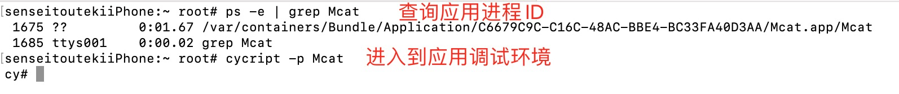
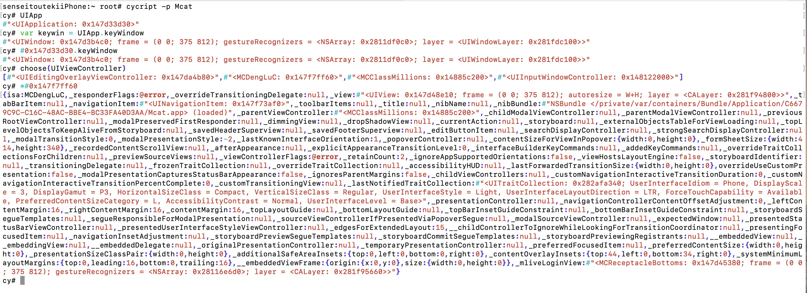
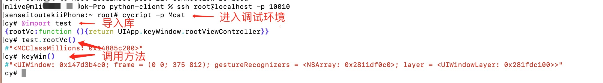

# Cycript
Cycript 是`Objective-C++`、`ES6（JavaScript）`、`Java`等语法的混合物,可以用来探索、修改、调试正在运行的Mac\iOS APP。点击[进入官网](http://www.cycript.org/),[查看Cycript相关文档](http://www.cycript.org/manual/)。在学习如何使用之前我们首先需要在 Cydia 商店安装 Cycript 插件。

## 获取应用进程ID
我们想通过 Cycript 调试某个程序，首先需要获取到应用的进程ID,手机需要安装`adv-cmds`插件，在安装 Cycript 插件时这个插件也会被安装,ps命令是`process status`的缩写，使用ps命令可以列出系统当前的进程，命令如下:

指令 | 含义
------- | -------
`ps -A`  | 列出所有进程
`ps -A \| grep 关键字`  | 根据关键字搜索进程
`ps -e \| grep 关键字`  | 根据关键字搜索进程

我们通过关键字获取到应用的进程id,比如我们的包名字叫Mcat,使用`ps -e | grep Mcat`获取到应用的进程ID
```markdown
 1278 ??         0:01.63 /var/containers/Bundle/Application/C6679C9C-C16C-48AC-BBE4-BC33FA40D3AA/Mcat.app/Mcat
```

##  Cycript的用法
获取到应用的进程ID之后，我们可以使用`cycript -p 1278`指令进入到应用的调试环境，也可以通过进程名字`cycript -p Mcat`进入到应用的调试环境。如下图:


进程ID在每次应用大退之后都会随机使用一个新的端口，我们在调试时尽量使用进程名字来调试。这样就可以避免每次查询进程ID了。如果进程名字中间含有空格，那就只能使用进程ID的方式进行调试。关于Cycript 几个简单的指令:

指令 | 含义 
------- | ------- 
`cycript` |  进入cycript。
`cycript -p 进程ID` |  进入到进程的调试环境
`cycript -p 进程名字` |  进入到进程的调试环境
`Ctrl + c` |  取消输入
`Ctrl + d` |  退出调试环境

Cycript 内部预设置了很多变量,进入到应用的调试环境后,我们可以通过预设变量查看应用的界面控件。比如:

指令 | 含义
------- | -------
UIApp  | 等价于`[UIApplication sharedApplication]`
var xxx = UIApp.keyWindow |  设置变量 
内存地址前用`#`号,例如`#0x231212121` | 也可以使用内存地址获取对象
`*UIApp `或者`*#0x231212121`  | 查看对象的所有成员变量 
`view.recursiveDescription.toString()` |  递归查看view的所有子控件
`choose(UIViewController)`或者`choose(UITableView)` |  筛选出某种类型的对象
`ObjectiveC.classes` |  查看已加载的所有OC类，很容易崩溃

下面是我通过 Cycript 调试 Mcat项目的打印结果，如下图:


我们通过在iPhone桌面做一个提示弹窗示例加深一下印象。首先找到我们的桌面程序`SpringBoard`，然后通过Cycript 让它提示一个弹窗，过程如下:
```markdown
1. `ps -e | grep Spring`  // 搜索SpringBoard 进程ID
2. `cycript -p SpringBoard`   // 根据进程名字进入到桌面的调试环境
3. `[[[UIAlertView alloc] initWithTitle:@"123" message:@"321" delegate:nil cancelButtonTitle:@"456" otherButtonTitles:@"789", nil] show]` //这里输入中文还是会进行转义，所以使用数字代替
```

## 封装 Cycript 方法
如果只使用 Cycript 提供给我们的变量，调试起来还是有很多不方便，我们可以将常用的Cycript代码封装到一个`.cy`文件中,在调试时导入对应的文件，可以直接调用库文件的方法。例如将下面的代码添加到`test.cy`文件中:
```javascript
// exports 参数名固定，用于向外提供接口
(function(exports) {
	// 如果是通过exports导出的方法，在访问时需要使用 文件名.方法名() 的方式
	exports.rootVc = function(){
		return UIApp.keyWindow.rootViewController;
	}
	// 全局函数, 可以直接访问
	keyWin = function(){
		return UIApp.keyWindow;
	}
})(exports)
```
我们需要将文件导入到手机中,可以使用`scp ~/Desktop/test.cy root@192.168.160.53:/usr/lib/cycript0.9/test.cy`命令将文件拷贝到cycript插件对应的目录下。

如果我们使用了USB端口转发,则使用`scp -P 10010 ~/Desktop/test.cy root@localhost:/usr/lib/cycript0.9/test.cy`指令拷贝文件。

拷贝成功后，当我们调试应用时，使用`@import xxx`指令导入我们写好的库,调试时直接调用库文件内的方法。流程如下图:



>如果 `xxx.cy ` 放在`/usr/lib/cycript0.9/com/dym`文件夹下,在导入时需要加上完整的路径`@import com.dym.test`。使用默认导入`@import xxx`会在`/usr/lib/cycript0.9/`目录下寻找对应文件。

----

明杰大佬已经封装了很多常用的方法，比如获取顶层的控制器/获取顶层控制器的图层等等,[代码仓库,需要自取](https://github.com/CoderMJLee/mjcript)

```javascript
(function(exports) {
	var invalidParamStr = 'Invalid parameter';
	var missingParamStr = 'Missing parameter';

	// app id
	MJAppId = [NSBundle mainBundle].bundleIdentifier;

	// mainBundlePath
	MJAppPath = [NSBundle mainBundle].bundlePath;

	// document path
	MJDocPath = NSSearchPathForDirectoriesInDomains(NSDocumentDirectory, NSUserDomainMask, YES)[0];

	// caches path
	MJCachesPath = NSSearchPathForDirectoriesInDomains(NSCachesDirectory, NSUserDomainMask, YES)[0]; 

	// 加载系统动态库
	MJLoadFramework = function(name) {
		var head = "/System/Library/";
		var foot = "Frameworks/" + name + ".framework";
		var bundle = [NSBundle bundleWithPath:head + foot] || [NSBundle bundleWithPath:head + "Private" + foot];
  		[bundle load];
  		return bundle;
	};

	// keyWindow
	MJKeyWin = function() {
		return UIApp.keyWindow;
	};

	// 根控制器
	MJRootVc =  function() {
		return UIApp.keyWindow.rootViewController;
	};

	// 找到显示在最前面的控制器
	var _MJFrontVc = function(vc) {
		if (vc.presentedViewController) {
        	return _MJFrontVc(vc.presentedViewController);
	    }else if ([vc isKindOfClass:[UITabBarController class]]) {
	        return _MJFrontVc(vc.selectedViewController);
	    } else if ([vc isKindOfClass:[UINavigationController class]]) {
	        return _MJFrontVc(vc.visibleViewController);
	    } else {
	    	var count = vc.childViewControllers.count;
    		for (var i = count - 1; i >= 0; i--) {
    			var childVc = vc.childViewControllers[i];
    			if (childVc && childVc.view.window) {
    				vc = _MJFrontVc(childVc);
    				break;
    			}
    		}
	        return vc;
    	}
	};

	MJFrontVc = function() {
		return _MJFrontVc(UIApp.keyWindow.rootViewController);
	};

	// 递归打印UIViewController view的层级结构
	MJVcSubviews = function(vc) { 
		if (![vc isKindOfClass:[UIViewController class]]) throw new Error(invalidParamStr);
		return vc.view.recursiveDescription().toString(); 
	};

	// 递归打印最上层UIViewController view的层级结构
	MJFrontVcSubViews = function() {
		return MJVcSubviews(_MJFrontVc(UIApp.keyWindow.rootViewController));
	};

	// 获取按钮绑定的所有TouchUpInside事件的方法名
	MJBtnTouchUpEvent = function(btn) { 
		var events = [];
		var allTargets = btn.allTargets().allObjects()
		var count = allTargets.count;
    	for (var i = count - 1; i >= 0; i--) { 
    		if (btn != allTargets[i]) {
    			var e = [btn actionsForTarget:allTargets[i] forControlEvent:UIControlEventTouchUpInside];
    			events.push(e);
    		}
    	}
	   return events;
	};

	// CG函数
	MJPointMake = function(x, y) { 
		return {0 : x, 1 : y}; 
	};

	MJSizeMake = function(w, h) { 
		return {0 : w, 1 : h}; 
	};

	MJRectMake = function(x, y, w, h) { 
		return {0 : MJPointMake(x, y), 1 : MJSizeMake(w, h)}; 
	};

	// 递归打印controller的层级结构
	MJChildVcs = function(vc) {
		if (![vc isKindOfClass:[UIViewController class]]) throw new Error(invalidParamStr);
		return [vc _printHierarchy].toString();
	};

	


	// 递归打印view的层级结构
	MJSubviews = function(view) { 
		if (![view isKindOfClass:[UIView class]]) throw new Error(invalidParamStr);
		return view.recursiveDescription().toString(); 
	};

	// 判断是否为字符串 "str" @"str"
	MJIsString = function(str) {
		return typeof str == 'string' || str instanceof String;
	};

	// 判断是否为数组 []、@[]
	MJIsArray = function(arr) {
		return arr instanceof Array;
	};

	// 判断是否为数字 666 @666
	MJIsNumber = function(num) {
		return typeof num == 'number' || num instanceof Number;
	};

	var _MJClass = function(className) {
		if (!className) throw new Error(missingParamStr);
		if (MJIsString(className)) {
			return NSClassFromString(className);
		} 
		if (!className) throw new Error(invalidParamStr);
		// 对象或者类
		return className.class();
	};

	// 打印所有的子类
	MJSubclasses = function(className, reg) {
		className = _MJClass(className);

		return [c for each (c in ObjectiveC.classes) 
		if (c != className 
			&& class_getSuperclass(c) 
			&& [c isSubclassOfClass:className] 
			&& (!reg || reg.test(c)))
			];
	};

	// 打印所有的方法
	var _MJGetMethods = function(className, reg, clazz) {
		className = _MJClass(className);

		var count = new new Type('I');
		var classObj = clazz ? className.constructor : className;
		var methodList = class_copyMethodList(classObj, count);
		var methodsArray = [];
		var methodNamesArray = [];
		for(var i = 0; i < *count; i++) {
			var method = methodList[i];
			var selector = method_getName(method);
			var name = sel_getName(selector);
			if (reg && !reg.test(name)) continue;
			methodsArray.push({
				selector : selector, 
				type : method_getTypeEncoding(method)
			});
			methodNamesArray.push(name);
		}
		free(methodList);
		return [methodsArray, methodNamesArray];
	};

	var _MJMethods = function(className, reg, clazz) {
		return _MJGetMethods(className, reg, clazz)[0];
	};

	// 打印所有的方法名字
	var _MJMethodNames = function(className, reg, clazz) {
		return _MJGetMethods(className, reg, clazz)[1];
	};

	// 打印所有的对象方法
	MJInstanceMethods = function(className, reg) {
		return _MJMethods(className, reg);
	};

	// 打印所有的对象方法名字
	MJInstanceMethodNames = function(className, reg) {
		return _MJMethodNames(className, reg);
	};

	// 打印所有的类方法
	MJClassMethods = function(className, reg) {
		return _MJMethods(className, reg, true);
	};

	// 打印所有的类方法名字
	MJClassMethodNames = function(className, reg) {
		return _MJMethodNames(className, reg, true);
	};

	// 打印所有的成员变量
	MJIvars = function(obj, reg){ 
		if (!obj) throw new Error(missingParamStr);
		var x = {}; 
		for(var i in *obj) { 
			try { 
				var value = (*obj)[i];
				if (reg && !reg.test(i) && !reg.test(value)) continue;
				x[i] = value; 
			} catch(e){} 
		} 
		return x; 
	};

	// 打印所有的成员变量名字
	MJIvarNames = function(obj, reg) {
		if (!obj) throw new Error(missingParamStr);
		var array = [];
		for(var name in *obj) { 
			if (reg && !reg.test(name)) continue;
			array.push(name);
		}
		return array;
	};
})(exports);
```