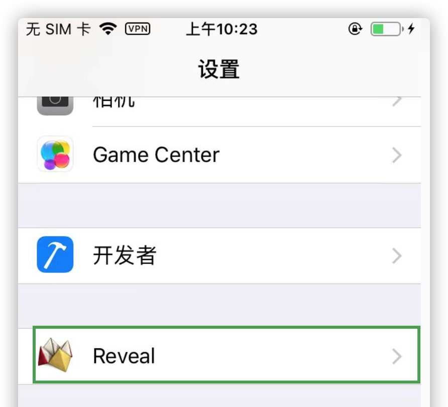
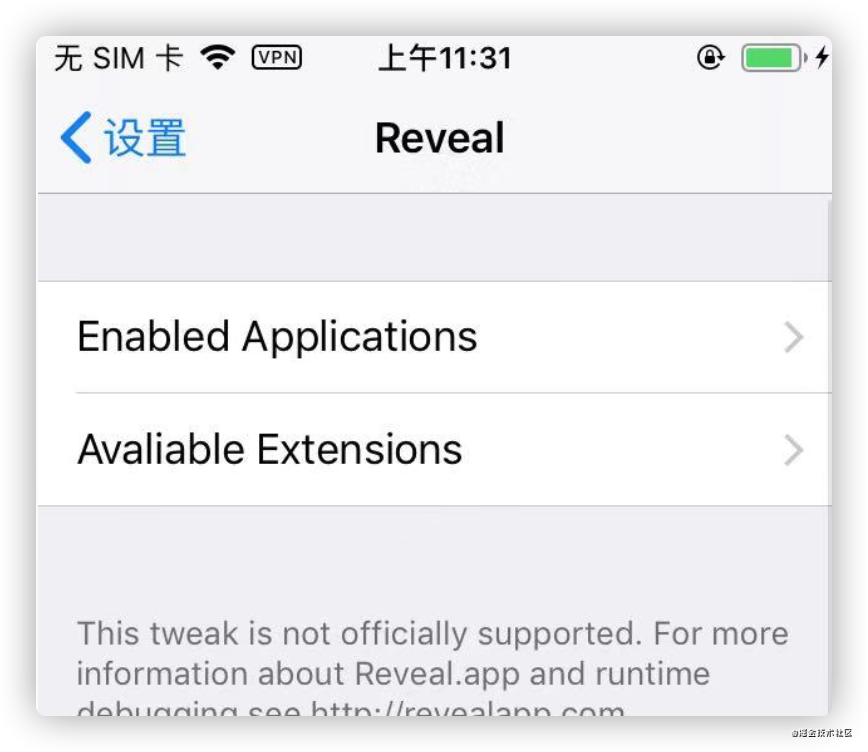
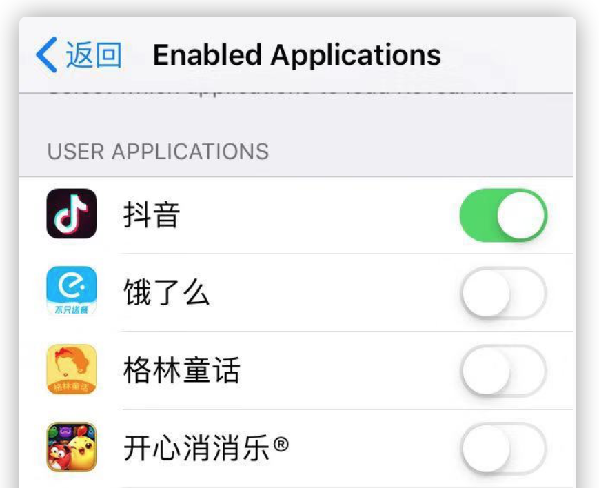
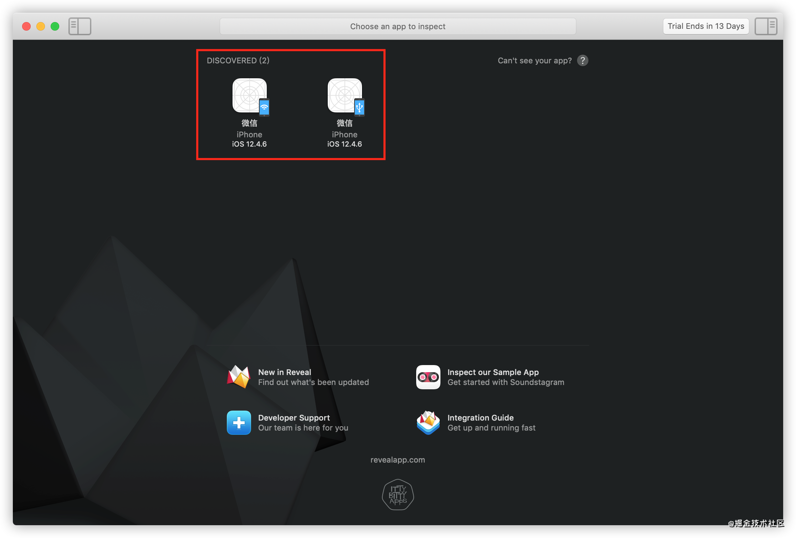
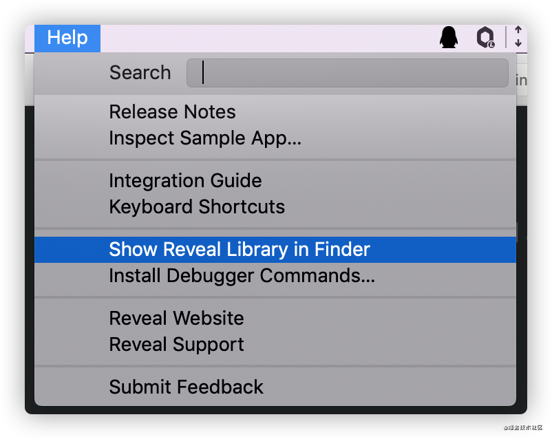
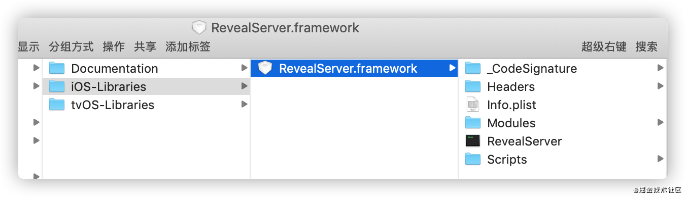
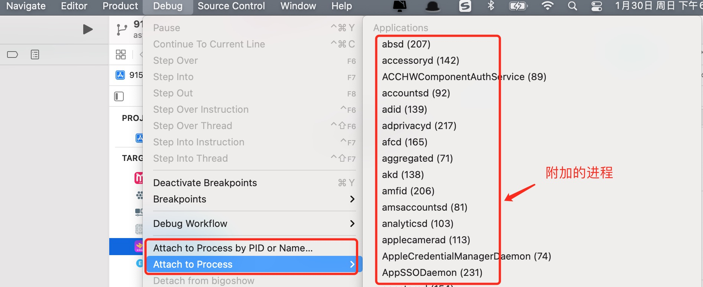
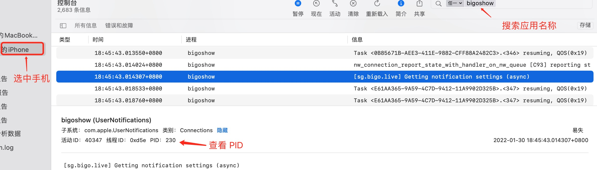

# Reveal
我们如果想分析别的应用UI界面，除了Cycript之外，还可以使用Reveal，它是一个图形化工具，跟我们使用Xcode分析界面图层很像，可以很方便的查看应用UI层结构。另外能连接到应用程序，并允许开发者编辑各种用户界面参数，而且会立即反应在程序的 UI 上。

使用`Reveal`需要下载对应的 Mac客户端 和 对应的手机插件`Reveal2Loader`。Mac版的[下载地址](https://revealapp.com/download/)。

操作可以分为下面几步:
```markdown
1. 手机通过 `Cydia` 商店安装 `Reveal2Loader`, 安装成功之后，可以在手机设置里面看到它。
2. 点击设置中的 `Reveal` 之后会看到两个按钮和作者的一些版本声明
    1. `Enabled Applications` 管理是否允许调试某些APP,**如果我们想调试某款APP需要进入此选项点开APP对应的开关**
    2. `Avaliable Extensions` 是管理扩展的，下面内容是作者的一些版权声明。
3. 安装好对应的插件并允许调试APP之后，可以打开电脑上的 `Reveal `软件，重新打开手机上需要调试的APP，电脑端`Reveal`就会显示手机打开的软件,有USB、WIFI两种连接方式，选择使用USB调试
4. 点击USB对应的图标时，会弹出提示框，说电脑端的 `Reveal Library` 与手机上的不一致,这时需要将 MAC 端的 `Reveal Library` 覆盖到手机上的，点击 `Show Reveal Library in Finder`。也可以通过`Help -> Show Reveal Library in Finder`进入
5. 将`RevealServer.framework`通过 iFunBox 拷贝到手机端的`/Library/RHRevealLoader`文件夹,如果这个文件夹找不到,那就在`/Library/Frameworks`这个文件夹里看看里面是否有 `RevealServer.framework`这个文件,对这个文件进行替换。
6. 替换完成之后，首先将手机APP大退重新打开，然后重新打开电脑端的`Reveal`
```

下面是这些步骤对应的截图：
1. 手机通过 `Cydia` 商店安装 `Reveal2Loader`, 安装成功之后，可以在手机设置里面看到它。

2. 点击设置中的 `Reveal` 之后会看到两个按钮和作者的一些版本声明，打开调试应用后面的开关
,
3. 安装好对应的插件并允许调试APP之后，可以打开电脑上的 `Reveal `软件，重新打开手机上需要调试的APP，电脑端`Reveal`就会显示手机打开的软件,有USB、WIFI两种连接方式，选择使用USB调试

4. 通过`Help -> Show Reveal Library in Finder`进入到Reveal的`framework`文件夹。

1. 使用iFunBox将手机端`RevealServer.framework`替换成电脑端的`RevealServer.framework`,如果在手机里找不到`/Library/RHRevealLoader`文件夹,那就在`/Library/Frameworks`文件夹下替换。



>在新版的Reveal中，针对`RevealServer.framework`库做了修改,将不同设备的库做了拆分，如果我们只是替换手机端的库，只需要使用`ios-arm64_armv7`文件夹

另外需要注意的是：**有的版本会有 `/Library/RHRevealLoader` 文件夹，如果有的话，打开看看里面是否有 `RevealServer` 这个文件,如果这个文件存在，只需要将MAC端 `RevealServer.framework `里面的 `RevealServer` 拷贝进去。**

>Reveal里面的控件地址也可以直接在Cycript里进行调用。

以上内容来自于:
* [iOS 逆向编程（十八）Reveal 详细安装](https://blog.csdn.net/zz00008888/article/details/111631716)

## Xcode附加进程
除了用Reveal查看界面外，还可以使用Xcode附加进程的方式查看手机中的应用界面。
1. 首先需要手机打开对应的应用
2. 打开Xcode选中手机，选择`Debug -> Attach to Process -> 选择调试的应用`
3. 或者选择`Debug -> Attch to Process by PID or Name -> 输入应用的名字或者端口`,端口可以在Mac中的控制台进行查看


