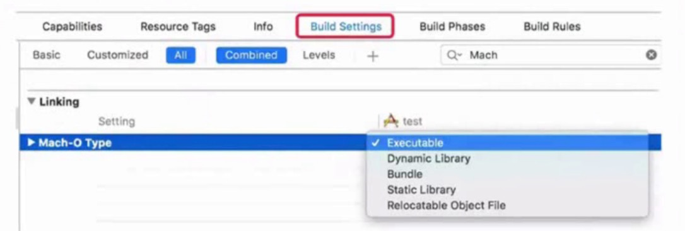
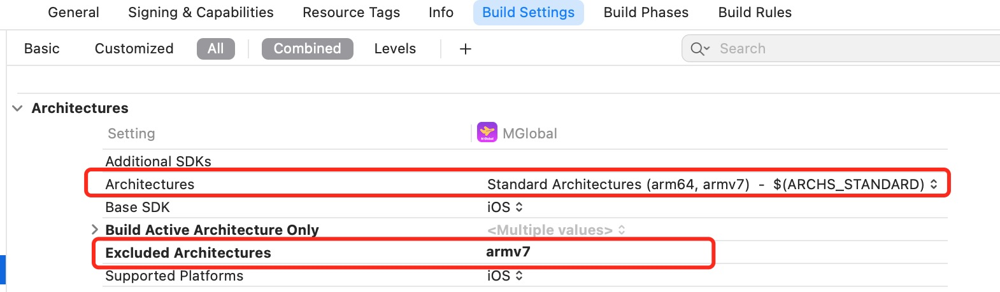
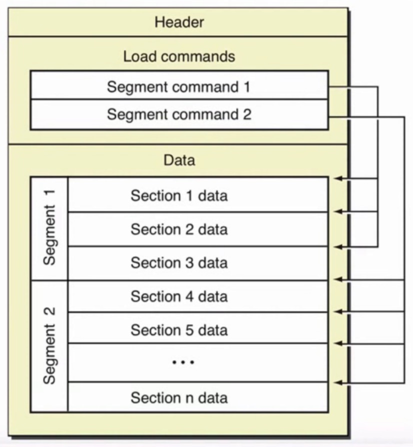
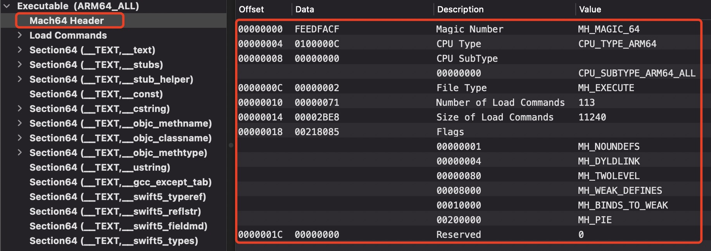
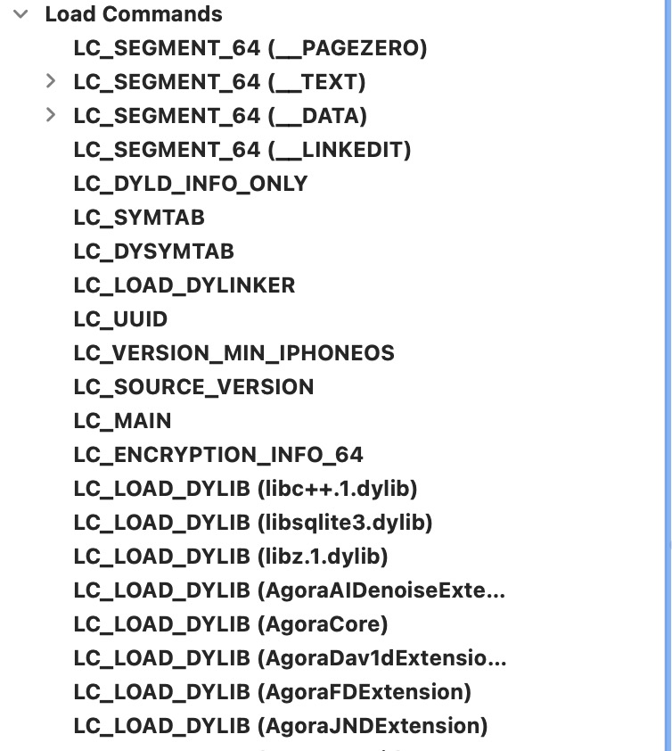
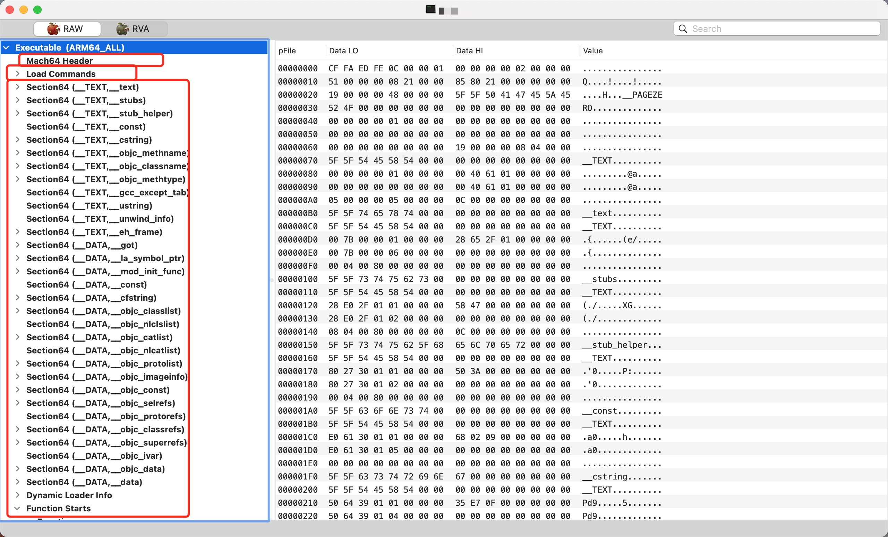

# Mach-O文件
Mach-O是Mach object的缩写，是Mac/iOS上用于存储程序、库的标准格式，属于`Mach-O`格式的文件类型有以下几种:
```c
#define MH_OBJECT 0x1 /* 可重定位目标文件 */
#define MH_EXECUTE 0x2 /* 请求分页可执行文件 */
#define MH_FVMLIB 0x3 /* 修复 VM 共享库文件 */
#define MH_CORE 0x4 /* 核心文件 */
#define MH_PRELOAD 0x5 /* 预加载的可执行文件 */
#define MH_DYLIB 0x6 /* 动态绑定共享库 */
#define MH_DYLINKER 0x7 /* 动态链接编辑器 */
#define MH_BUNDLE 0x8 /* 动态绑定捆绑文件 */
#define MH_DYLIB_STUB 0x9 /* 静态共享库存根 */
/* 仅链接，无节内容 */
#define MH_DSYM 0xa /* 只有调试的伴随文件 */
/* 部分 */
#define MH_KEXT_BUNDLE 0xb /* x86_64 kexts */
#define MH_FILESET 0xc /* mach-o 的集合 */ 
```

我们可以在xnu源码中,查看Mach-O格式的详细定义。[点击下载xnu源码](https://opensource.apple.com/tarballs/xnu/),可以在`EXTERNAL_HEADERS -> mach-o -> loader.h`文件中搜索`Constants for the filetype field of the mach_header`看到以上的内容。

## 常见的Mach-O文件类型
虽然Mach-O文件类型很多，但是常见的只有以下几种类型：
```markdown
* MH_OBJECT : 目标文件(.o) 和 静态库文件(.a),**静态库文件本质就是N个.o文件合并在一起。**
* MH_EXECUTE : 可执行文件
* MH_DYLIB : 动态库文件。包含`.dyld`和`.framework/xx`
* MH_DYLINKER : 动态链接编辑器, 手机和电脑上的路径为`/usr/lib/dyld` 文件  
* MH_DSYM : 存储着二进制文件符号信息的文件,常用于分析APP的崩溃信息`.dSYM/Contents/Resources/DWARF/xx`
```
我们可以通过`file 文件路径`命令查看Mach-o文件的类型：
```markdown
* MH_OBJECT  使用file查看文件类型为`Mach-O 64-bit object x86_64`
* MH_EXECUTE  使用file查看文件类型为`Mach-O 64-bit executable x86_64`
* MH_DYLIB   使用file查看文件类型为`Mach-O 64-bit dynamically linked shared library x86_64`
* MH_DYLINKER  使用file查看文件类型为`Mach-O 64-bit dynamic linker x86_64`
```

Xcode也可以生成Mach-O文件，比如静态库、动态库、Bundle、可执行文件等。在Xcode中查看Mach-O文件的类型`Target -> Build Settings -> 搜索Mach`,如下图：


## Universal Binary (通用二进制文件)
通用二进制文件也叫胖二进制文件(`Fat Binary`),同时适用于多种架构的二进制文件，包含了多种不同架构的独立的二进制文件。

因为需要存储多种架构的代码，通常比单一平台二进制的程序更大，但是由于两种架构有共同的一些资源，所以并不会达到单一架构的两倍。在执行过程中，只调用一部分代码，运行也不需要额外的内存。

Xcode中关于多个架构的设置，如下图：

```markdown
* $(ARCHS_STANDARD): Xcode内置的环境变量，默认是`armv7` 和`arm64`
* Excluded Architetures:  如果不需要那种架构就写上去
```
我们可以通过`lipo命令`对通过二进制文件做处理，可以将它们拆成单个架构的二进制文件，也可以将多个单架构二进制文件合成一个通用二进制文件，常用命令有以下几种：

命令 | 含义
------- | -------
`lipo -info 文件路径 ` | 查看架构信息，例如`lipo -info AgoraAIDenoiseExtension `
`lipo 文件路径 -thin 架构类型 -o 输出文件路径` | 导出某种特定的架构，例如`lipo AgoraAIDenoiseExtension -thin arm64 -o Agora_arm64`
`lipo -create 文件路径1 文件路径2 -o 输出文件路径` | 合并多种架构，例如`lipo -create Agora_armv7 Agora_arm64 -o AgoraAIDenoiseExtension`

## Mach-O文件的结构
Mach-O文件由三部分组成，如下图:



```markdown
* Header: 文件类型、目标架构类型等
* Load commands: 描述文件在虚拟内存中的逻辑结构、布局,可以将它看做指针，指向数据区域
* Raw segment data: 在Load commands中定义的Segment的原始数据,具体数据部分
```

#### Mach-O 文件 Header 信息
Mach-O 文件的头部主要包含二进制文件的一般信息，架构类型、字节顺序、加载指令的数量等。,如下图:


```c
struct mach_header_64 {
	uint32_t	magic;          /* 定位架构是64位还是32位 (e.g. MH_MAGIC_64) */
	cpu_type_t      cputype;        /* CPU类型 (e.g. CPU_TYPE_ARM64) */
	cpu_subtype_t	cpusubtype;     /* CPU具体类型 (e.g. CPU_SUBTYPE_ARM64_ALL) */
	uint32_t	filetype;	/* 文件类型 (e.g. MH_EXECUTE) */
	uint32_t	ncmds;          /* Load commands条数 */
	uint32_t	sizeofcmds;     /* Load commands大小 */
	uint32_t	flags;          /* 标志位。标识二进制文件支持的功能，主要和系统加载、链接有关 */
	uint32_t	reserved;	/* 预留区（只有64位才有） */
};
```

#### Mach-O 文件 Load commands 信息
包含区域的位置、符号表、动态符号表等。描述了文件中数据的具体组织结构，不同的数据类型使用不同的加载命令表示。如下图


```markdown
* LC_SEGMENT_64(__PAGEZERO) 
    * VM Size：虚拟内存，大小4G(32位是16M)。用于区分32位及存储位置
* LC_SEGMENT_64(__TEXT): 代码段
* LC_SEGMENT_64(__DATA): 数据段
* LC_SEGMENT_64(__LINKEDIT)
    * VM Address：虚拟内存地址
    * VM Size：虚拟内存大小
    * File Offset：数据在文件中的起始位置
    * File Size：数据在文件中的大小
* LC_DYLD_INFO_ONLY（动态链接相关信息）
    * Rebase：进行重定向的位置信息。当MachO加载到内存里，系统会随机分配一个内存偏移大小aslr，和* rebase里面的offset，对接(位置相加)获取代码在内存中的实际位置。再根据size开辟实际内存
    * Binding：绑定的位置信息
    * Weak Binding：弱绑定的位置信息
    * Lazy Binding：懒加载绑定的位置信息
    * Export：对外的位置信息
* LC_SYMTAB（符号表地址）
    * Symbol Table Offset：符号表的位置。函数名称、函数地址关联的信息
    * Number of Symbol：符号数
    * String Table Offset：符号名称位置
    * String Table Size：符号名称大小
* LC_DYSYMTAB（动态符号表地址）
* LC_LOAD_DYLINKER（动态库连接器：dyld）
    * Str Offset：动态库连接器位置
    * Name：动态库连接器路径（dyld）
* LC_UUID（MachO文件唯一标识）
* LC_VERSION_MIN_IPHONESOS（MachO文件支持最低的操作系统版本）
* LC_SOURCE_VERSION（源代码版本）
* LC_MAIN（MachO程序入口：设置程序主线程的入口地址和栈大小）
    * Entry Offset：入口位置
    * Stacksize：堆栈大小
    * Entry Point：入口点（内存地址）
* LC_ENCRYPTION_INFO_64（加密信息）
    * Crypt Offset：加密信息位置
    * Crypt Size：加密信息大小
    * Crypt ID：加密信息ID。非加密是0，加密是1
* LC_LOAD_DYLIB（依赖库的路径，包含三方库）
    * Str Offset：动态库位置
    * Time Stamp：动态库时间
    * Current Version：动态库版本
* LC_RPATH（frameworks信息）
* LC_FUNCTION_STARTS（函数的起始位置表）
* LC_DATA_IN_CODE（代码数据信息）
* LC_CODE_SIGNATURE（代码签名信息）
```

#### Mach-O 文件 Raw segment data 信息
由 Segment 段和 Section 节组成。存放具体数据：代码、数据、字符串常量、类、方法等。
Segment 组成:
```c
#define SEG_PAGEZERO    "__PAGEZERO" /* 当时 MH_EXECUTE 文件时，捕获到空指针 */
#define SEG_TEXT    "__TEXT" /* 代码/只读数据段 */
#define SEG_DATA    "__DATA" /* 数据段 */
#define SEG_OBJC    "__OBJC" /* Objective-C runtime 段 */
#define SEG_LINKEDIT    "__LINKEDIT" /* 包含需要被动态链接器使用的符号和其他表，包括符号表、字符串表等 */
```
常见的Section: 
```markdown
* __TEXT,__text: 主程序代码
* __TEXT,__stubs / __stub_helper: 用于动态链接的桩
* __TEXT,__objc_methname: OC方法名称
* __TEXT,__objc_classname: OC类名
* __TEXT,__objc_methtype: OC方法类型
* __TEXT,__cstring: 程序中c语言字符串
* __DATA,__got: 非懒加载符号表
* __DATA,__la_symbol_ptr: 懒加载符号表
* __DATA,__objc_classlist: OC类列表
* __DATA,__objc_protollist: OC原型列表
* __DATA,__objc_imageinfo: OC镜像信息
* __DATA,__objc_const: OC常量
* __DATA,__objc_selfrefs: OC类自引用(self)
* __DATA,__objc_superrefs: OC类超类引用(super)
* __DATA,__objc_protolrefs: OC原型引用
* __DATA,__objc_data / __data: OC代码数据
* Dynamic Loader Info: 动态链接器所需要使用的信息 (重定向,符号绑定,懒加载绑定等..)
* Function Starts: 方法的起始位置
* Symbol Table: 符号表
* Dynamic Symbol Table: 动态符号表
* String Table: 字符串表
* Code Signature: 代码签名信息
```

## otool 和 MachOView
我们如果想查看 Mach-O文件 的具体信息,可以用`otool`指令。一些常用命令:

指令 | 含义
------- | -------
`otool -f 文件路径` | 打印胖二进制文件头部信息
`otool -h 文件路径` | 打印Mach-O文件头部信息
`otool -l 文件路径` | 打印 load commands
`otool -L 文件路径` | 打印使用的动态库
`otool -l mcat \| grep crypt`  | 查看IPA是否加密,如果`cryptid == 1`说明应用加壳了,需要进行脱壳

除了 otool 指令之外，也可以使用GUI工具`MachOView`。这个工具年久失修，版本跟最新的系统不兼容，其他人对它进行修改,[MachOView下载地址](https://github.com/fangshufeng/MachOView)。如下图:



## 推荐阅读
* [Mach-O 文件格式探索](https://www.desgard.com/iOS-Source-Probe/C/mach-o/Mach-O%20%E6%96%87%E4%BB%B6%E6%A0%BC%E5%BC%8F%E6%8E%A2%E7%B4%A2.html)
* [Mach-O文件分析](https://juejin.cn/post/6964238764612943885)

`FreeBSD Unix Linux XNU Darwin MacOSX`