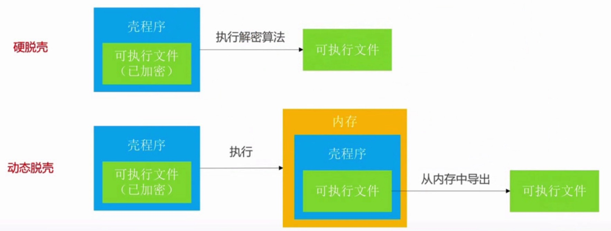
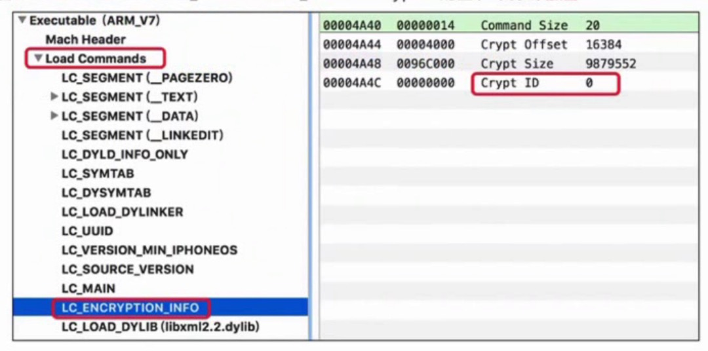

# IPA脱壳
当我们上传应用到苹果商店的时候，苹果商店会对应用进行加壳操作。加壳是利用特殊算法，对可执行文件的编码进行改变(比如压缩、加密),以达到保护程序代码的目的。

既然有加壳就会有脱壳，脱壳是摘掉壳程序，将未加密的可执行文件还原出来。脱壳主要有两种方式:硬脱壳、动态脱壳。

硬脱壳是自己写一个解密算法，直接将壳程序解密出可执行文件。动态脱壳是需要先运行程序，将程序加载到内存，然后从内存中导出可执行文件。如下图:



## 如何查询可执行文件是否已经脱壳
从苹果商店中下载的程序都需要脱壳,如果手机上安装的软件来源比较复杂,我们可以通过Mach-O文件中`Load Commands -> LC_ENCRYPTION_INFO -> Crypt ID的值`来确定是否需要脱壳，0 表示未加密, 1 表示已加密。如下图:



另外我们可以通过 otool 指令`otool -l 可执行文件 | grep crypt`来确定是否需要脱壳。例如`otool -l ~/Desktop/Payload/bigoshow.app/bigoshow | grep crypt`,cryptid=0表示不用脱壳:
```shell
  locreloff 0
    nlocrel 0
  cryptoff 11636736
cryptsize 4096
  cryptid 0
```

## frida-ios-dump 脱壳
`frida-ios-dump`是一个动态脱壳的工具,需要在电脑端和客户端进行配置。

Mac端的配置:
```markdown
1. 电脑端安装frida : `pip3 install frida-tools`,安装好之后`frida --version`查看下frida版本
2. 下载frida-ios-dump, `git clone https://github.com/AloneMonkey/frida-ios-dump.git`
3. 安装dump需要的库，`cd frida-ios-dump-master`进入下载好的文件夹，运行`sudo python3 -m pip install -r requirements.txt --upgrade`命令安装所需要的Python库
4. 运行`python3 dump.py -h`指令确定是否安装完成
```

iOS设备安装frida:
```markdown
1. 添加软件源: 在 cydia 中添加frida源 `https://build.frida.re`
2. 软件源添加好之后搜索 `frida` 进行安装,根据iOS设备安装对应的插件,默认安装第一个。**安装后查看frida 版本，需与Mac端frida版本一致**
```

Mac端和iOS设备配置好之后，由于`dump.py`文件是用端口映射的方式将手机内存中的可执行文件导入到Mac设置中,所以我们需要先进行端口映射。

终端运行`brew install iproxy`命令安装 iproxy,然后运行`iproxy 2222 22`指令进行端口映射,将Mac的2222端口映射到手机的22端口。

将越狱设备通过USB连上电脑,运行需要脱壳的程序,在终端输入`frida-ps -Ua`查看正在运行的应用程序和它对应的Bundle ID,运行`python3 dump.py -H 127.0.0.1 -p 2222 -u root -P alpine sg.bigo.live`,等下就能在当前文件夹下看到脱壳的可执行程序了。

#### 脱壳出现的错误
在脱壳过程中，遇到过以下几个错误:
````markdown
1. 使用frida-ios-dump砸壳时一直出现`timeout was reached`，是因为必须要保证程序在运行中才可以脱壳
2. 脱壳中出现错误，文件夹没有权限读写
  ```shell
    Generating "Mcat.ipa"
    zip I/O error: Permission denied
    zip error: Could not create output file (/Users/mlive/Desktop/frida-ios-dump/Mcat.ipa)
    Command '('zip', '-qr', '/Users/mlive/Desktop/frida-ios-dump/Mcat.ipa', './Payload')' returned non-zero exit status 15.
  ```
3. 运行dump.py文件时，也是直接使用应用名称或者使用唯一标识，如果出现`unable to launch iOS app: The operation couldn’t be completed. Application "" is unknown to FrontBoard.`错误意思是根据名字找不到应用需要 使用唯一标识进行获取。
````

#### frida 常用的几个指令
指令 | 作用
------- | -------
`frida-ps -Ua` | 查看正在运行的应用程序
`frida-ps -Uai` | 查看iOS设备中已经安装的应用程序
`frida-ls-devices` | 查看电脑连接的iOS设备信息，主要包括UDID、连接方式、iOS设备名称
`frida-ps -U ` | 查看通过USB连接的iOS设备上运行的程序
`frida-ps -D <UDID>` | 通过iOS设备的UDID查看iOS设备中应用程序中的pid、进程名
`frida-trace -U -f <bundleId> -m "-[* *]"` | 用于追踪iOS应用的方法调用
`frida-kill -D <UDID> <pid>` | 杀死指定UDID的iOS设备的具体进程，pid为该进程的进程号


## 推荐阅读
* [ios逆向-frida&环境&破解appSign算法](https://cloud.tencent.com/developer/article/1755721)
* [iOS逆向工程（六）：使用frida-ios-dump工具，一键脱壳](https://www.jianshu.com/p/8d6234a7d740)
* [ios逆向之frida安装与使用基础](https://www.jianshu.com/p/71587d8b39f4)
* [IOS应用砸壳之frida-ios-dump](https://www.cnblogs.com/paperpen/p/14845675.html)