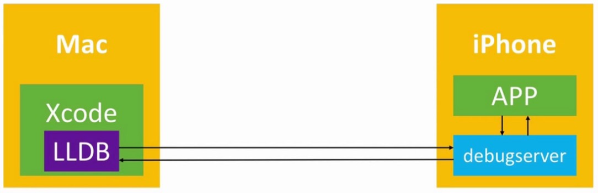

# 动态调试
在程序运行期间，通过断点、打印等方式，查看参数、返回值、函数调用流程等，协助我们分析应用。

## Xcode调试原理
Xcode之所以能够调试手机上的程序，这是因为Xcode内置了LLDB调试工具，在我们使用Xcode安装程序到手机上时，在手机内部安装了debugserver。

`debugserver`用来接收我们在 Xcode 敲出的 LLDB 指令，接收到指令后反馈给 APP，APP 执行指令后把结果反馈给`debugserver`,然后再由`debugserver`把结果返回给 LLDB ，再由 LLDB 把信息打印在 Xcode 上。过程如下图:

关于GCC、LLVM、GDB、LLDB的概念:
```markdown
* Xcode的编译器发展：GCC -> LLVM
* Xcode的调试器发展：GDB -> LLDB
```
`debugserver`刚开始存放在 Mac 的 Xcode 里面。当Xcode识别到手机设备时，Xcode会自动将 debugserver 安装到iPhone上，如果设备没有连接过Xcode，是没有 debugserver 的。debugserver 在电脑和手机中路径:
```markdown
* Mac中的路径:`/Applications/Xcode.app/Contents/Developer/Platforms/iPhoneOS.platform/DeviceSupport/15.0/DeveloperDiskImage.dmg/usr/bin/debugserver`
* iPhone中的路径: `/Developer/usr/bin/debugserver`
```

## 通过debugserver调试其他APP
Xcode调试的局限性在于只能调试通过Xcode安装的APP,如果我们想调试别人的APP该怎么办呢？

根据前面我们学的 Xcode 调试应用的原理，需要`LLDB / debugserve / APP`这三者之间建立连接。然后就可以在 Mac 中通过 LLDB 连接手机中的 debugserver 来调试手机中的应用。

#### debugserver的权限问题
默认情况下，手机中的`/Developer/usr/bin/debugserver`缺少权限，只能调试通过 Xcode 安装的APP。如果希望调试其他APP，需要对 debuserver 重新签名，签上两个调试相关的权限
```markdown
* `get-task-allow` Boolean类型 值为YES
* `task_for_pid-allow` Boolean类型 值为YES
```
可以参考上一章中给命令行工具的签名过程，使用 ldid 对 debugserver 进行签名。可以分为以下几步:
```markdown
1. 由于 iPhone上 的 `/Developer`目录是只读,先将 debugserver 复制到Mac上。
2. 通过 `ldid -e debugserver > debugserver.entitlements` 导出之前的权限
3. 在`debugserver.entitlements`中添加`get-task-allow`、t`ask_for_pid-allow`权限
4. 删除权限文件中的`seatbelt-profiles`权限
5. 通过`ldid -Sdebugserver.entitlements debugserver`对 debugserve 进行重新签名
6. 将重新签好权限的 debugserver 放到手机的 `/usr/bin` 目录, 这样登录手机之后可以直接运行 debugserver 指令
7. 使用`chmod +x /usr/bin/debugserve`赋予权限
```
关于权限签名也可以使用`codesign`工具:
```shell
# 查看权限信息
codesign -d --entitlements - debugserver
# 签名权限
codesign -f -s - --entitlements debugserver.entitlements debugserver
# 或则缩写
codesign -fs- --entitlements debugserver.entitlements debugserver
```
相关权限的 xml 文件，目前好像不再需要`get-task-allow`和 `task_for_pid-allow`了,可以直接将下面的 xml 文件签名到 debugserver:
```xml
<?xml version="1.0" encoding="UTF-8"?>
<!DOCTYPE plist PUBLIC "-//Apple//DTD PLIST 1.0//EN" "http://www.apple.com/DTDs/PropertyList-1.0.dtd">
<plist version="1.0">
<dict>
	<key>com.apple.backboardd.debugapplications</key>
	<true/>
	<key>com.apple.backboardd.launchapplications</key>
	<true/>
	<key>com.apple.diagnosticd.diagnostic</key>
	<true/>
	<key>com.apple.frontboard.debugapplications</key>
	<true/>
	<key>com.apple.frontboard.launchapplications</key>
	<true/>
	<key>com.apple.springboard.debugapplications</key>
	<true/>
	<key>run-unsigned-code</key>
	<true/>
</dict>
</plist>
```

#### debugserver附加到某个进程
现在我们手机中的 debugserver 可以拥有权限调试其他的应用。使用`ps -e | grep xxx`查看应用的进程,通过`debugserver localhost:端口号 -a 进程`附加某个进程。
```markdown
*  `localhost:端口号`: iPhone的某个端口启动 debugserver 服务,这里的端口主要用来跟电脑中的 LLDB 进行交互。（只要不是保留端口号就行）
*  进程: 输入APP的进程信息（进程ID和进程名称）
```
通过 SSH 登录到手机之后,打开APP,调用`debugserver localhost:10011 -a XinGaiNian1`附加相关进程,如果出现`Failed to get connection from a remote gdb process.`错误，需要删除权限文件中的这三个key进行重新签名：
```xml
<key>com.apple.security.network.client</key>
<true/>
<key>com.apple.security.network.server</key>
<true/>
<key>seatbelt-profiles</key>
<array>
    <string>debugserver</string>
</array>
```

#### Mac上启动LLDB，远程连接iPhone上的debugserver服务
我们手机的 debugserver 已经可以跟APP进行通信，现在我们只要让 Mac 中的 LLDB 跟手机中的 debugserver 建立连接就可以进行动态调试了。可以分为以下几步：
```markdown
1. 进行端口映射，将手机的端口映射到本地电脑端口`iproxy 1234:1234`,如果需要多个端口映射`iproxy 2222:22 1234:1234`
2. 通过 SSH 登录到手机,手机打开应用,使用`debugserver localhost:1234 -a XinGaiNian1`附加进程
3. 进入lldb - 打开终端,输入 `lldb`
4. 连接手机中的debugserver - `process connect connect://手机IP地址:debugserver端口号`,因为开启了端口映射，输入`process connect connect://localhost:1234` 
```
现在Mac中的 LLDB 就跟手机中的 debugserver 建立了连接,第一次连接后点击手机的应用是没有反应的，终端输入`c`进入下一步。我们进行动态时调试可以通过 LLDB 打断点进行调试。

## LLDB

含义 | 指令 
------- | ------- 
读取寄存器的值 |  `register read 寄存器名称`,例如`register read rax`
修改寄存器的值 |  `register write 寄存器名称 数值`,例如`register write rax 10`
读取内存中的值 |  `x/数量-格式-字节大小 内存地址`,例如 `x/3xw 0x0000010`
读取内存中的值 |  `memory read 数量格式字节数 内存地址`,例如 `memory read/3xg 0x100552c00`
修改内存中的值 |  `memory write 内存地址 数值`,例如`memory write 0x0000010 10`

在读取内存中的值对应的3xw含义：
```markdown
3: 代表打印的数量
x: 代表显示的格式 x->以16进制显示,   f->浮点数,  d->十进制
w: 代表字节数   b->byte 1个字节,  h ->half word 2字节,  w ->word 4字节, g ->giant word 8字节
```
#### LLDB 断点调试

含义 | 指令
------- | -------
单步运⾏，把子函数当做整体⼀步执⾏（源码级别） | thread step-over、next、n
单步运⾏，遇到子函数会进⼊子函数（源码级别） | thread step-in、step、s
单步运⾏，把子函数当做整体⼀步执⾏（汇编级别） | thread step-inst-over、nexti、ni
单步运⾏，遇到子函数会进⼊子函数（汇编级别） | thread step-inst、stepi、si
直接执⾏完当前函数的所有代码，返回到上一个函数（遇到断点会卡住） | thread step-out、finish
显示函数调用栈 | bt

内存地址相关规律:
```markdown
* 内存地址格式为：`0x4bdc(%rip)`，一般是全局变量，全局区（数据段）
* 内存地址格式为：`-0x78(%rbp)`，一般是局部变量，栈空间
* 内存地址格式为：`0x10(%rax)`，一般是堆空间
```