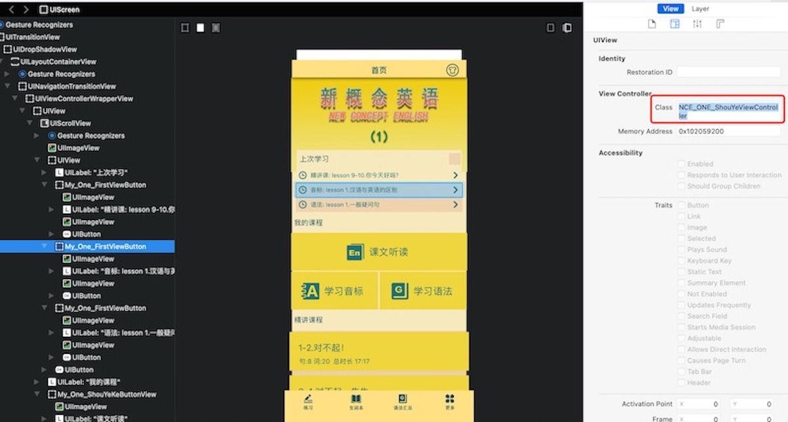
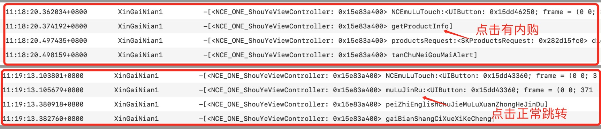
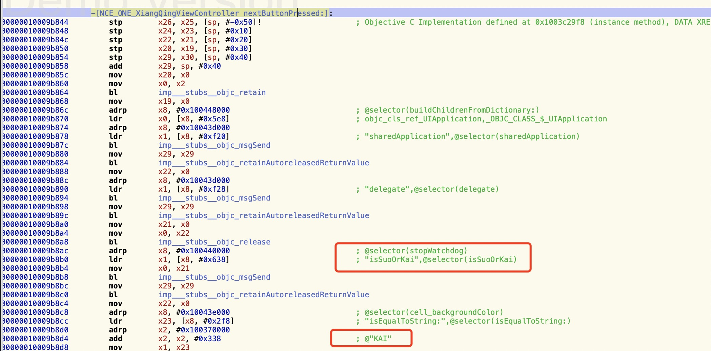
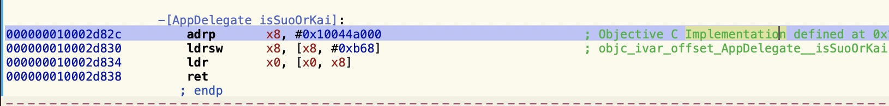

# 记录hook新概念的过程
本文主要记录hook新概念IPA的整个过程，如果下次对其他项目进行hook时可以有参考思路。这个项目也比较简单。主要拿来练手用。

## hook谷歌广告
1. 首先通过frida对应用进行脱壳:
```markdown
    1. 手机打开应用,使用`frida-ps -Ua`查看应用的`Bundle ID`
    2. 开启端口映射，将手机通过usb连接到电脑，使用`iproxy 2222 22`进行端口映射
    3. 使用`python3 dump.py -H 127.0.0.1 -p 2222 -u root -P alpine com.bigo.live`指令对应用进行脱壳
```
2. 通过`class-dump -H xxx -o  ~/Desktop/Headers`获取头文件信息
3. 查找跟广告相关的类，发现有多个不同的广告类，hook它们的初始化方法，直接返回nil，重新安装后发现不再显示谷歌广告，去除广告成功。

## hook内购方法
1. 通过 Charles 确定了它的内购是在本地的，没有通过服务器进行保存。
2. 首先我通过 Reveal 确认了它的项目结构，如下图:
    
3. 通过分析找到了`My_One_NceMuLuView`类，但是在它头文件中没有找到点击方法。后面又找到首页的控制器`NCE_ONE_ShouYeViewController`类
4. 由于`My_One_NceMuLuView`类方法很多,通过`logify.pl NCE_ONE_ShouYeViewController.h > shouey.xm`指令生成打印方法信息。
5. 将生成后的文件放到theos项目中，进行重新编译，安装到手机上。
6. 通过控制台查看按钮的点击方法，发现点击列表时，如果有内购信息，是调用别的方法，如果没有内购信息时，调用的是另一个方法，如下图:
   
7. hook 点击方法,直接调用正常流程的方法。
```shell
    %hook  NCE_ONE_ShouYeViewController
    // 点击目录的方法
    - (void)NCEmuLuTouch:(id)arg1{
        [self muLuJinRu:arg1];
    }
    %end
```
8. 重新安装后点击目录列表不会弹出内购弹窗了，完美。
9. 如果想安装到非越狱手机，需要对`tweek动态库`、`CydiaSubstrate`、`libsubstitute.0.dylib`放到可执行文件目录下，修改相关依赖路径，进行重新签名打包，可参考[重签名文档](../ipa/ipa重签名.md)

## hook播放详情界面
在播放详情界面时，点击下一章的时候会有一个显示需要解锁的弹窗提示。
1. 同样通过 Reveal 确定界面的层级和当前控制器
2. 通过 `class-dump -H xxx -o xxx`导出头文件，在头文件中发现了`- (void)nextButtonPressed:(id)arg1`方法
3. 确定弹窗提示就是在这个方法内，但是不知道它里面做了什么判断，使用`Hopper`查看当前类的方法


4. 在汇编中看到调用了`isSuoOrKai`的方法，感觉有点像这里控制的，全局搜索这个方法调用的地方
5. 最后发现是`AppDelegate`中的一个属性，并且是判断字符串是否相等的一个方法，重写get方法之后点击下一章就没有这个问题了。

## 总结
在刚开始的时候，想着首页目录是一个列表，可以根据模型进行确定是否需要解锁，所以刚开始在找到`My_One_NceMuLuView`类的时候，发现没有数据模型就很懵逼。

因为没有模型，我想着是不是直接将加锁的图片返回nil就可以了，尝试后发现返回nil之后虽然加锁图片不显示了，但是点击时依然会弹出内购提示。并且在`My_One_NceMuLuView`类头文件没有找到点击方法。依然很懵逼。

通过 Reveal 进行查看的时候，发现`My_One_NceMuLuView`类顶部是一个按钮，hook掉按钮之后，点击列表是没有反应的。确定找到的控件是对的。

想着如果当前类没有点击方法，就从它的上一级去找，找到了`NCE_ONE_ShouYeViewController`控制器,这个类有很多的方法，为了方便通过`logify.pl NCE_ONE_ShouYeViewController.h > shouey.xm`指令转成打印方法文件，因为我只想看调用方法的过程，所以直接将属性的get、set方法进行删除了，省了很多修改报错的时间。

编译安装后,通过Mac中的控制台查看方法的点击过程，发现有内购弹窗时的点击过程和没有内购弹窗时调用的方法是不一样的。

hook掉点击方法，直接调用正常的流程。安装之后，点击按钮不再显示内购，完美解决。