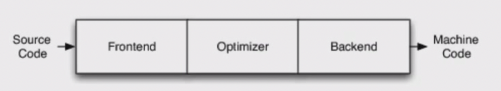
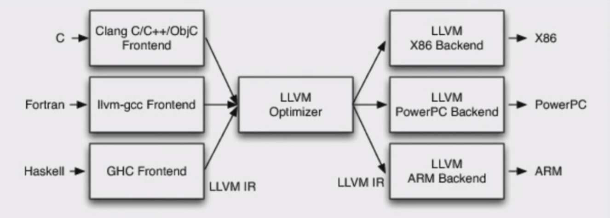
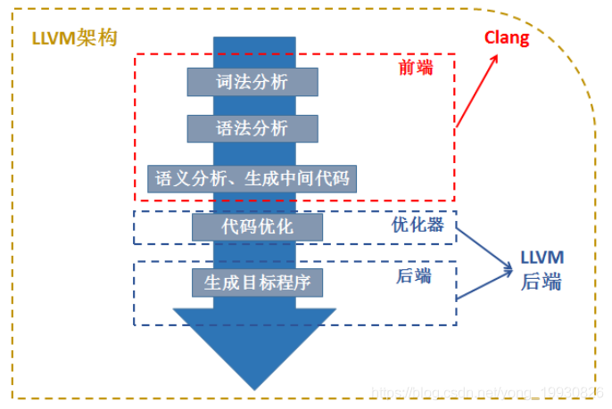
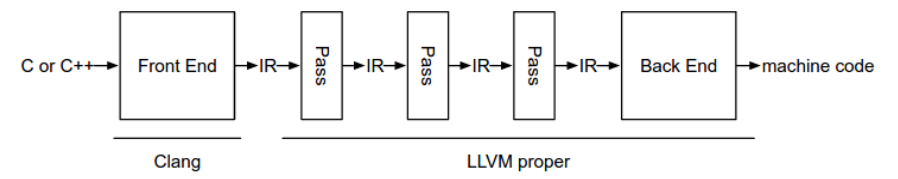
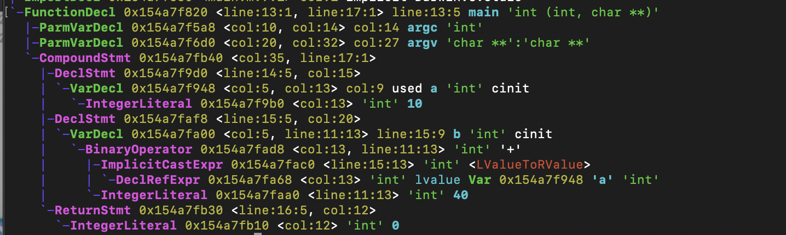
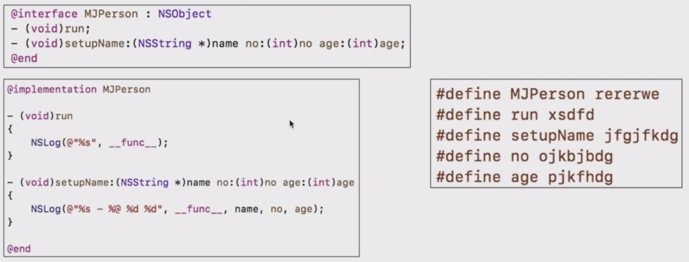

# LLVM 和 代码混淆
LLVM项目是模块化，可重用的编译器以及工具链技术的集合，[点击查看LLVM官网](https://llvm.org)。创始人是`Charis Lattner`,也是Swift之父。

## LLVM 和 传统编译架构 的差异
传统编译架构藕合比较严重,如下图:

```
* Frontend：词法分析、语法分析、语义分析、生成中间代码
* Optimizer:优化器（中间代码）
* Backend:后端，生成机器码
```

LLVM的编译架构 对前后端进行解耦，针对不同的语言可以使用不同的前后端编译器，但是生成的中间代码是一致的，结构如下图:

它的特点如下：
```markdown
* 不同的前端后端使用统一的中间代码`LLVM Intermediate Representation(LLVM IR)`
* 如果需要支持一种新的编程语言，那么只需要实现一个新的前端
* 如果需要支持一种新的硬件设备，那么只需要实现一个新的后端
* 优化阶段是一个通用的阶段，它针对的是统一的LLVM IR，不论是支持新的编程语言，还是支持新的硬件设备，都不需要对优化阶段做修改
* 相比之下，GCC的前端和后端没分的太开，前端和后端耦合在一起，所以GCC为了支持一门新的语言，或者为了支持一个新的目标平台，就变的特别困难
* LLVM现在被作为实现各种金泰和运行编译语言的通用基础（GCC家族、Java、.NET、Python、Ruby、Scheme、Haskell、D等
```

## Clang
Clang 是 LLVM项目的一个子项目，是基于LLVM架构的 `C/C++/Objective-C`的编译器前端。相比于GCC，Clang具有如下优点:
```markdown
* 编译速度快：在某些平台上，Clang的编译速度显著的快过GCC（Debug模式下编译OC速度比GGC快3倍）
* 占用内存小：Clang 生成的 AST 所占用的内存是 GCC 的五分之一左右
* 模块化设计：Clang 采用基于库的模块化设计，易于 IDE 集成及其他用途的重用
* 诊断信息可读性强：在编译过程中，Clang 创建并保留了大量详细的元数据 (metadata)，有利于调试和错误报告
* 设计清晰简单，容易理解，易于扩展增强
```

#### Clang与LLVM
广义上的LLVM是指 整个LLVM架构，狭义的LLVM：LLVM后端（代码优化、目标代码生成等）。如下图:

源代码经过Clang编译后，生成中间代码IR,中间代码经过一系列的pass优化,中间的优化代码我们是可以自己写的，优化完之后生成机器码。如下图: 


## OC源代码的编译过程
新创建一个命令行工具，查看代码的编译过程，main.m的代码如下：
```c
#include <stdio.h>

#define AGE 40

int main(int argc, char * argv[]) {
    int a = 10;
    int b = a + AGE;
    return 0
}
```
通过`clang -ccc-print-phases main.m`指令查看编译过程，如下：
```shell
mlive@mlivedeMacBook-Pro test % clang -ccc-print-phases main.m
               +- 0: input, "main.m", objective-c
            +- 1: preprocessor, {0}, objective-c-cpp-output
         +- 2: compiler, {1}, ir
      +- 3: backend, {2}, assembler
   +- 4: assembler, {3}, object
+- 5: linker, {4}, image
6: bind-arch, "arm64", {5}, image
```
input 找到`main.m`文件, preprocessor 进行预处理操作替换头文件和宏定义等信息, compiler 编译生成中间代码，backend 交给后端生成汇编代码，assembler 生成目标代码，linker 链接一些其他的动态库等等，最后bind-arch 生成arm64架构的代码

#### 预处理过程
通过`clang -E main.m`指令可以查看preprocessor（预处理）的结果，发现预处理就是将一些头文件代码导入和将宏定义进行替换

#### 词法分析
通过`clang -fmodules -E -Xclang -dump-tokens main.m`指令进行词法分析，生成一个个token，比如下面中`int`是一个token，`[`也是一个token.如下:
```
mlive@mlivedeMacBook-Pro test % clang -fmodules -E -Xclang -dump-tokens main.m
annot_module_include '#include <stdio.h>

#define AGE 40

int main(int argc, char * argv[]) {
    int a = 10'		Loc=<main.m:9:1>
int 'int'	 [StartOfLine]	Loc=<main.m:13:1>
identifier 'main'	 [LeadingSpace]	Loc=<main.m:13:5>
l_paren '('		Loc=<main.m:13:9>
int 'int'		Loc=<main.m:13:10>
identifier 'argc'	 [LeadingSpace]	Loc=<main.m:13:14>
comma ','		Loc=<main.m:13:18>
char 'char'	 [LeadingSpace]	Loc=<main.m:13:20>
star '*'	 [LeadingSpace]	Loc=<main.m:13:25>
identifier 'argv'	 [LeadingSpace]	Loc=<main.m:13:27>
l_square '['		Loc=<main.m:13:31>
r_square ']'		Loc=<main.m:13:32>
r_paren ')'		Loc=<main.m:13:33>
l_brace '{'	 [LeadingSpace]	Loc=<main.m:13:35>
int 'int'	 [StartOfLine] [LeadingSpace]	Loc=<main.m:14:5>
identifier 'a'	 [LeadingSpace]	Loc=<main.m:14:9>
equal '='	 [LeadingSpace]	Loc=<main.m:14:11>
numeric_constant '10'	 [LeadingSpace]	Loc=<main.m:14:13>
semi ';'		Loc=<main.m:14:15>
int 'int'	 [StartOfLine] [LeadingSpace]	Loc=<main.m:15:5>
identifier 'b'	 [LeadingSpace]	Loc=<main.m:15:9>
equal '='	 [LeadingSpace]	Loc=<main.m:15:11>
identifier 'a'	 [LeadingSpace]	Loc=<main.m:15:13>
plus '+'	 [LeadingSpace]	Loc=<main.m:15:15>
numeric_constant '40'	 [LeadingSpace]	Loc=<main.m:15:17 <Spelling=main.m:11:13>>
semi ';'		Loc=<main.m:15:20>
return 'return'	 [StartOfLine] [LeadingSpace]	Loc=<main.m:16:5>
numeric_constant '0'	 [LeadingSpace]	Loc=<main.m:16:12>
semi ';'		Loc=<main.m:16:13>
r_brace '}'	 [StartOfLine]	Loc=<main.m:17:1>
eof ''		Loc=<main.m:17:2>
```

#### 语法树 AST
词法分析完之后再进行语法分析，通过`clang -fmodules -fsyntax-only -Xclang -ast-dump main.m`指令生成语法书AST。如下图:


#### 中间代码 （LLVM IR）
LLVM IR有3种表示形式,本质是等价的。
```markdown
* text：便于阅读的文本格式，类似于汇编语言，拓展名.ll， `clang -S -emit-llvm main.m`
* memory：内存格式
* bitcode：二进制格式，拓展名.bc, `clang -c -emit-llvm main.m`
```
生成text格式的中间代码如下:
```
define i32 @main(i32 %0, i8** %1) #0 {
  %3 = alloca i32, align 4
  %4 = alloca i32, align 4
  %5 = alloca i8**, align 8
  %6 = alloca i32, align 4
  %7 = alloca i32, align 4
  store i32 0, i32* %3, align 4
  store i32 %0, i32* %4, align 4
  store i8** %1, i8*** %5, align 8
  store i32 10, i32* %6, align 4
  %8 = load i32, i32* %6, align 4
  %9 = add nsw i32 %8, 40
  store i32 %9, i32* %7, align 4
  ret i32 0
}
```
这是一种IR语法，点击[查看官网](https://llvm.org/docs/LangRef.html),IR基本语法是：
```markdown
* 注释以分号` ; `开头
* 全局标识符以`@`开头，局部标识符以`%`开头
* `alloca`，在当前函数栈帧中分配内存
* `i32`，32bit，4个字节的意思
* `align`，内存对齐
* `store`，写入数据
* `load`，读取数据
```

## 代码混淆
在做代码混淆之后理解什么是加固： 加固是为了增加应用的安全性，防止应用被破解、盗版、二次打包、注入、反编译等。常见的加固方式有:
```markdown
* 数据加密（字符串、网络数据、敏感数据等）
* 应用加壳（二进制加密）
* 代码混淆（类名、方法名、代码逻辑等）
* …（不同平台还有不同的做法）
```

iOS程序可以通过`class-dump`、`Hopper`、`IDA`等获取类名、方法名、以及分析程序的执行逻辑,如果进行代码混淆，可以加大别人的分析难度,目前iOS的代码混淆一般都是通过宏定义的方式修改类名、方法名、协议名信息。如下图。**需要注意的是宏定义不会替换xib、storyboard中的 名称的**。

混淆的注意点:
```markdown
* 不能混淆系统方法
* 不能混淆init开头的等初始化方法,混淆init方法之后在方法内使用`self = [super init]`会报错
* 混淆属性时需要额外注意set方法
* 如果xib、storyboard中用到了混淆的内容，需要手动修正
* 可以考虑把需要混淆的符号都加上前缀，跟系统自带的符号进行区分
* 混淆过多可能会被AppStore拒绝上架，需要说明用途
```

#### 字符串加密
很多时候，可执行文件中的字符串信息，对破解者来说，非常关键，是破解的捷径之一，为了加大破解、逆向难度，可以考虑对字符串进行加密。

字符串的加密技术有很多种，可以根据自己的需要自行制定算法,比如对每个字符进行`异或（^）`处理,
需要使用字符串时，对`异或（^）`过的字符再进行一次`异或（^）`，就可以获得原字符。代码如下:
```objc
int main(int argc, const char * argv[]) {
    
    const char *str = "12345";
    for (int i = 0; i < strlen(str); i++) {
        NSLog(@"%d",str[i] ^ 10);
    }
    
    // 异或后的字符串
    char stras[] = {59,56,57,62,63};
    NSMutableString *as = [NSMutableString string];
    for (int i = 0; i < strlen(stras); i++) {
        [as appendFormat:@"%c",stras[i] ^ 10];
    }
    NSLog(@"%@",as);
    
    return 0;
}
```


字符串加密这个方案感觉蛮好的,使用异或`^`的方式