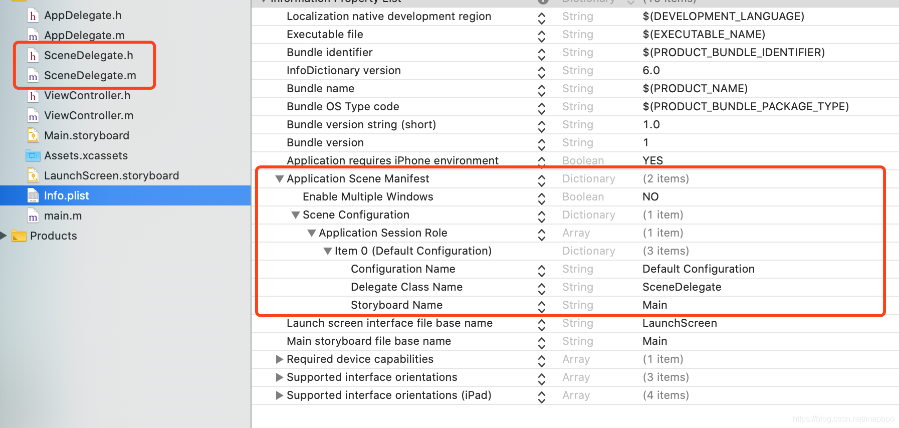

# 常见问题

## 基于Xcode11创建自定义UIWindow
Xcode 11 建新工程默认会创建通过 UIScene 管理多个 UIWindow 的应用,增加了 SceneDelegate 类，这是为了实现iPadOS支持多窗口的结果。


```info
enable Multipe Windows --- 是否允许分屏
Scene Configuratiton --- 屏幕配置项
Application Session Role --- 程序屏幕配置规则（为每个Scene指定规则）
Configuration Name --- 配置名称
Delegate Class Name --- 代理类名称
Storyboard Name  --- Storyboard的名字
```

在iOS13系统中，使用代码更换根控制器。
```objc
- (void)scene:(UIScene *)scene willConnectToSession:(UISceneSession *)session options:(UISceneConnectionOptions *)connectionOptions {
    if (scene) {
        self.window = [[UIWindow alloc] initWithWindowScene:(UIWindowScene *)scene];
        self.window.frame = CGRectMake(0, 0, [UIScreen mainScreen].bounds.size.width, [UIScreen mainScreen].bounds.size.height);
        self.window.rootViewController = [[ViewController alloc]init];
        [self.window makeKeyAndVisible];
    }
}
```
针对iOS13系统以下，需要`删除info.plist文件中的Application Scene Manifest选项;`,`删除SceneDelegate文件;`、`删除AppDelegate里面的UISceneSession lifecycle方法;`、`在AppDelegate头文件添加window属性;`
```objc

- (BOOL)application:(UIApplication *)application didFinishLaunchingWithOptions:(NSDictionary *)launchOptions {
    self.window = [[UIWindow alloc] initWithFrame:[UIScreen mainScreen].bounds];
    self.window.rootViewController = [[ViewController alloc]init];
    [self.window makeKeyAndVisible];
    return YES;
}
```

## 使用URLWithString方法时 无法生成url
`NSURL *url = [NSURL URLWithString:[NSString stringWithFormat:@"%@%@?%@",host_url,baseurl,postURL]];`
原因是字符串中存在特殊字符，需要先对字符串进行转义，
```
NSString *urlString = [NSString stringWithFormat:@"%@?paramstr=%@",url,[self jsonData]];
urlString = [urlString stringByAddingPercentEncodingWithAllowedCharacters:[NSCharacterSet URLQueryAllowedCharacterSet]];
```

## 腾讯播放器iOS13之前的系统不能播放视频
bug描述： 项目接入腾讯播放器后，iOS13之前的系统不能播放视频，iOS13系统之后的可以播放视频。

收到测试反馈这个bug之后，我的操作：
1. 找了iOS12系统的手机，看是否可以重新bug，测试过后发现bug确实存在
2. 找其他的项目组帮忙看一下他们的项目中iOS12系统手机是否能播放视频，测试后发现在他们的项目中iOS12系统可以播放视频。（为什么不自己直接试，这里牵扯到开发证书问题，我手上之后p12文件，不能添加测试设备，并且因为项目有一个马甲包，为了稳妥期间不添加其他测试设备以防被苹果审核）
3. 在发现确实是项目的问题之后，开始进行寻找。这个时候有点没有头绪，不知道从哪里入手。先删除了几个可能会影响到的库之后，问题依然存在。
4. 对项目使用加法，创建一个新的项目，做一个测试的Demo放进去，之后添加原项目中的库，发现没有问题，在添加项目文件时放弃了，由于项目经过长时间维护，引用的头文件导出都是，处理起来疲惫不堪，同组小伙伴在给项目做减法时遇到同样的问题。
5. 使用了一个方案，项目中保留两个播放库，在iOS13以下系统使用另一个播放库，iOS13之后使用腾讯的播放器。（到了这里已经不太愿意继续找了，觉得没有必要在这个问题上浪费时间。知道是肯定是某个文件导致的，但是要找到这个文件需要付出太多的精力）
6. 在找bug的期间小伙伴删除整个项目文件，只保留测试文件发现可以播放，基本可以确定是项目导致的。但是不知道具体的文件是什么，在删除项目文件因为引用的问题导致疲惫不堪
7. 写了一个Python脚本，将所有.m文件中的内容变成只根据文件名生成类的实现。因为Python的功力还不够，遇到了修改文件内容时部分文件生成的类名不对和部分文件内容没有被删除的问题，尽管如此还是减少了不少的工作量。
8. 将.m文件内容只显示类实现之后，减少了很多的引用问题，手动将.h的引用删除了
9. 挨个删除文件夹，最终在一个第三方Tune文件夹内发现了它交换了系统方法，导致播放器一直拉流失败。

总结：
1. 在遇到问题首先怀疑是库文件引起的没有错，但是删除之后视频依然不能播放时应该首先想到是因为分类引起的。
2. 在浪费大量时间解决删除项目文件时遇到引用问题，这个时候就应该停下来先想一想有没有更好的解决办法或者更好的删除方案。


## pch文件
项目使用oc和c++进行混编开发，在使用pch导入头文件时，需要使用`if __OBJC__`，表示宏内引用的文件确保只被使用Objective-C语言的文件所引用，保证引用关系的清晰。
```objc
#ifndef PrefixHeader1_pch
#define PrefixHeader1_pch

#ifdef __OBJC__
#import "NSDictionary+TGATransform.h"
#endif

#endif /* PrefixHeader1_pch */
```

## 多语言
添加多语言适配报错`Localizable.strings” couldn’t be copied to “zh-Hans.lproj” because an item with the same name already`,原因是之前添加过，但是没有删干净。

## iOS15 适配
设置系统导航栏背景颜色无效
```swift
navigationBar.setBackgroundImage(UIColor.clear.image, for: .default)
// 导航栏背景，主题色是绿色
navigationBar.barTintColor = UIColor.theme
// 默认不透明
navigationBar.isTranslucent = false
// 着色，让返回按钮图片渲染为白色
navigationBar.tintColor = UIColor.white
// 导航栏文字
navigationBar.titleTextAttributes = [
     NSAttributedString.Key.font: UIFont.systemFont(ofSize: 18),
     NSAttributedString.Key.foregroundColor: UIColor.white
]
```

iOS15 navigationBar的相关属性设置要通过实例`UINavigationBarAppearance`来实现，UINavigationBarAppearance是iOS13更新的API，应该有人已经在用，我们的应用兼容iOS10以上，对于导航栏的设置还没有使用UINavigationBarAppearance，如今在iOS15上失效，所以对于呈现的问题，做如下适配
```swift
if #available(iOS 15, *) {
    let app = UINavigationBarAppearance.init()
    app.configureWithOpaqueBackground()  // 重置背景和阴影颜色
    app.titleTextAttributes = [
        NSAttributedString.Key.font: UIFont.systemFont(ofSize: 18),
        NSAttributedString.Key.foregroundColor: UIColor.white
    ]
    app.backgroundColor = UIColor.theme  // 设置导航栏背景色
    app.shadowImage = UIColor.clear.image  // 设置导航栏下边界分割线透明
    navigationBar.scrollEdgeAppearance = app  // 带scroll滑动的页面
    navigationBar.standardAppearance = app // 常规页面
}
```

## UITabbar
tabbar的问题和navigationBar的问题属于同一类，tabbar背景颜色设置失效，字体设置失效，阴影设置失效问题，旧代码
```swift
self.tabBar.backgroundImage = UIColor.white.image
self.tabBar.shadowImage = UIColor.init(0xEEEEEE).image
item.setTitleTextAttributes(norTitleAttr, for: .normal)
item.setTitleTextAttributes(selTitleAttr, for: .selected)
```
新代码
```swift
if #available(iOS 15, *) {
    let bar = UITabBarAppearance.init()
    bar.backgroundColor = UIColor.white
    bar.shadowImage = UIColor.init(0xEEEEEE).image
    let selTitleAttr = [
        NSAttributedString.Key.font: itemFont,
        NSAttributedString.Key.foregroundColor: UIColor.theme
    ]
    bar.stackedLayoutAppearance.selected.titleTextAttributes = selTitleAttr // 设置选中attributes
    self.tabBar.scrollEdgeAppearance = bar
    self.tabBar.standardAppearance = bar
}
```

## UITableView
iOS15对于tableview，新增了sectionHeaderTopPadding作为列表每个部分标题上方的填充，它的默认值是UITableViewAutomaticDimension，所以我们要将他设置为0，否则当我们的列表设置了section高度的列表会出现head高度增加的情况，适配方式：

```swift
if #available(iOS 15, *) {
    tableView.sectionHeaderTopPadding = 0
}
```