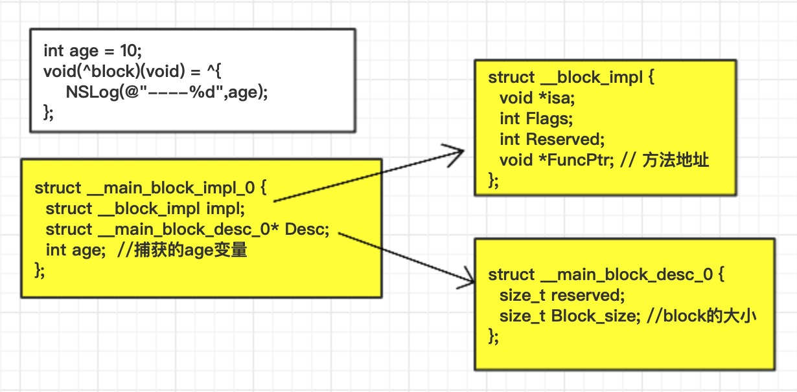
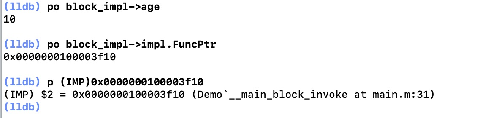

# Block
Block在项目开发中经常使用，我们经常使用它来做一些回调传值，但是你真的了解Block是什么东西吗？它的内部结构是什么样子呢，为什么要使用copy来修饰block,它又是怎么引起内存泄露的呢？

**我们将从下面几个方向学习Block:**
1. 通过将oc代码转换成 c++ 观察 Block 的数据结构
2. 通过转换oc代码观察 Block 的变量捕获不同变量的区别（auto类型、static类型、全局变量）
3. ARC和MRC环境下 Block 有什么不同以及不同类型的 Block 调用copy的结果
4. ARC什么情况下会自动调用copy
5. 对象类型的auto变量
6. `__block`的本质
7. Block的循环引用

## Block的内部结构
定义一个常见的Block块，通过`xcrun -sdk iphoneos clang -arch arm64 -rewrite-objc main.m`命令转换成c++代码,观察Block的结构
```objc
int age = 10;
void(^block)(void) = ^{
    NSLog(@"----%d",age);
};

// 转换后的block代码，内部包含__block_impl 和 __main_block_desc_0 两个结构体
struct __main_block_impl_0 {
  struct __block_impl impl;
  struct __main_block_desc_0* Desc;
  int age;
};

struct __block_impl {
  void *isa;
  int Flags;
  int Reserved;
  void *FuncPtr; //方法地址
};
// block的描述信息
struct __main_block_desc_0 {
  size_t reserved;
  size_t Block_size; // block的大小
};
// 封装了block执行逻辑的函数
static void __main_block_func_0(struct __main_block_impl_0 *__cself, int age1) {
  int age = __cself->age; // bound by copy
    ...
}
```
通过观察Block的结构体，我们发现 **Block本质也是一个OC对象，它内部也有isa指针，并且内部封装了函数调用（`void* FuncPtr`）以及函数调用环境**。这几个结构体的关系如下图：

我们将Block强转成结构体验证是否正确，转过之后通过结构体依然可以获取age的值，并且通过打印`void* FuncPtr`的地址，发现跟我们Block封装的方法地址是一致的。（Block的方法地址可以通过再Block内部断点，通过`Debug->Debug Workflow ->Always Show Disassembly`查看Block的方法地址）
```objc
int age = 10;
void(^block)(void) = ^{
    NSLog(@"----%d",age);
};
// 将block强转 __main_block_impl_0 结构体指针
struct  __main_block_impl_0 *block_impl = (__bridge struct __main_block_impl_0 *)block;
```
打印Block的方法地址


## Block 之变量捕获
知道了Block的内部结构，我们再来了解一下Block的变量捕获。为了保证Block内部能够正常访问外部变量的值，Block有变量捕获机制。

变量分为`局部变量`和`全局变量`。局部变量又有`auto`和`static`两种类型，**Block捕获不同类型的变量方式是不一样的**。捕获`auto`局部变量时，使用的是值传递，捕获`static`局部变量时，使用的是指针传递的方式。捕获全局变量时，使用直接访问的方式。

| 变量类型 |  | 捕获到block内部 | 访问方式
| -- | ------- | ------- | -------
局部变量 | auto | √ | 值传递
| | static | √ | 指针传递
全局变量 | | × | 直接访问

> atuo 类型

平时我们在使用局部变量时，默认是`auto`类型。通过转换oc代码查看block捕获`auto`局部变量类型,看到的结果block捕获的是age的值
```cpp
// 在不指定局部变量类型的情况下,系统会默认在局部变量前面加auto，因为每个局部变量都有，默认不显示
int age = 10;  // 等价于 auto int age = 10;
void(^block)(void) = ^{
    NSLog(@"--%d",age);
};

// block捕获auto局部变量时，会在结构体内部创建一个age
struct __main_block_impl_0 {
  struct __block_impl impl;
  struct __main_block_desc_0* Desc;
  int age; //值传递
};

// __main_block_impl_0结构体初始化时，传递的是age的值，将局部变量age的值赋值给自己的age
int age = 10;
void(*block)(void) = ((void (*)())&__main_block_impl_0((void *)__main_block_func_0, &__main_block_desc_0_DATA, age));
```
> static 类型
```cpp
static int age = 30;
void(^block)(void) = ^{
    NSLog(@"--%d",age);
};

struct __main_block_impl_0 {
  struct __block_impl impl;
  struct __main_block_desc_0* Desc;
  int *age; // 指针传递
};

// __main_block_impl_0结构体初始化时，传递的是age的地址
static int age = 30;
void(*block)(void) = ((void (*)())&__main_block_impl_0((void *)__main_block_func_0, &__main_block_desc_0_DATA, &age));
```
> 全局变量
```cpp
int age = 20;
static int height = 30;
int main(int argc, const char * argv[]) {
    @autoreleasepool {
        void(^block)(void) = ^{
            NSLog(@"--%d -- %d",age,height);
        };
    }
    return 0;
}

//全局变量时, 转换c++之后的Block结构体内部并不会对它进行捕获。
struct __main_block_impl_0 {
  struct __block_impl impl;
  struct __main_block_desc_0* Desc;
};

// 调用时，直接使用全局变量age
static void __main_block_func_0(struct __main_block_impl_0 *__cself) {
    NSLog((NSString *)&__NSConstantStringImpl__var_folders_lq_035f13253jg7rg4pbw518q440000gn_T_main_f3c139_mi_0,age,height);
}
```
## Block 的类型
Block既然是oc对象，那它肯定拥有类型，它的类型是什么，它的父类是谁，我们通过打印看一下观察到：`__NSMallocBlock__`:`__NSMallocBlock`:`NSBlock`:`NSObject`，这也证实了block就是一个oc对象。
```
NSLog(@"%@",[block class]);
NSLog(@"%@",[[block class] superclass]);
NSLog(@"%@",[[[block class] superclass] superclass]);
NSLog(@"%@",[[[[block class] superclass] superclass] superclass]);

Demo[10251:337992] __NSMallocBlock__
Demo[10251:337992] __NSMallocBlock
Demo[10251:337992] NSBlock
Demo[10251:337992] NSObject
```
block共有三种类型，可以通过下面的代码进行查看:
```objc
int age = 10;
void(^block)(void) = ^{
    NSLog(@"%d",age);
};

void(^block1)(void)= ^{
    
};

NSLog(@"%@ -- %@ -- %@",[block class],[block1 class],[^{
    NSLog(@"%d",age);
} class]);

// 打印结果:
__NSMallocBlock__ -- __NSGlobalBlock__ -- __NSStackBlock__ 
```
对应关系:
* __NSGlobalBlock__ （ _NSConcreteGlobalBlock ）
* __NSStackBlock__ （ _NSConcreteStackBlock ）
* __NSMallocBlock__ （ _NSConcreteMallocBlock ）

> 为什么会有三种类型的block？

想一下，为什么会Block会有三种类型呢？为什么捕获变量的时候，引用的方式不一样呢？**最主要的原因是不同类型的Block在内存中的位置不同**。如下图：


**程序在内存中都是分段管理的，每个内存段的特点和保存的东西不同：**
* `.text` 主要用来保存代码，属于代码段。
* data 主要放一些全局变量，属于数据段。
* 堆：动态分配内存，由程序员管理（自己申请和释放内存）。
* 栈 主要用来存在局部变量，由系统管理内存（分配和释放）

> Block的类型是根据什么确定的？

**当Block内部不访问auto变量的时候就是`__NSGlobalBlock__`类型，访问了auto变量就是`__NSStackBlock__`类型,即访问auto变量，又调用copy的时候就是`__NSMallocBlock__`类型。**

Block类型 | 环境
------- | -------
__NSGlobalBlock__ | 没有访问auto变量
__NSStackBlock__ | 访问了auto变量
__NSMallocBlock__ | __NSStackBlock__调用了copy

当你在ARC环境中，测试的时候没有出现`__NSStackBlock__`类型,不要惊讶，这是因为在ARC环境中，系统会根据情况自己帮我们调用copy方法，在`Build Settings`中搜索`automatic reference`,关闭ARC环境之后重新测试。在MRC环境测试下面的代码：
```
void(^block)(void);
void(^block1)(void);
void test(){
    int age = 10;
    block=^{
        NSLog(@"age: %d",age);
    };
    
    block1=[^{
        NSLog(@"age: %d",age);
    } copy];
    
    NSLog(@" -- %@ -- %@",[block class],[block1 class]);
}
// 打印结果:
-- __NSStackBlock__ -- __NSMallocBlock__
```

> 不同类型的block调用copy结果

Block的类 | 副本源的配置存储域 | 复制效果（copy）
------- | ------- | -------
_NSConcreteStackBlock | 栈 | 从栈复制到堆
_NSConcreteGlobalBlock | 数据段 | 什么也不做
 _NSConcreteMallocBlock | 堆 | 引用计数增加

## ARC什么情况下调用copy
在ARC环境下，使用Block时系统会根据情况帮我们调用copy方法，什么情况下系统才会帮我们调用copy呢？
* **block作为函数返回值时**
```objc
typedef  void(^Block)(void);
Block test(){
    int age = 10;
    return ^{
        NSLog(@"%d",age);
    };
}
```

* **将Block赋值给`__strong`指针时**
```objc
int height = 20;
void(^block)(void) = ^{
    NSLog(@"%d",height);
};
```

* **Block作为Cocoa API中方法名含有usingBlock的方法参数时**
```objc
NSArray *array = @[@"1",@"2",@"3"];
[array enumerateObjectsUsingBlock:^(id  _Nonnull obj, NSUInteger idx, BOOL * _Nonnull stop) {
    ...
}];
```

* **Block作为GCD API的方法参数时**
```objc
dispatch_after(dispatch_time(DISPATCH_TIME_NOW, (int64_t)(3 * NSEC_PER_SEC)), dispatch_get_main_queue(), ^{
    ...  
});
```

 ## 知识扩展
 **判断对象存在哪个数据段的小技巧**
 ```objc
 int age = 10;
int main(int argc, const char * argv[]) {
    @autoreleasepool {
        int height = 10;
        NSLog(@"数据段 局部变量 age: %p",&age);
        NSLog(@"栈 全局变量 height: %p",&height);
        NSLog(@"堆 实例对象 instance : %p",[[NSObject alloc] init]);
        NSLog(@"类对象 class : %p",[Person class]);
    }
    return 0;
}
打印结果:
 Demo[10942:375355] 数据段 局部变量 age: 0x100008128
 Demo[10942:375355] 栈 全局变量 height: 0x7ffeefbff54c
 Demo[10942:375355] 堆 实例对象 instance : 0x1018062c0
 Demo[10942:375355] 类对象 class : 0x1000080f8
对比类对象的内存地址和数据段的内存地址比较接近，基本判断类对象是存在数据段中。
 ```