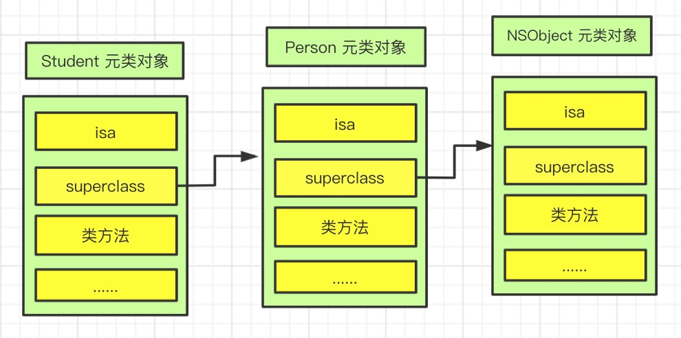
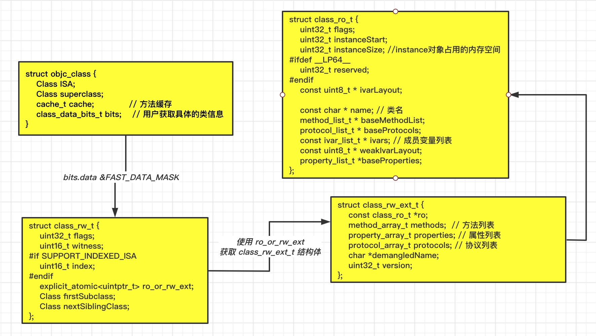

# isa和superclass
如果要学习isa和superclass,首先需要了解对象的分类，不同对象的isa指针指向的内存不同。我们将按照下面的流程学习:
1. 先了解对象的分类
2. 通过方法的调用认识isa和superclass指针的作用
3. 通过一张图加强对isa和superclass的认识
4. 通过打印指针地址的方式验证isa和superclass的调用过程
5. 通过阅读runtime源码查看isa和superclass

## oc对象的分类
oc对象可以分为三种，`instance对象 （实例对象）`、 `class 对象 （类对象）` 和 `meta-class 对象(元类对象)`

我们都知道实例对象在内存中保存着自己成员变量的具体值，每一个通过`[[NSObject alloc] init]`返回的实例对象的地址都不一样，但是它们内部都有一个共同的 isa 指针，这个isa指针是保存在哪里呢？另外我们平时用到协议、属性、方法又是保存在什么地方呢？

### 类对象 class
通过下面的代码获取到class对象,通过打印地址，会发现它们指向的是同一个地址。**也就是说每个类在内存中只有一个class对象**。

**class 对象在内存中存储的信息主要包括 isa指针、superclass指针、类的属性信息(@property)、类的对象方法信息(instance method)、类的协议信息(@protocol)、类的成员变量信息(ivar) ...等等**,这里的成员变量信息主要指成员变量的类型和名字，不是它的具体值。

```objc
#import <objc/runtime.h>

NSObject *obj = [[NSObject alloc] init];

Class class1 = [obj class];
Class class2 = [NSObject class];
Class class3 = object_getClass(obj);

NSLog(@"%p %p %p",class1,class2,class3);
```

### 元类对象 meta-class
通过`object_getClass()`方法，将类对象作为参数传递进去，返回元类对象。`元类对象`和`类对象`一样，返回的都是class类型，说明他们的结构是一样的，但是里面保存的值是不一样的。

**每个元类对象在内存中只有一份，主要保存isa指针、superclass指针、类的类方法信息、类的属性信息(值为null)、类的协议信息(null) ...等等**，虽然它的结构跟类对象是一样的，但是主要保存的还是isa、superclass和类的类方法，其他信息都是null。

```objc
// 将类对象作为参数传进去，获取的是元类对象
class metaClass = object_getClass([NSObject class]);
// 判断是否是元类
Bool isMetaClass = class_isMetaClass(metaClass);

```

## 初始 isa 和 superclass
根据我们上面的讲解，方法是保存在类对象和元类对象中的，那么当我们通过实例对象调用一个方法时，它是怎么找到这些方法并运行的呢？答案就是通过isa和supperclass。

>isa 指针

isa指针是怎么找到方法的呢？可以根据下面的图来认识一下，**当实例对象要调用方法时，会通过实例对象的isa指针找到自己的类对象，类对象存储着对象方法信息。如果是要调用类方法，会通过 类对象的isa指针 找到自己的 元类对象进行调用。**(一个是类对象class,一个是元类对象meta-class，🙅不要搞混哈！！)


如果子类调用父类的方法，又是如何找到的呢？这个时候就用到了我们的 superclass指针 。因为类对象的 superclass指针 和元类对象的 superclass指针 指向的类不同，所以这里先讲一下类对象的 superclass指针。

> 类对象 的superclass指针

假设我们有一个 Person类 继承自 NSObject , 一个Student类继承自Person类，superclass指针的指向如下图所示。**类对象的 superclass指针 指向的是 父类的类对象**，当Student的实例对象调用父类的方法时，会先通过isa指针找到自己的类对象，再通过类对象的 superclass指针找到Person的类对象，然后找到对应的方法进行调用。


> 元类对象 的superclass指针

同上所述，**元类对象的superlcass指针 指向的是自己父类的元类对象。**当Student调用Person的类方法时，会先通过类对象的isa指针找到自己的元类对象，然后通过元类对象的 superclass指针 找到Person的元类对象进行调用。



## 通过图来认识isa和superclass
图中有三个类，子类、父类、基类，通过superclass连接在一起。还有三种对象类型，实例对象、类对象、元类对象，通过isa连接在一起。我们可以把它们看成我们刚才讲的Student、Person、NSObject。虚线是isa，实线是superclass。


通过这张图我们可以做一个总结：
1. instance的isa指向 class, class 的isa指向 meta-calss, meta-calss 的isa指向基类的meta-calss
2. class的 superclass指针 指向父类的class，如果没有父类，指向nil
3. meta-calss的 superclass指针 指向父类的meta-calss，**基类的meta-calss的 superclass指针 指向 基类的class**

* 实例对象调用方法的轨迹：**instance通过isa找到class,如果方法不存在，通过superclass找到父类**
* class调用类方法的轨迹：**class通过isa找到meta-class,如果方法不存在，通过superclass找到父类**

>基类的元类对象 superlcass指针指向的是 基类的类对象。
这里我们肯定会有一个疑问，这是真的吗？我们将通过下面的代码进行证实。

```objc
// Person 继承自 NSObject,同时添加了 metaTest类方法 ,但并没有对它实现。通过添加NSObject分类实现了- (void)metaTest{}方法。直接调用[Person metaTest]发现可以发现metaTest方法。
@interface Person : NSObject
+ (void)metaTest;
@end

@implementation Person
@end

@interface NSObject (Test)
+ (void)metaTest;
@end

@implementation NSObject (Test)
// 实例方法
- (void)metaTest{
    NSLog(@"[NSObject test] -- %p",self);
}
@end

int main(int argc, const char * argv[]) {
    @autoreleasepool {
        NSLog(@"Person :%p -- NSObject :%p",[Person class],[NSObject class]);
        [Person metaTest];
        [NSObject metaTest];
    }
    return 0;
}
```
Person只做了方法声明，并没有对方法进行实现，创建NSObject分类，并且实现`- (void)metaTest`方法。运行之后，我们发现Person类真的可以调用`metaTest`方法，按照我们刚才所学，它的调用顺序应该如下图所示


## 通过打印指针地址 来看isa 和 superclass

我们之前一直是通过理论的方式来讲，下面通过打印isa指针地址的方式来进行验证。定义一个 Person类 继承自 NSObject，分别打印它的 实例对象、类对象、元类对象、和基类的元类对象的isa指针。

```objc
@interface Person : NSObject
@end

@implementation Person
@end

// 使用结构体强转的方式获取到isa指针。
struct p_objc_class{
    Class isa;
};

int main(int argc, const char * argv[]) {
    @autoreleasepool {
        // 实例对象 实例对象的isa & ISA_MASK = 类对象
        Person *p = [[Person alloc] init];
        
        // 类对象的isa指向元类对象
        Class pClass = [p class];
        
        // 元类对象的isa指向基类的元类对象(也就是NSObject的元类对象)
        Class pMetaClass = object_getClass(pClass);
        
        // 获取基类的元类独享
        Class objcMetaClass = object_getClass([NSObject class]);
        
        NSLog(@"实例对象地址：%p -- 类对象地址：%p -- 元类对象地址：%p -- 基类的元类对象地址：%p",p,pClass,pMetaClass,objcMetaClass);
        
        // 获取类对象的isa指针 （类对象不能直接打印出isa地址，我们通过强转结构体的方式，获取到isa指针）
        struct p_objc_class *p_class_isa = (__bridge struct p_objc_class*)pClass;
        NSLog(@"类对象的isa指针 -- %p",p_class_isa->isa);
        
        // 元类对象的isa指针
        struct p_objc_class *p_meta_class_isa = (__bridge struct p_objc_class*)pMetaClass;
        NSLog(@"元类对象的isa指针 -- %p",p_meta_class_isa->isa);
        
        // 基类的元类对象isa指针
        struct p_objc_class *objc_meta_class_isa = (__bridge struct p_objc_class*)objcMetaClass;
        NSLog(@"基类的元类对象isa指针 -- %p",objc_meta_class_isa->isa);
    }
    return 0;
}
```
通过上面的地址打印，发现跟我们描述的基本是一样的。实例对象的isa指针我们通过 lldb 命令进行获取，获取之后你会发现 实例对象的isa指针 指向的并不是 类对象的地址，这是因为在新的源码中 `实例对象的isa指针 &  ISA_MASK  = 类对象地址`，通过下图可以确认:

`ISA_MASK`宏不同平台显示的是不同的值。因为我们是通过Mac电脑进行演示的，所以这里是`0x00007ffffffffff8`
```cpp
// 简化后的代码
# if __arm64__
#   define ISA_MASK        0x0000000ffffffff8ULL
# elif __x86_64__
#   define ISA_MASK        0x00007ffffffffff8ULL
# endif
```
> 验证superclass指针

通过打印我们验证了isa的指针，下面我们再通过打印superclass指针来进行验证,因为superclass不支持直接打印，我们通过将类对象强转成结构体的形式对superclass进行打印。
```objc
@interface Person : NSObject
@end

@implementation Person
@end

// 使用结构体强转的方式获取到isa指针。
struct p_objc_class{
    Class isa;
    Class superclass;
};

int main(int argc, const char * argv[]) {
    @autoreleasepool {
        struct p_objc_class *p_class = (__bridge struct p_objc_class *)[Person class];
        struct p_objc_class *obj_class = (__bridge struct p_objc_class *)[NSObject class];
        
        // superclass指针：0x7fff91ccc118 --- NSObject类对象地址：0x7fff91ccc118
        NSLog(@"superclass指针：%p --- NSObject类对象地址：%p",p_class->superclass,obj_class);
    }
    return 0;
}
```
通过上面的代码打印，发现 Person 类对象的 superclass 指针指向的正是 NSObject 的类对象地址，也验证了我们的说法是正确的。

## 通过源码来看isa 和 superclass
如果要阅读源码，首先我们要搞清楚 Class 是一个什么东西,通过查看 objc.h 文件，`typedef struct objc_class *Class;`我们看到Class是一个定义的结构体，在源码中搜索`struct objc_class`找到定义位置开始读。代码片段来自于`objc4-781`，[点击进入下载地址](https://opensource.apple.com/tarballs/objc4/)。由于功力有限，自己阅读源码感受一下吧。

```cpp
struct objc_object {
private:
    isa_t isa;
    ...
}
// objc_class 继承自 objc_object, objc_object里面只有一个isa属性，剩下的都是方法
struct objc_class : objc_object {
    // Class ISA;
    Class superclass;
    cache_t cache;             // formerly cache pointer and vtable
    class_data_bits_t bits;    // class_rw_t * plus custom rr/alloc flags
    ...
}

// 类的具体信息
struct class_rw_t {
    // Be warned that Symbolication knows the layout of this structure.
    uint32_t flags;
    uint16_t witness;
#if SUPPORT_INDEXED_ISA
    uint16_t index;
#endif

    explicit_atomic<uintptr_t> ro_or_rw_ext; 

    Class firstSubclass;
    Class nextSiblingClass;

    ...

    // 方法
    const method_array_t methods() const {
        auto v = get_ro_or_rwe();
        if (v.is<class_rw_ext_t *>()) {
            return v.get<class_rw_ext_t *>()->methods;
        } else {
            return method_array_t{v.get<const class_ro_t *>()->baseMethods()};
        }
    }

    // 属性
    const property_array_t properties() const {
        auto v = get_ro_or_rwe();
        if (v.is<class_rw_ext_t *>()) {
            return v.get<class_rw_ext_t *>()->properties;
        } else {
            return property_array_t{v.get<const class_ro_t *>()->baseProperties};
        }
    }

    // 协议
    const protocol_array_t protocols() const {
        auto v = get_ro_or_rwe();
        if (v.is<class_rw_ext_t *>()) {
            return v.get<class_rw_ext_t *>()->protocols;
        } else {
            return protocol_array_t{v.get<const class_ro_t *>()->baseProtocols};
        }
    }
    ...
}

struct class_ro_t {
    uint32_t flags;
    uint32_t instanceStart;
    uint32_t instanceSize;
#ifdef __LP64__
    uint32_t reserved;
#endif

    const uint8_t * ivarLayout;
    
    const char * name;
    method_list_t * baseMethodList;
    protocol_list_t * baseProtocols;
    const ivar_list_t * ivars;

    const uint8_t * weakIvarLayout;
    property_list_t *baseProperties;

    method_list_t *baseMethods() const {
        return baseMethodList;
    }
    ...
};
```


## 扩展知识
`object_getClass(id obj)`、`objc_getClass(const char *aClassName)`和`+ (Class)class`三个方法的区别

 ```cpp
// objc-class.mm
Class object_getClass(id obj)
{
    // 如果是instance对象，返回的是class对象
    // 如果是class对象，返回的是meta-class对象
    // 如果是meta-class对象，返回的是NSOject(基类)的meta-class对象
    if (obj) return obj->getIsa();
    else return Nil;
}

// 根据类名，返回的这个类的类对象，如果类不存在，则可能会创建
Class objc_getClass(const char *aClassName)
{
    if (!aClassName) return Nil;
    // NO unconnected, YES class handler
    return look_up_class(aClassName, NO, YES);
}

// 返回的一直都是类对象
+ (Class)class
- (Class)class
```

## 面试题
**面试题1: 对象的isa指向哪里**
* instance 对象的isa指向class对象
* class 对象的isa指向meta-class对象
* meta-calss对象的isa指向基类的meta-class对象

**面试题2: OC的类信息存放在哪里**
* 成员变量的具体值，存放在instance 对象中
* 对象方法、属性、成员变量、协议信息，存放在class对象中
* 类方法，存放在meta-class对象中