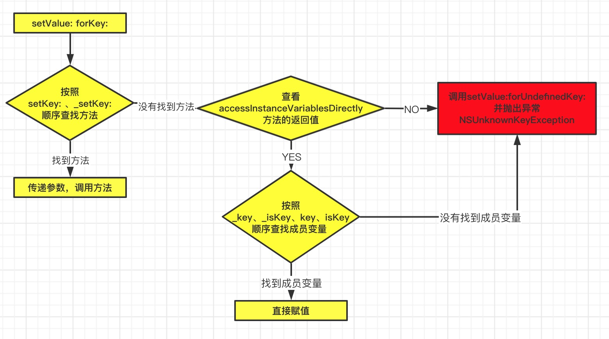
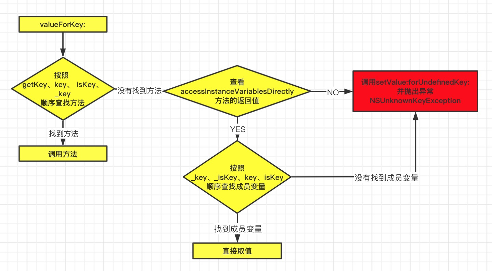

# KVC的本质
KVC 的全称是`Key-Value Coding`，俗称“键值编码”，可以通过一个key来访问某个属性

> KVC中常见的API
```objc
- (void)setValue:(id)value forKeyPath:(NSString *)keyPath;
- (void)setValue:(id)value forKey:(NSString *)key;
- (id)valueForKeyPath:(NSString *)keyPath;
- (id)valueForKey:(NSString *)key; 
```

## KVC的基础使用
通过下面的代码认识一下KVC的基本使用
```objc
@interface Cat : NSObject
@property (nonatomic, assign)int height;
@end

@implementation Cat
@end

@interface Person : NSObject
@property (nonatomic, assign)int age;
@property (nonatomic, strong)Cat *cat;
@end

@implementation Person
@end

- (void)viewDidLoad {
    [super viewDidLoad];
    Person *p = [Person new];
    p.cat = [Cat new];

    // 对age和height进行赋值
    [p setValue:@10 forKey:@"age"];
    [p setValue:@11 forKeyPath:@"cat.height"];

    // 读取age 和height的值
    NSLog(@"age: %@  -- height:%@",[p valueForKey:@"age"],[p valueForKeyPath:@"cat.height"]);
}
```

## setValue: forKey: 的调用流程
调用`setValue: forKey:`方法时，会优先按照`setKey:` 、`_setKey`的顺序查找方法，如果找到了直接调用。如果没找到，会查看`accessInstanceVariablesDirectly`方法的返回值是否允许访问成员变量，如果是NO，抛出`NSUnknownKeyException`异常。如果是 YES，会按照 `_key、_isKey、key、isKey`的顺序查找成员变量，如果有成员变量，直接对成员变量进行赋值，如果没有找到成员变量，则抛出`NSUnknownKeyException`异常。 **`accessInstanceVariablesDirectly`方法默认返回YES**。

我们可以自己通过下面的代码试一下，Person类没有成员变量age，但是有`setAge:`方法时，当 Person的实例对象 使用KVC方法时,同样会调用`setAge:`方法
```objc
@interface Person : NSObject
@end

@implementation Person
- (void)setAge:(int)age{
    NSLog(@"%@ 调用setAge:",object_getClass(self));
}
- (void)_setAge:(int)age{
    NSLog(@"%@ 调用_setAge:",object_getClass(self));
}
// 是否允许访问成员变量
+ (BOOL)accessInstanceVariablesDirectly{
    return YES;
}
@end

- (void)viewDidLoad {
    [super viewDidLoad];
    Person *p = [Person new];
    //  即使Person类没有age属性，只要有setAge:方法，就会调用setAge:
    [p setValue:@10 forKey:@"age"];
}
```

注意: **即使类中没有实现`setKey:`方法，只要使用KVC方法对属性的值进行改变，就会触发KVO。**同样，我们可以通过下面的代码进行验证。
```objc
@interface Person : NSObject
{
    @public
    int _age;
}
@end

@implementation Person
- (void)willChangeValueForKey:(NSString *)key{
    [super willChangeValueForKey:key];
    NSLog(@"willChangeValueForKey");
}
-(void)didChangeValueForKey:(NSString *)key{
    NSLog(@"didChangeValueForKey-begin");
    [super didChangeValueForKey:key];
    NSLog(@"didChangeValueForKey-end");
}
@end

- (void)viewDidLoad {
    [super viewDidLoad];
    Person *p = [Person new];
    [p addObserver:self forKeyPath:@"age" options:NSKeyValueObservingOptionNew context:nil];
  
    // 当我们调用setValue: forKey: 方法时，依然会触发KVO
    [p setValue:@10 forKey:@"age"];
    [p removeObserver:self forKeyPath:@"age"];
}

打印调用顺序：
2020-12-15 20:19:51.280118+0800 Demo[20917:454289] willChangeValueForKey
2020-12-15 20:19:51.280302+0800 Demo[20917:454289] didChangeValueForKey-begin
2020-12-15 20:19:51.280610+0800 Demo[20917:454289] <Person: 0x60000093c080> -- age -- {
    kind = 1;
    new = 10;
}
2020-12-15 20:19:51.280769+0800 Demo[20917:454289] didChangeValueForKey-end
```

## valueForKey: 的调用流程
调用`valueForKey:`方法时，会优先按照`getKey、key、isKey、_key`的顺序查找方法，如果找到了直接调用。如果没找到，会查看`accessInstanceVariablesDirectly`方法的返回值是否允许访问成员变量，如果是NO，抛出`NSUnknownKeyException`异常。如果是 YES，会按照 `_key、_isKey、key、isKey`的顺序查找成员变量，如果有成员变量，直接获取成员变量的值，如果没有找到成员变量，则抛出`NSUnknownKeyException`异常。


## 面试题
**面试题1: 通过KVC修改属性会触发KVO么？**

会触发KVO,即使类中没有实现`setKey:`方法，只要使用KVC对属性的值进行改变，就会触发KVO。


## 推荐阅读
[KVC原理剖析](https://segmentfault.com/a/1190000013476163)