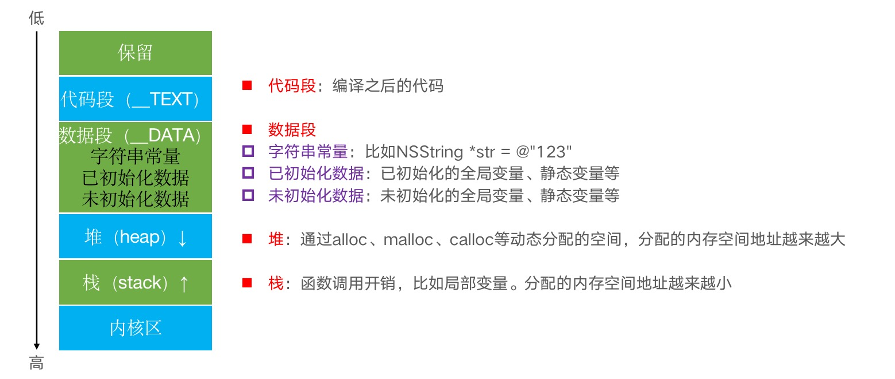

# 内存管理 - 内存布局、Tagged Pointer、MRC、Copy
在本章中，我们将学习内存布局、Tagged Pointer技术、MRC、Copy、引用计数和week的实现原理。先来了解一下程序在内存中的布局。

## 内存布局
APP内的代码、字符串、常量、对象它们在内存中的排序是怎么样？通过下面这张图来了解一下:

通过上图我们了解到，内存中的排序是`代码段内存地址 < 数据段内存地址 < 堆地址 < 栈地址 < 内核区地址`，注意：堆、栈可能会有部分地址混用，根据上图显示，堆地址是从低地址往高地址分配，而栈地址是高地址往低地址分配，这样有可能造成部分内存混用。

通过打印全局变量、静态变量、局部变量、对象 指针地址的方式进行验证:
````objc
int a = 10;
int b;
- (void)viewDidLoad {
    [super viewDidLoad];
    static int c = 20;
    static int d;
    int e = 30;
    int f;
    NSString *str = @"234567543213456";
    NSObject *obj = [[NSObject alloc] init];
    NSObject *obj1 = [[NSObject alloc] init];

    NSLog(@"\n a = %p \n b = %p \n c = %p \n d = %p \n e = %p \n f  = %p \n str = %p \n obj = %p \n obj1 = %p \n",&a,&b,&c,&d,&e,&f,str,obj,obj1);
}

打印结果:
// 字符串常量
str = 0x10f289040

// 已初始化全局变量、静态变量
a = 0x10f28e580
c = 0x10f28e584

// 未初始化的全局变量、静态变量
b = 0x10f28e64c
d = 0x10f28e648

// 堆
obj = 0x600001544080
obj1= 0x600001544090

// 栈
f =   0x7ffee0978d00
e =   0x7ffee0978d04
````
通过打印结果我们看到：字符串的内存地址最低，栈的内存地址最高，并且栈内存地址是从高地址往低地址分配。也验证了我们上面的说法是正确的。

## Tagged Pointer
从64bit开始，iOS引入了`Tagged Pointer`技术,主要用于优化 `NSNumber、NSDate、NSString`等小对象的存储。

在没有使用`Tagged Pointer`之前， NSNumber 等对象需要动态分配内存、维护引用计数等，NSNumber 指针存储的是堆中 NSNumber 对象的地址值。

使用`Tagged Pointer`之后，NSNumber指针里面存储的数据变成了：`Tag + Data`，也就是将数据直接存储在了指针中,当指针不够存储数据时，才会使用动态分配内存的方式来存储数据。

在调用方法时,`objc_msgSend` 能识别 `Tagged Pointer`，比如 NSNumber 的 intValue 方法，直接从指针提取数据，节省了以前的调用开销

> 通过打印地址验证

在现在的版本中，为了保证数据安全，苹果对 `Tagged Pointer` 做了数据混淆，开发者通过打印指针无法判断它是否是一个Tagged Pointer对象，更无法读取它的存储数据。在分析Tagged Pointer之前，可以通过添加环境变量`OBJC_DISABLE_TAG_OBFUSCATION`为 YES 关闭混淆。通过打印存储的地址进行判断:
```objc
int main(int argc, const char * argv[]) {
    @autoreleasepool {
        NSNumber *num1 = @4;
        NSNumber *num2 = @5;
        NSNumber *num3 = @6;
        NSString *str = [NSString stringWithFormat:@"abc"];
        NSLog(@"%p %p %p %p %p",num1,num2,num3,str);
        NSLog(@"%@",[str class]);
    }
    return 0;
}
// 关闭加密混淆: 0x427 0x527 0x627 0x63626135 
// 开启加密混淆: 0xd19eac0b6d90790b 0xd19eac0b6d90780b 0xd19eac0b6d907b0b 0xd19eac0b0ef21c19
// str的类型: NSTaggedPointerString
```
根据打印地址我们看到，关闭加密混淆之后打印的地址值包含着NSNumber对象的值，字符串也是，61在ACSII码中代表a，62代表b，63代表c。

> 如何判断一个指针是否为Tagged Pointer？

判断一个对象是不是属于`Tagged Pointer`,**在Mac平台，最低有效位是1，在iOS平台，最高有效位是1（第64bit）**,我们也可以通过runtime源码确认我们的说法是否正确:
```objc
static inline bool
_objc_isTaggedPointerOrNil(const void * _Nullable ptr)
{
    return !ptr || ((uintptr_t)ptr & _OBJC_TAG_MASK) == _OBJC_TAG_MASK;
}

#if __arm64__
#   define OBJC_SPLIT_TAGGED_POINTERS 1
#else
#   define OBJC_SPLIT_TAGGED_POINTERS 0
#endif

#if (TARGET_OS_OSX || TARGET_OS_MACCATALYST) && __x86_64__
    // 64-bit Mac - tag bit is LSB
#   define OBJC_MSB_TAGGED_POINTERS 0
#else
    // Everything else - tag bit is MSB
#   define OBJC_MSB_TAGGED_POINTERS 1
#endif

#if OBJC_SPLIT_TAGGED_POINTERS
#   define _OBJC_TAG_MASK (1UL<<63)
#elif OBJC_MSB_TAGGED_POINTERS
#   define _OBJC_TAG_MASK (1UL<<63)
#else
#   define _OBJC_TAG_MASK 1UL
#endif
```
> `Tagged Pointer`的面试题，判断下面这两段代码会有什么结果

```objc
// 代码1 
dispatch_queue_t queue = dispatch_queue_create("queue", DISPATCH_QUEUE_CONCURRENT);
for (int i = 0; i < 1000; i++) {
    dispatch_async(queue, ^{
        self.name = [NSString stringWithFormat:@"abcdefghijklmn"];
    });
}

// 代码2
dispatch_queue_t queue = dispatch_queue_create("queue", DISPATCH_QUEUE_CONCURRENT);
for (int i = 0; i < 1000; i++) {
    dispatch_async(queue, ^{
        self.name = [NSString stringWithFormat:@"abc"];
    });
}
```
运行上面两段代码，我们发现在运行代码1的时候发生了坏内存访问，崩溃在`objc_release()`方法,这是因为虽然项目是ARC环境，但是ARC的本质还是MRC，系统默认帮我们实现了之前需要自己写的 return 和 release 操作。当我们给 name 属性赋值时，调用的方法是`setName:`函数。在函数内部，系统帮我们实现了release操作。代码如下:
```objc
- (void)setName:(NSString *)name{
    if (_name != name) {
        [_name release];
        _name = [name copy];
    }
}
```
当我们使用多个线程同时调用此方法时，就会产生坏内存访问。解决方案也很简单，在调用`setName:`函数之前进行加锁就可以了。

为什么代码2没有产生崩溃，这是因为代码2的字符串使用了`Tagged Pointer`，字符串本身就是存储在指针中，不需要调用release方法。

## MRC
在iOS中，使用**引用计数**来管理OC对象的内存,一个新创建的OC对象引用计数默认是1，当引用计数减为0，OC对象就会销毁，释放其占用的内存空间。调用`retain`会让OC对象的引用计数+1，调用`release`会让OC对象的引用计数-1。

MRC环境下,需要程序员自己调用return和release操作。当使用其他对象作为成员变量时，需要在set方法中进行return,在dealloc方法中进行release。举个🌰:
```objc
@interface Person : NSObject
@property (nonatomic, strong)Cat *cat;
@end

@implementation Person

- (void)setCat:(Cat *)cat{
    if (_cat != cat) {
        [_cat release];
        _cat = [cat retain];
    }
}

- (void)dealloc{
    [_cat release];
    _cat = nil;
    [super dealloc];
}
@end
```

## Copy
如果要了解Copy，我们就得知道Copy的目的是什么？我们想要的是Copy后的文件内容和要拷贝的文件内容一致。并且修改其中一个文件内容不会改变另一个文件内容。

知道了Copy的目的，我们再来了解什么是深拷贝、什么是浅拷贝。深拷贝和浅拷贝的区别在于:调用copy方法时，需不需要重新开辟一块内存空间，如果需要开启新的内存空间，就属于深拷贝，如果不需要，属于浅拷贝。深拷贝属于内容拷贝，会产生新的对象。浅拷贝属于指针拷贝，没有产生新的对象。

iOS中提供了两个拷贝方法，`copy`和`mutableCopy`。`copy: 不可变拷贝，产生一个不可变的副本。mutableCopy: 可变拷贝，产生可变副本。`

**不同类型下的深拷贝和浅拷贝**

类型 | copy | mutableCopy 
------- | ------- | ------- 
NSString | NSString<br><small>浅拷贝</small> |  NSMutableString<br><small>深拷贝</small> 
NSMutableString  | NSString<br><small>深拷贝</small>  |  NSMutableString<br><small>深拷贝</small> 
NSArray  | NSArray<br><small>浅拷贝</small> |  NSMutableArray<br><small>深拷贝</small> 
NSMutableArray |   NSArray<br><small>深拷贝</small>  |  NSMutableArray<br><small>深拷贝</small> 
NSDictionary |  NSDictionary<br><small>浅拷贝</small> |  NSMutableDictionary<br><small>深拷贝</small> 
NSMutableDictionary  | NSDictionar<br><small>深拷贝</small>  |   NSMutableDictionary<br><small>深拷贝</small> 

**成员变量使用copy进行修饰时的注意事项：**

当我们使用copy修饰成员变量时，代表调用当前属性的copy方法。根据之前所讲，即使我们是可变对象，调用copy方法之后，返回的也是一个不可变对象。举个🌰：
```
@interface Person : NSObject
@property (nonatomic,copy)NSMutableArray *ary;
@end

- (void)viewDidLoad {
    [super viewDidLoad];
    
    Person *person = [[Person alloc] init];
    person.ary = [NSMutableArray array];

    NSMutableArray *dataAry = person.ary;
    [dataAry addObject:@"123456"];
}
```
当往dataAry中添加成员时，会造成程序崩溃`-[__NSArray0 addObject:]: unrecognized selector sent to instance`,这就有点奇怪了，我们的数组不是一个可变数组吗？为什么会报这个错误？

主要原因在于： 我们是使用copy对成员变量进行修饰。当我们对数组进行初始化时，调用的是`setAry:`函数,在函数内部，系统会调用`[ary copy]`方法返回一个新的不可变数组，所以在往数组中添加数据时会报找不到方法的错误。相当于以下代码:
```objc
- (void)setAry:(NSMutableArray *)ary{
    if (_ary != ary) {
        [_ary release];
        _ary = [ary copy];
    }
}
```

**为什么系统使用copy修饰可变的字符串：**

我们在使用`UITextField`时，看到`attributedText`属性就是使用copy进行修饰的,为什么系统要使用copy修饰可变的字符串呢？

这牵扯到设计思想的问题。iOS并不希望你在赋值之后，在使用过程中更改字符串，文本框的内容也要跟着改变。他更多的是希望你将字符串初始化好之后对其进行赋值。赋值之后对字符串的操作也影响不到`UITextField`控件内部字符串内容。

## 引用计数
在iOS中，使用**引用计数**来管理OC对象的内存,一个新创建的OC对象引用计数默认是1，当引用计数减为0，OC对象就会销毁，释放其占用的内存空间,调用`retain`会让OC对象的引用计数+1，调用`release`会让OC对象的引用计数-1。

当调用`alloc、new、copy、mutableCopy`方法返回了一个对象，在不需要这个对象时，要调用`release`或者`autorelease`来释放它。想拥有某个对象，就让它的引用计数+1；不想再拥有某个对象，就让它的引用计数-1

可以通过私有函数`extern void _objc_autoreleasePoolPrint(void);`来查看自动释放池的情况

**引用计数存储的位置**

在64bit中，引用计数可以直接存储在优化过的isa指针中`(extra_rc)`。当引用计数过大无法存储在isa中时，`has_sidetable_rc`值会设为1，引用计数会被存储在`SideTable`类的属性中
```
struct SideTable {
    spinlock_t slock;
    RefcountMap refcnts;  // 存放着对象引用计数的散列表
    weak_table_t weak_table; // 存放着weak对象的散列表
};
```

## weak
我们都知道`__weak`是弱引用,它内部是怎么实现的呢？我们先通过一段代码来展示使用不同修饰词引用对象时，对象的释放时机会发生变化:
```
- (void)viewDidLoad {
    [super viewDidLoad];
    __strong Person *person1;
    __weak Person *person2;
    __unsafe_unretained Person *person3;
    
    NSLog(@"begin");
    {
        Person *person = [[Person alloc] init];
        person1 = person;
        // person2 = person;
        // person3 = person;
    }
    NSLog(@"end ");
}
```
在上面的代码中,当我们通过`__strong`引用 person 时,打印 end 之后才会释放Person对象，而通过`__weak`和`__unsafe_unretained`引用 person 时,在打印 end 之前就会释放Person对象。

**`__weak`和`__unsafe_unretained`的区别**
* `__weak`: 在释放Person对象时会将实例对象设置为nil
* `__unsafe_unretained`: 在释放Person对象时不会更改实例对象的值

**`__weak`为什么可以将实例对象设置为nil**

通过runtime源码进行解读: `dealloc`->`_objc_rootDealloc()`->`rootDealloc()`->`object_dispose()`->`objc_destructInstance()`->` obj->clearDeallocating()`

```objc
objc_object::rootDealloc()
{
    if (isTaggedPointer()) return;  // fixme necessary?

    // 如果是一个优化过的isa指针 && 没有弱引用 && 没有关联对象 && 没有c++构造函数 && 没有使用sidetable存储引用计数
    if (fastpath(isa.nonpointer                     &&
                 !isa.weakly_referenced             &&
                 !isa.has_assoc                     &&
                 !isa.getClass(false)->hasCxxDtor() &&
                 !isa.has_sidetable_rc))
    {
        free(this);
    } 
    else {
        object_dispose((id)this);
    }
}

inline void 
objc_object::clearDeallocating()
{
    if (slowpath(!isa.nonpointer)) {
        // Slow path for raw pointer isa.
        sidetable_clearDeallocating();
    }
    else if (slowpath(isa.weakly_referenced  ||  isa.has_sidetable_rc)) {
        // Slow path for non-pointer isa with weak refs and/or side table data.
        clearDeallocating_slow();
    }
}

/***********************************************************************
* objc_destructInstance
* Destroys an instance without freeing memory. 
* Calls C++ destructors.
* Calls ARC ivar cleanup.
* Removes associative references.
* Returns `obj`. Does nothing if `obj` is nil.
**********************************************************************/
void *objc_destructInstance(id obj) 
{
    if (obj) {
        // Read all of the flags at once for performance.
        bool cxx = obj->hasCxxDtor();
        bool assoc = obj->hasAssociatedObjects();

        // This order is important.
        if (cxx) object_cxxDestruct(obj);  //清除成员变量
        if (assoc) _object_remove_assocations(obj, /*deallocating*/true); // 移除关联对象
        obj->clearDeallocating();  // 将指向当前对象的弱指针置为nil
    }
    return obj;
}

inline void 
objc_object::clearDeallocating()
{
    if (slowpath(!isa.nonpointer)) {
        // Slow path for raw pointer isa.
        sidetable_clearDeallocating();
    }
    else if (slowpath(isa.weakly_referenced  ||  isa.has_sidetable_rc)) {
        // Slow path for non-pointer isa with weak refs and/or side table data.
        clearDeallocating_slow();
    }
}

NEVER_INLINE void
objc_object::clearDeallocating_slow()
{
    SideTable& table = SideTables()[this];
    table.lock();
    if (isa.weakly_referenced) {
        weak_clear_no_lock(&table.weak_table, (id)this);
    }
    if (isa.has_sidetable_rc) {
        table.refcnts.erase(this);
    }
    table.unlock();
}

// 由dealloc调用； 清除所有指向所提供对象的弱指针，以便不再使用它们
void 
weak_clear_no_lock(weak_table_t *weak_table, id referent_id) 
{
    objc_object *referent = (objc_object *)referent_id;

    weak_entry_t *entry = weak_entry_for_referent(weak_table, referent);
    if (entry == nil) {
        return;
    }

    // zero out references
    weak_referrer_t *referrers;
    size_t count;
    
    if (entry->out_of_line()) {
        referrers = entry->referrers;
        count = TABLE_SIZE(entry);
    } 
    else {
        referrers = entry->inline_referrers;
        count = WEAK_INLINE_COUNT;
    }
    
    for (size_t i = 0; i < count; ++i) {
        objc_object **referrer = referrers[i];
        if (referrer) {
            if (*referrer == referent) {
                *referrer = nil;
            }
            else if (*referrer) {
                objc_weak_error();
            }
        }
    }
    weak_entry_remove(weak_table, entry);
}

```
在源码中我们看到，在`clearDeallocating_slow`方法中，会获取到当前对象的引用计数类`SideTable`,将弱引用表传入`weak_clear_no_lock()`中。又通过`weak_entry_for_referent`函数获取到弱引用表，对其进行置 nil 操作。

## 推荐阅读
* [老生常谈内存管理（五）：Tagged Pointer](https://juejin.cn/post/6844904132940136462)
* [深入理解Tagged Pointer](https://blog.devtang.com/2014/05/30/understand-tagged-pointer/)