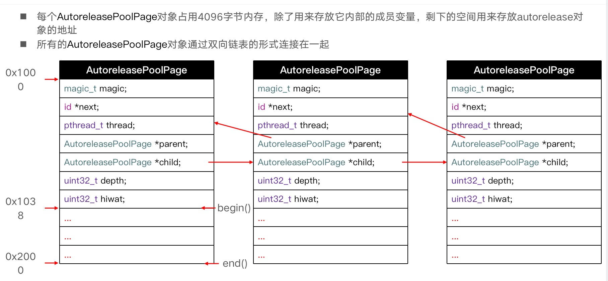

# 内存管理 - autorelease
autorelease对象会在什么时候进行释放？自动释放池`@autoreleasepool{}`是如何实现的呢?它的原理是什么？Runloop 中 autorelease对象会在什么时候进行释放呢？在本章中我们将逐一讲解这些问题。

## 什么是autorelease
创建一个`Command Line Tool`项目，通过`Automatic Reference Counting`将项目环境设置为 MRC 环境。创建Person类，在Person将要释放时进行打印。
```objc
@interface Person : NSObject
@end

@implementation Person
- (void)dealloc{
    NSLog(@"%s",__func__);
    [super dealloc];
}
@end
```
在main函数中使用Person对象，当我们没有使用autorelease方法时，需要手动调用release方法:
```objc
int main(int argc, const char * argv[]) {
    @autoreleasepool {
        Person *p = [[Person alloc] init];
        [p release];
    }
    return 0;
}
```
当我们使用 autorelease 方法时，即使不调用release方法也同样做到释放Person对象，这是为什么呢？
```objc
int main(int argc, const char * argv[]) {
    @autoreleasepool {
        Person *p = [[[Person alloc] init] autorelease];
    }
    return 0;
}
```

 ## 自动释放池 - @autoreleasepool{} 
autorelease 可以做到自动释放的主要原因是自动释放池`@autoreleasepool{}`。为什么自动释放池就可以做到这样的功能呢？我们来了解一下它的原理到底是什么？

先通过`xcrun -sdk iphoneos clang -arch arm64 -rewrite-objc  main.m`命令将代码转换成c++代码
```objc
int main(int argc, const char * argv[]) {
    /* @autoreleasepool */ { __AtAutoreleasePool __autoreleasepool;
      Person *p = ((Person *(*)(id, SEL))(void *)objc_msgSend)((id)((Person *(*)(id, SEL))(void *)objc_msgSend)((id)objc_getClass("Person"), sel_registerName("new")), sel_registerName("autorelease"));
    }
    return 0;
}
```
通过对上面代码的观察，自动释放池主要是生成了一个`__autoreleasepool`局部变量，为了方便阅读，将上面的整理成下面的格式：
```objc
extern "C" __declspec(dllimport) void * objc_autoreleasePoolPush(void);
extern "C" __declspec(dllimport) void objc_autoreleasePoolPop(void *);

struct __AtAutoreleasePool {
  __AtAutoreleasePool() { // 构造函数，创建结构体时调用
      atautoreleasepoolobj = objc_autoreleasePoolPush();
      }
  ~__AtAutoreleasePool() { // 析构函数，结构体销毁时调用
      objc_autoreleasePoolPop(atautoreleasepoolobj);
      }
  void * atautoreleasepoolobj;
};

int main(int argc, const char * argv[]) {
    /* @autoreleasepool */ { 
      atautoreleasepoolobj = objc_autoreleasePoolPush();  

      Person *p = [[[Person alloc] init] autorelease];

      objc_autoreleasePoolPop(atautoreleasepoolobj);
    }
    return 0;
}
```
通过观察，`@autoreleasepool{}`的作用是在函数内添加一个`__AtAutoreleasePool`的局部变量，`__autoreleasepool`初始化时调用构造函数`objc_autoreleasePoolPush()`，被释放时调用析构函数`objc_autoreleasePoolPop()`。为什么这样就可以做到自动释放呢？我们需要通过源码做进一步的了解

在源码中搜索`objc_autoreleasePoolPush()`函数，发现主要调用的是`AutoreleasePoolPage::push();`方法。我们来重点了解一下`AutoreleasePoolPage`类。

## AutoreleasePoolPage
通过源码看一下`AutoreleasePoolPage`类的主要成员：
```objc
class AutoreleasePoolPage
{
	magic_t const magic;
	__unsafe_unretained id *next; // 下一个能存放autorelease对象地址的区域
	pthread_t const thread;
	AutoreleasePoolPage * const parent; // 上一个AutoreleasePoolPage对象
	AutoreleasePoolPage *child;  // 下一个AutoreleasePoolPage对象
	uint32_t const depth;
	uint32_t hiwat;
};
```
通过一张图来了解`AutoreleasePoolPage`:

AutoreleasePoolPage用来管理调用了autorelease 方法的对象。每个 AutoreleasePoolPage对象占用4096字节。

### AutoreleasePoolPage 的作用

1. 当对象在自动释放池内调用`autorelease`方法时，会调用`AutoreleasePoolPage`的push方法,将一个`POOL_BOUNDARY`入栈，并且返回其存放的内存地址
2. 自动释放池将要释放前，调用pop方法，传入一个`POOL_BOUNDARY`的内存地址，会从最后一个入栈的对象开始发送 release 消息，直到遇到这个`POOL_BOUNDARY`。
3. 当一个`AutoreleasePoolPage`对象不够存储时，会进行分页，创建一个新的`AutoreleasePoolPage`对象。child指向下一个`AutoreleasePoolPage`对象地址。
4. `id *next`指向了下一个能存放autorelease对象地址的区域

使用`extern void _objc_autoreleasePoolPrint(void);`函数进行验证:
```objc
extern void _objc_autoreleasePoolPrint(void);

int main(int argc, const char * argv[]) {
    @autoreleasepool { // r1 = push()
        Person *p1 = [[[Person alloc] init] autorelease];
        Person *p2 = [[[Person alloc] init] autorelease];
        @autoreleasepool { // r2 = push()
            Person *p3 = [[[Person alloc] init] autorelease];
            @autoreleasepool { //r3 = push()
                Person *p4 = [[[Person alloc] init] autorelease];

                _objc_autoreleasePoolPrint();
            } // pop(r3)
        } // pop(r2)
    } // pop(r1)
    return 0;
}

// 打印结果:
objc[8293]: ##############
objc[8293]: AUTORELEASE POOLS for thread 0x1000dedc0
objc[8293]: 7 releases pending.
objc[8293]: [0x10080c000]  ................  PAGE  (hot) (cold)
objc[8293]: [0x10080c038]  ################  POOL 0x10080c038
objc[8293]: [0x10080c040]       0x100437610  Person
objc[8293]: [0x10080c048]       0x10043cf40  Person
objc[8293]: [0x10080c050]  ################  POOL 0x10080c050
objc[8293]: [0x10080c058]       0x10043d260  Person
objc[8293]: [0x10080c060]  ################  POOL 0x10080c060
objc[8293]: [0x10080c068]       0x100435680  Person
objc[8293]: ##############
```
根据打印结果看跟我们讲的是一样的。自动释放池的主要底层数据结构是：**_`__AtAutoreleasePool、AutoreleasePoolPage`_,调用了autorelease 方法的对象最终都是通过AutoreleasePoolPage对象来管理的。**

## Runloop和Autorelease
通过上面的学习，我们知道在`@autoreleasepool{}`自动释放池中使用`autorelease`方法，对象会在大括号执行结束之前进行释放。如果在Runloop中调用`autorelease`方法，会在什么时候进行释放呢？我们通过代码进行测试一下。先将当前环境设置为MRC环境：
```objc
@interface Person : NSObject
@end

@implementation Person
- (void)dealloc{
    NSLog(@"%s",__func__);
}
@end

@implementation ViewController

- (void)viewDidLoad {
    [super viewDidLoad];
    NSLog(@"begin");
    Person *person = [[[Person alloc] init] autorelease];
    NSLog(@"end ");
}

- (void)viewWillAppear:(BOOL)animated{
    NSLog(@"%s",__func__);
}

- (void)viewDidAppear:(BOOL)animated{
    NSLog(@"%s",__func__);
}
@end
```
通过打印结果发现,Person 对象会在调用`viewDidLoad`和`viewWillAppear`之后才会释放。为什么会这样呢？
这是因为Runloop的关系。

iOS在主线程的Runloop中注册了2个Observer，
* 第1个Observer监听了`kCFRunLoopEntry`事件，调用`objc_autoreleasePoolPush()`函数。
* 第2个Observer同时了监听Runloop即将进入休眠和即将退出事件
  * 监听 `kCFRunLoopBeforeWaiting`时调用`objc_autoreleasePoolPop()`和`objc_autoreleasePoolPush()`函数。
  * 监听`kCFRunLoopBeforeExit`时调用`objc_autoreleasePoolPop()`函数。

```objc
// activities = 1 监听Runloop进入
"<CFRunLoopObserver 0x6000008243c0 [0x7fff8002e8c0]>{valid = Yes, activities = 0x1, repeats = Yes, order = -2147483647, callout = _runLoopObserverCallout (0x7fff2416bbcd), context = (\n    \"<_UIWeakReference: 0x600003b20320>\"\n)}",

// activities = 160 = 32 + 128 监听Runloop进入休眠和退出            
"<CFRunLoopObserver 0x600000824460 [0x7fff8002e8c0]>{valid = Yes, activities = 0xa0, repeats = Yes, order = 2147483647, callout = _runLoopObserverCallout (0x7fff2416bbcd), context = (\n    \"<_UIWeakReference: 0x600003b20320>\"\n)}"
```

**Runloop的状态**

```c
typedef CF_OPTIONS(CFOptionFlags, CFRunLoopActivity) {
    kCFRunLoopEntry = (1UL << 0),  // 即将进入Runloop   值 为 1
    kCFRunLoopBeforeTimers = (1UL << 1),  // 即将处理Timer    值 为 2
    kCFRunLoopBeforeSources = (1UL << 2),  // 即将处理Sources   值 为 4
    kCFRunLoopBeforeWaiting = (1UL << 5),  // 即将进入休眠    值 为 32
    kCFRunLoopAfterWaiting = (1UL << 6),  // 刚从休眠中唤醒   值 为 64
    kCFRunLoopExit = (1UL << 7),  // 即将退出Loop   值 为 128
    kCFRunLoopAllActivities = 0x0FFFFFFFU  // 所有状态
};
```

>如何是在 ARC 环境下，具体释放时机要看系统会在什么时候调用release方法。如果在`viewDidLoad`方法中调用`[person release]`方法，Person对象就会在方法结束之前进行释放。经过测试是在`viewDidLoad`方法结束之前进行释放。