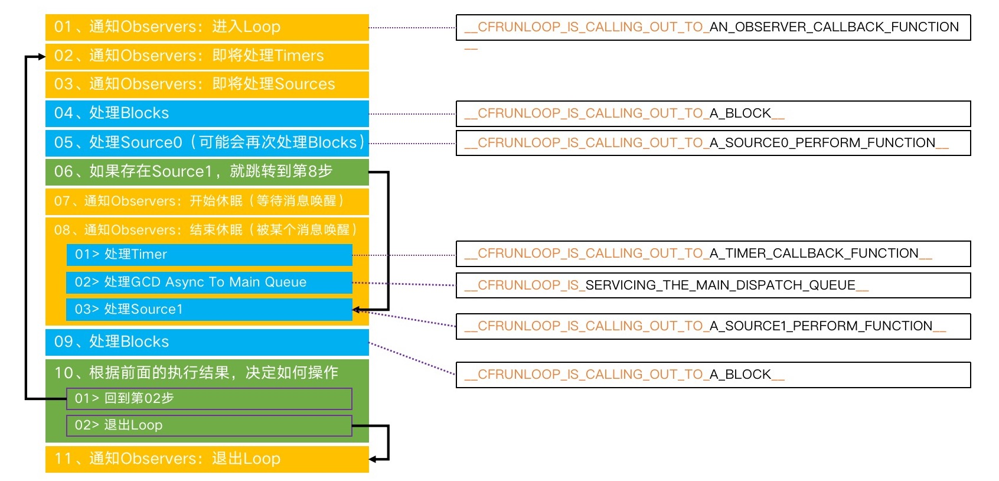

# Runloop
知道了什么是Runloop和Runloop的内部结构以及Runloop如何切换Mode。现在我们来了解Runloop的调用流程,以及从源码上分析Runloop的调用流程，最后再讲一下Runloop在程序内的应用。

## Runloop的调用流程
01. 通知Observers：进入Loop
02. 通知Observers：即将处理Timers
03. 通知Observers：即将处理Sources
04. 处理Blocks
05. 处理Source0（可能会再次处理Blocks）
06. 如果存在Source1，就跳转到第8步
07. 通知Observers：开始休眠（等待消息唤醒）
08. 通知Observers：结束休眠（被某个消息唤醒）
    1. 处理Timer
    2. 处理GCD Async To Main Queue
    3. 处理Source1
09. 处理Blocks
10. 根据前面的执行结果，决定如何操作
    01.  回到第02步
    02.  退出Loop
11. 通知Observers：退出Loop

使用图片展示Runloop的调用流程，图片来源于小码哥的MJ老师，点击进入[小码哥官网](http://www.520it.com/)


## 通过源码分析Runloop
该怎么找Runloop的入口呢？在上一章中，我们通过打印堆栈信息查看是否是 Source0 处理点击事件，在堆栈事件中，有一个`__CFRunLoopRun`函数，在Runloop运行之前调用的是`CFRunLoopRunSpecific`函数，可以确定`CFRunLoopRunSpecific`函数是Runloop的入口。

我们通过源码分析Runloop的具体实现，代码片段来自`CF-1153.18`，代码经过删减，只显示主要逻辑：
```c
SInt32 CFRunLoopRunSpecific(CFRunLoopRef rl, CFStringRef modeName, CFTimeInterval seconds, Boolean returnAfterSourceHandled) {   
    // 通知Observers: 进入Runloop
    __CFRunLoopDoObservers(rl, currentMode, kCFRunLoopEntry);
    
    // Runloop中具体要做的事情
    __CFRunLoopRun(rl, currentMode, seconds, returnAfterSourceHandled, previousMode);
	
    // 通知Observers: 退出Runloop
    __CFRunLoopDoObservers(rl, currentMode, kCFRunLoopExit);

    return result;
}
```
通过源码我们知道`__CFRunLoopRun()`函数中是Runloop的具体实现，分析一下`__CFRunLoopRun()`函数:
```c
static int32_t __CFRunLoopRun(CFRunLoopRef rl, CFRunLoopModeRef rlm, CFTimeInterval seconds, Boolean stopAfterHandle, CFRunLoopModeRef previousMode) {

    int32_t retVal = 0;
    do {
        // 通知Observers: 即将处理Timers
        __CFRunLoopDoObservers(rl, rlm, kCFRunLoopBeforeTimers);
        
        // 通知Observers: 即将处理Sources
        __CFRunLoopDoObservers(rl, rlm, kCFRunLoopBeforeSources);

        // 处理Blocks
        __CFRunLoopDoBlocks(rl, rlm);

        // 处理Sources0
        if (__CFRunLoopDoSources0(rl, rlm, stopAfterHandle)) {
            // 处理Blocks
            __CFRunLoopDoBlocks(rl, rlm);
        }

        //判断有没有Source1，如果有，跳转到 handle_msg
        if (__CFRunLoopServiceMachPort(dispatchPort, &msg, sizeof(msg_buffer), &livePort, 0, &voucherState, NULL)) {
            goto handle_msg;
        }

        //通知Observers: 即将休眠
        __CFRunLoopDoObservers(rl, rlm, kCFRunLoopBeforeWaiting);
        __CFRunLoopSetSleeping(rl);

        // 等待别的消息唤醒当前线程
        __CFRunLoopServiceMachPort(waitSet, &msg, sizeof(msg_buffer), &livePort, poll ? 0 : TIMEOUT_INFINITY, &voucherState, &voucherCopy);

        // user callouts now OK again
        __CFRunLoopUnsetSleeping(rl);
        //通知Observers: 结束休眠
        __CFRunLoopDoObservers(rl, rlm, kCFRunLoopAfterWaiting);

    handle_msg:;
        if (被Timers唤醒) {
            // 处理Timers
            __CFRunLoopDoTimers(rl, rlm, mach_absolute_time());
        }else if (被 GCD 唤醒) {
            // 处理GCD
            __CFRUNLOOP_IS_SERVICING_THE_MAIN_DISPATCH_QUEUE__(msg);
        } else { // 被Sources1唤醒
            // 处理Sources1
            __CFRunLoopDoSource1(rl, rlm, rls, msg, msg->msgh_size, &reply) || sourceHandledThisLoop;
        }
        
        // 处理Blocks
        __CFRunLoopDoBlocks(rl, rlm);
        
        // 设置返回值
        if (sourceHandledThisLoop && stopAfterHandle) {
            retVal = kCFRunLoopRunHandledSource;
            } else if (timeout_context->termTSR < mach_absolute_time()) {
                retVal = kCFRunLoopRunTimedOut;
        } else if (__CFRunLoopIsStopped(rl)) {
                __CFRunLoopUnsetStopped(rl);
            retVal = kCFRunLoopRunStopped;
        } else if (rlm->_stopped) {
            rlm->_stopped = false;
            retVal = kCFRunLoopRunStopped;
        } else if (__CFRunLoopModeIsEmpty(rl, rlm, previousMode)) {
            retVal = kCFRunLoopRunFinished;
        }

    } while (0 == retVal);

    return retVal;
}
```
在`__CFRunLoopRun()`函数中我们看到，Runloop的本质就是一个`do{}while()`循环，在循环中不停的处理`Source`、`Timers`和`Blocks`,当没有事情需要处理时，进入休眠状态。有事情需要处理时会唤醒当前Runloop对象继续处理事件。

**Runloop的细节**
1. GCD只有在返回主线程刷新U界面时使用Runloop
```objc
    dispatch_async(dispatch_get_main_queue(), ^{

    });
```

2. `__CFRunLoopServiceMachPort()`函数是通过调用内核态的`mach_msg()`函数，真正让线程休眠，当有事件时重新唤醒线程。

## Runloop在实际开发中的应用
Runloop在实际开发中主要的应用场景有 控制线程生命周期、解决NSTimer在滑动时停止工作的问题、监控应用卡顿和性能优化。

> 解决NSTimer在滑动时停止工作的问题

这个问题是在项目中经常会遇到的问题。比如轮播图，如果不把NSTimer添加到Runloop中，当我们滑动UITableView的时候，定时器会停止调用。

为什么会造成这种情况？经过之前的学习我们知道。**一条线程对应一个Runloop对象，并且Runloop只能在一种模式下运行，在主线程中，Runloop默认是`kCFRunLoopDefaultMode`模式，当我们滚动视图时，Runloop会切换到`UITrackingRunLoopMode`模式，那么处在`kCFRunLoopDefaultMode`模式下的定时器就会停止工作。**所以造成了当前这种现象。

解决问题的方式也很简单，把 NSTimer 添加到当前模式的中即可。
```objc
NSTimer *timer = [NSTimer timerWithTimeInterval:1.0 repeats:YES block:^(NSTimer * _Nonnull timer) {
    NSLog(@"-----");
}];
//NSRunLoopCommonModes只是一个标记，timer能在_commonModes数组中存放的模式下工作.
[[NSRunLoop currentRunLoop] addTimer:timer forMode:NSRunLoopCommonModes];
```

> 线程保活

如果有一个需求,需要在子线程中不断的做事情。按照以往的做法，不断的创建销毁线程，会消耗不少的资源。这个时候就要考虑保持一条子线程存活不被销毁，如果要保持子线程不被销毁。就需要使用到Runloop对象。只要Runloop一直在运行，线程就不会被销毁。Runloop运行有两个前提，1. Mode中要包含 Source0/Source1/Timer/Observer任意一种 2. 需要在线程中调用。通过下面代码来看一下。

这是使用Runloop封装的线程保活Demo:
```objc
typedef void (^LastingThreadTask)(void);
@interface MMLastingThread : NSObject
// 在当前子线程执行一个任务
- (void)executeTask:(LastingThreadTask)task;
// 结束线程
- (void)stop;
@end

@interface MMLastingThread()
@property (strong, nonatomic) NSThread *innerThread;
@property (assign, nonatomic,getter=isStopped) BOOL stopped;
@end

@implementation MMLastingThread
#pragma mark - public methods
- (instancetype)init
{
    if (self = [super init]) {
        _stopped = NO;
        __weak typeof(self) weakSelf = self;
        
        _innerThread = [[NSThread alloc] initWithBlock:^{
            
            [[NSRunLoop currentRunLoop] addPort:[[NSPort alloc] init] forMode:NSDefaultRunLoopMode];
            
            while (weakSelf && !weakSelf.isStopped) {
                [[NSRunLoop currentRunLoop] runMode:NSDefaultRunLoopMode beforeDate:[NSDate distantFuture]];
            }
            
        }];
        
        [self.innerThread start];
    }
    return self;
}

- (void)executeTask:(LastingThreadTask)task{
    if (!self.innerThread || !task) return;
    
    [self performSelector:@selector(__executeTask:) onThread:self.innerThread withObject:task waitUntilDone:NO];
}

- (void)stop{
    if (!self.innerThread) return;
    [self performSelector:@selector(__stop) onThread:self.innerThread withObject:nil waitUntilDone:YES];
}

- (void)dealloc{
    NSLog(@"%s", __func__);
    
    [self stop];
}

#pragma mark - private methods
- (void)__stop{
    self.stopped = YES;
    CFRunLoopStop(CFRunLoopGetCurrent());
    self.innerThread = nil;
}

- (void)__executeTask:(LastingThreadTask)task{
    task();
}
@end
```
看过代码之后我们可能存在两个疑问？

**1. 停止Runloop时为什么要使用`performSelector:onThread:withObject:waitUntilDone:`方法？**

通过之前所学我们知道，`CFRunLoopGetCurrent()`函数返回的是当前线程的Runloop对象，如果我们想要停止子线程中的Runloop，当然要在子线程中调用`CFRunLoopGetCurrent()`函数。

**2. 另一个问题，使用`performSelector:onThread:withObject:waitUntilDone:`时，`wait`参数为什么传Yes？**

`stop`方法是在`MMLastingThread`对象释放的时候调用的，在这个时间里同时在子线程调用`__stop`方法，因为我们自身已经被释放了，在子线程内再访问`__stop`方法时，会造成坏内存访问。传入YES，是为了阻塞当前线程，等子线程执行完之后再执行主线程的操作。

如果使用C语言实现Runloop中添加Source,不需要额外的变量进行控制。
```objc
@interface MMLastingThread()
@property (strong, nonatomic) NSThread *innerThread;
@end

@implementation MMLastingThread
#pragma mark - public methods
- (instancetype)init
{
    if (self = [super init]) {
        
        self.innerThread = [[NSThread alloc] initWithBlock:^{
            
            // 创建上下文 (要初始化一下结构体)
            CFRunLoopSourceContext context = {0};
            // 创建source
            CFRunLoopSourceRef source = CFRunLoopSourceCreate(kCFAllocatorDefault, 0, &context);
            // 将source添加到Runloop
            CFRunLoopAddSource(CFRunLoopGetCurrent(), source, kCFRunLoopDefaultMode);
            // 销毁source
            CFRelease(source);
            // 启动RunLoop. returnAfterSourceHandled参数设置为true，代表执行完source后就会退出当前loop。如果要一直运行，设置为false
            CFRunLoopRunInMode(kCFRunLoopDefaultMode, 1.0e10, false);
            
        }];
        
        [self.innerThread start];
    }
    return self;
}

- (void)executeTask:(LastingThreadTask)task{
    if (!self.innerThread || !task) return;
    
    [self performSelector:@selector(__executeTask:) onThread:self.innerThread withObject:task waitUntilDone:NO];
}

- (void)stop{
    if (!self.innerThread) return;
    [self performSelector:@selector(__stop) onThread:self.innerThread withObject:nil waitUntilDone:YES];
}

- (void)dealloc{
    NSLog(@"%s", __func__);
    [self stop];
}

#pragma mark - private methods
- (void)__stop{
    CFRunLoopStop(CFRunLoopGetCurrent());
    self.innerThread = nil;
}

- (void)__executeTask:(LastingThreadTask)task{
    task();
}
@end
``` 

**注意点：**
1. `[[NSRunLoop currentRunLoop] run];`方法会开启一个无限循环，无法停止。`CFRunLoopStop(CFRunLoopGetCurrent());`方法只能停止其中的一次循环。并不能停止Runloop的循环。如果我们希望能退出Runloop，应该使用`runMode:beforeDate:`方法，例如:
```
BOOL shouldKeepRunning = YES; // global
NSRunLoop *theRL = [NSRunLoop currentRunLoop];
while (shouldKeepRunning && [theRL runMode:NSDefaultRunLoopMode beforeDate:[NSDate distantFuture]]);
// 在想要停止Runloop时，设置shouldKeepRunning = NO
```

2. `- (void)performSelector:(SEL)aSelector onThread:(NSThread *)thr withObject:(nullable id)arg waitUntilDone:(BOOL)wait`函数,在其他线程执行方法。
* wait代表为YES时，代表会阻塞当前线程，直到指定的线程方法执行完成之后再返回。(线程同步，注意如果线程不存或者无法执行方法时会造成坏内存访问。)
* wait代表为NO时，不阻塞当前线程。

## 面试题

1. 下面代码的打印结果:

```objc
- (void)viewDidLoad {
    [super viewDidLoad];  
    dispatch_async(dispatch_get_global_queue(0, 0), ^{
        NSLog(@"--任务1--");
        [self performSelector:@selector(run) withObject:self afterDelay:0.0];
        NSLog(@"--任务3--");
    });
    
}
- (void)run{
    NSLog(@"--任务2--");
}
```
不出所料，只打印了任务1和任务3，原因是`performSelector:withObject:afterDelay`方法的本质是往Runloop中添加定时器，在子线程中，Runloop默认是没有启动的，导致不能处理对应的Timers事件

2. 下面的代码会引起什么结果？

```objc
- (void)touchesBegan:(NSSet<UITouch *> *)touches withEvent:(UIEvent *)event{
    NSThread *therad = [[NSThread alloc] initWithBlock:^{
        NSLog(@"--任务1--  %@",[NSThread currentThread]);
    }];
    
    [therad start];
    [self performSelector:@selector(run) onThread:therad withObject:self waitUntilDone:YES];
}
- (void)run{
    NSLog(@"--任务2--");
}
```
`performSelector:withObject:afterDelay:`方法会引起崩溃` target thread exited while waiting for the perform"`。

崩溃的原因是：子线程中没有Runloop对象对其进行保活，在执行完start方法之后，线程已经死掉了。

## GNUstep

GNUstep是GNU计划的项目之一，它将Cocoa的OC库重新开源实现了一遍,[点击进入源码地址](http://www.gnustep.org/resources/downloads.php),下载`GNUstep Base`,虽然GNUstep不是苹果官方源码，但还是具有一定的参考价值。

通过GUNstep的查看`performSelector:withObject:afterDelay:`方法的具体实现，通过下面的代码我们看到，其本质就是往Runloop中添加定时器。
```objc
- (void) performSelector: (SEL)aSelector
	      withObject: (id)argument
	      afterDelay: (NSTimeInterval)seconds
{
  NSRunLoop		*loop = [NSRunLoop currentRunLoop];
  GSTimedPerformer	*item;

  item = [[GSTimedPerformer alloc] initWithSelector: aSelector
					     target: self
					   argument: argument
					      delay: seconds];
  [[loop _timedPerformers] addObject: item];
  RELEASE(item);
  [loop addTimer: item->timer forMode: NSDefaultRunLoopMode];
}
```