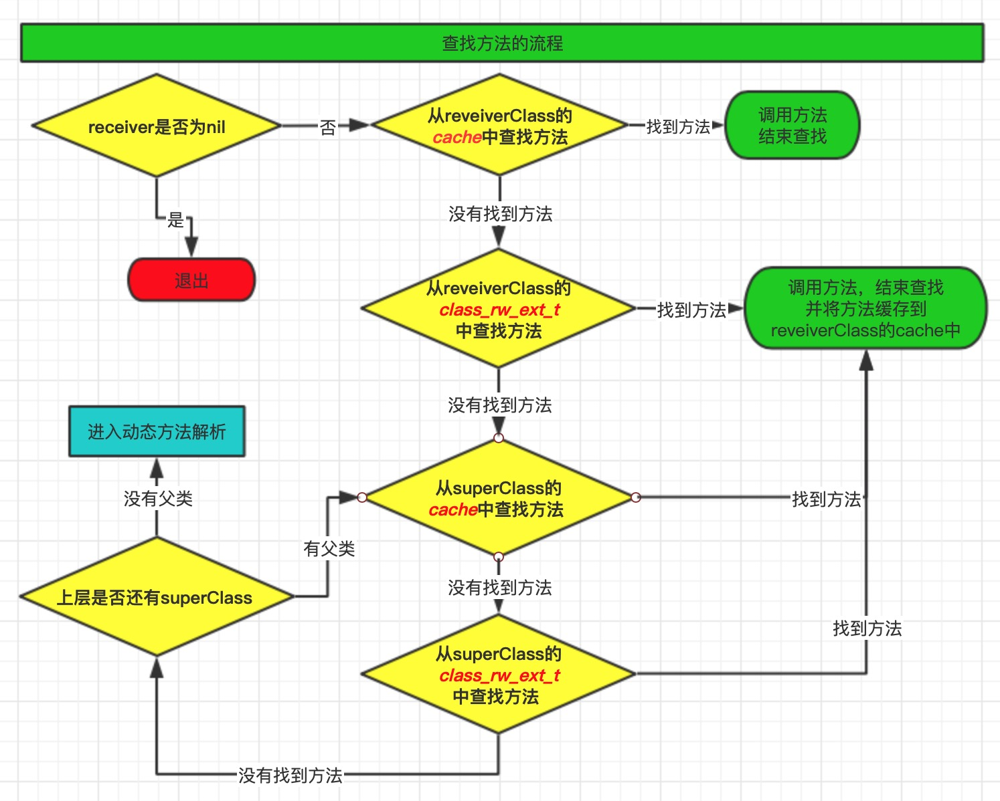

# objc_msgSend函数
当我们使用`[ ]`调用方法时，底层是通过`objc_msgSend()`函数进行调用的，这也是OC特有的消息机制，方法调用是通过消息传递的形式进行的。比如下面的代码：
```c
NSObject *objc = [[NSObject alloc] init];
[objc class];
[NSObject class];
```
通过`xcrun -sdk iphoneos clang -arch arm64  -rewrite-objc main.m -o main.cpp`命令转成c++代码
```c
objc_msgSend(objc, sel_registerName("class"));
objc_msgSend(objc_getClass("NSObject"), sel_registerName("class"));

// OC的方法调用：消息机制 给方法调用者发送消息  sel_registerName("class") 等价于 @selector(class)
// 消息接收者(receiver)： objc 、objc_getClass("NSObject")
// 消息名称： class
```
objc_msgSend需要两个参数，一个是消息接收者(receiver)，一个是消息名称(SEL)。我们将通过阅读源码、消息发送、动态解析方法、消息转发 这几个步骤逐步分析OC的消息机制。

## 通过源码认识 objc_msgSend
objc_msgSend方法是汇编编写的，真机只看`objc-msg-arm64.s`文件即可,`ENTRY _objc_msgSend`是方法的入口，代码片段来自于`objc4-818.2`
```
    // _objc_msgSend 方法的入口
	ENTRY _objc_msgSend
	UNWIND _objc_msgSend, NoFrame

	cmp	p0, #0			// 消息接受者是否为nil，为nil时ret
	b.eq	LReturnZero

	ldr	p13, [x0]		// p13 = isa
	GetClassFromIsa_p16 p13, 1, x0	// p16 = class
LGetIsaDone:
	// 调用imp或objc_msgSend_uncached，因为传入的NORMAL 为0，所以调用的是 __objc_msgSend_uncached
	CacheLookup NORMAL, _objc_msgSend, __objc_msgSend_uncached

LReturnZero:  // 返回
	...
	ret

	END_ENTRY _objc_msgSend
```
整个查找路径是：
`ENTRY _objc_msgSend` -> `__objc_msgLookup_uncached` ->`MethodTableLookup` -> `_lookUpImpOrForward` 

我们发现最后会调用`_lookUpImpOrForward`方法，汇编中调用函数会在函数前添加下划线，全局搜索`lookUpImpOrForward`,对应的函数实现如下，代码片段来自于`objc4-818.2`：
```c
IMP lookUpImpOrForward(id inst, SEL sel, Class cls, int behavior)
{
    // 获取转发的imp
    const IMP forward_imp = (IMP)_objc_msgForward_impcache;
    IMP imp = nil;
    Class curClass;
    ....
    cls = realizeAndInitializeIfNeeded_locked(inst, cls, behavior & LOOKUP_INITIALIZE);
    curClass = cls;

    for (unsigned attempts = unreasonableClassCount();;) {
        if (curClass->cache.isConstantOptimizedCache(/* strict */true)) {
            imp = cache_getImp(curClass, sel);
            if (imp) goto done_unlock;
            curClass = curClass->cache.preoptFallbackClass();
        } else {
            // 方法列表
            Method meth = getMethodNoSuper_nolock(curClass, sel);
            if (meth) {
                imp = meth->imp(false);
                goto done;
            }

            // 找不到方法并且方法解析器也无效时，使用转发
            if ((curClass = curClass->getSuperclass()) == nil) {
                imp = forward_imp;
                break;
            }
        }
        ....
        // Superclass cache.
        imp = cache_getImp(curClass, sel);
        if (imp == forward_imp) {// 在超类的forward::方法中找到，停止搜索，不缓存，首先调用此类的解析器
            break;
        }
        if (imp) {   // 在超类中找到该方法。 将其缓存在此类中
            goto done;
        }
    }

    // 找不到实现。 尝试一次方法解析器
    if (behavior & LOOKUP_RESOLVER) {
        behavior ^= LOOKUP_RESOLVER;
        return resolveMethod_locked(inst, sel, cls, behavior);
    }

 done:
    if ((behavior & LOOKUP_NOCACHE) == 0) {
        while (cls->cache.isConstantOptimizedCache(/* strict */true)) {
            cls = cls->cache.preoptFallbackClass();
        }
        log_and_fill_cache(cls, imp, sel, inst, curClass);
    }
 done_unlock:
    runtimeLock.unlock();
    if ((behavior & LOOKUP_NIL) && imp == forward_imp) {
        return nil;
    }
    return imp;
}
```
通过阅读`lookUpImpOrForward`方法，我们会发现 **objc_msgSend的执行流程可以分为3大阶段**
* 消息发送
* 动态方法解析
* 消息转发

## 消息发送
通过阅读`lookUpImpOrForward`方法，来看objc_msgSend函数的调用顺序：
1. 消息接收者(receiver)是否为nil，如果为nil，直接return。如果不为空 -> 执行步骤 2
2. receiver 通过isa指针找到 receiverClass ,在类对象缓存中(`cache`)查找方法，如果找到方法直接调用，如果没有找到 -> 执行步骤 3
3. 从当前类的`class_rw_ext_t`中查找方法，如果找到方法直接调用，如果没有找到  -> 执行步骤 4
4. receiverClass 通过 superclass指针 找到 superClass ,从`superclass`的缓存中(`cache`)查找方法，如果找到方法直接调用。如果没有找到  -> 执行步骤 5
5. 从父类的`class_rw_ext_t`中查找方法，如果找到方法直接调用。如果没有找到  -> 执行步骤 6
6. 查看上层是否还有父类，如果有父类 -> 执行步骤 4
7. 如果没有父类，进入 ->  动态方法解析 


从`class_rw_ext_t`中查找方法有两种方式：
* 方法经过排序的，二分查找 `findMethodInSortedMethodList`函数
* 方法没有排序的，遍历查找 `findMethodInUnsortedMethodList`函数

## 动态方法解析
动态方法解析是调用`resolveMethod_locked`函数，开发者可以通过实现`+resolveInstanceMethod:`和`+resolveClassMethod:`两个方法，来动态添加方法实现。动态解析过后，会重新走“消息发送”的流程,从"receiverClass的cache中查找方法"这一步开始执行

```c
static NEVER_INLINE IMP
resolveMethod_locked(id inst, SEL sel, Class cls, int behavior)
{
    if (! cls->isMetaClass()) {
        resolveInstanceMethod(inst, sel, cls);
    } 
    else {
        // try [nonMetaClass resolveClassMethod:sel]
        // and [cls resolveInstanceMethod:sel]
        resolveClassMethod(inst, sel, cls);
        if (!lookUpImpOrNilTryCache(inst, sel, cls)) {
            resolveInstanceMethod(inst, sel, cls);
        }
    }
    
    // lookUpImpOrForwardTryCache 最终会再次调用 lookUpImpOrForward 函数
    return lookUpImpOrForwardTryCache(inst, sel, cls, behavior);
}
```
**动态方法解析的步骤，流程如下图：**
1. 判断是否曾经有过方法解析，如果有，直接执行消息转发，如果没有 -> 执行步骤2
2. 通过实现`+resolveInstanceMethod:`和`+resolveClassMethod:`两个方法，来动态添加方法实现。并且标记为已经动态解析。
3. 动态方法解析完成后，重新进入消息发送阶段


> 在动态方法解析中添加方法避免程序崩溃

定义一个 Person 类，声明两个方法`-sayHello`和`+sayHello`，只做声明不做内部实现，添加`+resolveInstanceMethod:`和`+resolveClassMethod:`方法，在这里向Person动态添加方法
```objc
#import "Person.h"
#import <objc/runtime.h>
@implementation Person
- (void)other{
    NSLog(@"%s --",__func__);
}

void test(id self,SEL _cmd){
    NSLog(@"%s",__func__);
}

+ (BOOL)resolveInstanceMethod:(SEL)sel{
    if (sel == @selector(sayHello)) {
        // 这里是添加实例方法，需要将方法添加到类对象中。因为当前就是在+号方法中，self本身就是类对象
        Method method = class_getInstanceMethod(self, @selector(other));
        class_addMethod(self, sel, method_getImplementation(method), method_getTypeEncoding(method));

        // 也可以动态添加c语言的方法
        // class_addMethod(self, sel, (IMP)test, "v@:");
        return YES;
    }
    return [super resolveInstanceMethod:sel];
}

+ (BOOL)resolveClassMethod:(SEL)sel{
    if (sel == @selector(sayHello)) {
        //注意：这里是添加类方法，因为类方法是存储在元类对象中，所以需要给元类对象添加方法
        Method method = class_getInstanceMethod(self, @selector(other));
        class_addMethod(object_getClass(self), sel, method_getImplementation(method), method_getTypeEncoding(method));
        return YES;
    }
    return [super resolveClassMethod:sel];
}
@end
```

> Method 详解

Method跟`method_t`结构体很类似，官方定义`typedef struct objc_method *Method;`我们可以把它理解成`struct method_t*`，比如也可以使用下面的代码给Person类动态添加方法：
```objc
struct method_t {
    SEL  name;
    char *  types;
    IMP  imp;
};

- (void)other{
      NSLog(@"%s --",__func__);
}

+ (BOOL)resolveInstanceMethod:(SEL)sel{
    if (sel == @selector(sayHello)) {
        struct method_t *method = (struct method_t*)class_getInstanceMethod(self, @selector(other));
        class_addMethod(self, sel, method->imp, method->types);
        NSLog(@"%s -- %s --%p",sel_getName(method->name),method->types,method->imp);//other -- v16@0:8 --0x100003bd0
        return YES;
    }
    return [super resolveInstanceMethod:sel];
}
```

## 消息转发
当消息发送和动态方法解析都不能处理消息时，会来到消息转发`_objc_msgForward_impcache`。我们在源码中找不到`_objc_msgForward_impcache`方法的具体实现，可以通过打断点的方式判断系统都调用了什么方法。在这之前我们先看一下**消息转发流程：**
1. 调用`forwardingTargetForSelector:`方法将消息转发给别的对象处理（转发的对象要有处理消息的能力），如果返回值为nil，执行步骤2
2. 调用`methodSignatureForSelector:`方法，如果返回值不为nil，调用`forwardInvocation:`方法
。如果返回nil，执行步骤3
3. 调用`doesNotRecognizeSelector:`方法，报经典错误`unrecognized selector sent to instance`


我们知道了消息的转发流程，在`forwardingTargetForSelector:`方法内打断点，打印堆栈信息，看一下系统是通过什么函数进行调用的，通过打印堆栈我们看到，方法是被`___forwarding___`函数调用的，我们基本可以确定消息转发是从`___forwarding___`函数开始的。


> forwardingTargetForSelector: 方法
```objc
#import "Person.h"
#import "Cat.h"
@implementation Person
// 将Person类的消息转发给Cat类
- (id)forwardingTargetForSelector:(SEL)aSelector{
    if (aSelector == @selector(sayHello)) {
        return [Cat new];
    }
    return [super forwardingTargetForSelector:aSelector];
}
+ (id)forwardingTargetForSelector:(SEL)aSelector{
    if (aSelector == @selector(sayHello)) {
        return [Cat class];
    }
    return [super forwardingTargetForSelector:aSelector];
}
@end
```

> methodSignatureForSelector：方法 将消息转发给其他对象处理

如果没有实现`forwardingTargetForSelector:`方法或返回值为nil的情况下，会来到`methodSignatureForSelector:`方法，要求返回一个方法签名，也就是`mtehod_t`结构体中的`types`，比如`-(void)sayHello;`的方法签名是`v16@0:8`。

**如果`methodSignatureForSelector:`方法返回值不为nil，会调用`forwardInvocation:`方法，在这里我们可以做任何事情，可以转发给其他对象消息，也可以只打印信息。不会造成崩溃。**
```objc
// 方法签名: 返回值类型、参数类型
- (NSMethodSignature *)methodSignatureForSelector:(SEL)aSelector{
    if (aSelector == @selector(sayHello)) {
        return [NSMethodSignature signatureWithObjCTypes:"v16@0:8"];
    }
    return [super methodSignatureForSelector:aSelector];
}
// NSInvocation 封转了一个方法调用，包括方法调用者、方法名、方法参数
//  anInvocation.target  方法调用者
//  anInvocation.selector  方法名 
- (void)forwardInvocation:(NSInvocation *)anInvocation{
    if (anInvocation.selector == @selector(sayHello)) {
        anInvocation.target = [Cat class];
        [anInvocation invoke];
        // 或者  [anInvocation invokeWithTarget:[Cat class]];
    }
}
```
也可以在`forwardInvocation:`方法中通过`NSInvocation`获取参数和返回值，获取参数时需要注意:**系统会默认在方法中带self和_cmd两个参数，我们自己传的参数下标是从2开始的，如果下标越界，会造成崩溃。**
```objc
- (NSMethodSignature *)methodSignatureForSelector:(SEL)aSelector{
    if (aSelector == @selector(sayHi:)) {
        // 这里使用一个小技巧，因为cat类中有sayHi方法，可以直接使用cat生成方法签名
        return [[Cat new] methodSignatureForSelector:@selector(sayHi:)];
    }
    return [super methodSignatureForSelector:aSelector];
}
- (void)forwardInvocation:(NSInvocation *)anInvocation{
    if (anInvocation.selector == @selector(sayHi:)) {
        // 获取参数，参数书序 receiver、selector、other arguments
        int hi;
        [anInvocation getArgument:&hi atIndex:2];
        
        // 注意必须消息调用之后才会有返回值
        [anInvocation invokeWithTarget:[Cat new]];

        // 获取返回值
        int ret;
        [anInvocation getReturnValue:&ret];
        NSLog(@"%d --%d",hi,ret); //100 --100
    }
}
```

**`+methodSignatureForSelector:`和`+forwardInvocation:`也有类方法**
```objc
+ (NSMethodSignature *)methodSignatureForSelector:(SEL)aSelector{
    if (aSelector == @selector(sayHello)) {
        return [[Cat class] methodSignatureForSelector:@selector(sayHello)];
    }
    return [super methodSignatureForSelector:aSelector];
}
+ (void)forwardInvocation:(NSInvocation *)anInvocation{
    if (anInvocation.selector == @selector(sayHello)) {
        [anInvocation invokeWithTarget:[Cat class]];
    }
}
```