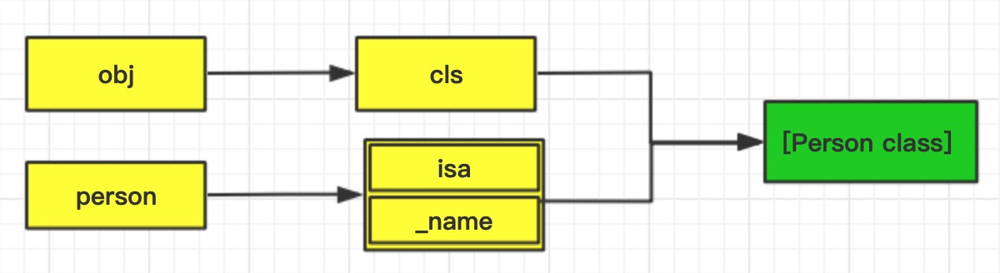

# Runtime引发的面试题
从三个面试题入手，了解`isMemberOfClass 和  isKindOfClass`的本质，以及 super 调用方法的本质和栈空间是如何分配内存的。读完之后受益匪浅。🍺！！！

## 关于 isMemberOfClass 和  isKindOfClass
* **isKindOfClass** 判断当前方法调用者的 类对象 是否是 传入的类对象 或者是 传入类对象的子类
* **isMemberOfClass** 判断当前方法调用者的 类对象 是否是 传入的类对象

查看官方源码，看我们描述是否正确，代码片段来自`objc4-818.2`
```objc
// 通过isa获取元类对象（meta-class），判断是否相等
+ (BOOL)isMemberOfClass:(Class)cls {
    return self->ISA() == cls;
}
// 直接通过class方法获取类对象（class），判断跟传入的cls是否是同一个类对象
- (BOOL)isMemberOfClass:(Class)cls {
    return [self class] == cls;
}
// 通过当前self的isa获取元类对象（meta-class），判断是跟传入的class一样，如果不相等，获取当前元类对象的父类继续判断，直接上层没有superclass为止
+ (BOOL)isKindOfClass:(Class)cls {
    for (Class tcls = self->ISA(); tcls; tcls = tcls->getSuperclass()) {
        if (tcls == cls) return YES;
    }
    return NO;
}
// 通过当前self的isa获取类对象(class)，判断是跟传入的class一样，如果不相等，获取当前类对象的父类继续判断，直接上层没有superclass为止
- (BOOL)isKindOfClass:(Class)cls {
    for (Class tcls = [self class]; tcls; tcls = tcls->getSuperclass()) {
        if (tcls == cls) return YES;
    }
    return NO;
}
```
通过源码我们知道了两个方法的内部实现原理，下面来判断一下代码的打印结果
```objc
// Person 继承自 NSObject
NSLog(@"%d ---",[[Person class] isKindOfClass:[Person class]]);  // 0
NSLog(@"%d ---",[[NSObject class] isKindOfClass:[NSObject class]]); // 1

NSLog(@"%d ---",[[Person class] isMemberOfClass:[Person class]]); // 0
NSLog(@"%d ---",[[NSObject class] isMemberOfClass:[NSObject class]]); // 0
```
为什么`[[NSObject class] isKindOfClass:[NSObject class]]`返回的是YES，我们知道`[NSObject class]`返回的是一个类对象（class），所以调用的是`+isKindOfClass`方法，通过isa，找到的是NSObject的元类对象(meta-class),根据我们之前所学，NSObject元类对象(meta-class)的父类正是NSObject类对象(class)，所以返回值为YES。[点击查看isa和superclass](./isa和superclass.md)

## super 调用方法的本质
我们通过打印先认识一下super是否是跟我们想象的一样。下面的代码中 Student 继承自 Person , Person 继承自 NSObject。在 Student 初始化的时候打印：
```objc
@implementation Student
- (instancetype)init{
    if (self = [super init]) {
        NSLog(@"[self class] --%@",[self class]);  //[self class] -- Student
        NSLog(@"[self superclass] --%@",[self superclass]); //[self superclass] -- Person
        NSLog(@"[super class] --%@",[super class]); //[super class] -- Student
        NSLog(@"[super class] --%@",[super superclass]);    //[super class] -- Person
    } 
    return self;
}
@end
```
打印结果是不是跟你想的很不一样。不要慌，我们通过转换 c++代码 的形式窥探一下 super 调用方法时会发生什么？

> super是怎样调用父类方法的

在Person中定义`-sayHello`方法，在Student内部重写sayHello并调用父类的方法
```objc
@implementation Student
-(void)sayHello{
    [super sayHello];
}
@end
```
使用`xcrun -sdk clang -arch arm64  -rewrite-objc Student.m`转成c++代码,下面是经过整理后的代码：
```objc
@implementation Student

struct objc_super {
    __unsafe_unretained _Nonnull id receiver; // 消息接收者
    __unsafe_unretained _Nonnull Class super_class; //消息接收者的父类（标记从这个类对象开始搜索方法）
};
-(void)sayHello{
    struct objc_super arg = {self,[Person class]};
    objc_msgSendSuper(arg,@selector(sayHello));
}

@end
```
**`struct objc_super`结构体中有两个参数:**
* `receiver`: 消息接收者，self
* `super_class`: 消息接收者的父类（标记从这个类对象开始搜索方法）

我们看到`[super sayHello]`实际上是调用的`objc_msgSendSuper(struct objc_super * _Nonnull super, SEL _Nonnull op, ...)`函数。传入两个参数`struct objc_super`和`SEL`。`objc_super`结构体中有两个参数，消息接收者（self）和 它的父类(super_class),也就是当我们调用`[super sayHello]`时消息接收者是 self 自己。 `super_class` 只是起到一个标志作用，表示从它开始搜索方法。

**注意：转换后的代码跟实际编译会有一定差异，在下面的面试题会讲到。实际编译时会调用[objc_msgSendSuper2()函数](./runtime4.md?id=objc_msgsendsuper2)**

> `NSObject`内部是怎么实现`class`方法

知道了 super 是怎么调用方法的，我们再来了解一下`NSObject`内部是怎么实现`class`方法的。代码片段来自`objc4-818.2`
```objc
// 获取当前self的类对象
- (Class)class {
    return object_getClass(self);
}
// 获取当前self的superclass
- (Class)superclass {
    return [self class]->getSuperclass();
}
```
根据源码我们发现，`class和superclass`是根据 self 返回的类对象和父类的。根据我们上面的知识，我们在调用`super`调用方法时，它的 self 其实就是当前对象本身。谜底揭晓，**super调用方法时，消息接收者还是当前对象，只是查找方法时，从父类开始查找。**

## 综合面试题
下面这道题有点变态，考察的内容有以下几点:
1. 考察 super 调用方法的本质
2. 函数栈空间分配内存
3. 消息机制
4. 访问成员变量的本质

定义一个Person类，在ViewController中调用
```objc
@interface Person : NSObject
@property (nonatomic,strong)NSString *name;
- (void)sayHello;
@end

@implementation Person
- (void)sayHello{
    NSLog(@" %@ ",_name); // <ViewController: 0x7ff65b704d10>
}
@end

// 在控制器中进行打印
- (void)viewDidLoad {
    [super viewDidLoad];
    id cls = [Person class];
    void *obj = &cls;
    [(__bridge id)obj sayHello];
}
```
观察一下上面的代码，我们的问题有两个？
1. sayHello 方法能调用成功吗？
2. 打印的结果是什么？

> 方法为什么可以调用成功

首先我们来看一下方法为什么可以调用成功，根据我们前几章的知识，实例对象的isa指向类对象，类对象的isa指向元类对象。我们把 obj 看做实例对象，它的指针指向着类对象 cls ，cls 的 isa 指向元类对象，它们之间的关系可以通过下面的图进行表示：

实例对象当然可以调用实例方法，这也是它为什么能够调用成功。但是它在内存中关系真的跟我们描述的一样吗？我们通过打印地址来验证我们的结论。


通过打印地址我们发现跟我们描述的一样，从侧面也验证了我们的猜想。

> 为什么打印_name是ViewController

如果要知道为什么打印_name时是ViewController控制器，首先我们来了解一下栈空间是如何分配地址的？我们在一个函数内创建几个局部变量，打印它们的内存地址。
```c
// 栈空间分配，从高地址到低地址
void test(){
    int a = 1; // 0x7ffee531111c
    int b = 2; // 0x7ffee5311118
    int c = 3; // 0x7ffee5311114
    NSLog(@" a = %p b = %p c = %p",&a); // a = 0x7ffee531111c  b = 0x7ffee5311118  c = 0x7ffee5311114
}
```
通过打印结果可以看出来：**栈空间分配是从高地址到低地址。**根据栈空间的分配原则，cls 变量内存地址是在高位，obj 变量内存地址是在低位。

使用 super 调用方法时，会调用`objc_msgSendSuper(struct objc_super * _Nonnull super, SEL _Nonnull op, ...)`函数，传入`struct objc_super`结构体。当调用`[super viewDidLoad]`时，生成的伪代码如下:
```objc
struct objc_super {
    __unsafe_unretained _Nonnull id receiver; // 消息接收者
    __unsafe_unretained _Nonnull Class super_class; //消息接收者的父类（标记从这个类对象开始搜索方法）
};

- (void)viewDidLoad {
    struct objc_super arg = {self ,[ViewController class]};
    objc_msgSendSuper(arg,@selector(sayHello));

    id cls = [Person class];
    void *obj = &cls;
    [(__bridge id)obj sayHello];
}
```
在调用`[super viewDidLoad]`方法时，会产生一个`struct objc_super`的局部变量，**结构体在分配内存时，第一个变量在低位，最后一个变量在高位。**由此，它们在内存中的分配如下图：


知道了它们在内存中的位置，我们再来看一下我们是怎么获取`_name`变量的值。

通过学习[OC对象的本质](./OC对象的本质.md),我们知道Person类的本质就是一个结构体，我们只要知道了isa指针，往下偏移8个字节就能获取到 _name的值。
```objc
struct Person_IMPL {
	Class isa;
	NSString *  _name;
};
```
根据在内存中分配的地址，cls 的向下偏移8位指向的正好是self的内存地址，这也是为什么我们打印 _name 时会打印出 ViewController的原因。

## objc_msgSendSuper2()
之前我们说过将 oc 代码转成的 c++ 代码，跟底层的调用是会存在一定差异。使用 super 调用方法时，底层真正调用的是`objc_msgSendSuper2(struct objc_super * _Nonnull super, SEL _Nonnull op, ...)`函数，传入的结构体是`struct objc_super2`。
```objc
struct objc_super2 {
    id receiver;  // 消息接受者
    Class current_class;  // 当前消息接受者的 类对象
};
```
注意`struct objc_super2`第二个参数传的时当前消息接收者的类对象。不再是消息接受者的父类了。你可能会觉得奇怪，那这样怎么调用父类的方法呢？我们看一下它的源码是实现的？代码片段`objc4-8181.2`
```
	ENTRY _objc_msgSendSuper2
	UNWIND _objc_msgSendSuper2, NoFrame

	ldp	x0, x17, [x0]		// x0 = real receiver, x17 = class
	add	x17, x17, #SUPERCLASS	// x17 = &class->superclass
	ldr	x16, [x17]		// x16 = class->superclass
	AuthISASuper x16, x17, ISA_SIGNING_DISCRIMINATOR_CLASS_SUPERCLASS
L_objc_msgSendSuper2_body:
	CacheLookup NORMAL, _objc_msgSendSuper2, __objc_msgSend_uncached

	END_ENTRY _objc_msgSendSuper2
```
通过源码我们看到，传入当前类对象，使用`class->superclass`方法获取到父类，从父类中开始搜索方法。跟之前的super调用时一个道理。

根据栈空间分配内存地址的特性，我们通过打印地址来验证一下传入的是不是当前消息接受者的类对象，我们只要找到 cls 的地址，向前偏移16个字节就是`current_class`的地址了
```objc
@implementation ViewController

- (void)viewDidLoad {
    [super viewDidLoad];
    id cls = [Person class];
}

@end
// 打印结果：
(lldb) po &cls  // 当前cls的内存地址
<Person: 0x7ffee262a158>

(lldb) x/4g  0x7ffee262a158   // 查看内存地址，cls向前偏移16个字节 0x000000010d5db5b0
0x7ffee262a158: 0x000000010d5db678 0x00007fe3a9e07ac0
0x7ffee262a168: 0x000000010d5db5b0 0x00007fff5e358c29
(lldb) po (Class) 0x000000010d5db5b0 // 打印0x000000010d5db5b0
ViewController
```