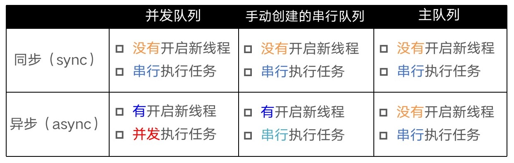
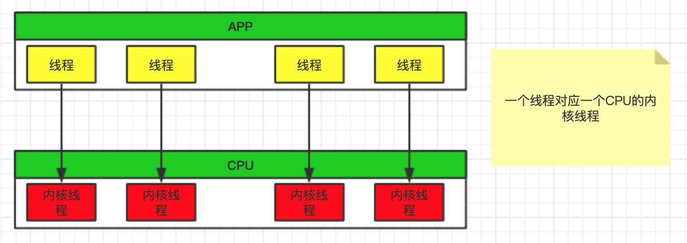
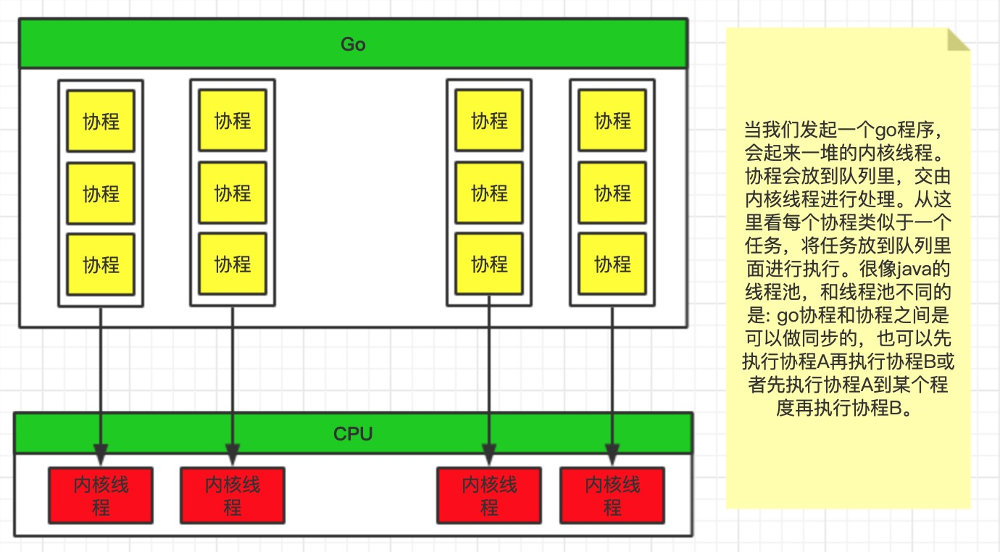
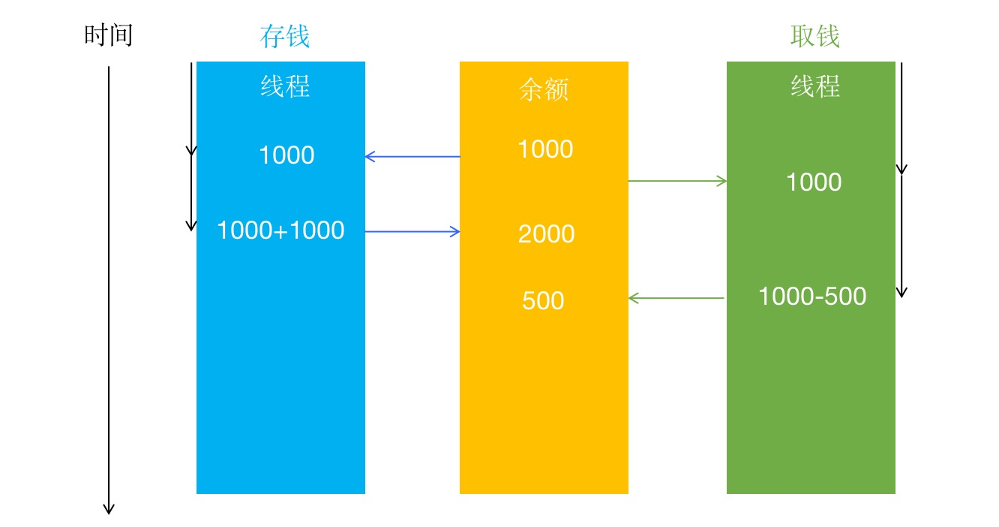
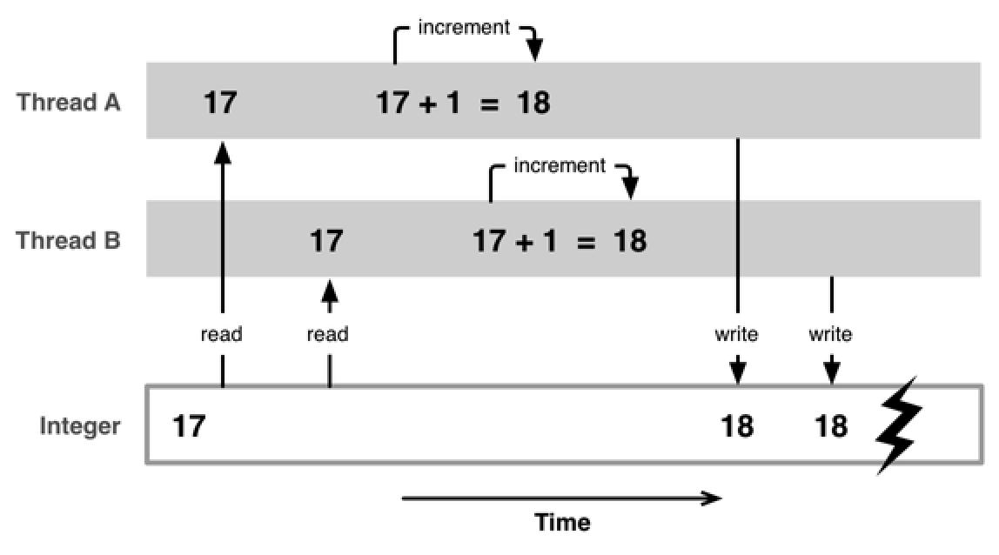
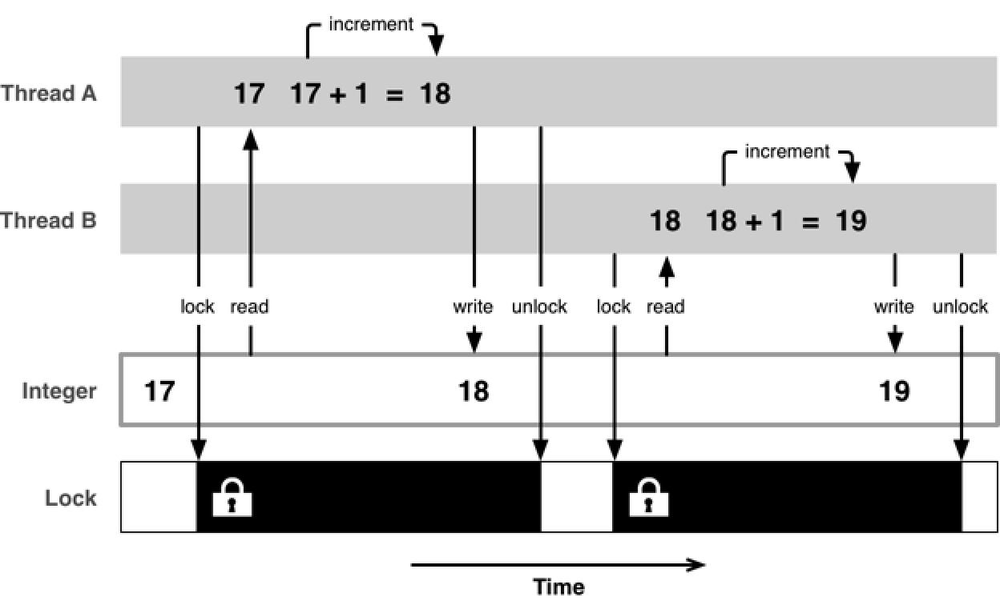

# 多线程
多线程在项目中经常使用，我们执行耗时操作时，比如网络请求、下载图片、加载音视频等耗时操作，为了不卡住主线程，都需要在异步进行操作。

**iOS中的多线程方案有几下几种：**

**技术方案** | **简介** | **语言** | **线程生命周期** | **使用频率**
------- | ------- | ------- | ------- | -------
pthread | 一套通用的多线程API<br>适用于Unix\Linux\Windows等系统<br>跨平台\可移植<br>使用难度大 | C | 程序员管理 | 几乎不用
NSThread | 使用更加面向对象<br>简单易用，可直接操作线程对象 | OC | 程序员管理 | 偶尔使用
GCD | 旨在替代NSThread等线程技术<br>充分利用设备的多核 | C | 自己管理 | 经常使用
NSOperation | 基于GCD（底层是GCD）<br>比GCD多了一些更简单实用的功能,使用更加面向对象 | OC | 自己管理 | 经常使用

* `NSOperation`、`GCD`、`NSThread`的底层使用的都是`pthread`。

## GCD的基本概念
在项目中使用的GCD偏多，所以我们通过GCD讲清楚一些多线程的基本概念。GCD是开源项目，[点击进入下载](https://github.com/apple/swift-corelibs-libdispatch)

GCD中有2个用来执行任务的函数`dispatch_sync(dispatch_queue_t queue, dispatch_block_t block)`和`dispatch_async(dispatch_queue_t queue, dispatch_block_t block)`
```objc
用同步的方式执行任务
dispatch_sync(dispatch_queue_t queue, dispatch_block_t block);
用异步的方式执行任务
dispatch_async(dispatch_queue_t queue, dispatch_block_t block);
queue：队列
block：任务
```

多线程中比较容易混淆的几个术语：`同步、异步、并发、串行`,**同步和异步主要影响：能不能开启新的线程，并发和串行主要影响：任务的执行方式**，注意，主队列是一种特殊的串行队列。
* 同步`dispatch_sync`：在当前线程中执行任务，不具备开启新线程的能力  _`(需要马上在当前线程执行任务，任务完成之后才能继续往下执行)`_
* 异步`dispatch_async`：在新的线程中执行任务，具备开启新线程的能力   _`(不要求马上在当前线程执行任务)`_
* 并发：多个任务并发（同时）执行
* 串行：一个任务执行完毕后，再执行下一个任务

它们之间的关系如下图，图片来源小码哥的MJ老师，注意：**两个async共用一个手动创建的串行队列时，只会产生一个新线程**：


通过代码获取队列：
```objc
// 主队列，一种特殊的串行队列
dispatch_queue_t mainQueue = dispatch_get_main_queue();
// 串行队列
dispatch_queue_t queue1 = dispatch_queue_create("queue1", DISPATCH_QUEUE_SERIAL);
// 全局并发队列
dispatch_queue_t queue2 = dispatch_get_global_queue(0, 0 );
// 并发队列
dispatch_queue_t queue3 = dispatch_queue_create("queue3", DISPATCH_QUEUE_CONCURRENT);
```

## 死锁
当两个以上的运算单元，双方都在等待对方停止运行，以获取系统资源，但是没有一方提前退出时，就称为死锁。通过代码的方式展示死锁的两种方式：
```objc
// 情况1
- (void)viewDidLoad {
    [super viewDidLoad];
    dispatch_sync(dispatch_get_main_queue(), ^{

    });
}
```
要想知道这里为什么会死锁？我们需要先知道串行队列和同步的特点：
* **串行队列的特点: FIFO 先进先出。谁先进来，就先把谁执行完。**
* **同步`dispatch_sync`: 需要马上在当前线程执行任务，执行完成之后才能继续往下执行**

根据串行队列的特点，viewDidLoad函数 在 sync 任务的前面,所有需要先执行 viewDidLoad 函数，而在 viewDidLoad函数中又有 sync，根据 sync 的特点，需要先执行完 sync 的任务才能继续往下执行，这样就造成了双方都在等待对方先执行结束。也就造成了我们说的死锁。

下面的代码也是一样，虽然 sync 任务是在 async 内部进行的，但是它和 async 使用的是同一个串行队列，也会造成死锁的情况。
```objc
// 情况2
- (void)viewDidLoad {
    [super viewDidLoad];
    
    dispatch_queue_t queue = dispatch_queue_create("queue", DISPATCH_QUEUE_SERIAL);
    
    dispatch_async(queue, ^{
        dispatch_sync(queue, ^{

        });
    });
}
```
我们根据以上情况做一个总结,_**`当使用sync函数往当前串行队列中添加任务时，会卡住当前的串行队列（产生死锁）`**_

## 队列组
有一个需求是先异步并发执行 任务1、任务2, 等任务1和任务2都执行完毕后，再回到主线程执行任务3。这个时候可以考虑使用队列组。
```
- (void)viewDidLoad {
    [super viewDidLoad];
    
    // 创建队列组
    dispatch_group_t group = dispatch_group_create();
    // 创建并发队列
    dispatch_queue_t queue = dispatch_get_global_queue(0, 0);
    // 添加异步任务
    dispatch_group_async(group, queue, ^{
        for (int i = 0; i < 10; i++) {
            NSLog(@"%d --- 任务1 --%@",i,[NSThread currentThread]);
        }
    });
    dispatch_group_async(group, queue, ^{
        for (int i = 0; i < 10; i++) {
            NSLog(@"%d ---任务2 -- %@",i,[NSThread currentThread]);
        }
    });
    //等前面的任务执行完毕，会执行当前任务
    dispatch_group_notify(group, dispatch_get_main_queue(), ^{
        for (int i = 0; i < 10; i++) {
            NSLog(@"%d ---任务3 --  %@",i,[NSThread currentThread]);
        }
    });
}
```
## 线程调度
**线程之间的调度是由操作系统进行分配的**。假设我们有三个线程thread1、thread2、thread3,系统会给每个线程以毫秒为单位分配一段时间，这里有个名词叫`时间片`,每个线程轮番执行相应的时间。线程调度用到的算法叫`轮转调度算法(线程、进程)`。当进行线程切换时,CPU的主要作用是 **保存现场，执行新的线程。恢复现场，继续执行原线程这样的一个过程**。

线程和CPU之间的关系，每个线程对应CPU中的一条内核线程，如下图：


Go语言之所以支持高并发，主要原因是**在用户态模拟了CPU调度线程的原理**,当我们开启一个go程序时，系统会起来一堆的内核线程，协程被放到队列里，交由内核线程进行处理。这也是为什么协程比线程更加轻量级的原因。

每个协程类似于一个任务，放到任务队列里。很像队列组，和队列组不同的是: 
1. Go语言中协程和协程之间是可以做同步的
2. 可以先执行协程A再执行协程B
3. 先执行协程A到某个程度再执行协程B

关于时间片，我们可以使用下面的例子更直观的感受一下:
```objc
- (void)asyncSaleTicket{
    dispatch_queue_t queue = dispatch_get_global_queue(0, 0);
    dispatch_async(queue, ^{
        for (int i = 0; i < 10; i++) {
            [self saleTicket];
        }
    });
    dispatch_async(queue, ^{
        for (int i = 0; i < 10; i++) {
            [self saleTicket];
        }
    });
}
- (void)saleTicket{
//    sleep(1);
    OSSpinLockLock(&_lock);
    _ticketCount -= 1;
    NSLog(@"%d -- %@",_ticketCount,[NSThread currentThread]);
    OSSpinLockUnlock(&_lock);
}
```
多个线程调用`saleTicket`方法时，如果使用`sleep()`函数，打印结果是两个线程交替执行，如果注释掉`sleep()`函数,看到的打印结果是先执行完线程A，再执行线程B。这是因为线程调用是由系统进行分配的，在系统分配给线程的时间片内，线程完成了for循环任务，所以打印的都是同一个线程，当我们使用`sleep()`函数时，该线程运行任务的时间超过了系统分配给它的时间片，这时系统会调用另外一个线程来执行任务。

## 多线程的安全隐患
有多条线程访问同一块内存时，会存在安全隐患问题。比如多个线程访问同一个对象、同一个变量、同一个文件，很容易引发数据错乱和数据安全问题。比如经典的存钱取钱和卖票问题。

**存钱取钱**

使用两个线程对银行存储的钱就行操作，一个存钱，一个取钱，当多个线程对同一个变量进行操作时，就会存在数据错乱的问题。使用图片进行表示,图片来源于小码哥的mj老师:

1. 在银行内存储余额1000，存钱线程读取金额为1000，在同一时间取钱线程读取的金额也是1000
2. 存钱线程又存了1000到银行，将金额返回给银行。这个时候银行存储的金额为2000
3. 取钱的操作在存钱之后，在原来读取的1000金额上取出500，将剩下的500金额返回给银行。这个时候银行存储金额就由2000变成了500。

**卖票**

买票也是经典的多线程安全问题。比如票有100张，使用多个线程同时卖票，每卖出一张票数-1，在代码中我们使用三个线程同时卖票，每个线程卖十张票，剩余票数却不是70张。这也是因为多个线程同时对一个变量进行操作引起的。
```objc
- (void)viewDidLoad {
    [super viewDidLoad];
    _count = 100;
    
    dispatch_async(dispatch_get_global_queue(0, 0), ^{
        for (int i = 0; i < 10; i++) {
            [self saleTicket];
        }
    });
    dispatch_async(dispatch_get_global_queue(0, 0), ^{
        for (int i = 0; i < 10; i++) {
            [self saleTicket];
        }
    });
    dispatch_async(dispatch_get_global_queue(0, 0), ^{
        for (int i = 0; i < 10; i++) {
            [self saleTicket];
        }
    });
}

- (void)saleTicket{
    // 这里停留1秒是为了更好的让多线程的问题更加明显
    sleep(1);
    _count -= 1;
    NSLog(@"剩余票数 %d --- %@",_count,[NSThread currentThread]);
}
```
## 如何防止多线程的安全隐患
当使用多个线程访问同一个变量时，就会引发数据错乱的问题。使用下面这张图可以表示：

如何解决多线程引起的安全隐患？**使用线程同步技术（同步，就是协同步调，按预定的先后次序进行）**,常见的线程同步技术就是加锁。如下图:

在线程A访问资源时，对资源进行加锁，访问结束后，对资源进行解锁。在加锁期间，其他线程无法访问资源。线程A解锁后，线程B访问资源，执行上述加锁解锁操作。

**iOS中的加锁方案**

iOS中有很多的加锁方案，在下章中对锁的使用方法一一个做介绍。

column0 | column1 | column2 | column3
------- | ------- | ------- | -------
OSSpinLock | os_unfair_lock | pthread_mutex | dispatch_semaphore
dispatch_queue(DISPATCH_QUEUE_SERIAL) | NSLock | NSRecursiveLock | NSCondition
NSConditionLock | @synchronized
