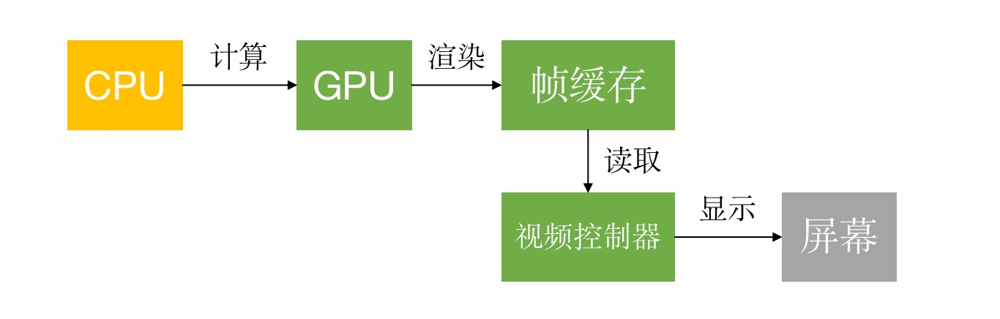
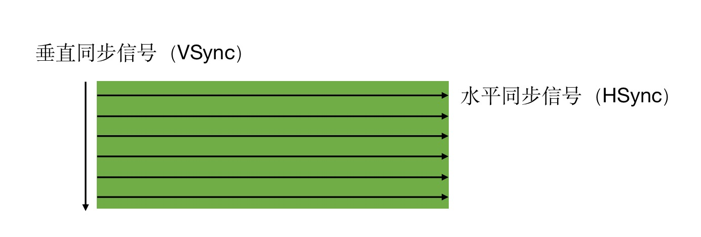
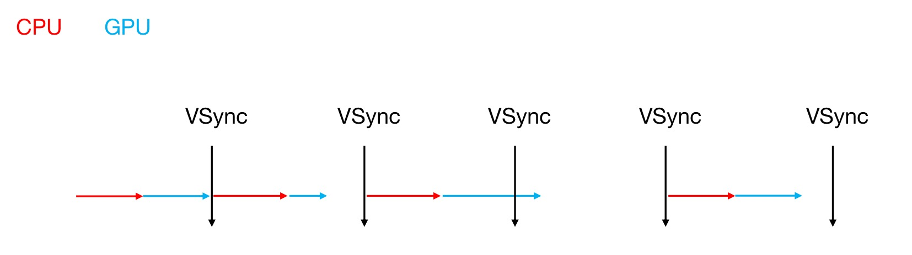
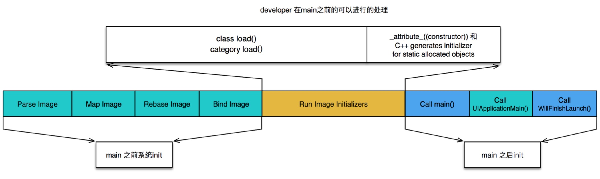

# 性能优化
我们将从界面卡顿、程序耗电、APP启动耗时以及安装包瘦身这几个方面对APP进行优化。

## 卡顿优化
在程序开发过程中可能会经常遇到界面卡顿的问题，我们将在本章中了解卡顿是如何产生的？我们可以通过什么技术手段进行检测？以及如何对界面卡顿进行优化？在此之前我们要先了解什么是CPU、什么是GPU以及它们的作用是什么？

### CPU和GPU
在屏幕成像的过程中，CPU和GPU起着至关重要的作用。
* CPU（Central Processing Unit，中央处理器），主要负责 `对象的创建和销毁、对象属性的调整、布局计算、文本的计算和排版、图片的格式转换和解码、图像的绘制（Core Graphics）`
* GPU（Graphics Processing Unit，图形处理器）,主要负责纹理的渲染

CPU主要负责计算，将计算好的数据交给GPU进行渲染，GPU将渲染好的数据存储在帧缓存中，视频控制器读取帧缓存中的数据，将读取的数据显示在屏幕上。在iOS中是双缓冲机制，有前帧缓存、后帧缓存。

### 屏幕成像原理
简单来说，就是产生一个垂直同步信号VSync，之后不断的进行水平同步信号HSync将屏幕显示完之后，再产生下一个VSync，再不断的进行水平同步信号HSync将整个屏幕显示完，重复这样的操作。每一个垂直同步信号就是一帧。

按照60FPS的刷帧率，每隔16ms就会有一次VSync信号。计算方式`1秒是1000ms，1000/60 = 16`。FPS：帧率，“每秒显示帧数”（Frame per Second，FPS）或“赫兹。
### 卡顿原理
知道了CPU、GPU的作用和屏幕成像的原理，基本可以推断出为什么会出现卡顿了。卡顿的原因是没有在规定的时间刷新屏幕。例如下面这张图：

红色代表CPU，蓝色代表GPU，在第三个垂直同步信号到来的时候，CPU和GPU的计算还没有完成，就会造成当前帧延时显示的问题。俗称丢帧。

### 卡顿优化
知道了卡顿的原理，我们也就知道了如何解决界面卡顿问题，要从两个方面入手CPU和GPU，要尽可能减少CPU、GPU资源消耗。

**CPU优化**
1. 尽量用轻量级的对象，比如用不到事件处理的地方，可以考虑使用CALayer取代UIView
2. 不要频繁地调用UIView的相关属性，比如frame、bounds、transform等属性，尽量减少不必要的修改
3. Autolayout会比直接设置frame消耗更多的CPU资源
4. 图片的size最好刚好跟UIImageView的size保持一致
5. 控制一下线程的最大并发数量
6. 尽量把耗时的操作放到子线程`文本处理（尺寸计算、绘制）、图片处理（解码、绘制）`

**GPU优化**
1. 尽量避免短时间内大量图片的显示，尽可能将多张图片合成一张进行显示
2. GPU能处理的最大纹理尺寸是4096x4096，一旦超过这个尺寸，就会占用CPU资源进行处理，所以纹理尽量不要超过这个尺寸
3. 尽量减少视图数量和层次
4. 减少透明的视图（alpha<1），不透明的就设置opaque为YES
5. 尽量避免出现离屏渲染

### 离屏渲染
在OpenGL中，GPU有2种渲染方式：
* On-Screen Rendering：当前屏幕渲染，在当前用于显示的屏幕缓冲区进行渲染操作
* Off-Screen Rendering：离屏渲染，在当前屏幕缓冲区以外新开辟一个缓冲区进行渲染操作

离屏渲染消耗性能的原因是：**需要创建新的缓冲区，并且需要多次切换上下文环境。**

离屏渲染的整个过程，需要多次切换上下文环境，先是从当前屏幕（On-Screen）切换到离屏（Off-Screen）；等到离屏渲染结束以后，将离屏缓冲区的渲染结果显示到屏幕上，又需要将上下文环境从离屏切换到当前屏幕

**会触发离屏渲染操作？**
* 光栅化，`layer.shouldRasterize = YES`
* 遮罩，`layer.mask`
* 圆角，同时设置`layer.masksToBounds = YES、layer.cornerRadius大于0`（考虑通过CoreGraphics绘制裁剪圆角，或者叫美工提供圆角图片）
* 阴影，`layer.shadowXXX`，如果设置了`layer.shadowPath`就不会产生离屏渲染

查看离屏渲染，模拟器可以选中`Debug -> Color Off-screen Rendered`开启调试，真机可以用Instruments检测，`Instruments -> Core Animation -> Debug Options -> Color Offscreen-Rendered Yellow`开启调试，开启后，有离屏渲染的图层会变成高亮的黄色。

### 卡顿检测
平时所说的“卡顿”主要是因为在主线程执行了比较耗时的操作，可以添加Observer到主线程RunLoop中，通过监听RunLoop状态切换的耗时，以达到监控卡顿的目的。或者使用`Time Profiler`工具查看耗时的方法。
GitHub上卡顿检测工具：
* [LXDAppFluecyMonitor](https://github.com/UIControl/LXDAppFluecyMonitor)
* [Matrix](https://github.com/Tencent/matrix#matrix_ios_cn)

## 耗电优化
手机耗电的主要操作有`CPU处理(Processing)、网络(Networking)、定位(Location)、图像(Graphics)`。优化也是从这几个方面入手。

**CPU优化**
1. 尽可能降低CPU、GPU功耗
2. 少用定时器
3. 优化I/O操作: _尽量不要频繁写入小数据，最好批量一次性写入，读写大量重要数据时，考虑用`dispatch_io`，其提供了基于GCD的异步操作文件I/O的API。用`dispatch_io`系统会优化磁盘访问
数据量比较大的，建议使用数据库`（比如SQLite、CoreData）`_

**网络优化**
1. 减少、压缩网络数据
2. 如果多次请求的结果是相同的，尽量使用缓存
3. 下载文件时，使用断点续传，否则网络不稳定时可能多次传输相同的内容
4. 网络不可用时，不要尝试执行网络请求
5. 网络不稳定时，让用户可以取消长时间运行或者速度很慢的网络操作，设置合适的超时时间
6. 批量传输，比如，下载视频流时，不要传输很小的数据包，直接下载整个文件或者一大块一大块地下载。如果下载电子邮件，一次下载多封，不要一封一封地下载。减少发送网络请求的数量。

**定位优化**
1. 如果只是需要快速确定用户位置，最好用`CLLocationManager`的`requestLocation`方法。定位完成后，会自动让定位硬件断电
2. 如果不是导航应用，尽量不要实时更新位置，定位完毕就关掉定位服务
3. 尽量降低定位精度，比如尽量不要使用精度最高的`kCLLocationAccuracyBest`
需要后台定位时，尽量设置`pausesLocationUpdatesAutomatically`为YES，如果用户不太可能移动的时候系统会自动暂停位置更新
4. 尽量不要使用`startMonitoringSignificantLocationChanges`，优先考虑`startMonitoringForRegion:`

**硬件检测优化**
用户移动、摇晃、倾斜设备时，会产生动作(motion)事件，这些事件由加速度计、陀螺仪、磁力计等硬件检测。在不需要检测的场合，应该及时关闭这些硬件。比如摇一摇功能

## APP启动优化
APP的启动可以分为2种，冷启动和热启动。APP启动时间的优化，主要是针对冷启动进行优化
* 冷启动（Cold Launch）：从零开始启动APP
* 热启动（Warm Launch）：APP已经在内存中，在后台存活着，再次点击图标启动APP

通过添加环境变量可以打印出APP的启动时间分析`（Edit scheme -> Run -> Arguments）`
`DYLD_PRINT_STATISTICS` 设置为1。运行项目之后，会打印在调用main函数之前的启动时间。
```objc
Total pre-main time:  25.91 milliseconds (100.0%)
         dylib loading time:  49.93 milliseconds (192.6%)
        rebase/binding time: 126687488.9 seconds (303809467.3%)
            ObjC setup time:   8.07 milliseconds (31.1%)
           initializer time:  32.63 milliseconds (125.9%)
           slowest intializers :
             libSystem.B.dylib :   2.81 milliseconds (10.8%)
   libBacktraceRecording.dylib :   6.02 milliseconds (23.2%)
               libobjc.A.dylib :   1.03 milliseconds (3.9%)
                CoreFoundation :   0.77 milliseconds (3.0%)
    libMainThreadChecker.dylib :  20.23 milliseconds (78.0%)
```
如果需要更详细的信息，就将 `DYLD_PRINT_STATISTICS_DETAILS` 设置为1

### APP冷启动的过程
APP的冷启动可以使用：`dyld、runtime、main` 三个阶段进行概括。如下图


**dyld**

dyld（dynamic link editor），Apple的动态链接器，用来装载 Mach-O 文件（可执行文件、动态库等）。启动APP时，dyld所做的事情有:
1. 装载APP的可执行文件，同时会递归加载所有依赖的动态库
2. 当dyld把可执行文件、动态库都装载完毕后，会通知Runtime进行下一步的处理

**runtime**

启动APP时，runtime所做的事情有:
1. 调用`map_images`进行可执行文件内容的解析和处理
2. 在`load_images`中调用`call_load_methods`，调用所有Class和Category的+load方法
进行各种objc结构的初始化（注册Objc类 、初始化类对象等等）
3. 调用C++静态初始化器和`__attribute__((constructor))`修饰的函数

到此为止，可执行文件和动态库中所有的符号(Class，Protocol，Selector，IMP，…)都已经按格式成功加载到内存中，被runtime 所管理。

>总结
*  APP的启动由 dyld 主导，将可执行文件加载到内存，顺便加载所有依赖的动态库。
* 并由 runtime 负责加载成 objc 定义的结构
* 所有初始化工作结束后，dyld 就会调用 main 函数
* 接下来就是`UIApplicationMain`函数，AppDelegate 的`application:didFinishLaunchingWithOptions:`方法

### APP冷启动优化方案
根据不同的阶段做不同的优化:
* **dyld:** 减少动态库、合并一些动态库（定期清理不必要的动态库）,减少Objc类、分类的数量、减少Selector数量（定期清理不必要的类、分类）,减少C++虚函数数量,Swift尽量使用struct
* **runtime:** 用`+initialize`方法和`dispatch_once`取代所有的`__attribute__((constructor))、C++静态构造器、ObjC的+load`
* **main:** 在不影响用户体验的前提下，尽可能将一些操作延迟，不要全部都放在`finishLaunching`方法中,按需加载

## 安装包瘦身
当一个项目做的时间久了打出来的安装包会越来越大，这个时候就要想办法对安装包进行瘦身。安装包（IPA）主要由可执行文件、资源组成。

1. 使用[LSUnusedResources](https://github.com/tinymind/LSUnusedResources)去除没有用
2. 编译器优化`Strip Linked Product`、`Make Strings Read-Only`、`Symbols Hidden by Default`设置为YES。去掉异常支持，`Enable C++ Exceptions`、`Enable Objective-C Exceptions`设置为NO， `Other C Flags`添加`-fno-exceptions`
3. 利用AppCode（https://www.jetbrains.com/objc/）检测未使用的代码：`菜单栏 -> Code -> Inspect Code`
4. 生成LinkMap文件，查看可执行文件的具体组成。可借助第三方工具[解析LinkMap文件]( https://github.com/huanxsd/LinkMap)。需要在Xcode中设置允许生成Link Map文件和生成之后的文件路径。`Path to Link Map File`是文件路径，`Write Link Map File`允许写Link Map文件。

## 面试题
1. 你在项目中是怎么优化内存的？
2. 优化你是从哪几方面着手？
3. 列表卡顿的原因可能有哪些？你平时是怎么优化的？
4. 遇到tableView卡顿嘛？会造成卡顿的原因大致有哪些？

## 推荐阅读
* [iOS应用千万级架构：性能优化与卡顿监控](https://www.cnblogs.com/jys509/p/13296128.html) 