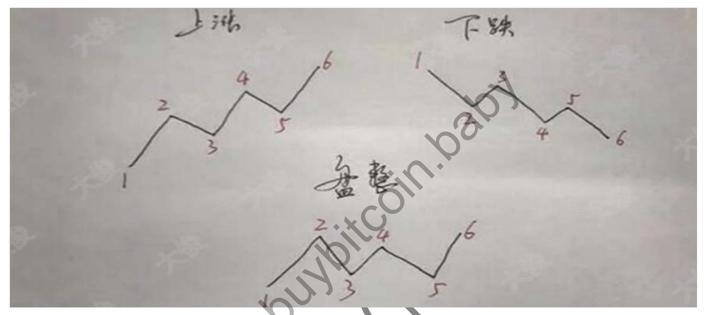

# 证劵知识点

## 压力位和支撑位

## 斐波那契线

## 维加斯加速通道

## 移动止盈止损

## 交易机器人

方向，仓位，止损点和止盈点

比如一条简单的开平仓规则: 一根放量长阳开多，一根放量长阴开空

1. 如何判断支撑/压力位；
2. 如何判断趋势；
3. 资金管理。
4. 打造一套趋势交易系统

一个是概率，一个是盈亏比

做大概率对的，盈亏比高的事。

八、如何判断趋势
趋势，就是行情往一个方向连续的长时间的运动，
既然是趋势交易，那么怎么判断趋势呢，又怎么判断是上升趋势还是下降趋势呢?其实很简
单，
1．按照道氏理论，
K 线的高点一次比一次高，低点一次比一次高，也就是底部不断抬高，就是上升趋势;
K 线的高点一次比一次低，低点一次比一次低，也就是高点不断降低，就是下降趋势;
如果 K 线的高低点没有规律性，这就是盘整趋势，也就是震荡。

2． K 线在 MA20 之上运行，就是上涨趋势，K 线在 MA20 之下运行，就是下降趋
势;MA20 指的是 20 均线，20 没什么神奇的，不一定非得 20,19，21 都行，没有区别，
只是给自己找一个固定的规则。

确定好趋势之后就要选个方向开单了，记得下面这两句话:
**1.只做一个方向**
**2.上升趋势找支撑做多，下降趋势找压力做空。**
这是第一个思路:上升趋势找支撑做多，下降趋势找压力做空。
千万不要想着两头都想吃，多你也想做空你也想做，最后大概率是两头你都没吃到。
并不需要判断多空吧，你只需要知道现在是什么趋势，上涨趋势就跟着做多，下降趋势
跟着做空，然后顺着趋势开单就行了。
>注：确定好操作的级别，级别越大越稳定，最低选择 4h 或者日线，且经我测算下来，
一般选择 ema21 适配日线最为合适。日线的趋势中，ema21 会是很好的支撑点。

第二个思路:做突破。
1、突破是指上涨趋势的时候突破压力位、调整突破前高的时候做多
2、下降趋势突破支撑位的时候做空，越大周期的压力支撑位越有效（注：最少日线）

做突破有个基本的原则
:所有的突破，都当真突破。不要去猜测这是真的还会是假的，所有的突破，都当真的来做

## 压力位和支撑位

斐波那契回撤，来辅助判断支撑/压力位，一般选用 0.382,0.618 即可

十、如何打造一个趋势交易系统
?

交易系统=至少一个开平仓规则 +资金管理。
开平仓规则就是什么地方开仓，什么地方止损，什么地方止盈的一套规则。
资金管理是开仓多少，加仓多少，止盈多少，持仓多久的一套规则