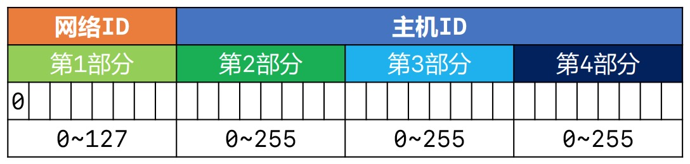
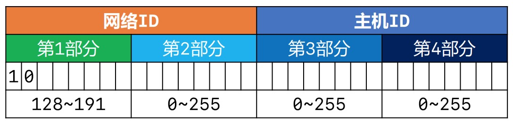
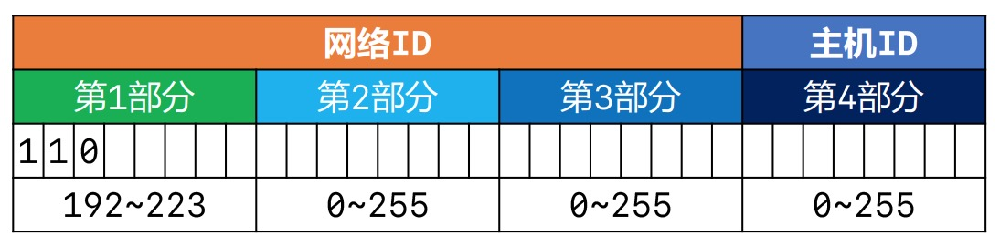
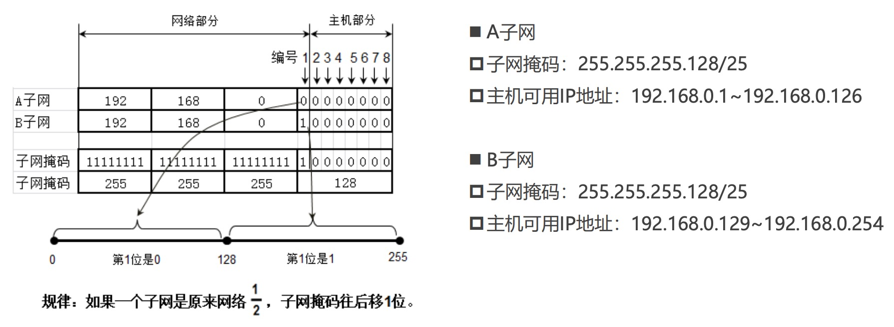
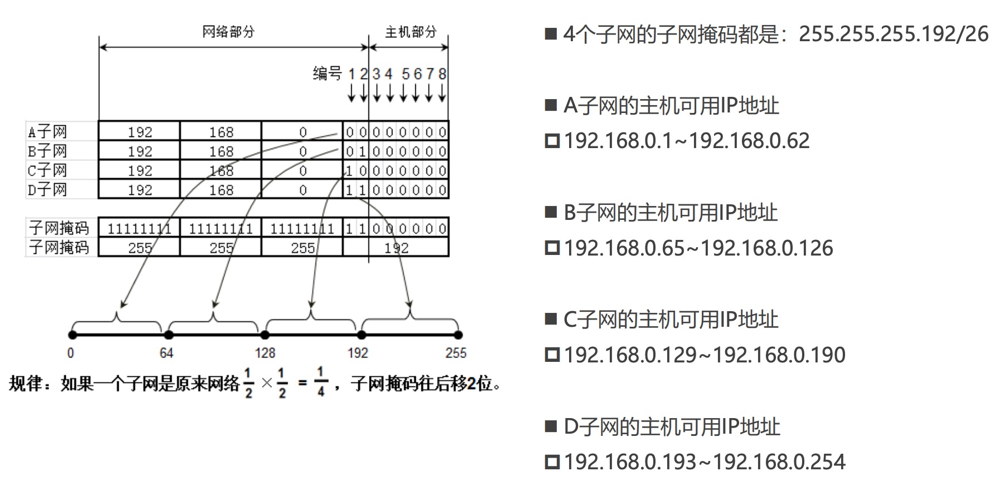
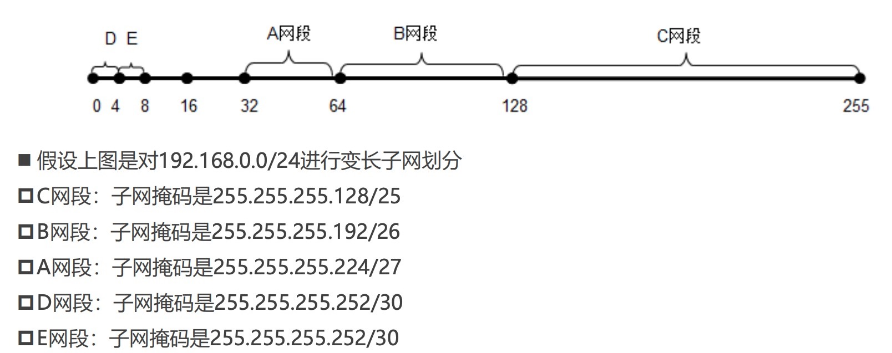
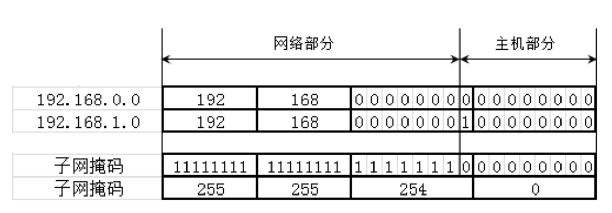

# IP地址
IP地址（Internet Protocol Address）：互联网上的每一个主机都有一个IP地址。最初是IPv4版本，32bit（4字节）,例如`192.168.1.10`，在2019年11月25日，全球的IP地址已经用完。后面推出了IPv6版本，128bit（16字节）。

## IP地址的组成方式
IP地址由2部分组成：`网络标识（网络ID）、主机标识（主机ID）`
* 网络ID 表示你在哪一个网段
* 主机ID 表示你是当前网段的哪一台主机 _**(主机ID的 bit位不能全为0和全为1，全0表示网段，全为1表示广播)**_

我们可以通过子网掩码（subnet mask）可以得知网络ID 、主机ID。 **主机所在的网段 = 子网掩码 & IP地址**，举例：
```
IP地址： 192.168.1.10
子网掩码： 255.255.255.0
    1100 0000.1010 1000.0000 0001.0000 1010
&   1111 1111.1111 1111.1111 1111.0000 0000
-----------------------------------------------
    1100 0000.1010 1000.0000 0001.0000 0000

网段 192.168.1.0
```

计算机和其他计算机通信前，会先判断目标主机和自己是否在同一网段。判断是否跟自己在同一网段: `目标IP & 自己的子网掩码`
* 同一网段：不需要由路由器进行转发
* 不同网段：交由路由器进行转发

## IP地址分类
IP 地址分为 A类、B类、C类、D类、E类。

Class | 前缀位(bit) | 网络ID(bit) | 主机ID(bit) | 子网掩码 | 每个网络的主机数
------- | ------- | ------- | ------- | ------- | -------
A类地址 | 0 | 8 | 24 | 255.0.0.0 | 16,777,214
B类地址 | 10 | 16 | 16 | 255.255.0.0 | 65,534
C类地址 | 110 | 24 | 8 | 255.255.255.0 | 254
D类地址（群播） | 1110 | 未定义 | 未定义 | 未定义 | 未定义 | 未定义
E类地址（保留） | 1111 | 未定义 | 未定义 | 未定义 | 未定义 | 未定义

注意：主机ID全为0，表示主机所在网段。主机ID全为1，表示主机所在网段的全部主机(广播)，可以尝试ping某个网段的全部主机。例如`ping 192.168.160.255`

### A类地址

* 网络ID: 取值范围 `0~127`，全为0不能用,127作为保留网段使用，其中127.0.0.1是本地环回地址，代表本机地址
* 主机ID: 第2、3、4部分的取值范围`0~255`
* 最大主机数： `256 * 256 * 256 - 2 = 16777214`。(-2 的原因是因为主机位bit位全为0和全为1时不能使用)


### B类地址

* 网络ID: 第一部分取值范围`128-191`,第二部分取值范围`0~255`
* 主机ID: 第3、4部分的取值范围`0~255`
* 最大主机数： `256 * 256 - 2 = 65534` (-2 的原因是因为主机位bit位全为0和全为1时不能使用)


### C类地址

* 网络ID: 第一部分取值范围`192-223`,第2、3部分取值范围`0~255`
* 主机ID: 第4部分的取值范围`0~255`
* 最大主机数： `256 - 2 = 254` (-2 的原因是因为主机位bit位全为0和全为1时不能使用)


###  子网掩码的CIDR表示方法

CIDR表示方法是一个用于给用户分配IP地址以及在互联网上有效地路由IP数据包的对IP地址进行归类的方法。例如 
* `192.168.1.100/24`代表子网掩码有24个1，也就是255.255.255.0 
* `123.210.100.200/16` 代表子网掩码有16个1，也就是255.255.0.0


## 子网划分
子网划分指的是从当前网段划分出多个网段。

### 为什么要进行子网划分

一个C类网段可以分配`254`台主机，如果需要让500台主机在同一个网段内，那就分配一个B类网段，比如191.100.0.0/16，而一个B类网段共有65534个可用IP，为了500台主机就是用B类网段属于极大的浪费资源,我们可以通过子网划分更好的利用资源。

子网划分的原理是**借用主机位作子网位，划分出多个子网**,可以分为:
* 等长子网划分：将一个网段等分成多个子网，每个子网的可用IP地址数量是一样的
* 变长子网划分：每个子网的可用IP地址数量可以是不一样的

子网划分的步骤:
* 确定子网的子网掩码长度 
* 确定子网中第1个、最后1个主机可用的IP地址

### 等长子网划分

占用主机bit位作为网络ID。例如图中`192.168.0.0`网段划分成A/B两个等长子网。
* A子网网段为`192.168.0.0/25`，主机可用IP地址取值范围为`192.168.0.1~192.168.0.126`
* B子网网段为`192.168.0.128/25`,主机可用IP地址取值范围为`192.168.0.129~192.168.0.254`
* A/B的子网掩码为`255.255.255.128/25`


子网掩码每往后移一位，子网是原来网络的二分之一。例如 子网掩码往后移2位，会划分为4个网段。


### 变长子网划分
变长子网指的将一个网段划分成不同长度的子网。

根据前面说的知识,只要子网掩码往后偏移，子网就是当前网段的二分之一。不等长的子网，它们的子网掩码也不同。如下图:


## 超网划分
超网跟子网反过来，它是将多个连续的网段合并成一个更大的网段。

例如下面这张图,将`192.168.0.0/24、192.168.1.0/24`合并为一个网段：`192.168.0.0/23`（子网掩码往左移动1位），子网掩码`255.255.254.0/23`。如果想要更多的主机，可以向左移动2位，子网掩码每向左移动一位，能装纳的主机数就是上一位的倍数。


子网划分是子网掩码向右移动，超网划分是子网掩码向左移动。合并网段的规律：
* 第一个网段的网络号以二进制0结尾，那么由它开始连续的2个网段，能通过左移1位子网掩码进行合并
* 第一个网段的网络号以二进制00结尾，那么由它开始连续的4个网段，能通过左移2位子网掩码进行合并
* 第一个网段的网络号以二进制000结尾，那么由它开始连续的8个网段，能通过左移3位子网掩码进行合并

```
192.168.0.0/24      192.168.00000000.0
192.168.1.0/24      192.168.00000001.0
192.168.2.0/24      192.168.00000010.0
192.168.3.0/24      192.168.00000011.0

192.168.4.0/24      192.168.00000100.0
192.168.5.0/24      192.168.00000101.0
192.168.6.0/24      192.168.00000110.0
192.168.7.0/24      192.168.00000111.0
```

默认情况下，A类子网掩码的位数是8，B类子网掩码的位数是16，C类子网掩码的位数是24。

判断一个网段是子网还是超网:
* 如果该网段的子网掩码位数比默认子网掩码多，就是子网
* 如果该网段的子网掩码位数比默认子网掩码少，则是超网