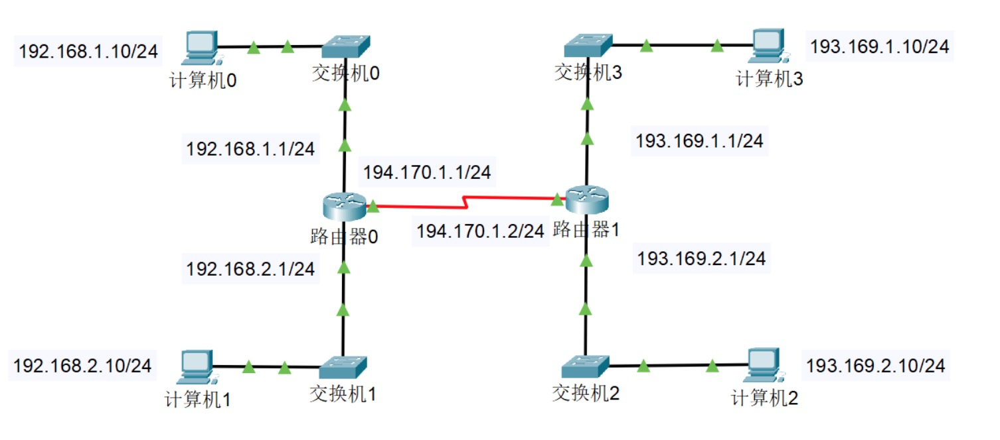
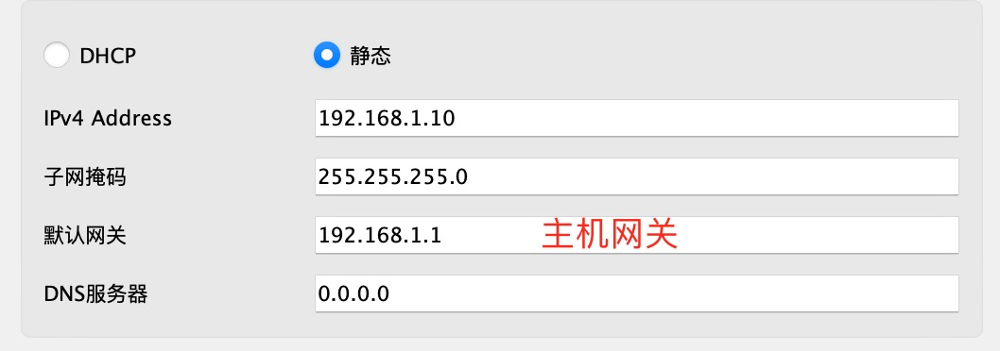
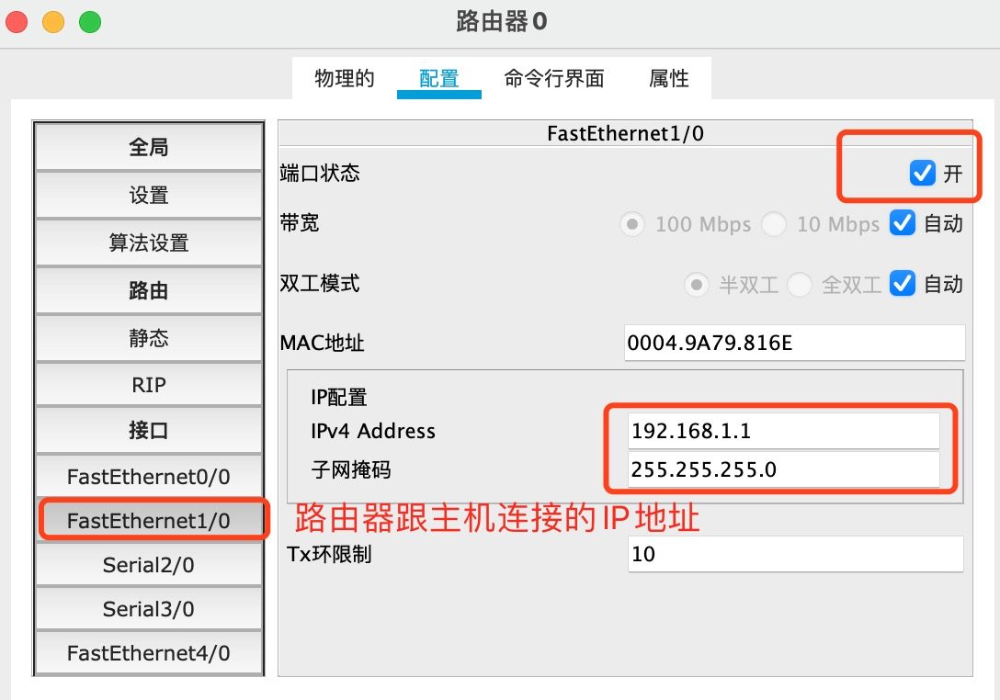
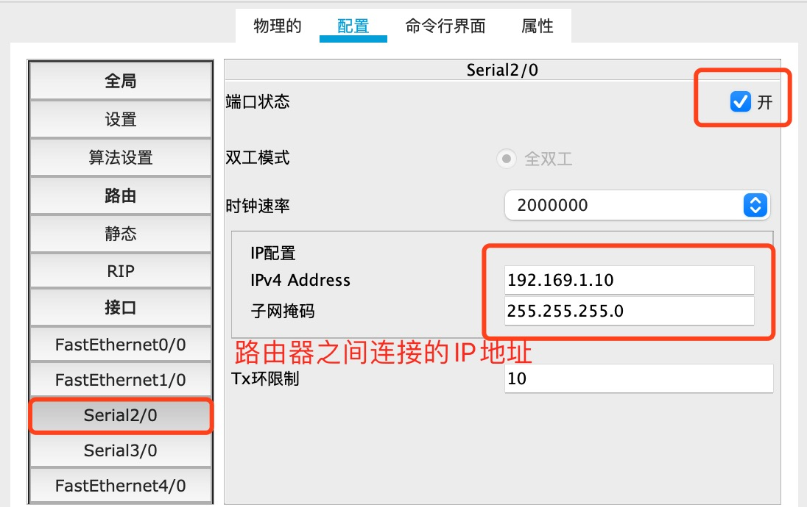
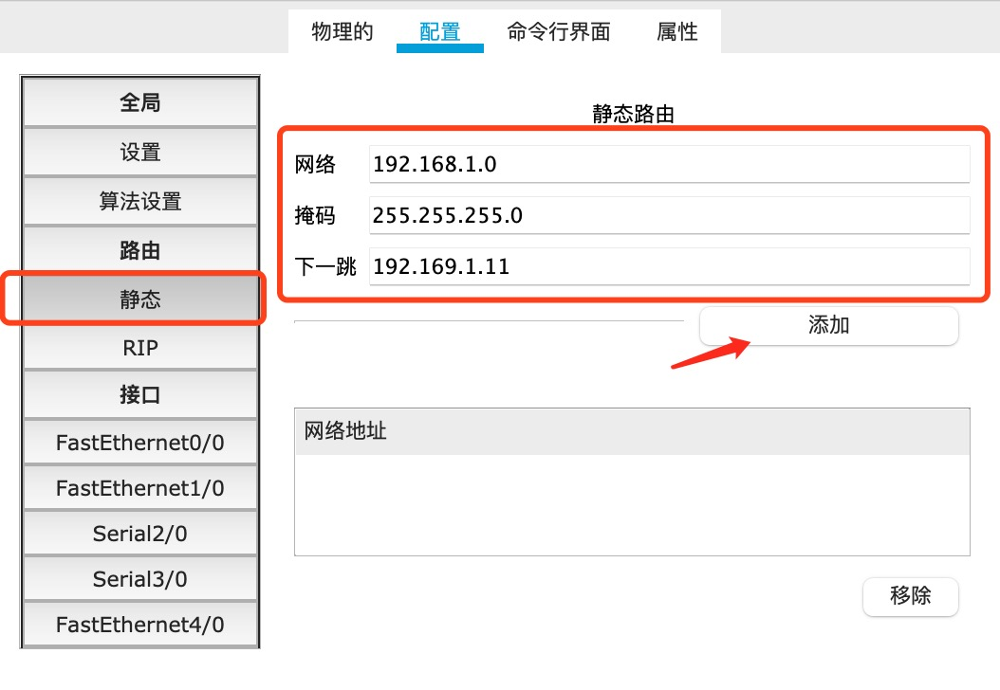
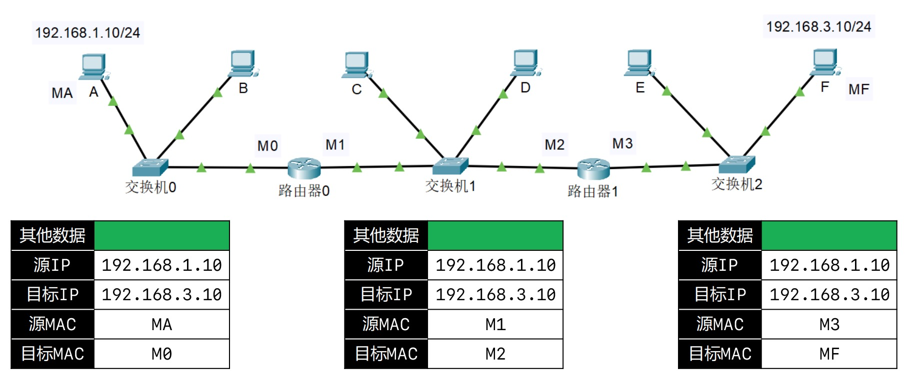
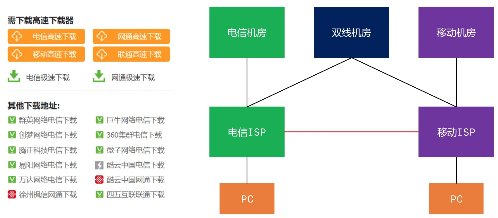
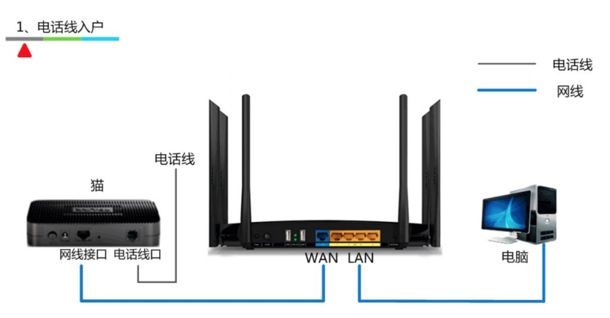
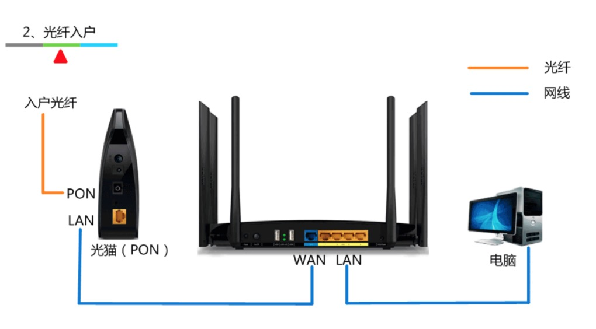
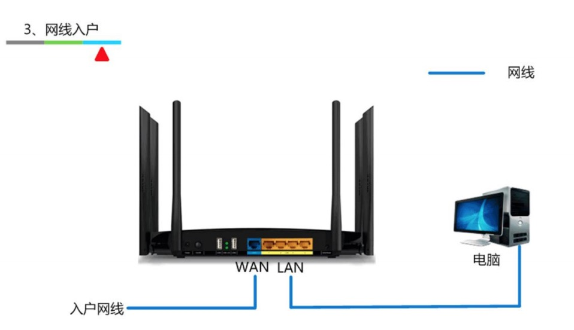

# 路由
在不同网段之间转发数据时，需要有路由器的支持。主机端需要设置网关发送消息到路由器。
 
默认情况下，路由器只知道跟它直连的网段，非直连的网段需要通过静态路由、动态路由来告诉它。路由器内部有一个路由表，存储着指向特定网络地址的路径

* 静态路由: 管理员手动添加路由信息,适用于小规模网络。比如家用网络/校园机房
* 动态路由：路由器通过路由选择协议（比如RIP、OSPF）自动获取路由信息，适用于大规模网络

## 实例讲解
比如我们想让下面四台不同网段的主机进行通信，每个主机通过交换机跟路由器进行连接，分为两个广播域,：

1. 四台主机分别在不同的网段,不同网段的通信首先需要设置主机网关
2. 设置路由器跟主机相连接的的IP地址
3. 设置路由器跟路由器之间连接的IP地址,路由器之间使用串口连接`Serial`
4. 设置路由器的静态路由表，添加下一跳的地址。注意点：
   1. 路由器相连之间要属于同一网段,图中两个路由器网段都属于`192.169.1.0`
   2. 下一跳地址意思是如果找`192.168.1.0`网段的IP,就往`192.169.1.11`IP发送消息
   3. 可以指定默认路由,IP`0.0.0.0`,子网掩码`0.0.0.0`,下一跳`192.169.1.11`，设置默认路由后，当路由器不知道路径怎么走时，都会走下一跳的地址
   4. 使用`Packet Tracker`不知道路由器和主机连接的哪个端口时，选择`选项->首选项->在逻辑工作区总是显示端口标签`

## 数据包的传输过程
利用下面这张图简述一下数据包是如何传送的,图中 主机A 要向 主机F进行通信,主机A网卡地址MA，主机F网卡地址 MF,两台主机属于不同网段，经过两个路由器进行转发数据。
1. 主机A 不知道主机B 的网卡地址,首先将数据发送到路由器0，源MAC地址是主机A的地址，目标MAC地址是路由器MO
2. 路由器0 向 路由器1发送数据，源IP、目标IP不变，源MAC地址更改为M1，目标MAC地址改为M2
3. 路由器1 向主机B 发送数据，源IP、目标IP不变，源MAC地址更改为M3，目标MAC地址改为MF


## ISP
ISP(Internet Service Provider，Internet)服务提供商，比如移动、电信、网通、铁通、长城宽带等等，这些属于网路服务商，由他们搭建网线，维护网络，我们只需要买他们的服务就可以了。我们平时拉的宽带都是通过ISP连接到Internet的。

我们在一些网站经常有看到提示多个站点或者区域下载，这是为了下载速度更快。比如你使用的是移动宽带，肯定选择移动自己的机房下载速度会更快

## 网络分类
按照网络的范围进行分类，可以分为：局域网、城域网、广域网等
* 局域网（Local aREA nETWORK , **LAN** ）
   * 一般是范围在几百米到十几公里内的计算机所构成的计算机网络
   * 常用于公司、家庭、学校、医院、机关、一幢大楼等
   * 局域网中使用最广泛的网络技术叫：以太网（Ethernet）
   * 在电脑、手机上经常见到的一个英文 WLAN（ Wireless LAN ），意思是无线局域网.在家用路由器的接口上也可以看到
* 城域网（Metropolitan Area Network，**MAN**）一般范围是数十公里到数百公里，可以覆盖一个城市
* 广域网（Wide Area Network，**WAN**） 一般范围是几百公里到几千公里，可以覆盖一个国家。通常都需要租用 的线路

## 常见的几种接口
使用`Packet Tracker`工具的时候,在路由器和计算机中可以看到这些接口
* FastEthernet   快速以太网接口（100M），一般用在局域网
* GigabitEthernet   千兆以太网接口
* Serial    串行接口，一般用在两个路由器连接

## 上网的几种方式
上网的方式有电话线入户、光纤入户、网线入户。

**电话线入户**
很早之前使用的都是电话入户，想上线先装个座机，也就是平时说的ADSL电话拨号上网。
* 猫（Modem）调制解调器，进行数字信号和模拟信号的转换
* 数字信号不适合长距离传输，网线不能超过100米，超出100米无法保证正常传输


**光纤入户**
* 光猫（Optical Modem） 光调制解调器，进行数字信号和光信号的转换


**网线入户**
一般在小区内的比较多，网络服务商已经将光信号转换成数字信号了，直接链接就可以上网


## 公网IP、私网IP
IP地址也分为：公网IP、私网IP。公网IP 只要能上电脑Internet网就能访问到，私网IP不能被局域网外的网络所访问。

**公网IP**
* Internet上的路由器中只有到达公网的路由表，没有到达私网的路由表
* 公网IP由因特网信息中心（Internet Network Information Center ，Inter NIC）统一分配和管理
* ISP 需要向 Inter NIC 申请公网IP

**私网IP**
* 主要用于局域网。下面是保留的私网网段。家用路由器常用的是`192.168.1.0`网段
```
✓ A类：10.0.0.0/8，1个A类网络
✓ B类：172.16.0.0/16 ~ 172.31.0.0/16，16个B类网络
✓ C类：192.168.0.0/24 ~ 192.168.255.0/24，256个C类网络
```

## NAT技术

我们家用的路由器通常是私有IP，那我们是怎么来访问互联网呢？这里就需要路由器将私网IP访问 Internet 需要进行 NAT 转换为公网。

网络地址转换（英语：Network Address Translation，缩写：NAT；又称网络掩蔽、IP掩蔽）在计算机网络中是一种在IP数据包通过路由器或防火墙时重写来源IP地址或目的IP地址的技术。这种技术被普遍使用在有多台主机但只通过一个公有IP地址访问互联网的私有网络中。它是一个方便且得到了广泛应用的技术。当然，NAT也让主机之间的通信变得复杂，导致了通信效率的降低。

我们通过百度查询自己的ip地址，不一定是自己家的路由器的IP地址，通信过程中，可能会进行多次NAT转换。查到的IP地址一定是最后一次NAT转换的IP地址。

**NAT的特点**
1. 可以节约公网 资源
2. 会隐藏内部真实IP，(这里并不能达到完全隐藏，通过网络服务商也可以找到访问的主机)

**NAT的分类**
* 静态转换 （已不使用）
   * 手动配置 映射表
   * 一对一转换，不能达到节约公网IP的目的
* 动态转换 (已不使用)
  * 定义外部地址池，动态随机转换
  * 一对一转换
* 网络地址端口转换（NAPT，常用）
  * 多对一转换，最大程度节约公网 资源
  * 采用端口多路复用方式，通过端口号标识不同的数据流

**网络地址端口转换**这种方式支持端口的映射，并允许多台主机共享一个公网IP地址。

支持端口转换的NAT又可以分为两类：源地址转换和目的地址转换。前一种情形下发起连接的计算机的IP地址将会被重写，使得内网主机发出的数据包能够到达外网主机。后一种情况下被连接计算机的IP地址将被重写，使得外网主机发出的数据包能够到达内网主机。实际上，以上两种方式通常会一起被使用以支持双向通信。

NAPT维护一个带有IP以及端口号的NAT表，结构如下:

内网IP | 外网IP
------- | ------- 
192.168.1.55:5566 | 219.152.168.222:9200
192.168.1.59:80 | 219.152.168.222:9201
192.168.1.59:4465 | 219.152.168.222:9202

**NAT其他用途实例**
* 负载均衡：目的地址转换NAT可以重定向一些服务器的连接到其他随机选定的服务器。
* 失效终结：目的地址转换NAT可以用来提供高可靠性的服务。如果一个系统有一台通过路由器访问的关键服务器，一旦路由器检测到该服务器宕机，它可以使用目的地址转换NAT透明的把连接转移到一个备份服务器上。
* 透明代理：NAT可以把连接到因特网的HTTP连接重定向到一个指定的HTTP代理服务器以缓存数据和过滤请求。一些因特网服务提供商就使用这种技术来减少带宽的使用而不用让他们的客户配置他们的浏览器支持代理连接。