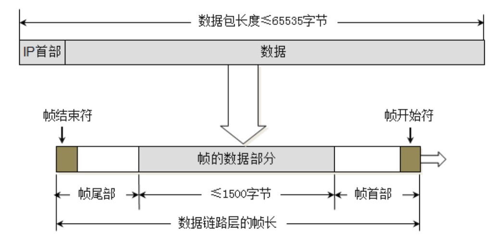
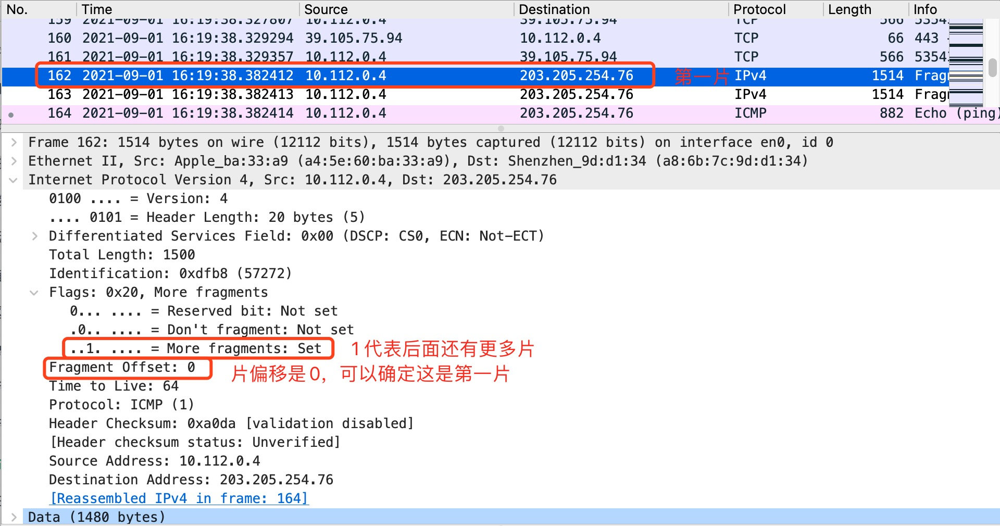
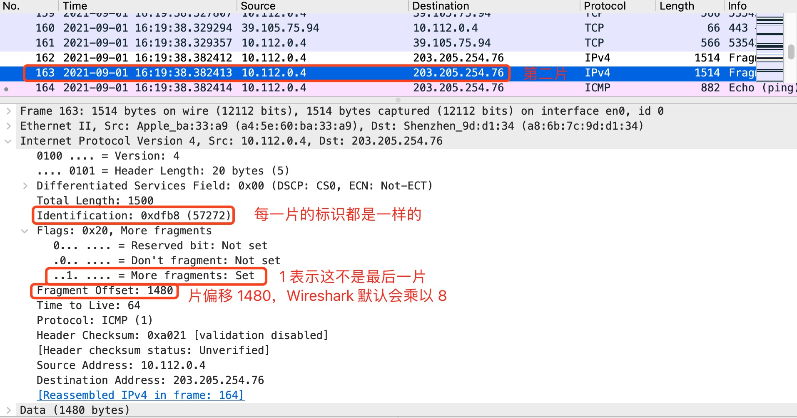

# 网络层
网络层数据包（IP数据包，Packet）由首部、数据2部分组成, 数据部分很多时候是由传输层传递下来的数据段（Segment）,而有些协议比如 ICMP、ARP 只工作在网络层，不需用到传输层数据。

网络层提供路由和寻址的功能，使两终端系统能够互连且决定最佳路径，并具有一定的拥塞控制和流量控制的能力。相当于发送邮件时需要地址一般重要。

下面我们通过一张图来了解网络层的首部信息：

网络层首部由 固定部分(20个字节) 和 可变部分(最大40个字节) 组成,固定部分包含 IP协议版本、首部长度、区分服务、总长度、标识、标志、片偏移、生存时间(TTL)、协议、首部检验和、源IP地址、目标IP地址组成。我们将一一讲解首部的这些信息。

>图中的每一行是4个字节，一行共32个二进制位, `0 ~ 4` 是版本信息，意思是用4个二进制位表示当前IP协议版本，`4 ~ 8`是首部长度，意思是用4个二进制位表示首部的总长度，以此类推....

## 版本（Version）
目前常用IP协议有IPv4和IPv6 两个版本。占首部4个比特位：如果是 `0b0100` 表示是 IPv4 版本, `0b0110` 表示是 IPv6 版本。

## 首部长度 （Header Length）
首部长度占4位，由于4个比特位表达的值有限，首部长度最终的值计算方式是 `二进制的值 * 4`。

首部是由固定部分和可变部分组成，固定部分是20个字节，四个二进制位最大的值是`Ob1111` * 4 = 60,可变部分的长度最大值是60 - 20 = 40。
* 0b0101：5 * 4 = 20（首部长度最小值）
* 0b1111：15 * 4 = 60（首部长度最大值）

## 区分服务 （Differentiated Services Field）
区分服务占8位，可以用于提高网络的服务质量（QoS，Quality of Service）。客户端跟服务端在通信过程中会经过路由器转发消息，如果区分服务有值，在经过路由器时会被优先传输。区分服务主要用于区分数据的优先级。

## 总长度（Total Length）
总长度占16位,16个二进制位的最大值是65535。一个IP数据包的长度是 `首部 + 数据之和`，那可以计算得出，`一个IP数据包的最大值是65535`,在我们学习数据链路层的时候，知道以太网帧的数据部分不能超过1500字节,所以当传输过大的IP数据包时，需要对数据包进行分片传输。每一片都有自己的网络层首部(IP首部)。标识、标志、片偏移都是用来

## 标识（Identification）
标识占16位,表示数据包的ID，
* 当数据包过大进行分片时，同一个数据包的所有片标识都是一样的。
* 有一个计数器专门管理数据包的ID，每发出一个数据包，ID就加1。

## 标志（Flags）
标志占3位，每一位都代表不同的含义
* 第1位（Reserved Bit）：保留位
* 第2位（Don't Fragment）：1代表不允许分片，0代表允许分片
* 第3位（More Fragments）：1代表不是最后一片，0代表是最后一片

>标志位的作用:我们知道以太网帧的数据部分不能超过1500字节，所以当IP数据包 >1500字节 时会进行分片传输,每一片都有自己的网络层首部，接收端接收到数据之后，可以根据标志位确认这个包是否进行了分片，以及根据`More Fragments`确认IP数据包是否完整。

## 片偏移（Fragment Offset）
片偏移占13位,由于13位表达的值有限，所以`片偏移的值 = 字节偏移的值 / 8`，比如下面这张图：

需要发送3800个字节,由于大于1500个字节，需要进行分片,图中分成了三片：
* 第一片,片偏移 `0 / 8 = 0`; 长度1400字节
* 第二片,片偏移 `1400 / 8 = 175`; 长度1400字节
* 第二片,片偏移 `2800 / 8 = 350`; 长度1000字节

拿到片偏移的值之后，再乘以8 = 实际的字节偏移,我们使用 Wireshark 进行抓包时， Wireshark 显示的是已经乘以8之后的值。

>片偏移的作用:当数据包由于过大进行分片时，接收端接收到数据之后，需要重新组装成一个完整的数据包，片偏移可以确定当前片处于数据包的位置。

我们通过一个实例来观察一下,使用 ping 命令向腾讯课堂发送指定大小的数据包,用 Wireshark 进行抓包查看每一片IP数据包首部信息,`ping ke.qq.com -s 3800` 向腾讯课堂发送 3800个字节:

我们看到 IP数据包被分成三片,第一片的数据总长度`Total Length`是1500个字节，IP数据包首部`Header Length`是20个字节(这里 Wireshark 已经帮我们乘以4了),标志位`More Fragments`是1，表示这不是最后一片，后面还有数据。第一片不需要偏移，片偏移为0。

到第二片时，片偏移是1480，第一片一共1500个字节，减去首部20个字节，数据部分剩余1480字节,当接收端接收到数据时，就可以根据片偏移计算出这是一个 IP数据包的第几片。

到第三片的时候，标志位`More Fragments`是0，表示这是最后一片， Wireshark 也是在最后一片的时候，才知道这三片是一个完整的数据包。

>在Internet协议IPv4版本和较新的IPv6版本中，分片机制的细节和分片机制的整体框架是有所不同的。

* IPv4的分片字段均保存在IP头中，允许路由器对超大的IP数据包进行分片。
* IPv6的分片字段作为标准的扩展头部，没被包含在基本IP头中，IP协议推荐使用“路径MTU发现”来获得整个传输路径的最小MTU，从而避免IP数据包过大而需要分片，并因此不允许路由器进行分片。

## 生存时间（Time To Live，TTL）
生存时间 占8位, 每个路由器在转发之前会将TTL减1，一旦发现TTL减为0，路由器会返回错误报告。它的作用是**避免IP包在网络中的无限循环和收发，节省了网络资源。**

在MAC系统中我们可以通过`traceroute`的查看当前主机到目标主机经过的路径。命令`traceroute hostname`。每个系统对应的TTL不同,我们观察使用ping命令后的TTL，能够推测出对方的操作系统、中间经过了多少个路由器。

**常见命令**

MAC | Window | 作用
------- | ------- | -------
`traceroute` | `tracert` | 查看当前主机到目标主机经过的路径 | 
`nslookup` | `nslookup ` | 可以查到DNS记录的生存时间，还可以指定使用哪个DNS服务器进行解析
`mtr` | `pathping` | 网络连通性判断工具，结合了ping，traceroute，nslookup 的相关特性
`ping hostname -s 4000` | `ping hostname -l 4000` | 发送指定大小的数据
`ping hostname -m TTL` |`ping hostname -i TTL` | 设置TTL的值

## 协议 （Protocol）
协议占8位,表明所封装的数据是使用了什么协议，每个协议对应的数值不同。具体值如下图:

## 首部检验和 （Header Checksum）
首部检验和 占16位,用于检查首部是否有错误，跟数据链路层的FCS一个意思

## 源IP（Source Address）、目标IP (Destination Address)
数据链路层有MAC地址，网络层IP地址,那么想一想，传输层协议肯定是拥有端口号的，那么到此为止齐活，MAC地址、IP地址、端口号都有了

## Wireshark 抓包分析IP数据包首部
最后，我们通过下面 Wireshark抓包的这张图来直观的了解一下IP数据包的首部

