# TCP - 连接管理
在这之前我们已经学习了TCP的可靠传输、流量控制、拥塞控制，这一章主要讲TCP的连接管理。我们知道TCP的连接管理主要通过三次握手和四次挥手组成，那么为什么会有三次握手呢？为什么断开的时候要四次挥手呢？

在学习连接管理之前，我们需要温习一下TCP首部 seq 和 ack
* seq : 在建立连接后，序号表示`这一次传给对方的TCP数据部分第一个字节的编号`,比如建立连接后，数据是从1-100，每次传5个数据，第一次传递的序号是1，第二次传递的序号是6。
* ack : 在建立连接后，确认号表示`期望对方下一次传过来的TCP数据部分的第一个字节的编号`

再温习一下TCP首部中的标志位：

标志 | 含义
------- | -------
URG`(Urgent)` | 当URG=1时，紧急指针字段才有效。表明当前报文段中有紧急数据，应优先尽快传送
ACK`(Acknowledgment)` | 当ACK=1时，确认号字段才有效
PSH`(Push)` | 当PSH=1时，指示接收方应该尽快将这个报文段交给应用层而不用等待缓冲区装满。
RST`(Reset)` | 当RST=1时，表明连接中出现严重差错，必须释放连接，然后再重新建立连接
SYN`(Synchronization)` | 当SYN=1、ACK=0时，表明这是一个建立连接的请求,若对方同意建立连接，则回复SYN=1、ACK=1
FIN`(Finish)` | 当FIN=1时，表明数据已经发送完毕，要求释放连接

>需要注意的是：标志位中也有一个ACK,当标志位中的ACK=1时，TCP首部中的确认号字段才是有效的

理解了序号(seq)和确认号(ack)的和标志位之后，我们再来看TCP的连接过程.

## 连接过程
我们先通过下面这张图了解一个HTTP的请求过程,蓝色代表客户端，紫色表示服务端，箭头的颜色表示是客户端发送的数据还是服务端发送的数据:


通过上面这张图，我们看到在进行HTTP请求之前，会先进行三次握手建立连接，握手成功后，客户端发送HTTP请求，服务端多次返回数据,HTTP请求结束之后,经过四次挥手，断开连接。注意这里:**断开连接可以由客户端发起，也可以由服务端发起**。

## 三次握手
我们先通过 Wireshark 抓包来看一下三次握手都做了什么,通过抓取网站`http://icp.chinaz.com/`进行分析,通过IP过滤只看跟当前网站相关的通信。
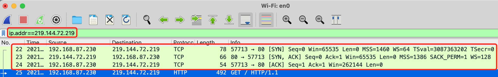
可以看到确实如我们介绍的一样，在进行HTTP请求之前，会进行三次握手。在三次握手中，客户端和服务端会交换一些信息，比如窗口大小、每个段的最大数据部分(MSS)、是否使用选择性确认技术(SACK)，并且这三次是没有任何数据进行传输的。

我们知道TCP首部是20字节，可选部分是40字节,在第一次客户端请求建立连接时`SYN = 1,ACK =0`，可选部分为24字节,服务端同意建立连接`SYN = 1,ACK =1`,可选部分为12字节。如下图:
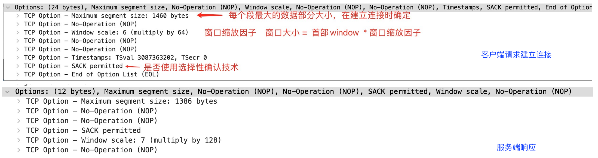
知道了以上信息，我们再来了解一下三次握手时客户端和服务端的序号和确认号

### 三次握手的seq和ACK
1. 客户端首先发起建立连接的请求，`SYN=1、ACK=0`, 表明这是一个建立连接的请求,并且初始化一个seq,`（Wireshark 为了方便我们查看，会使用一个相对值 0，表明这是TCP连接的第一次请求）`
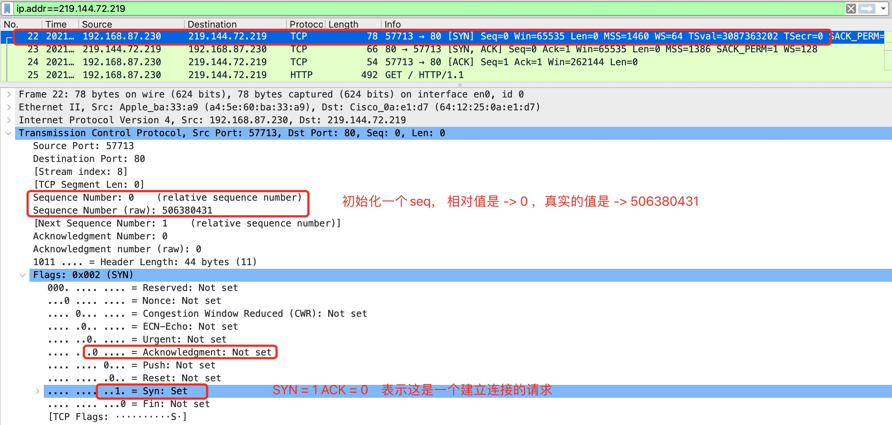

2. 服务端收到请求之后，给回`SYN=1、ACK=1`的响应，同意建立连接，这里同样会初始化一个seq，并且回复的ACK = `客户端的序列号seq + 1`


3. 客户端收到服务端的消息之后，发送`SYN=0、ACK=1`的响应,这时一个TCP连接才真正建立起来。确认号ACK的值 = `服务端的序列号seq + 1`， 序列号seq为了回应服务端的ACK，它的值 = `初始化seq的值 + 1`
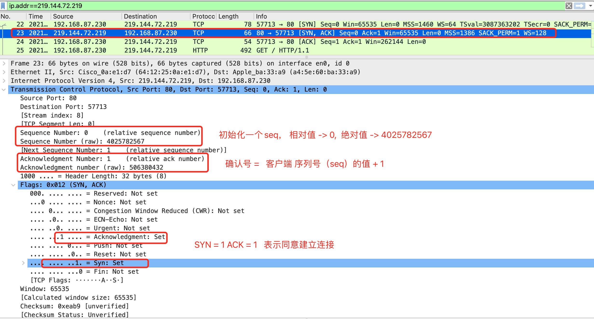

4. 在三次握手成功之后，客户端正式发起HTTP请求,序列号的值在握手成功之后 = `当前值 + 数据部分的长度`，因为之前的数据部分是0，所以这次的序列号不发生变化，这次请求数据部分是有值的。
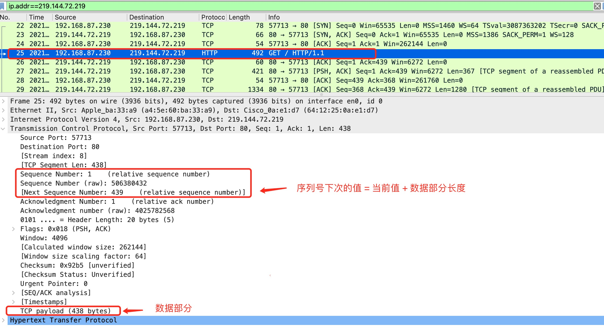

5. 服务端收到客户端的请求后，使用连续ARQ协议返回数据,序列号由于之前没有发送数据保持不变，ACK = 客户端下次序列号的值
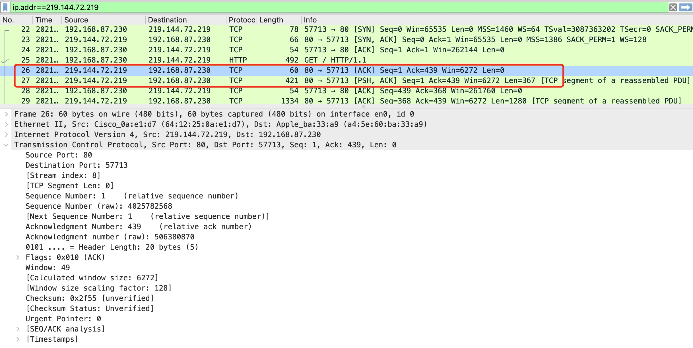

序列号和确认号我们需要注意的是三次握手的值，在三次握手中,虽然数据部分长度为0，但是为了响应对方的ACK,序列号的值会发生改变:
1. 客户端请求建立连接`SYN = 1, ACK = 0, seq = 初始值 x`
2. 服务端同意建立连接`SYN = 1, ACK = x + 1, seq = 初始值 y`
3. 客户端返回确认`SYN = 0, ACK = y + 1, seq = x + 1`

### 三次握手状态解读
当客户端请求建立连接前，处于关闭状态，服务端处于监听状态,客户端发起建立连接的请求之后，处于`SYN-SENT`状态，服务端收到SYN报文之后，处于`SYN-RCVD`状态，客户端发送确认之后，双方处于连接已建立。
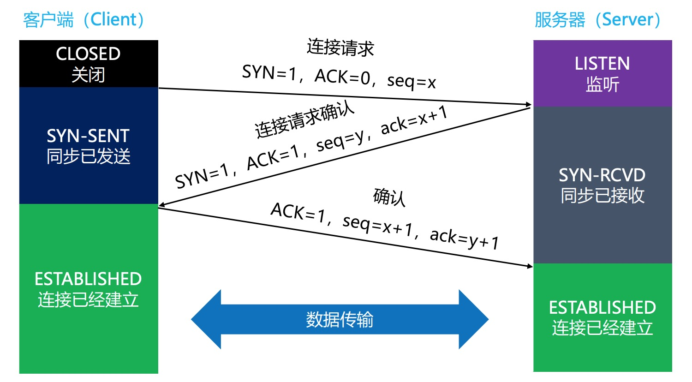
* `CLOSED`：client处于关闭状态
* `LISTEN`：server处于监听状态，等待client连接
* `SYN-RCVD`：表示server接受到了SYN报文，当收到client的ACK报文后，它会进入到ESTABLISHED状态
* `SYN-SENT`：表示client已发送SYN报文，等待server的第2次握手
* `ESTABLISHED`：表示连接已经建立

### 疑问？

#### 1. 为什么需要三次握手
看完三次握手的过程之后，我们肯定还是会有疑问，为什么一定要三次握手，两次不行吗？这样做的目的是**防止server端一直等待，浪费资源**。如果建立连接只需要2次握手，那么可能出现的情况是：

假设client发出的第一个连接请求报文段，因为网络延迟，在连接释放以后的某个时间才到达server，本来这是一个早已失效的连接请求，但server收到此失效的请求后，误认为是client再次发出的一个新的连接请求，于是server就向client发出确认报文段，同意建立连接。

如果不采用“3次握手”，那么只要server发出确认，新的连接就建立了。由于现在client并没有真正想连接服务器的意愿，因此不会理睬server的确认，也不会向server发送数据。但server却以为新的连接已经建立，并一直等待client发来数据，这样，server的很多资源就白白浪费掉了。

**采用“三次握手”的办法可以防止上述现象发生。例如上述情况，client没有向server的确认发出确认，server由于收不到确认，就知道client并没有要求建立连接**

#### 2. 第3次握手失败了，会怎么处理？
* 此时server的状态为SYN-RCVD，若等不到client的ACK，server会重新发送SYN+ACK包
* 如果server多次重发SYN+ACK都等不到client的ACK，就会发送RST包，强制关闭连接


## 四次挥手
了解完三次握手之后，我们再来看一下四次挥手。先来看四次挥手的过程:
1. 第一次挥手: 当`主机1`发出FIN报文段时,表示`主机1`告诉`主机2`,`主机1`已经没有数据要发送了，但是，此时的`主机1`还是可以接收来自`主机2`的数据
2. 第二次挥手: 当`主机2`返回ACK报文段时,表示`主机2`已经知道`主机1`没有数据发送了，但是`主机2`还是可以发送数据到`主机1`的
3. 第三次挥手：当`主机2`也发送了FIN报文段时，表示`主机2`告诉`主机1`，`主机2`已经没有数据要发送了
4. 第四次挥手：当`主机1`返回ACK报文段时，表示`主机1`已经知道`主机2`没有数据发送了，随后正式断开整个TCP连接


### 四次挥手状态解读
了解过四次挥手的过程，再来看一下四次挥手的状态,TCP/IP协议栈在设计上，允许任何一方先发起断开请求。这里演示的是client主动要求断开:
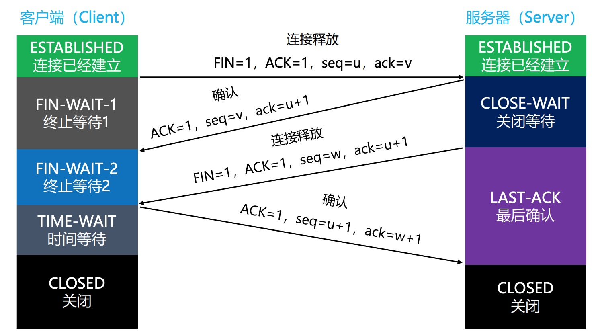
* `FIN-WAIT-1`：表示想主动关闭连接,向对方发送了FIN报文，此时进入到 FIN-WAIT-1状态
* `CLOSE-WAIT`：表示在等待关闭,当对方发送FIN给自己，自己会回应一个ACK报文给对方，此时则进入到CLOSE-WAIT 状态。在此状态下，需要考虑自己是否还有数据要发送给对方，如果没有，发送FIN报文给对方
* `FIN-WAIT-2`：只要对方发送ACK确认后，主动方就会处于 FIN-WAIT-2 状态，然后等待对方发送FIN报文
* `LAST-ACK`：被动关闭一方在发送FIN报文后，最后等待对方的ACK报文。当收到ACK报文后，即可进入CLOSED状态了
* `CLOSED`：关闭状态
* `CLOSING`：一种比较罕见的例外状态
    * 表示你发送 FIN 报文后，并没有收到对方的 ACK 报文，反而却也收到了对方的 FIN 报文
    * 如果双方几乎在同时准备关闭连接的话，那么就出现了双方同时发送FIN报文的情况，也就会出现CLOSING状态
    * 表示双方都正在关闭连接
* `TIME-WAIT`：表示收到了对方的FIN报文，并发送出了ACK报文，就等**2MSL**后即可进入CLOSED状态了
    * 如果`FIN-WAIT-1`状态下，收到了对方同时带FIN标志和ACK标志的报文时,可以直接进入到`TIME-WAIT`状态，而无须经过`FIN-WAIT-2`状态

> MSL 是TCP报文在Internet上的最长生存时间,每个具体的TCP实现都必须选择一个确定的MSL值，[RFC 1122](https://www.rfc-editor.org/rfc/rfc1122.html)建议是2分钟,可以防止本次连接中产生的数据包误传到下一次连接中（因为本次连接中的数据包都会在2MSL时间内消失了）

我们可以通过`netstat`命令查看当前设备跟其他主机的连接状态，由于有些状态的时间比较短暂，所以很难用netstat命令看到，比如SYN-RCVD、FIN-WAIT-1等

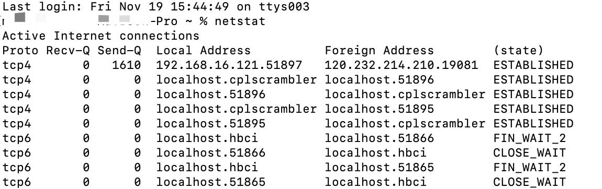

### 为什么会有 TIME-WAIT 状态
在上面的图中,我们看到client发送ACK后，需要有个 `TIME-WAIT` 阶段，等待一段时间后，再真正关闭连接,一般是等待2倍的MSL`（Maximum Segment Lifetime，最大分段生存期）`。为什么需要等这么一个时间呢？主要是为了预防下面这种情况。

如果client发送ACK后马上释放了，然后又因为网络原因，server没有收到client的ACK，server就会重发FIN
这时可能出现的情况是:
* ① client没有任何响应，服务器那边会干等，甚至多次重发FIN，浪费资源
* ② client有个新的应用程序刚好分配了同一个端口号，新的应用程序收到FIN后马上开始执行断开连接的操作，而本来它可能是想跟server建立连接的。

>**等待2倍的MSL就是为了防止本次连接中产生的数据包误传到下一次连接中（因为本次连接中的数据包都会在2MSL时间内消失了）**

### 为什么抓包有时候会是三次挥手
有时候在使用抓包工具的时候，有可能只会看到“3次“挥手,这其实是将第2、3次挥手合并了。
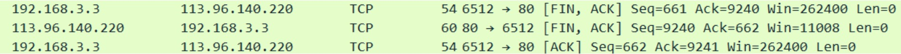
当server接收到client的FIN时，如果server后面也没有数据要发送给client了。这时，server就可以将第2、3次挥手合并，同时告诉client两件事
1. 已经知道client没有数据要发
2. server已经没有数据要发了

## 代码演示
我们通过下面这段代码建立一个客户端和服务端，客户端通过界面向服务端发送请求，我们通过 Wireshark进行抓包查看通信过程。客户端和服务端代码使用Python编写，Python文件 在MAC电脑中通过`python3 xxx.py`运行。

* 服务端代码

```python
# server.py
import socket
import threading

def process_connection(client):
    """处理客户端连接"""
    # 接收客户端发来的数据
    data = b''
    while True:
        chunk = client.recv(1024)
        data += chunk
        if len(chunk) < 1024:
            break

    # 打印从客户端接收的数据
    print(f'data: {data}')
    # 给客户端发送响应数据
    client.sendall(bytes("hello ->", encoding='utf-8') + data)

    # 关闭客户端连接对象
    client.close()

def main():
    # 创建 socket 对象
    sock = socket.socket(socket.AF_INET, socket.SOCK_STREAM)
    # 允许端口复用
    sock.setsockopt(socket.SOL_SOCKET, socket.SO_REUSEADDR, 1)
    # 绑定 IP 和端口
    sock.bind(('127.0.0.1', 8000))
    # 开始监听
    sock.listen(5)

    while True:
        # 等待客户端请求
        client, addr = sock.accept()
        print(f'client type: {type(client)}\naddr: {addr}')

        # 创建新的线程来处理客户端连接
        t = threading.Thread(target=process_connection, args=(client,))
        t.start()

if __name__ == '__main__':
    main()
```

* 客户端代码，客户端使用了 `Tkinter`建立一个简单的界面，如果是Mac电脑,安装`Tkinter`使用`brew install python-tk`命令

```python
from tkinter import *
import socket

class Application(Frame):
    def __init__(self, master=None):
        Frame.__init__(self, master)
        self.pack()
        self.createWidgets()

    def createWidgets(self):
        #  设置输入框
        self.nameInput = Entry(self)
        self.nameInput.pack()
        #  设置按钮
        self.alertButton = Button(self, text='发送数据', command=self.hello)
        self.alertButton.pack()
        #  收到的回调
        self.callback = Label(text="收到服务器的返回")
        self.callback.pack()

    def hello(self):
        name = self.nameInput.get()
        self.sendMassage(name)

    def sendMassage(self,msg):
        # 创建 socket 对象
        sock = socket.socket(socket.AF_INET, socket.SOCK_STREAM)
        # 指定服务器 IP 和端口，进行连接
        sock.connect(('127.0.0.1', 8000))
        # 向 URL "/" 发送 GET 请求
        sock.send(bytes(msg, encoding='utf-8'))

        # 接收服务端响应数据
        data = b''
        while True:
            chunk = sock.recv(1024)
            data += chunk
            if len(chunk) < 1024:
                break
        # 打印响应数据
        print(data)
        self.callback.config(text="服务器返回" + str(data, encoding='utf-8'))

        # 关闭连接
        sock.close()

app = Application()
# 设置窗口标题:
app.master.title('Hello World')
#  设置窗口大小
width, height, padx, pady = 600, 200, 40, 300
app.master.geometry('%dx%d-%d+%d' % (width, height, padx, pady))
# 主消息循环:
app.mainloop()
```

这是一个简单的程序，先运行服务端代码监听端口,再运行客户端弹出交互界面,界面中包含一个输入框，一个发送按钮，一个接受返回数据的Label

每次点击发送按钮，会跟服务端建立一次新的连接，向服务端发送输入框内的文字，服务端收到文字之后，在内容前加入hello 返回给客户端，并主动断开连接。

Wireshark抓包截图:
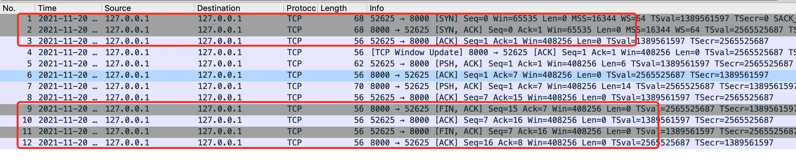

>**关于TCP Window Update:**是服务端告知客户端服务端有足够的缓存大小，可以正常接收客户端数据。若出现了TCP Window Full包表示缓存区已满，客户端会停止发送，直到接收到了TCP Window Update包。(Window值表示滑动窗口，允许接收到多个包同时响应一个ACK包)

## 心跳包 - 连接保活
在双方建立连接成功之后，如果一段时间内服务端没有收到客户端发送的数据，会将当前这条连接断掉，为了连接保活，一般是每隔x秒向服务端发送一个心跳包表示自己还在线，让服务端不要关闭连接。发的这个数据也称为心跳包