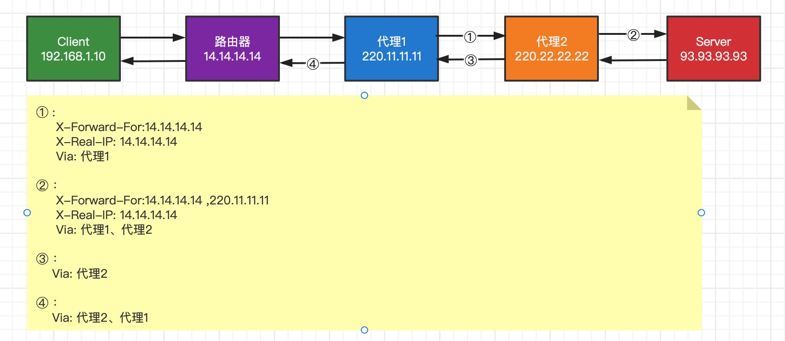
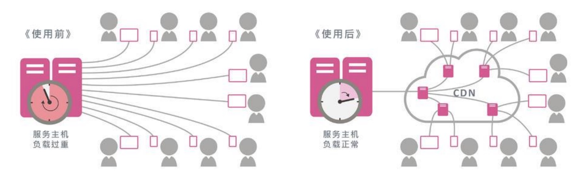
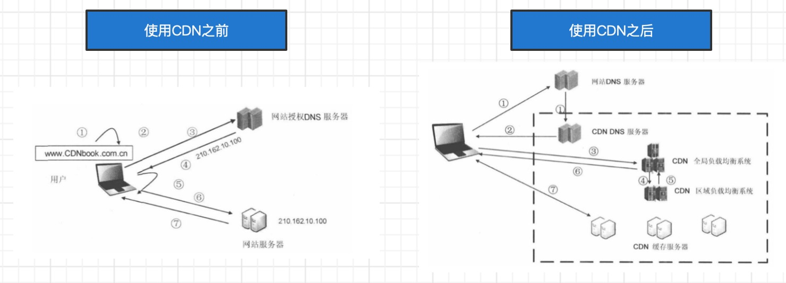
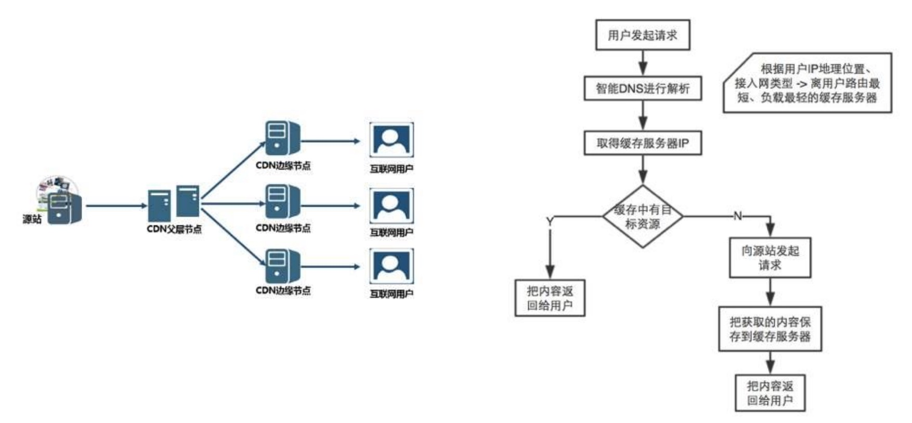
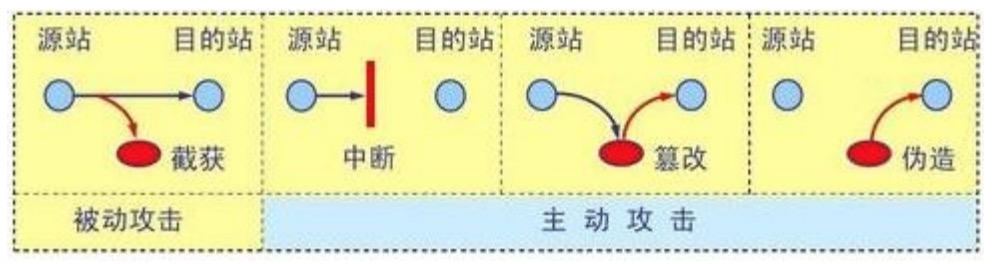

# 代理、CDN、网络安全
这章主要讲一些代理、CDN和网络安全相关的东西。

## 代理
代理`（英语：Proxy`）也称网络代理，是一种特殊的网络服务，允许一个终端（一般为客户端）通过这个服务与另一个终端（一般为服务器）进行非直接的连接。一些网关、路由器等网络设备具备网络代理功能。一般认为代理服务有利于保障网络终端的隐私或安全，在一定程度上能够阻止网络攻击。

代理分为正向代理和反向代理,如下图：


* 正向代理: 代理的对象是客户端，它的作用有:
    * 隐藏客户端身份
    * 绕过防火墙（突破访问限制）
    * Internet访问控制
    * 数据过滤 等等
* 反向代理: 代理的对象是服务器，它的作用有:
    * 负载平衡
    * 缓存静态内容
    * 压缩数据
    * 安全防护 等等

>MAC电脑设置代理: 系统偏好设置 -> 网络 -> 高级 -> 代理 -> 选择对应的 HTTP/HTTPS/SOCKET

一些免费的正向代理:
* [快代理](https://www.kuaidaili.com/free/)
* [高可用全球免费代理IP库](https://ip.jiangxianli.com/)
* [开心代理](http://www.kxdaili.com/dailiip/2/1.html)

### 抓包工具的原理
我用常用的抓包工具有Wireshark、Fiddler、Charles。 Fiddler、Charles等抓包工具的原理：在客户端启动了正向代理服务，如下图:


需要注意的是：**Wireshark 的原理是：通过底层驱动，拦截网卡上流过的数据**

### 代理服务器相关的头部字段
跟代理服务器相关的头部字段有下面几个:
* X-Forwarded-For：追加请求方的IP地址
* X-Real-IP：客户端的真实IP地址
* Via：追加经过的每一台代理服务器的主机名（或域名）

下面这张图是使用代理之后，设置使用相关的头部字段所展示的值:


## CDN
内容分发网络`（英语：Content Delivery Network或Content Distribution Network , 缩写:CDN）`,是指一种透过互联网互相连接的电脑网络系统，利用最靠近每位用户的服务器，更快、更可靠地将音乐、图片、视频、应用程序及其他文件发送给用户，来提供高性能、可扩展性及低成本的网络内容传递给用户。使用CDN之前和使用CDN之后的对比如下图:

CDN运营商在全国、乃至全球的各个大枢纽城市都建立了机房,部署了大量拥有高存储高带宽的节点，构建了一个跨运营商、跨地域的专用网络,内容所有者向CDN运营商支付费用，CDN将其内容交付给最终用户。



## 网络安全
网络中面临的安全威胁可以分为4种: 截获：窃听通信内容、中断：中断网络通信、篡改：篡改通信内容、伪造：伪造通信内容。


### 网络层 - ARP欺骗
ARP欺骗`（ARP spoofing）`，又称ARP毒化（ARP poisoning）、ARP病毒、ARP攻击,ARP欺骗可以造成的效果:
* 可让攻击者获取局域网上的数据包甚至可篡改数据包
* 可让网络上特定电脑之间无法正常通信（例如`网络执法官`这样的软件）
* 让送至特定IP地址的流量被错误送到攻击者所取代的地方等等

简单案例分析：这里用一个最简单的案例来说明ARP欺骗的核心步骤。假设在一个LAN里，只有三台主机A、B、C，且C是攻击者:
```markdown
1. 攻击者聆听局域网上的MAC地址。它只要收到两台主机的 ARP 请求，就可以进行欺骗活动。
2. 主机A、B都进行了 ARP 请求.攻击者现在有了两台主机的IP、MAC地址，开始攻击。
3. 攻击者发送一个ARP 响应给主机B，把响应包里的 源IP 设为A的IP地址，源MAC 设为攻击者自己的MAC地址。
4. 主机B收到ARP 响应包后，更新它的ARP表，把主机A的MAC地址`（IP_A, MAC_A）`改为`（IP_A, MAC_C）`。
5. 当主机B要发送数据包给主机A时，它根据ARP表来封装数据包的Link报头，把目的MAC地址设为MAC_C，而非MAC_A。
6. 当交换机收到B发送给A的数据包时，根据此包的目的MAC地址`（MAC_C）`而把数据包转发给攻击者C。
7. 攻击者收到数据包后，可以把它存起来后再发送给A，达到偷听效果。攻击者也可以篡改数据后才发送数据包给A，造成伤害。
```

#### ARP防护
最理想的防制方法是网络内的每台电脑的ARP一律改用静态的方式，不过这在大型的网络是不可行的，因为需要经常更新每台电脑的ARP表。

另外一种方法，例如`DHCP snooping`，网络设备可借由 DHCP 保留网络上各电脑的 MAC 地址，在伪造的 ARP 数据包发出时即可侦测到。此方式已在一些厂牌的网络设备产品所支持。

有一些软件可监听网络上的ARP回应，若侦测出有不正常变动时可发送电子邮件通知管理者。例如UNIX平台的`Arpwatch`以及Windows上的`XArp v2`或一些网络设备的Dynamic ARP inspection功能。

### 网络层 - Dos/DDos
DoS攻击`（拒绝服务攻击，Denial-of-Service attack）`,使目标电脑的网络或系统资源耗尽，使服务暂时中断或停止，导致其正常用户无法访问。

DDoS攻击`（分布式拒绝服务攻击，Distributed Denial-of-Service attack）`,黑客使用网络上两个或以上被攻陷的电脑作为“僵尸”向特定的目标发动DoS攻击。攻击可以分为2大类:
* 带宽消耗型：UDP洪水攻击、ICMP洪水攻击
* 资源消耗型：SYN洪水攻击、LAND攻击

#####  Dos/DDos 防御方式
防御方式通常为：入侵检测、流量过滤、和多重验证,堵塞网络带宽的流量将被过滤，而正常的流量可正常通过
* 防火墙
    * 防火墙可以设置规则，例如允许或拒绝特定通讯协议，端口或IP地址
    * 当攻击从少数不正常的IP地址发出时，可以简单的使用拒绝规则阻止一切从攻击源IP发出的通信
    * 复杂攻击难以用简单规则来阻止，例如80端口遭受攻击时不可能拒绝端口所有的通信，因为同时会阻止合法流量
    * 防火墙可能处于网络架构中过后的位置，路由器可能在恶意流量达到防火墙前即被攻击影响
* 交换机：大多数交换机有一定的速度限制和访问控制能力
* 路由器：和交换机类似，路由器也有一定的速度限制和访问控制能力
* 黑洞引导: 将所有受攻击计算机的通信全部发送至一个“黑洞”（空接口或不存在的计算机地址）或者有足够能力处理洪流的网络设备商，以避免网络受到较大影响
* 流量清洗: 当流量被送到DDoS防护清洗中心时，通过采用抗DDoS软件处理，将正常流量和恶意流量区分开,正常的流量则回注回客户网站

#### 传输层 - SYN洪水攻击
SYN洪水攻击`（SYN flooding attack）`，攻击者发送一系列的SYN请求到目标，然后让目标因收不到ACK（第3次握手）而进行等待、消耗资源。

* 攻击方法
    * 跳过发送最后的ACK信息
    * 修改源IP地址，让目标送SYN-ACK到伪造的IP地址，因此目标永不可能收到ACK（第3次握手）
* 防护: 参考：[RFC 4987](https://datatracker.ietf.org/doc/html/rfc4987)

#### 传输层 - LAND攻击
LAND攻击`（局域网拒绝服务攻击，Local Area Network Denial attack）`《通过持续发送相同源地址和目标地址的欺骗数据包，使目标试图与自己建立连接，消耗系统资源直至崩溃。

有些系统存在设计上的缺陷，允许设备接受并响应来自网络、却宣称来自于设备自身的数据包，导致循环应答。防护方法有以下几种：
* 大多数防火墙都能拦截类似的攻击包，以保护系统
* 部分操作系统通过发布安全补丁修复了这一漏洞
* 路由器应同时配置上行与下行筛选器，屏蔽所有源地址与目标地址相同的数据包

#### 应用层 - DNS劫持/HTTP劫持
DNS劫持，又称为域名劫持。攻击者篡改了某个域名的解析结果，使得指向该域名的IP变成了另一个IP，导致对相应网址的访问被劫持到另一个不可达的或者假冒的网址，从而实现非法窃取用户信息或者破坏正常网络服务的目的。

为防止DNS劫持，可以考虑使用更靠谱的DNS服务器，比如：
```markdown 
* 114DNS: 114.114.114.114
* 谷歌：8.8.8.8、8.8.4.4
* 微软：4.2.2.1、4.2.2.2
* 百度：180.76.76.76
* 阿里：223.5.5.5、223.6.6.6
```

**HTTP劫持**：对HTTP数据包进行拦截处理，比如插入JS代码,比如你访问某些网站时，在右下角多了个莫名其妙的弹窗广告