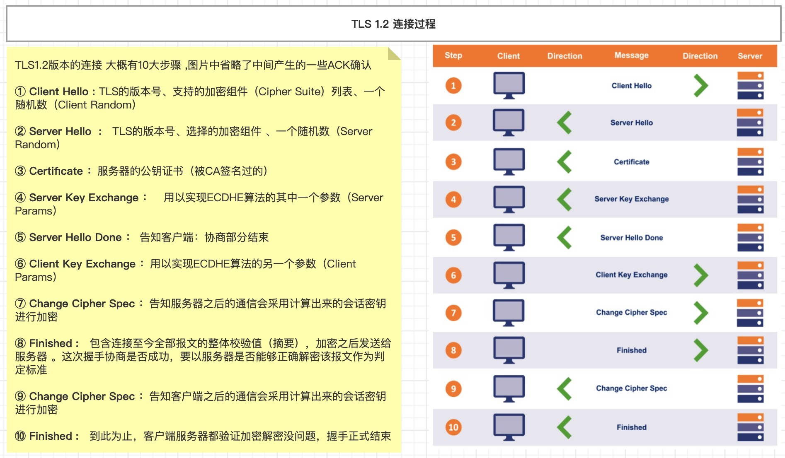
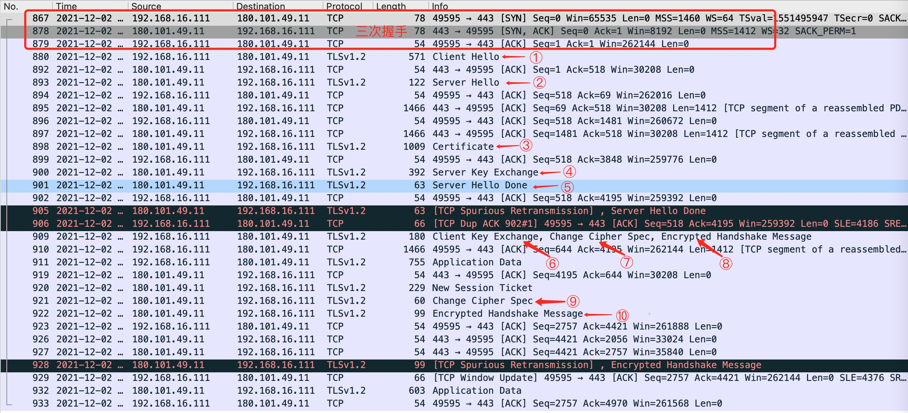
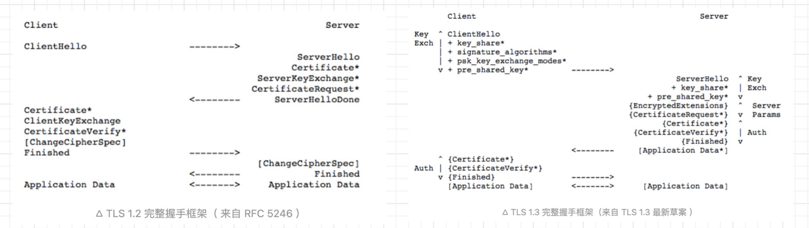

# HTTPS
超文本传输安全协议（英语：`HyperText Transfer Protocol Secure`，缩写：HTTPS；常称为HTTP over TLS、HTTP over SSL或HTTP Secure）是一种通过计算机网络进行安全通信的传输协议。HTTPS 经由 HTTP 进行通信，但利用`SSL/TLS`来加密数据包。

现在很多网站使用的是https协议，比如百度。我们在浏览器上输入`http://www.baidu.com`时，它会使用302重定向到https，如下图:


## 认识 SSL/TLS
TLS`（Transport Layer Security）`，译为：传输层安全性协议，它的前身是SSL（`Secure Sockets Layer）`，译为：安全套接层。

HTTPS 是在 HTTP 的基础上使用 SSL/TLS 来加密报文，对窃听和中间人攻击提供合理的防护。SSL/TLS 也可以用在其他协议上，比如、`FTP → FTPS`、`SMTP → SMTPS`。

SSL/TLS 的历史版本信息:
```
SSL 1.0：因存在严重的安全漏洞，从未公开过
SSL 2.0：1995年，已于2011年弃用（RFC 6176）
SSL 3.0：1996年，已于2015年弃用（RFC 7568）
TLS 1.0：1999年（RFC 2246）
TLS 1.1：2006年（RFC 4346）
TLS 1.2：2008年（RFC 5246）
TLS 1.3：2018年（RFC 8446）
```
TLS/SSL 工作在运输层和应用层之间，如下图：


## OpenSSL
OpenSSL 是SSL/TLS协议的开源实现，始于1998年，支持Windows、Mac、Linux等平台。Linux、Mac一般自带OpenSSL,Windows平台的[OpenSSL下载地址](https://slproweb.com/products/Win32OpenSSL.html)

OpenSSL 常用命令有:
* 生成私钥：`openssl genrsa -out mj.key`
* 生成公钥：`openssl rsa -in mj.key -pubout -out mj.pem`

可以使用OpenSSL构建一套属于自己的CA，自己给自己颁发证书，称为“自签名证书”

## HTTPS的通信过程
HTTPS的通信过程可以分为3大阶段：① TCP的3次握手、② TLS的连接、③ HTTP请求和响应


## TLS 1.2的连接过程
TLS 1.2 版本的连接过程大约有10步，主要是客户端和服务端双方沟通TLS的版本号，沟通双方通信加密方式以及验证CA证书。如下图：


使用 Wireshark 对 baidu.com 进行抓包分析:


* ① Client Hello: TLS的版本号、支持的加密组件（Cipher Suite）列表（加密组件是指所使用的加密算法及密钥长度等）、一个随机数（Client Random）
    
* ② Server Hello: TLS的版本号、选择的加密组件`（是从接收到的客户端加密组件列表中挑选出来的）`、一个随机数（Server Random）
    
* ③ Certificate: 服务器的公钥证书（被CA签名过的）
    
* ④ Server Key Exchange: 用以实现ECDHE算法的其中一个参数（Server Params）。`ECDHE是一种密钥交换算法，为了防止伪造，Server Params经过了服务器私钥签名`
    
* ⑤ Server Hello Done: 告知客户端：协商部分结束
    
* ⑥ Client Key Exchange: 用以实现ECDHE算法的另一个参数（Client Params）
    
* ⑦ Change Cipher Spec: 告知服务器：之后的通信会采用计算出来的会话密钥进行加密
    
* ⑧ Finished: 包含连接至今全部报文的整体校验值（摘要），加密之后发送给服务器,这次握手协商是否成功，要以服务器是否能够正确解密该报文作为判定标准
    
* ⑨ Change Cipher Spec: 告知客户端：之后的通信会采用计算出来的会话密钥进行加密
* ⑩ Finished :到此为止，客户端服务器都验证加密解密没问题，握手正式结束

## TLS1.2   VS   TLS1.3
TLS 1.3 与之前的协议有较大差异，主要在于：
```markdown
1. 相比过去的的版本，引入了新的密钥协商机制 — PSK
2. 支持 0-RTT 数据传输，在建立连接时节省了往返时间
3. 废弃了 3DES、RC4、AES-CBC 等加密组件，废弃了 SHA1、MD5 等哈希算法
4. ServerHello 之后的所有握手消息采取了加密操作，可见明文大大减少
5. 不再允许对加密报文进行压缩、不再允许双方发起重协商
6. DSA 证书不再允许在 TLS 1.3 中使用
```


## Wireshark 抓包HTTPS
如果在 Window 系统中需要设置环境变量`SSLKEYLOGFILE`（浏览器会将key信息导出到这个文件）,设置完成后，最好重启一下操作系统,在Wireshark中选择: `编辑 → 首选项 → Protocols → TLS`。


如果是 macOS 系统,在命令行调用下面的命令生成key.log文件。
* --user-data-dir 配置用户使用数据
* --ssl-key-log-file 配置 ssl-key-log 的存储路径

```shell
/Applications/Google\ Chrome.app/Contents/MacOS/Google\ Chrome --user-data-dir=/tmp/chrome --ssl-key-log-file=/tmp/.ssl-key.log
``` 
在Wireshark中选择该文件: `编辑 → 首选项 → Protocols → TLS -> /tmp/.ssl-key.log`。

## 使用Flask搭建HTTPS服务
我们使用自签的证书和 Flask 搭建一个简单的 https 服务器。运行服务端进行监听，再新开一个命令行运行客户端，会打印返回的code和数据。

1. 生成证书,证书需要放在客户端和服务端代码同目录下:
    ```
    # 生成rsa密钥
    $ openssl genrsa -des3 -out server.key 1024
    # 去除掉密钥文件保护密码
    $ openssl rsa -in server.key -out server.key
    # 生成ca对应的csr文件
    $ openssl req -new -key server.key -out server.csr
    # 自签名
    $ openssl x509 -req -days 1024 -in server.csr -signkey server.key -out server.crt
    $ cat server.crt server.key > server.pem
    ```
2. 安装 python 的 OpenSSL 的类库: `pip3 install pyOpenSSL`
3. 服务端代码:
    ```python
    from flask import Flask
    app = Flask(__name__)

    @app.route('/login')
    def hello_world():
        return 'Hello World!'
        
    if __name__ == '__main__':
        app.run(host="0.0.0.0", port=8091, ssl_context=('server.crt', 'server.key'))
    ```
4. 客户端代码:
    ```python
    import urllib.request
    import ssl

    if __name__ == '__main__':
        CA_FILE = "server.crt"
        context = ssl.SSLContext(ssl.PROTOCOL_TLS)
        context.check_hostname = False
        context.load_verify_locations(CA_FILE)
        context.verify_mode = ssl.CERT_REQUIRED
        try:
            request = urllib.request.Request('https://127.0.0.1:8091/login')
            res = urllib.request.urlopen(request, context=context)
            print(res.code)
            print(res.read().decode("utf-8"))
        except Exception as ex:
            print("Found Error in auth phase:%s" % str(ex))
    ```

## 推荐阅读
* [macOS系统 - Wireshark https抓包](https://www.jianshu.com/p/b3cc1299e03e)
* [wireshark可以抓HTTPS明文包](https://segmentfault.com/a/1190000023568902)
* [https如何使用python+flask来实现](https://bbs.huaweicloud.com/blogs/detail/259237)
* [TLS1.3 VS TLS1.2](https://zhuanlan.zhihu.com/p/44980381)
* [HTTP/3详解](https://www.kancloud.cn/kancloud/http3-explained/1395002)