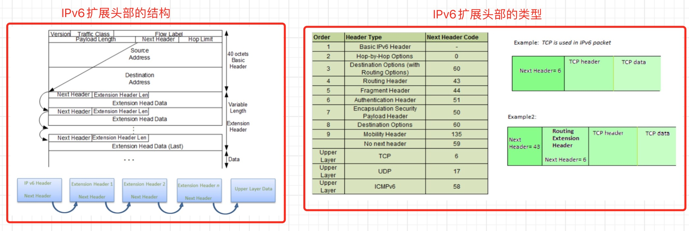

# 其他应用层协议
应用层还有其它很多不同场景使用的协议，比如:
```markdown
* socket相关协议:`WebSocket`
* 文件传输协议: `FTP`
* 邮件相关协议: `SMTP`、`POP`、`IMAP`
* 即时通信相关协议: `XMPP`、`MQTT`
* 流媒体相关协议: `RTP`、`RTCP`、`RTSP`、`RTMP`、`HLS`
```

## WebSocket
WebSocket 是基于 TCP 的支持全双工通信的应用层协议,在2011年由IETF标准化为[RFC 6455](https://datatracker.ietf.org/doc/html/rfc6455)，后由[RFC 7936](https://datatracker.ietf.org/doc/html/rfc7936)补充规范。[WebSocket体验和演示](https://www.websocket.org/echo.html)

WebSocket 允许服务端主动向客户端推送数据。在WebSocket API中，浏览器和服务器只需要完成一次握手，两者之间就可以创建持久性的连接，并进行双向数据传输。WebSocket的应用场景很多: 社交订阅、股票基金报价、体育实况更新、多媒体聊天、多玩家游戏等

#### HTTP VS WebSocket
WebSocket 和 HTTP属于平级关系，都是应用层的协议。TCP本身就是支持全双工通信的（客户端、服务器均可主动发消息给对方）,只是HTTP的`“请求-应答模式”`限制了TCP的能力。

WebSocket使用`80（ws://）`、`443（wss://）`端口，可以绕过大多数防火墙的限制,比如 `ws://example.com/wsapi`、`wss://secure.example.com/wsapi`

>与HTTP不同的是，WebSocket需要先建立连接,这就使得WebSocket成为一种有状态的协议，之后通信时可以省略部分状态信息,而HTTP请求可能需要在每个请求都额外携带状态信息（如身份认证等）。

#### WebSocket连接
WebSocket需要借助HTTP协议来建立连接（也叫作握手，[Handshake](https://datatracker.ietf.org/doc/html/rfc6455#section-1.3)）,由客户端（浏览器）主动发出握手请求,握手的过程如下图：


* Connection 必须设置Upgrade, 表示客户端希望连接升级
* Upgrade 必须设置websocket, 表示希望升级到WebSocket协议
* Sec-WebSocket-Version, 表示支持的Websocket版本,[RFC 6455](https://datatracker.ietf.org/doc/html/rfc6455)要求使用的版本是13
* Sec-WebSocket-Key 是客户端生成的随机字符串，比如例子中的`dGhlIHNhbXBsZSBub25jZQ==`


服务器接收到客户端的`Sec-WebSocket-Key`后，会进行以下操作:
* ① Sec-WebSocket-Key加上一个固定的[GUID](https://datatracker.ietf.org/doc/html/rfc4122)值`（258EAFA5-E914-47DA-95CA-C5AB0DC85B11）`,最终值是`dGhlIHNhbXBsZSBub25jZQ==258EAFA5-E914-47DA-95CA-C5AB0DC85B11`
* ② 将 ① 的结果进行[SHA-1摘要计算](http://encode.chahuo.com/),得出: `b37a4f2cc0624f1690f64606cf385945b2bec4ea`
* ③ 将 ② 的结果进行[Hex To Base64编码](https://base64.guru/converter/encode/hex): `s3pPLMBiTxaQ9kYGzzhZRbK+xOo=`
* ④ 将 ③ 的结果做为Sec-WebSocket-Accept响应头的值，返回给客户端

如此操作，可以尽量避免普通HTTP请求被误认为WebSocket协议。


## HTTPDNS
HTTPDNS 是基于HTTP协议向DNS服务器发送域名解析请求,替代了基于 DNS协议向运营商`Local DNS`发起解析请求的传统方式,可以避免`Local DNS`造成的域名劫持和跨网访问问题,常用在移动互联网中（比如在Android、iOS开发中）。


## FTP
FTP`（File Transport Protocol）`，译为：文件传输协议。[RFC 959](https://datatracker.ietf.org/doc/html/rfc959)定义了此规范，是基于TCP的应用层协议。在[RFC 1738](https://datatracker.ietf.org/doc/html/rfc1738)中有定义FTP的URL格式：`ftp://[user[:password]@]host[:port]/url-path`

FTP有2种连接模式：主动`（Active）`和被动`（Passive）`,不管是哪种模式，都需要客户端和服务器建立2个连接: ① 控制连接：用于传输状态信息（命令，cmd）、② 数据连接：用于传输文件和目录信息（data）。


## 邮件相关协议 SMTP、POP、IMAP
邮件相关协议有三个`SMTP、POP、IMAP`，SMTP 是发邮件的协议,POP/IMAP 是收邮件的协议。

* SMTP`（Simple Mail Transfer Protocol）`，译为：简单邮件传输协议。基于TCP，标准参考[RFC 5321](https://datatracker.ietf.org/doc/html/rfc5321)。服务器默认使用25端口，SSL/TLS使用 465 端口
* POP`（Post Office Protocol）`，译为：邮局协议。基于TCP，最新版是POP3，标准参考[RFC 1939](https://datatracker.ietf.org/doc/html/rfc1939)。服务器默认使用110端口，SSL/TLS使用995端口
* IMAP`（Internet Message Access Protocol）`，译为：因特网信息访问协议。基于TCP，最新版是IMAP4，标准参考[RFC 3501](https://datatracker.ietf.org/doc/html/rfc3501)。服务器默认使用143端口，SSL/TLS使用993端口

#### POP 和 IMAP 之间的区别 
* POP的特点: 客户端连接服务器时，将会从服务器下载所有邮件,可以设置下载完后，立即或一段时间后删除服务器邮件。
    * 客户端的操作（比如删除邮件、移动到文件夹）不会跟服务器同步
    * 每个客户端都是独立的，都可以获得其自己的电子邮件副本
* IMAP的特点: 客户端连接服务器时，获取的是服务器上邮件的基本信息，并不会下载邮件,等打开邮件时，才开始下载邮件。
    * 客户端的操作（比如删除邮件、移动到文件夹）会跟服务器同步
    * 所有客户端始终会看到相同的邮件和相同的文件夹

## IPv6
IPv6`（Internet Protocol version 6）`，译为：网际协议第6版。用它来取代IPv4主要是为了解决IPv4地址枯竭问题，同时它也在其他方面对于IPv4有许多改进。

协议 | 位数 | 格式
------- | ------- | -------
IPv4 | 32位 | 每8bit一组，共4组。每组以`.`隔开,一般用十进制方式表示`192.168.1.1`
IPv6 | 128位 | 每16bit一组，共8组。每组以冒号`:`隔开，每组以4位十六进制方式表示,例如:`2001:0db8:86a3:08d3:1319:8a2e:0370:7344`

#### IPv6的地址格式
* 每组前面连续的0可以省略。下面的IPv6地址是等价的
    ```markdown
    2001:0db8:02de:0000:0000:0000:0000:0e13
    2001:db8:2de:0:0:0:0:e13
    ```
* 可以用双冒号`“::”`表示一组0或多组连续的0，但只能出现一次。下面的IPv6地址是等价的
    ```markdown
    2001:db8:2de:0:0:0:0:e13
    2001:db8:2de::e13
    ```
* `::1`是本地环回地址`（0:0:0:0:0:0:0:1）`

#### IPv6的首部格式
IPv6 有40字节的固定首部,相比较IPv4,做了很大的变化，如下图,黄颜色代表保留字段,红颜色代表字段被删除,蓝色表示名字和位置发生变化，但是意义不变，绿色是新增字段。


字段相关含义:
```markdown
* Version`（占4bit，0110`）：版本号
* Traffic Class`（占8bit`）：交通类别,指示数据包的类别或优先级，可以帮助路由器根据数据包的优先级处理流量,如果路由器发生拥塞，则优先级最低的数据包将被丢弃
* Payload Length`（占16bit）`：有效负载长度,最大值65535字节,包括了扩展头部、上层（传输层）数据的长度
* Hop Limit`（占8bit）`：跳数限制,与IPv4数据包中的TTL相同
* Source Address`（占128bit）`：源IPv6地址
* Destination Address`（占128bit）`：目的IPv6地址
* Flow Label`（占20bit）`：流标签,指示数据包属于哪个特定序列（流）,用数据包的源地址、目的地址、流标签标识一个流
* Next Header`（占8bit）`：下一个头部,指示扩展头部（如果存在）的类型、上层数据包的协议类型（例如TCP、UDP、ICMPv6）
```

关于IPv6头部扩展:


## 即时通信
即时通信（`Instant Messaging`，简称IM），平时用的QQ、微信，都属于典型的IM应用。国内IM云服务的公司有
网易云信、腾讯云、环信等,常用的协议 XMPP、MQTT、自定义协议。

*  XMPP`（Extensible Messaging and Presence Protocol）` 译为：可扩展消息与存在协议，前身是Jabber。基于TCP，默认端口5222、5269。它的特点是:
   * 使用XML格式进行传输，体积较大
   * 比较成熟的IM协议，开发者接入方便

*  MQTT `（Message Queuing Telemetry Transport）`，译为：消息队列遥测传输,基于TCP，默认端口1883、8883(带SSL/TLS)，它的特点是:
   * 开销很小，以降低网络流量，信息冗余远小于XMPP
   * 不是专门为IM设计的协议，很多功能需要自己实现
   * 很多人认为MQTT是最适合物联网`（IoT，Internet of Things）`的网络协议

## 流媒体 
流媒体`（Streaming Media）`，又叫流式媒体。是指将一连串的多媒体数据压缩后，经过互联网分段发送数据，在互联网上即时传输影音以供观赏的一种技术。此技术使得资料数据包得以像流水一样发送，不使用此技术，就必须在使用前下载整个媒体文件。

流媒体常见的协议有:
* RTP`（Real-Time Transport Protocol）`，译为：实时传输协议 ,参考：[RFC 3550](https://datatracker.ietf.org/doc/html/rfc3550)、[RFC 3551](https://datatracker.ietf.org/doc/html/rfc3551)，基于UDP
* RTCP`（Real-Time Transport Control Protocol）`，译为：实时传输控制协议,参考：[RFC 3550](https://datatracker.ietf.org/doc/html/rfc3550)，基于UDP，使用RTP的下一个端口
* RTSP`（Real-Time Streaming Protocol）`，译为：实时流协议，参考：[RFC 7820](https://datatracker.ietf.org/doc/html/rfc7820),基于TCP、UDP的554端口
* RTMP`（Real-Time Messaging Protocol）`，译为：实时消息传输协议，由Adobe公司出品,默认基于TCP的1935端口
* HLS`（HTTP Live Streaming）`，基于HTTP的流媒体网络传输协议，苹果公司出品，参考：[RFC 8216](https://datatracker.ietf.org/doc/html/rfc8216)

## VPN
VPN`（Virtual Private Network`），译为：虚拟私人网络，它可以在公共网络上建立专用网络，进行加密通讯。工作在传输层或数据链路层。如下图:


**VPN的实现原理是使用了隧道协议（Tunneling Protocol）**,常见的VPN隧道协议有:
```markdown
PPTP（Point to Point Tunneling Protocol）：点对点隧道协议
L2TP（Layer Two Tunneling Protocol）：第二层隧道协议
IPsec（Internet Protocol Security）：互联网安全协议
SSL VPN（如OpenVPN）
...
```

## tcpdump
tcpdump 是Linux平台的抓包分析工具，在服务器端用tcpdump比较多，Windows版本是 WinDump。

* [使用手册](https://www.tcpdump.org/manpages/tcpdump.1.html)
* [tcpdump教程](https://danielmiessler.com/study/tcpdump/)
* [tcpdump使用技巧](https://linuxwiki.github.io/NetTools/tcpdump.html)