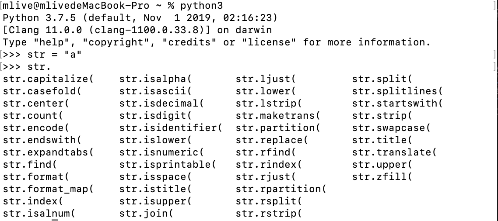

# Python 基础

## 基础介绍

>查看当前类的所有方法

MAC电脑在命令行输入 `Python3` 进入`Python`环境，输入`str = "a"`回车，输入`str.` ,连续按两次`Tab`键，显示可用方法



>查看变量类型 `type(变量的名字)`

> 注释

如果在项目中有使用到中文，头部添加注释 `# -*- coding:utf-8 -*-`
指定shell环境执行python脚本，头部添加注释 `#!/usr/bin/python3`

> 安装第三方包

```
pip install pygame
pip3 install pygame
```

> 查看Python中的关键字：

```python
python3  // 命令行输入Python3 进入python环境 
import keyword
keyword.kwlist
```

> 字符串的 `输入` 、 `输出` 、 `打印`

* 输入 `password = input("请输入密码:")`
* 输出格式：`print("我的姓名是%s,年龄是%d"%(name,age))`

| 格式符号 | 转换 |
| -- | -- |
| %c | 字符 |
| %s | 通过str() 字符串转换来格式化 |
| %i | 有符号十进制整数 |
| %d | 有符号十进制整数 |
| %u | 无符号十进制整数 |
| %o | 八进制整数 |
| %x | 十六进制整数（小写字母） |
| %X | 十六进制整数（大写字母） |
| %e | 索引符号（小写'e'）|
| %E | 索引符号（大写“E”）|
| %f | 浮点实数 |
| %g | ％f和％e 的简写 |
| %G | ％f和％E的简写 |

## 数据类型转换
| 函数 | 说明 |
| -- | -- |
| int(x [,base ]) | 将x转换为一个整数 |
| long(x [,base ]) | 将x转换为一个长整数 |
| float(x ) | 将x转换到一个浮点数 |
| complex(real [,imag ]) | 创建一个复数 |
| str(x ) | 将对象 x 转换为字符串 |
| repr(x ) | 将对象 x 转换为表达式字符串 |
| eval(str ) | 用来计算在字符串中的有效Python表达式,并返回一个对象 |
| tuple(s ) | 将序列 s 转换为一个元组 |
| list(s ) | 将序列 s 转换为一个列表 |
| chr(x ) | 将一个整数转换为一个字符 |
| unichr(x ) | 将一个整数转换为Unicode字符 |
| ord(x ) | 将一个字符转换为它的整数值 |
| hex(x ) | 将一个整数转换为一个十六进制字符串 |
| oct(x ) | 将一个整数转换为一个八进制字符串 |

##  逻辑运算符
| 运算符 | 逻辑表达式 | 描述 | 实例 |
| -- | -- | -- | -- |
| and | x and y | 布尔"与" - 如果 x 为 False，x and y 返回 False，否则它返回 y 的计算值。 | (a and b) 返回 20。 |
| or | x or y | 布尔"或" - 如果 x 是 True，它返回 True，否则它返回 y 的计算值。 | (a or b) 返回 10。 |
| not | not x | 布尔"非" - 如果 x 为 True，返回 False 。如果 x 为 False，它返回 True。 | not(a and b) 返回 False |

## 条件语句

###  判断语句 和 条件语句
* 代码的缩进为一个tab键，或者4个空格

```python
if 条件:
    ...


if 条件:
    ...
else 
    ...


if 条件1:
     ...
elif 条件2:
    ...
else:
    ...


while 条件:
    ...


for 临时变量 in 列表或者字符串等:
    循环满足条件时执行的代码
else:
    循环不满足条件时执行的代码

break : 跳出循环
continue : 跳过本次循环
```
### pass语句
pass 一般用于占位置。定义一个空函数程序会报错，当你没有想好函数的内容是可以用 pass 填充，使程序可以正常运行。
```python
def sample(n_samples):
    pass
```

### with ... as ... 用法
```python
file = open("/tmp/foo.txt")
try:
    data = file.read()
finally:
    file.close()

等价于

with open("/tmp/foo.txt") as file:
    data = file.read()
```