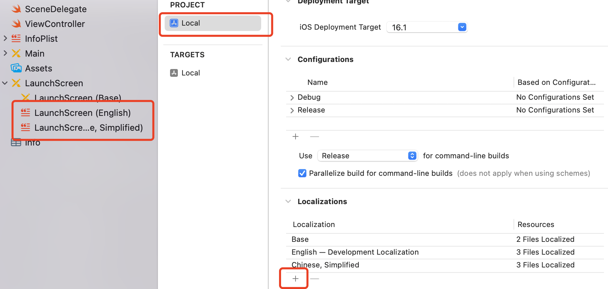
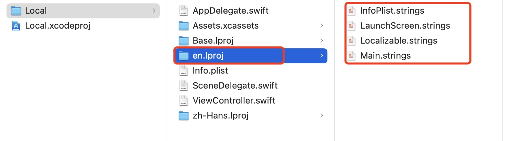
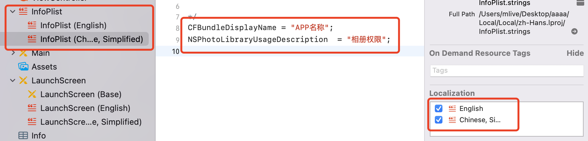
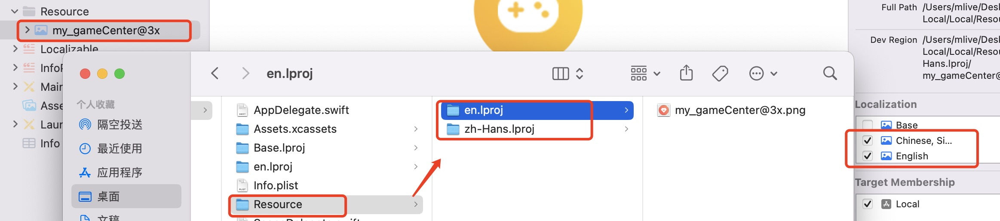

# 本地化
实现本地化需要考虑以下几个因素
```markdown
1. 文字本地化
2. APP名称，系统权限弹窗 本地化
3. APP图片本地化
4. APP内切换多语言功能
```
>在调试时为了更方便的切换语言，通过`Edit Scheme -> Options -> App Language`修改APP的语言。**注意，如果是有阿拉伯语，适配会更麻烦一些，因为阿拉伯习惯是从右到左**

## 1.文本本地化
选择 `Xcode -> PROJECT -> Localizations` 添加其他语言

添加之后，项目多出`zh-Hans.lproj`文件夹。紧接着再新建`Localizable.strings`文件,**文件名称一定需要是`Localizable`。**在`zh-Hans.lproj`文件夹内部可以看到多语言文件`LaunchScreen.strings`和`Localizable.strings`,使用`Key = Value;`的方式进行语言本地化。

相关代码
```swift
/*
    key: 文件中的key
    tableName: 多语言文件名称,默认取的是`Localizable.strings`中的值
    Bundle: `zh-Hans.lproj`文件路径
    comment: 对 Key的注释
*/
public func NSLocalizedString(_ key: String, tableName: String? = nil, bundle: Bundle = Bundle.main, value: String = "", comment: String) -> String
```
系统默认使用的多语言文件是`Localizable.strings`,如果你想使用其他文件,使用 tableName 进行指定
```swift
label.text = NSLocalizedString("text", tableName: "LaunchScreen", comment: "")
```

## 2.APP名称本地化
App名称和系统弹窗实现多语言需要创建`InfoPlist.strings`文件，**名字必须是`InfoPlist`。**多语言的 Key 使用 `info.plist` 文件中的 Key 就可以了。

```s
    CFBundleDisplayName = "APP名称";
    NSPhotoLibraryUsageDescription  = "相册权限";
```

## 3.图片本地化
**第一种:** 选中图片 -> 选择详情 -> 打开Localization。项目中适配了中文和英文,`Universal`是默认图片


**第二种:** 如果APP内可以切换语言,这种适配方式就不是很合适。我们可以采取多语言的方式,图片使用多个，取不同的名称。通过修改图片名称达成图片适配
```swift
UIImage.init(named: NSLocalizedString("图片名称", comment: ""))
```

**第三种:** 还有一种通过 Resource 文件夹进行管理图片，创建图片 Resource 文件夹，将图片放在文件夹下，选择将当前图片进行多语言适配，会在文件夹下产生同样的`zh-Hans.lproj`文件夹

在加载图片时，需要指定对应的资源文件
```swift
guard let path = Bundle.main.path(forResource: "en", ofType: "lproj"),
        let bundle = Bundle(path: path)
else { return }
imgView.image = UIImage.init(named: "my_gameCenter", in: bundle, with: nil)
```

## 4.设置默认语言
Xcode创建项目时默认语言是英文，在项目跟路径找到`xxx.xcodeproj` -> 右击显示包内容 ->  打开`project.pbxproj`文件 -> 修改`developmentRegion`的值，修改后项目会使用修改后的语言做默认语言。
```xml
developmentRegion = zh-Hans;
hasScannedForEncodings = 0;
knownRegions = (
    en,
    Base,
    "zh-Hans",
);
```

## 5.APP内切换语言  
获取手机可用语言
```swift
Locale.preferredLanguages.first  // 系统语言
Locale.preferredLanguages  // 系统切换过的所有语言
Bundle.main.preferredLocalizations.first // 系统语言
```
项目每添加一种语言，Xcode会在根目录下创建对应的资源文件夹,对应的资源在文件夹内。比如`zh-Hans.lproj`文件夹。

APP 内切换语言其实就是切换多语言资源文件，直接修改`NSLocalizedString(_ key:, tableName:, bundle:, value:, comment:)`方法中的 bundle 资源文件即可
```swift
    guard let path = Bundle.main.path(forResource: "en", ofType: "lproj"),
        let bundle = Bundle(path: path) else { return }
    label.text = NSLocalizedString("text",bundle: bundle, comment: "")
```


## 参考文档
* [Info.plist文件国际化](https://www.jianshu.com/p/d9f7c7dd01d3)
* [如何在你的 App 中支持 App 独立语言设置](https://developer.apple.com/cn/news/?id=u2cfuj88)
* [iOS语言本地化/国际化宝典](https://blog.51cto.com/u_15755990/5591956)
* [iOS 国际化 和 多语言](https://pengyj.github.io/ios/2019/08/01/i18N.html)