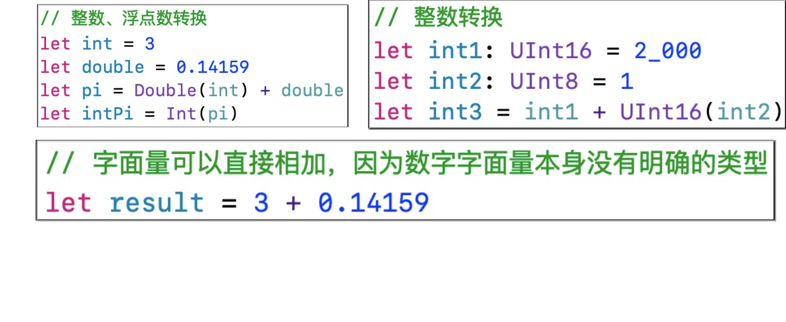
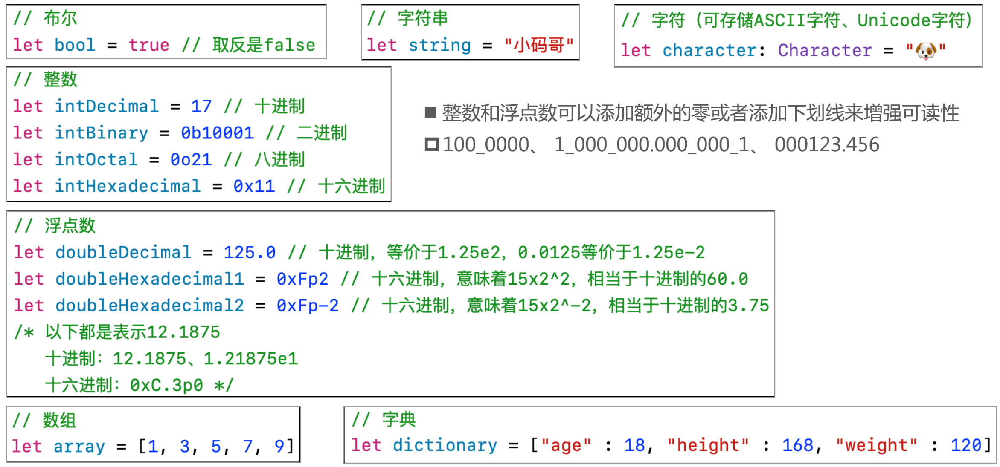
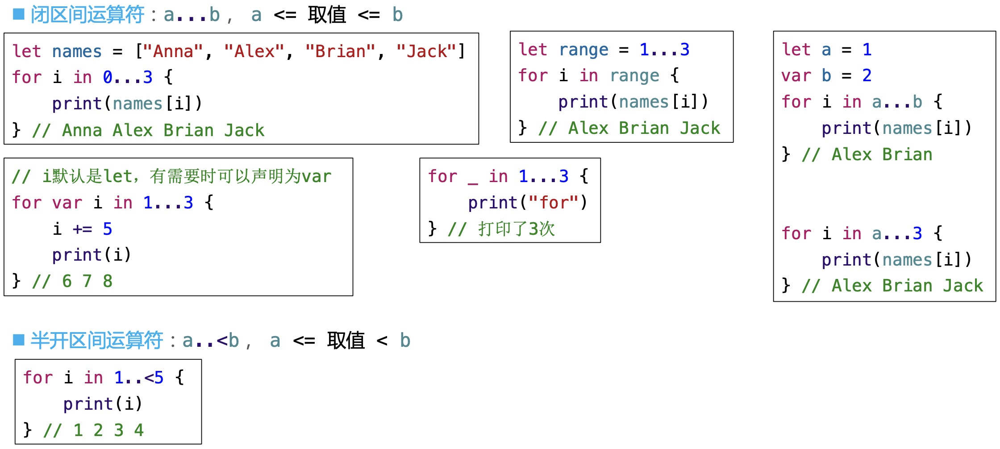
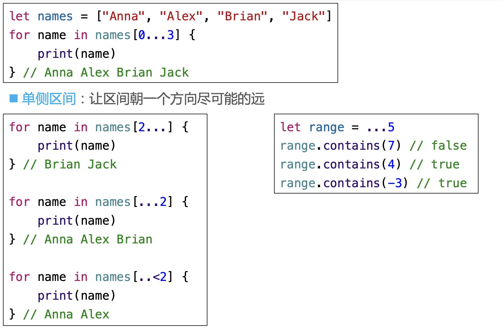
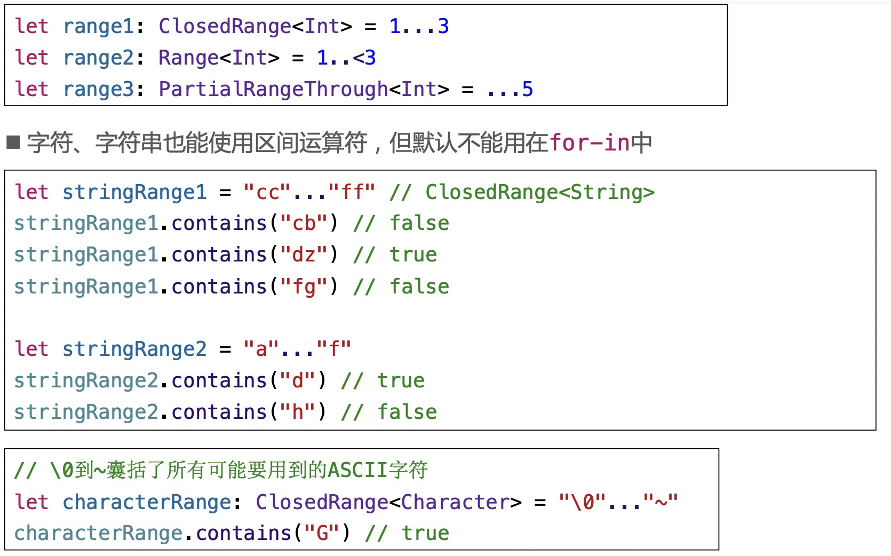

# 基础语法

```markdown
* `API（Application Programming Interface）：`应用程序编程接口。源代码和库之间的接口
* `ABI（Application Binary Interface）：`应用程序二进制接口。应用程序与操作系统之间的底层接口,涉及的内容有：目标文件格式、数据类型的大小\布局\对齐、函数调用约定等等
```
## swift编译流程
编译分为前端、中间代码、后端,我们之前使用c/oc编写代码是使用`Clang编译器`编译成前端代码，Swift则是使用`swiftc编译器`进行编译。如下图:

Swift代码编译时首先生成AST语法树，然后生成Swift特有的中间代码，然后对中间代码优化生成简洁的Swift中间代码，之后生成LLVM IR中间代码，然后是汇编代码，最后是可执行文件。过程如下图:

Swift使用`swiftc编译器`进行编译，它的位置存放在Xcode内部 `Contents/Developer/Toolchains/XcodeDefault.xctoolchain/usr/bin`文件中，对应的指令有:
```markdown
* 生成语法树: `swiftc -dump-ast main.swift` 
* 生成最简洁的SIL代码: `swiftc -emit-sil main.swift` 
* 生成LLVM IR代码: `swiftc -emit-ir main.swift -o main.ll` 
* 生成汇编代码: `swiftc -emit-assembly main.swift -o main.s`
* 生成可执行文件:  `swiftc -emit-executable /xxx/*.swift -o  ~/Desktop/main`
```

我们可以通过`swiftc -h`查看帮助，常用的指令有以下这些：
```markdown
  -dump-ast             语法和类型检查，打印AST语法树
  -dump-parse           语法检查，打印AST语法树
  -dump-pcm             转储有关预编译Clang模块的调试信息
  -dump-scope-maps <expanded-or-list-of-line:column>
                         Parse and type-check input file(s) and dump the scope map(s)
  -dump-type-info        Output YAML dump of fixed-size types from all imported modules
  -dump-type-refinement-contexts
                         Type-check input file(s) and dump type refinement contexts(s)
  -emit-assembly         Emit assembly file(s) (-S)
  -emit-bc               输出一个LLVM的BC文件
  -emit-executable       输出一个可执行文件
  -emit-imported-modules 展示导入的模块列表
  -emit-ir               展示IR中间代码
  -emit-library          输出一个dylib动态库
  -emit-object           输出一个.o机器文件
  -emit-pcm              Emit a precompiled Clang module from a module map
  -emit-sibgen           输出一个.sib的原始SIL文件
  -emit-sib              输出一个.sib的标准SIL文件
  -emit-silgen           展示原始SIL文件
  -emit-sil              展示标准的SIL文件
  -index-file            为源文件生成索引数据
  -parse                 解析文件
  -print-ast             解析文件并打印（漂亮/简洁的）语法树
  -resolve-imports       解析import导入的文件
  -typecheck             检查文件类型
```

## 关于Playground
Playground可以快速预览代码效果，在学习Swift语法时可是用它快速预览。在Xcode13中需要选择`File -> New ->Playground Page`创建一个新的Playground。如果是M1芯片需要Xcode不以`Rosetta`方式打开,关闭`Rosetta`的方式`打开访达->应用->Xcode->右键点击Xcode->显示简介->将勾选使用Rosetta打开去掉`。快捷键有:
```markdown
* `Command + Shift + Enter`：运行整个Playground
* `Shift + Enter`：运行截止到某一行代码
```

Playground下的`Soureces`文件放代码文件,`Resoureces`放资源文件。如果想直接看到界面效果，可以直接导入`import PlaygroundSupport`.比如下面的代码:
```swift
import UIKit
import PlaygroundSupport

let vc = UITableViewController()
vc.view.backgroundColor = .red
PlaygroundPage.current.liveView = vc
```

## 数据类型
Swift不用我们编写main函数，默认全局范围内的首句可执行代码作为程序入口。一句代码尾部可以省略分号`（;）`，如果是多句代码写到同一行时必须用分号`（;）`隔开。

Swift 用`var`定义变量，`let`定义常量，编译器能自动推断出变量\常量的类型。常量只能赋值1次，**但是它的值不要求在编译时期确定，但使用之前必须赋值1次。**比如下面的代码：
```swift
func getAge() -> Int{
    return 10;
}
let age = getAge()
```

Swift分为值类型和引用类型.值类型中又分为枚举和结构体。如下图:

```markdown
* 整数类型有：Int8、Int16、Int32、Int64、UInt8、UInt16、UInt32、UInt64
* 在32bit平台，Int等价于Int32，在64bit平台，Int等价于Int64
* 整数的最大值和最小值: `UInt8.max`/`UInt16.min`，一般情况下直接使用Int即可
* Double和Float转Int类型时，会有精度丢失的问题，四舍五入可以使用函数`lroundf(23.50)`进行转换
```
浮点类型`Float`32位，精度只有6位。Doouble是64位，精度至少15位。如果是两个整数运行时想要获取到小数，首先需要将两个整数转变为Float类型。类型转换如下图:



布尔、字符串、数组、字典的一些写法如下，字符类型必须要在后面标上类型:`Character`。


```swift
let num1 = 12345
let str = String(format: "%.2f", Float(num1)/1000) // Swift保留2位小数
```

关于元组的一些写法:
```swift
// 元组初始化,获取value时使用 HTTP404Error.0 / HTTP404Error.1
let HTTP404Error = (404,"Not Found")
// 使用元组接收时可以给名词,获取value时使用 code / msg,如果不想接收可以直接使用(code,_) =  HTTP404Error
let (code,msg) = HTTP404Error
// 初始化时给值一个名称,获取value时使用 HTTP200Status.code
let HTTP200Status = (code:200,msg:"success")
```

## 运算符
```
算术运算符: +  -  *  /  %
比较运算符: ==  !=  >  <   >=  =>
逻辑运算符: && ||  !
位运算符: &,|,^分别为取反，按位与与，按位与或，按位与异或运算
```

## 流程控制
流程控制有`if-else`、`while`、`for`循环、`switch`。

`if-else`和`while`没什么好说的, if后面的条件可以省略小括号,**需要注意`if后面的条件只能是Bool类型`**比如`if age {}`这样是错误的。

`repeat-while`相当于C语言中的`do-while`,需要注意:从Swift3开始，去除了自增（++）、自减（--）运算符。

-----

`for`循环可以使用`闭区间运算符`、`半开区间运算符`。它们分别代表不同的含义。如下图：

```markdown
* 闭区间运算符：`a...b`,作用是`a <= 取值 <= b`
* 半开区间运算符：`a..<b`,注意是2个点,一个小于号。作用是`a <= 取值 < b`,不包含B
* 单侧区间：让区间朝一个方向尽可能的远,比如`names[2...]`，只要数组内大于等于2的值都会被取出来
```
区间运算符也可以使用在数组的取值中，使用for循环的方式对数组进行取值。如下图：

如果需要使用带有所有的for循环，使用一下代码：
```swift
let  ans = [1,2,3,4,5]
for (index, item) in ans.enumerated() {
    print("在 index = \(index) 位置上的值为 \(item)")
}
```

-----

`switch`的`case、default`后面不能写大括号`{}`,默认可以不写`break`，并不会贯穿到后面的条件。如果我们想使用oc中的贯穿效果，可以使用`fallthrough`达到贯穿效果。如下面的代码:
```swift
// 除了 fallthrough,也可以使用 switch 10,20:
let number = 10
switch number {
case 10:
    print("number is 10")
    fallthrough
case 20:
    print("number is 20")
case 30:
    print("number is 30")
default:
    break
}
```
>switch需要注意的是必须要保证能处理所有情况。`case、default`后面至少要有一条语句,如果不想做任何事，加个`break`即可。如果能保证已处理所有情况，也可以不必使用`default`

----

switch也支持`Character`、`String`类型,也可以使用符复合条件的方式将两个条件放在一起，满足其中一个就会运行。比如下面的代码:
```swift
let string = "jack"
switch string {
case "jack":
    fallthrough
case "rose":
    print("Right person")
default:
    break
}

// 复合条件的方式
let character: Character = "b"
switch character{
case "a","A":
    print("the letter A")
default:
    print("Not the letter A")
}
```
也可以使用`switch`进行区间匹配和元祖匹配，比如比较某个点是否在某个区间。如果我们用不到某个值可以使用`下划线 _ `进行忽略。关于case匹配问题，属于`模式匹配（Pattern Matching）`,如下图：


----

switch值绑定的方式,如果需要用到某个值时可以使用这个方式，必要时let也可以改为var。如下面的代码：
```swift
let point = (2, 0)
switch point {
    case (let x, 0):
        print("on the x-axis with an x value of \(x)")
    case (0, let y):
        print("on the y-axis with a y value of \(y)")
    case let (x, y):
        print("somewhere else at (\(x), \(y))")
} // on the x-axis with an x value of 2
```

## where 添加过滤条件
使用switch时也可以加上`where`过滤条件，满足条件才允许进入大括号。比如下面的代码：
```swift
let point = (1, -1)
switch point {
    case let (x, y) where x == y:
        print("on the line x == y")
    case let (x, y) where x == -y:
        print("on the line x == -y")
    case let (x, y):
        print("(\(x), \(y)) is just some arbitrary point")
} // on the line x == -y
```
for 循环也可以使用where进行条件过滤，比如下面的代码，只有大于0的值才会被添加进去
```swift
// 将所有正数加起来
var numbers = [10, 20, -10, -20, 30, -30]
var sum = 0
for num in numbers where num > 0 { // 使用where来过滤num
    sum += num
}
print(sum) // 60
```

## 标签语句 outer:
如果有两个循环嵌套，里面的循环想控制外面的循环时，可以使用标签语句。
```swift
outer: for i in 1...4 {
    for k in 1...4 {
        if k == 3 {
            continue outer
        }
        if i == 3 {
            break outer
        }
        print("i == \(i), k == \(k)")
    }
}
```

## 区间运算符的类型
区间运算符也是分类型的，不同的区间是不同的类型。字符和字符串也可以使用区间运算符，但是默认不能在for-in中。如下图:

可以使用带间隔的区间值：
```swift
let hours = 11
let hourInterval = 2
// tickMark的取值：从4开始，累加2，不超过11
for tickMark in stride(from: 4, through: hours, by: hourInterval) {
print(tickMark)
} // 4 6 8 10
```

## 推荐网址
* [swift编译成可执行文件过程](https://www.jianshu.com/p/730389bb587d)
* [Swift运算符](https://www.runoob.com/swift/swift-operators.html)