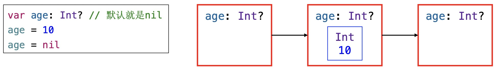
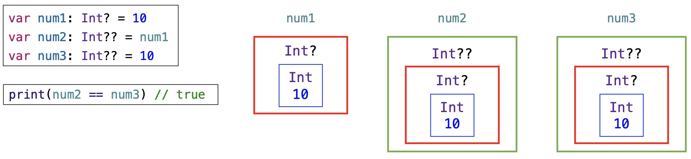
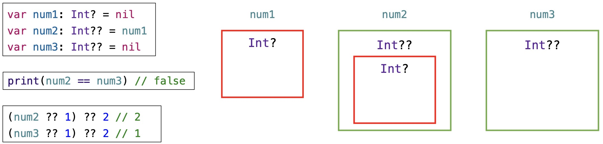

# 可选项 （Optional）
可选项（Optional）,一般也叫可选类型，它允许将值设置为nil。在类型名称后面加个问号` ? `来定义一个可选项。比如以下代码:
```swift
var name: String? = "Jack"
var age: Int? // 默认就是nil

var array = [1, 15, 40, 29]
func get(_ index: Int) -> Int? {
    if index < 0 || index >= array.count {
        return nil
    }
    return array[index]
}
print(get(1)) // Optional(15)
print(get(-1)) // nil
print(get(4)) // nil
```

## 强制解包（Forced Unwrapping）
可选项是对其他类型的一层包装，可以将它理解为一个盒子,如果为`nil`，那么它是个空盒子。如果不为nil，那么盒子里装的是被包装类型的数据。如下图:

如果要从可选项中取出被包装的数据（将盒子里装的东西取出来），需要使用感叹号` ! `进行强制解包。比如下面的代码:
```swift
var age: Int? = 10
let ageInt: Int = age!
```
>如果对值为`nil`的可选项（空盒子）进行强制解包，将会产生运行时错误`Fatal error: Unexpectedly found nil while unwrapping an Optional value`

判断可选类型是否有值时，需要判断是否 `!= nil`，如下：
```swift
let number = Int("123")
if number != nil {
    print("字符串转换整数成功：\(number!)")
} else {
    print("字符串转换整数失败")
}
// 字符串转换整数成功：123
```

## 可选项绑定（Optional Binding）
除了判断是否为nil，也可以使用可选项绑定来判断可选项是否包含值。如果包含就自动解包,把值赋给一个临时的常量`(let)`或者变量`(var)`，并返回`true`，否则返回`false`。在代码中常用这种写法。
```swift
if let number = Int("123") {
    print("字符串转换整数成功：\(number)")
    // number是强制解包之后的Int值
    // number作用域仅限于这个大括号
} else {
    print("字符串转换整数失败")
}
```
有时候我们需要判断多个可选项绑定,可以将多个可选项条件用`,`号分开。比如:
```swift
if let first = Int("4"),
    let second = Int("42"),
        first < second && second < 100 {
            print("\(second) < \(second) < 100")
}
// 4 < 42 < 100
```
在`while`循环中使用可选项绑定时也可以通过`,`号对条件进行分割
```swift
// 遍历数组，将遇到的正数都加起来，如果遇到负数或者非数字，停止遍历
var strs = ["10", "20", "abc","-20", "30"]
var index = 0
var sum = 0
while let num = Int(strs[index]), num > 0 {
    sum += num
    index += 1
}
print(sum
```

## 空合并运算符 ??（Nil-Coalescing Operator）
空合并运算符 `??`,当一个可选类型为 nil 时,会使用`??`后面的值。
```swift
public func ?? <T>(optional: T?, defaultValue: @autoclosure () throws -> T?) rethrows -> T?
public func ?? <T>(optional: T?, defaultValue: @autoclosure () throws -> T) rethrows -> T
```
空合并运算符有以下几种情况，两个都是可选项，两个中只有一个可选项，如下面的代码:
```swift
let a: Int? = 1
let b: Int? = 2
let c = a ?? b // c是Int? , Optional(1) 

let a: Int? = 1
let b: Int = 2
let c = a ?? b // c是Int , 1

let a: Int? = nil
let b: Int? = 2
let c = a ?? b // c是Int? , Optional(2)

let a: Int? = nil
let b: Int = 2
let c = a ?? b // c是Int , 2

let a: Int? = nil
let b: Int? = nil
let c = a ?? b // c是Int? , nil
```
如果不使用??运算符,可以使用`可选项绑定（Optional Binding）`的方式
```swift
let a: Int? = nil
let b: Int = 2
let c: Int  // 如果不使用??运算符
if let tmp = a {
    c = tmp
} else {
    c = b
}
```
如果是多个 ?? 一起用，根据以下的代码：
```swift
let a: Int? = 1
let b: Int? = 2
let c = a ?? b ?? 3 // c是Int , 1

let a: Int? = nil
let b: Int? = 2
let c = a ?? b ?? 3 // c是Int , 2

let a: Int? = nil
let b: Int? = nil
let c = a ?? b ?? 3 // c是Int , 3
```
也可以` ?? `跟` if let `配合使用,比如下面的代码：
```swift
let a: Int? = nil
let b: Int? = 2
if let c = a ?? b {
    print(c)
}// 类似于if a != nil || b != nil

if let c = a, let d = b {
    print(c)
    print(d)
}// 类似于if a != nil && b != nil
```

## guard语句
guard语句的基本格式如下：
```swift
guard 条件 else { // 条件不成立时执行大括号内的代码
    // do something....
    退出当前作用域
    // return、break、continue、throw error
}
```
>当`guard`语句的条件为`false`时，就会执行大括号里面的代码。当·语句的条件为`true`时，就会跳过`guard`语句。guard语句特别适合用来“提前退出”。

当使用`guard语句`进行可选项绑定时，绑定的`常量(let)`、`变量(var)`也能在外层作用域中使用。比如下面的代码：
```swift
func login(_ info: [String : String]) {
    guard let username = info["username"] else {
        print("请输入用户名")
        return
    }
    guard let password = info["password"] else {
        print("请输入密码")
        return
    }
    // if username ....
    // if password ....
    print("用户名：\(username)", "密码：\(password)", "登陆ing")
}
```

## 隐式解包（Implicitly Unwrapped Optional）
在某些情况下，可选项一旦被设定值之后，就会一直拥有值。在这种情况下，可以去掉检查，也不必每次访问的时候都进行解包，因为它能确定每次访问的时候都有值。可以在类型后面加个感叹号` ! `定义一个隐式解包的可选项,比如下面的代码：
```swift
let num1: Int! = 10
let num2: Int = num1
if num1 != nil {
    print(num1 + 6) // 16
}
if let num3 = num1 {
    print(num3)
}
```
可选项在字符串插值或者直接打印时，编译器会发出警告，可以通过`强制解包`、`空合并运算符`的方式进行解包，代码如下：
```swift
var age: Int? = 10
print("My age is \(age!)") // My age is 10
print("My age is \(String(describing: age))") // My age is Optional(10)
print("My age is \(age ?? 0)")// My age is 10
```

## 多重可选项
可选项为`单个问号`？，多重可选项为`多个问号??`,如下图：

>可以使用lldb指令 `frame variable –R` 或者` fr v –R xxx`查看区别

多重可选项如果是nil的情况如下图:


## 推荐网址
* [使用 guard 的正确姿势](https://swift.gg/2016/02/14/swift-guard-radix/)