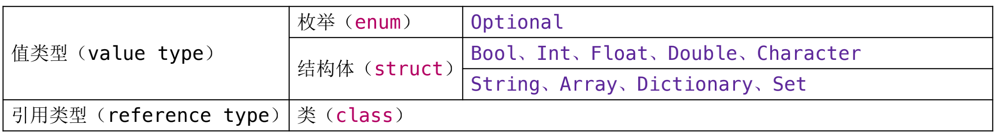
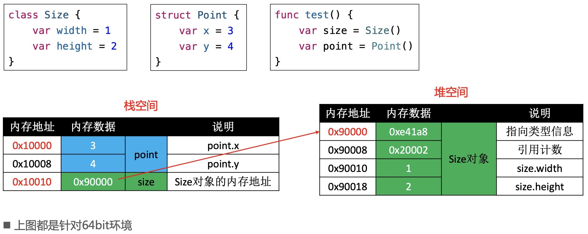
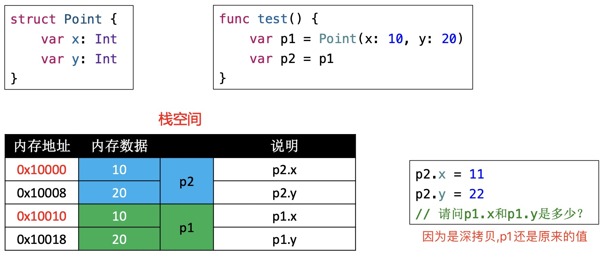
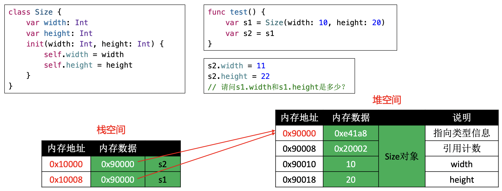

# 结构体
Swift分为值类型和引用类型.值类型中又分为枚举和结构体。如下图:

在 Swift 标准库中，绝大多数的公开类型都是结构体，而枚举和类只占很小一部分。比如`Bool、Int、Double、 String、Array、Dictionary`等常见类型都是结构体。另外**在枚举、结构体、类中都可以定义方法.**

## 结构体的初始化
所有的结构体都有一个编译器自动生成的初始化器`（initializer，初始化方法、构造器、构造方法）`。在下面的代码中,给date赋值时调用的初始化方法，就是编译器为我们生成的初始化方法。
```swift
struct Date {
    var year: Int
    var month: Int
    var day: Int
}
// 在Date结构体初始化时，所有的成员都需要有初始值
var date = Date(year: 2019, month: 6, day: 23) 
```
>编译器会根据情况，可能会为结构体生成多个初始化器，宗旨是：**保证所有成员都有初始值**

在下面的代码中，如果结构体内的成员变量有初始值,结构体会有多个初始化器，宗旨只有一个:**保证所有成员都有初始值**
```swift
struct Point{
    var x: Int = 0
    var y: Int = 0
}
var p1 = Point(x: 10,y: 20)
var p1 = Point(x: 10)
var p1 = Point(y: 20)
var p1 = Point()
```
>一旦我们自己定义结构体时自定义了初始化器，编译器就不会自动生成其他初始化器。比如下面的代码：
```swift
struct Point{
    var x: Int = 0
    var y: Int = 0
    init(x: Int,y: Int){
        self.x = x
        self.y = y
    }
}
```

## 结构体的内存结构
获取结构体的大小可以使用`MemoryLayout`类
```swift
struct Point{
    var x: Int = 0
    var y: Int = 0
    var origin: Bool = false
}
var p = Point()
print(MemoryLayout<Point>.size)  //17, 实际用到的空间大小
print(MemoryLayout<Point>.stride) // 24, 分配占用的空间大小
print(MemoryLayout<Point>.alignment) // 8, 内存对齐
print(Mems.memStr(ofVal:&p) //使用明杰老师的工具查看成员的值
```

## 类
类的定义和结构体类似，但**编译器并不会为类自动生成可以传入成员值的初始化器。并且类属于引用类型**。

如果类的所有成员都在定义的时候指定了初始值，编译器会为类生成无参的初始化器。成员的初始化是在这个初始化器中完成的。比如下面的代码：
```swift
class Point{
    var x = 10
    var y = 10
}
```
在上面的代码中，成员变量都有初始值，编译器会给类生成无参的初始化器。上面的代码跟下面这段代码是等价的:
```swift
class Point{
    var x: Int
    var y: Int
    init() {
        x = 10
        y = 10
    }
}
```

## 结构体与类的本质区别
结构体是值类型`（枚举也是值类型）`，类是引用类型`（指针类型）`。值类型的数据是在栈空间,引用类型的数据是在堆空间。如下图:

图中的Size类共占用32个字节,其中前8个字节指向类型信息,8~16的字节指向引用计数，另外16个字节是成员变量。

通过下面的代码进行分析：
```swift
func testClassAndStruct(){
    struct Point{
        var x: Int = 10
        var y: Int = 20
    }
    class Size{
        var width = 11
        var height = 21
    }
    var size = Size()
    print("size变量的地址" , Mems.ptr(ofVal: &size))
    print("size变量的内存" , Mems.memStr(ofVal: &size))
    print("size所指向内存的地址" , Mems.ptr(ofRef: size))
    print("size所指向内存的内容" , Mems.memStr(ofRef: size))
    print("----")
    var point = Point()
    print("point变量的地址" , Mems.ptr(ofVal: &point))
    print("point变量的内存" ,Mems.memStr(ofVal: &point))
}

testClassAndStruct()
// 打印结果为：
size变量的地址 0x000000016fdff3c8
size变量的内存 0x0000000100732d10
size所指向内存的地址 0x00000001006047b0
size所指向内存的内容 0x000000010000c2b8 0x0000000200000003 0x000000000000000b 0x0000000000000015
----
point变量的地址 0x000000016fdff3b8
point变量的内存 0x000000000000000a 0x0000000000000014
```
> 为什么size的内存地址比point要大,这是由于size和point是在栈空间。栈地址的内存分配方式(从高地址到低地址),即先分配的变量存在高地址，后分配的存在低地址。

通过汇编分析结构体和类的区别,在创建结构体变量时，并没有发现allocinit相关的汇编指令。在Swift中，创建类的实例对象，要向堆空间申请内存，大概流程如下：
```markdown
1. Class.__allocating_init()
2. libswiftCore.dylib：_swift_allocObject_
3. libswiftCore.dylib：swift_slowAlloc
4. libsystem_malloc.dylib：malloc
```
在Mac、iOS中的`malloc函数`分配的内存大小总是16的倍数,我们通过`class_getInstanceSize`可以得知：类的对象至少需要占用多少内存。
```swift
class Size{
    var width = 10
    var height = 20
    var isFalse = false
}
var s = Size()
class_getInstanceSize(type(of: s)) // 40
class_getInstanceSize(Size.self) /
```

## 值类型和引用类型的区别
值类型赋值给`var`、`let`或者给函数传参，是直接将所有内容拷贝一份,类似于对文件进行copy、paste操作，产生了全新的文件副本。属于深拷贝`（deep copy）`。如下图:

在Swift标准库中，为了提升性能，String、Array、Dictionary、Set采取了`Copy On Write`的技术
。比如仅当有“写”操作时，才会真正执行拷贝操作。对于标准库值类型的赋值操作，Swift 能确保最佳性能，所有没必要为了保证最佳性能来避免赋值。建议：**不需要修改的，尽量定义成let**
--------

引用类型赋值给`var`、`let`或者给函数传参，是将内存地址拷贝一份,类似于制作一个文件的替身（快捷方式、链接），指向的是同一个文件。属于浅拷贝`（shallow copy）`.如下图:



## 嵌套类型
```swift
struct Poker {
    enum Suit : Character {
        case spades = "♠", hearts = "♥", diamonds = "♦", clubs = "♣"
    }
    enum Rank : Int {
        case two = 2, three, four, five, six, seven, eight, nine, ten
        case jack, queen, king, ace
    }
}

var suit = Poker.Suit.spades
suit = .diamonds

var rank = Poker.Rank.five
rank = .king
```
