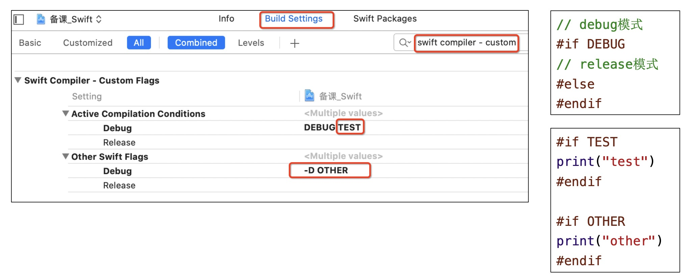

# OC到Swift
这里主要说明从OC转到Swift语言，需要注意的一些地方，比如Swift中的注释:
```swift
// MARK: 类似于OC中的 #pragma mark
// MARK: - 类似于OC中的 #pragma mark -
// TODO: 用于标记未完成的任务
// FIXME: 用于标记待修复的问题
```
## 条件编译
在oc中有宏定义,可以根据DEBUG模式进行，在swift中，固定的宏定义只有以下几个：
```swift
// 操作系统：macOS\iOS\tvOS\watchOS\Linux\Android\Windows\FreeBSD
#if os(macOS) || os(iOS)
// CPU架构：i386\x86_64\arm\arm64
#elseif arch(x86_64) || arch(arm64)
// swift版本
#elseif swift(<5) && swift(>=3)
// 模拟器
#elseif targetEnvironment(simulator)
// 可以导入某模块
#elseif canImport(Foundation)
#else
#endif
```

添加自定义的条件编译宏，选择`TARGETS -> Build Settings ->swift compiler - Custom Flags`。
* `Active Compilation Conditions` 中间加空格
* `Other Swift Flags` 使用`-D 空格 宏`


## 打印
DEBUG模式时打印具体信息，RELEASE模式时不打印。
* `#file` 当前文件
* `#line` 当前行
* `#function` 当前方法名
```swift
func log<T>(_ msg: T,file: NSString = #file,line: Int = #line,fn: String = #function) {
    #if DEBUG
        let prefix = "\(file.lastPathComponent)_\(line)_\(fn):"
        print(prefix, msg)
    #endif
}
```

## 系统版本检测
```swift
if #available(iOS 10, macOS 10.12, *) {
// 对于iOS平台，只在iOS10及以上版本执行
// 对于macOS平台，只在macOS 10.12及以上版本执行
// 最后的*表示在其他所有平台都执行
}
```

## API可用性说明
API可用性说明，写框架时用得到，比如说当前方法在哪个版本以后不能使用，当前方法替换成了什么方法。更多的用法参考：[苹果官网](https://docs.swift.org/swift-book/ReferenceManual/Attributes.html)

```swift
@available(iOS 10, macOS 10.15, *)
class Person {}
struct Student {
    // 方法替换成了study
    @available(*, unavailable, renamed: "study")
    func study_() {}
    func study() {}

    // 在iOS11版本以后过期
    @available(iOS, deprecated: 11)
    @available(macOS, deprecated: 10.12)
    func run() {}
}
```

## iOS程序的入口
在`AppDelegate`上面默认有个`@main`标记，这表示编译器自动生成入口代码（main函数代码），自动设置`AppDelegate`为APP的代理。

也可以删掉`@main`，自定义入口代码：必须新建一个`main.swift`文件:
```swift
import UIKit

class TestAppdelegate: UIApplication{}

UIApplicationMain(CommandLine.argc, CommandLine.unsafeArgv, NSStringFromClass(TestAppdelegate.self), NSStringFromClass(AppDelegate.self))
```

## OC 和 Swift 互相调用
* Swift 访问 OC 
  * 需要添加`{targetName}-Bridging-Header.h`文件，在我们添加混编文件时系统默认会创提示建。
  * 如果没有提示需要手动创建，在`Build Settings → Swift Compiler - General → Objective-C Bridging Header`中设置对应的路径,**需要在Swift中访问的OC类，将.h添加到当前文件中**

* OC 访问 Swift 
  * 系统会自动生成`{targetName}-Swift.h`文件，在Objc类中导入该文件即可访问Swift中暴露的类和方法。
    * Swift暴露给OC的类最终继承自`NSObject`
    * 使用`@objc`修饰需要暴露给OC的成员
    * 使用`@objcMembers`修饰类,代表默认所有成员都会暴露给OC（包括扩展中定义的成员）,最终是否成功暴露，还需要考虑成员自身的访问级别
  * 在`Build Settings -> Objective-C Generated interface Header Name`中可以看到文件名。


## @_silgen_name 解决Swift和C语言方法冲突
如果C语言暴露给Swift的函数名跟Swift中的其他函数名冲突了,可以在Swift中使用 `@_silgen_name` 修改C函数名
```swift
// C语言
int sum(int a, int b) { return a + b;}

// Swift  将C语言的额sum()方法修改为 swift_sum()
@_silgen_name("sum") func swift_sum(_ v1: Int32, _ v2: Int32) -> Int32
print(swift_sum(10, 20)) // 30
print(sum(10, 20)) // 30
```
> 这个关键字的好处是知道一些系统没有暴露的方法之后，可以通过重命名后在swift中进行调用

## @objc
可以通过 `@objc` 重命名Swift暴露给OC的符号名（类名、属性名、函数名等）
```swift
@objc(MJCar)
@objcMembers class Car: NSObject {
    var price: Double
    @objc(name)
    var band: String
    init(price: Double, band: String) {
        self.price = price
        self.band = band
    }
    @objc(drive)
    func run() { print(price, band, "run") }
    static func run() { print("Car run") }
}
extension Car {
    @objc(exec:v2:)
    func test() { print(price, band, "test") }
}

MJCar *c = [[MJCar alloc] initWithPrice:10.5 band:@"BMW"];
c.name = @"Bently";
c.price = 108.5;
[c drive]; // 108.5 Bently run
[c exec:10 v2:20]; // 108.5 Bently test
[MJCar run]; // Car run
```

## 选择器（Selector）
Swift中依然可以使用选择器，使用`#selector(name)`定义一个选择器。必须是被`@objcMembers`或`@objc`修饰的方法才可以定义选择器
```swift
@objcMembers class Person: NSObject {
    func test1(v1: Int) { print("test1") }
    func test2(v1: Int, v2: Int) { print("test2(v1:v2:)") }
    func test2(_ v1: Double, _ v2: Double) { print("test2(_:_:)") }
    func run() {
        perform(#selector(test1))
        perform(#selector(test1(v1:)))
        perform(#selector(test2(v1:v2:)))
        perform(#selector(test2(_:_:)))
        perform(#selector(test2 as (Double, Double) -> Void))
    }
}
```

## 协议
* 只能被`class`继承的协议
```swift
protocol Runnable1: AnyObject {}
@objc protocol Runnable3 {} n 被 @objc 修饰的协议，还可以暴露给OC去遵守实现
```
* 可选协议
  * 一种是通过协议扩展实现某个协议方法，使当前协议方法可选
```swift
protocol Runnable{
    func run1() //可选协议
    func run2()
}
extension Runnable{
    func run1(){}
}
```
  * 另一种是通过`@objc optional`使协议可选
```swift
@objc protocol Runnable {
    func run1()
    @objc optional func run2() // 可选协议
    func run3()
}
```

## dynamic
被 `@objc dynamic` 修饰的内容会具有动态性，比如调用方法会走runtime那一套流程.
```swift
class Dog: NSObject {
    @objc dynamic func test1() {} // objc_msgSend
    func test2() {} //虚表
}
```

## 序列化和反序列化
如果要将一个对象持久化，需要把这个对象序列化。过去的做法是实现 `NSCoding` 协议，但实现 `NSCoding` 协议的代码写起来很繁琐，尤其是当属性非常多的时候。
Swift4 中引入了 `Codable` 协议，可以大大减轻了我们的工作量。我们只需要让需要序列化的对象符合 `Codable` 协议即可，不用再写任何其他的代码。
```swift
struct Mode: Codable {
    var name: String
}
struct Language: Codable {
    var name: String
    var version: Int
    var mode: Mode
}
```
#### `Encode` 操作 
可以直接把符合了 `Codable` 协议的对象 `encode` 成 `JSON` 或者 `PropertyList`。
```swift
let swift = Language(name: "Swift", version: 4,mode: Mode(name: "test"))
//encoded对象
guard let encodedData = try? JSONEncoder().encode(swift) else {return}
//从encoded对象获取String
let jsonString = String(data: encodedData, encoding: .utf8)
print(jsonString ?? "00")
```
#### Decode 操作
```swift
guard let decodedData = try? JSONDecoder().decode(Language.self, from: encodedData) else {return}
print(decodedData.name, decodedData.mode.name)
```

## 方法交换
```swift
extension UIViewController {
    public class func initializeMethod(){
        let originalSelector = #selector(UIViewController.viewDidAppear(_:))
        let swizzledSelector = #selector(UIViewController.myMethod(animated:))

        let originalMethod = class_getInstanceMethod(self, originalSelector)
        let swizzledMethod = class_getInstanceMethod(self, swizzledSelector)

        //在进行 Swizzling 的时候,需要用 class_addMethod 先进行判断一下原有类中是否有要替换方法的实现
        let didAddMethod: Bool = class_addMethod(self, originalSelector, method_getImplementation(swizzledMethod!), method_getTypeEncoding(swizzledMethod!))
        //如果 class_addMethod 返回 yes,说明当前类中没有要替换方法的实现,所以需要在父类中查找,这时候就用到 method_getImplemetation 去获取 class_getInstanceMethod 里面的方法实现,然后再进行 class_replaceMethod 来实现 Swizzing
        if didAddMethod {
            class_replaceMethod(self, swizzledSelector, method_getImplementation(originalMethod!), method_getTypeEncoding(originalMethod!))
        } else {
            method_exchangeImplementations(originalMethod!, swizzledMethod!)
        }
    }

    @objc func myMethod(animated: Bool) {
        self.myMethod(animated: animated)
        print("替换了")
        self.view.backgroundColor = UIColor.yellow
    }
}
```

## 获取属性列表
只有`@objc`的属性,才能被发现,因为`class_copyPropertyList`是oc的runtime方法。可以使用`@objcMembers`标记类，这样就不用每个属性都使用`@objc`进行标记了。
```swift
func getClassPropertieNames(_ clsType:AnyClass){
    var prosCount:UInt32 = 0
    //获取属性列表,注意只有@objc的属性,才能被发现,因为class_copyPropertyList是oc的runtime方法
    let pros:UnsafeMutablePointer<objc_property_t>! =  class_copyPropertyList(clsType.self, &prosCount)
    let count:Int = Int(prosCount);
    //遍历属性名字
    for i in 0..<count {
        let pro: objc_property_t = pros[i]
        let proName:String = String(cString: property_getName(pro))
        print("属性名:",proName)
    }
    free(pros)
}
```
> 模型里面的嵌套模型不能被遍历不出来

## UIViewController 自定义初始化器
```swift

class PwdController: UIViewController {
    convenience init(_ title: String){
        self.init(nibName: nil, bundle: nil)
        self.title = title
    }
    
    override init(nibName nibNameOrNil: String?, bundle nibBundleOrNil: Bundle?) {
        super.init(nibName: nibNameOrNil, bundle: nibBundleOrNil)
    }
    
    required init?(coder: NSCoder) {
        fatalError("init(coder:) has not been implemented")
    }
}
```

## KVC\KVO
Swift 支持 `KVC \ KVO` 的条件,属性所在的类、监听器最终继承自 `NSObject`,用 `@objc dynamic` 修饰对应的属性。
```swift
class Observer: NSObject {
    override func observeValue(forKeyPath keyPath: String?,of object: Any?,change: [NSKeyValueChangeKey : Any]?,context: UnsafeMutableRawPointer?) {
        print("observeValue", change?[.newKey] as Any)
    }
}
class Person: NSObject {
    @objc dynamic var age: Int = 0
    var observer: Observer = Observer()
    override init() {
        super.init()
        self.addObserver(observer,forKeyPath: "age",options: .new,context: nil)
    }
    deinit {
        self.removeObserver(observer,forKeyPath: "age")
    }
}
var p = Person()
p.age = 20 // observeValue Optional(20)
p.setValue(25, forKey: "age") // observeValue Optional(25)
```
* block方式的KVO
```swift
class Person: NSObject {
    @objc dynamic var age: Int = 0
    var observation: NSKeyValueObservation?
    override init() {
        super.init()
        observation = observe(\Person.age, options: .new) {(person, change) in
            print(change.newValue as Any)
        }
    }
}
var p = Person()
p.age = 20 // Optional(20)
p.setValue(25, forKey: "age") // Optional(25)
```
* 通过KVO获取WKWebView的高度
```swift
override func viewDidLoad() {
    super.viewDidLoad()
    webView.addObserver(self, forKeyPath: "scrollView.contentSize" , options: [.new, .old], context: nil)
}
override func observeValue(forKeyPath keyPath: String?, of object: Any?, change: [NSKeyValueChangeKey : Any]?, context: UnsafeMutableRawPointer?) {
    // 通过KVO监听
    let newValue = change?[NSKeyValueChangeKey.newKey] as? CGSize ?? .zero
    print(newValue)
}
// 这里注意📢：KVO的addObserver和removeObserver需要是成对的，如果重复remove则会导致NSRangeException类型的Crash，如果忘记remove则会在观察者释放后再次接收到KVO回调时Crash。
override func viewDidDisappear(_ animated: Bool) {
    super.viewDidDisappear(animated)
    if isViewLoaded {
        webView.removeObserver(self, forKeyPath: "scrollView.contentSize")
    }
}
```

在Swift4，官方推荐了另外Key-value Oberservation的实现方式。简单来说，就是创建一个变量observation、给obervation赋值。赋值实现了既添加观察者又实现响应通知的功能。最后在不需要观察时，直接把observation设置为nil即可。
```swift
var obervation: NSKeyValueObservation?

override func viewDidLoad() {
    super.viewDidLoad()
    obervation = observe(\.webView.estimatedProgress,options: [.new], changeHandler: { _, change in
        print(change.newValue)
    })
}
override func viewDidDisappear(_ animated: Bool) {
    super.viewDidDisappear(animated)
    obervation = nil
}
```
* `#keyPath()`
使用 `#keyPath()` 写法，可以避免我们因为拼写错误而引发问题,返回的是一个字符串。
```swift
webView.addObserver(self, forKeyPath: #keyPath(WKWebView.scrollView.contentSize), options: [.new, .old], context: nil)
// 移除监听
removeObserver(self, forKeyPath: #keyPath(WKWebView.scrollView.contentSize))
```
>这里的`keyPath`与上文中的`keyPath`接收的参数类型不同。这里是KeyPath类型，而上面addObserver方法中的keyPath是字符串。写法是`\.property`，这里的property是相对于receiver的，所以当receiver是controller时，keyPath就是`\.webView.estimatedProgress`；而当receiver是webView时，keyPath则是`\.estimatedProgress`


## 关联对象（Associated Object）
在Swift中，`class`依然可以使用关联对象,默认情况，`extension`不可以增加存储属性,借助关联对象，可以实现类似`extension`为`class`增加存储属性的效果。
```swift
class Person {}
extension Person {
    private static var AGE_KEY: Void?
    var age: Int {
        get {
            (objc_getAssociatedObject(self, &Self.AGE_KEY) as? Int) ?? 0
        }
        set {
            objc_setAssociatedObject(self,&Self.AGE_KEY,newValue,
            .OBJC_ASSOCIATION_ASSIGN)
        }
    }
}

var p = Person()
print(p.age) // 0
p.age = 10
print(p.age)
```

## 资源名管理
现在iOS中的字符串和图片名字都是在项目中用到就写的，如果是参考了Android的资源名管理方式,可以使用下面的方式:
```swift
// 原来的方法
let img = UIImage(named: "logo")
let btn = UIButton(type: .custom)
btn.setTitle("添加", for: .normal)
performSegue(withIdentifier: "login_main", sender: self)
// 封装后的方式
let img = UIImage(R.image.logo)
let btn = UIButton(type: .custom)
btn.setTitle(R.string.add, for: .normal)
performSegue(withIdentifier: R.segue.login_main, sender: self)
// 需要用到的扩展
enum R {
    enum string: String {
        case add = "添加"
    }
    enum image: String {
        case logo
    }
    enum segue: String {
        case login_main
    }
}
extension UIImage {
    convenience init?(_ name: R.image) {
        self.init(named: name.rawValue)
    }
}
extension UIViewController {
    func performSegue(withIdentifier identifier: R.segue, sender: Any?) {
        performSegue(withIdentifier: identifier.rawValue, sender: sender)
    }
}
extension UIButton {
    func setTitle(_ title: R.string, for state: UIControl.State) {
        setTitle(title.rawValue, for: state)
    }
}
```
资源名管理的其他思路
```swift
// 原来的方式
let img = UIImage(named: "logo")
let font = UIFont(name: "Arial", size: 14)
// 封装后的方式
let img = R.image.logo
let font = R.font.arial(14)
// 用到的扩展
enum R {
    enum image {
        static var logo = UIImage(named: "logo")
    }
    enum font {
        static func arial(_ size: CGFloat) -> UIFont? {
            UIFont(name: "Arial", size: size)
        }
    }
}
```
* [R.Swift](https://github.com/mac-cain13/R.swift)
* [SwiftGen](https://github.com/SwiftGen/SwiftGen)
* [Objective-C与Swift混编tips](https://www.jianshu.com/p/dcf69f53ced1)
* [理解KVO - 用Swift在WKWebView中添加进度条](https://www.jianshu.com/p/919fefa588c2)
* [Swift - Swift4新特性介绍1（Key Paths新语法、类与协议的组合类型）](https://www.hangge.com/blog/cache/detail_1823.html)
* [使用Mirror自动比较Swift Class, Struct的尝试](https://www.jianshu.com/p/157db4e8da5e)
