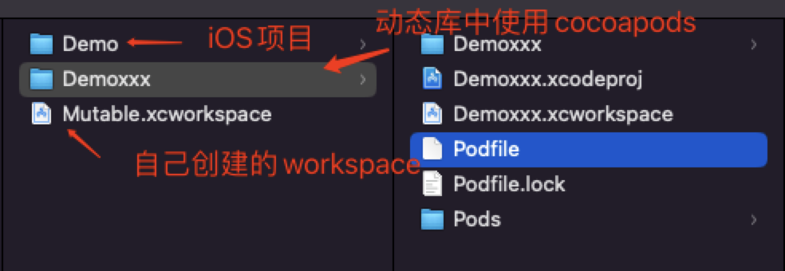

# CocoaPods
1. 安装CocoaPods,在终端输入 `sudo gem install cocoapods`,如果出现`ERROR:  While executing gem ... (Errno::EPERM)`错误,更换命令`sudo gem install -n /usr/local/bin cocoapods`

命令 | 含义
------- | -------
`pod search AFNetworking` | 在Cocoapods中搜索当前库信息
`pod install` | 安装
`pod --version` | pod版本


* 指定仓库地址
```ruby
pod 'BRPickerView', :git => 'https://github.com/91renb/BRPickerView.git'
```


* Swift使用第三方时，有些库需要证书签名。解决方案在`Podfile`文件下添加一下方法
```ruby
platform :ios, '11.0'
source 'https://github.com/CocoaPods/Specs.git'
target 'xxx' do
end
post_install do |installer|
  installer.pods_project.targets.each do |target|
    if target.respond_to?(:product_type) and target.product_type == "com.apple.product-type.bundle"
      target.build_configurations.each do |config|
        config.build_settings['CODE_SIGNING_ALLOWED'] = 'NO'
      end
    end
  end
end
```

## 指定版本号
```ruby
pod 'AFNetworking', '2.0'  #只使用2.0版本
pod "AFNetworking", '> 2.0' #使用高于2.0的版本
pod "AFNetworking", '>= 2.0' #使用大于或等于2.0的版本
pod "AFNetworking", '< 2.0' #使用小于2.0的版本
pod "AFNetworking", '<= 2.0' #使用小于或等于2.0的版本
pod "AFNetworking", '~> 0.1.2' #使用大于等于0.1.2但小于0.2的版本
pod "AFNetworking", '~> 0.1' #使用大于等于0.1但小于1.0的版本
pod "AFNetworking", '~> 0' #使用最新版本，不写 `~> 0` 也是使用最新版本
```

## 指定workspace
当有多个workspace,对主workspace进行指定，并且对不同的 target 导入相同的动态库,项目结构如下图:

```ruby
platform :ios, '11.0'
source 'https://github.com/CocoaPods/Specs.git'

workspace '../Mutable.xcworkspace'
target "Demoxxx" do
  use_frameworks!
  pod 'AFNetworking'
end

target "Demo" do
  project '../Demo/Demo.xcodeproj'
  use_frameworks!
  pod 'AFNetworking'
end
```

## CocoaPods源码和`Podfile`文件调试
1. 创建一个新的iOS项目，创建一个Podfile文件
```ruby
  platform :ios, '11.0'
  source 'https://github.com/CocoaPods/Specs.git'
  target "DemoX" do
    use_frameworks!
    pod 'AFNetworking'
  end
```

2. [下载CocoaPods源码](https://github.com/CocoaPods/CocoaPods),将`CocoaPods`源码和iOS项目放到同一目录下，并在该目录下新建一个`Gemfile`文件,并运行`bundle install`。`Gemfile`文件内容
```ruby
  source 'https://rubygems.org'
  # 指定本地CocoaPods路径
  gem 'cocoapods', path: './CocoaPods'
```

3. 创建 `launch.json` 文件，调试 rb 文件时可以选择是否创建 `launch.json`文件，修改部分内容
```json
  {
      // 悬停以查看现有属性的描述。欲了解更多信息，请访问: https://marketplace.visualstudio.com/items?itemName=KoichiSasada.vscode-rdbg
      "version": "0.2.0",
      "configurations": [
          {
              "type": "rdbg",
              "name": "Debug current file with rdbg",
              "request": "launch",
              // 指定使用的pod解释文件。
              "script": "${workspaceRoot}/CocoaPods/bin/pod",
              // pod 命令执行的路径。会在该路径下寻找Podfile文件。
              "cwd": "${workspaceFolder}/DemoX",
              // 执行的命令参数，在这里执行的是 pod install
              "args": ["install"],
              "askParameters": true
          },
          {
              "type": "rdbg",
              "name": "Attach with rdbg",
              "request": "attach"
          }
      ]
  }
```

4. 在`CocoaPods -> lib -> cocoapods -> command -> install.rb`文件中打断点,进行调试即可

5. iOS项目中的`Podfile`文件内容使用的也是ruby语法,也可以在`pod xxx`中打断点进行调试。

## 关于`Podfile`文件
`Podfile`文件写入的是ruby语法，像我们常用的一些 pod 命令,并不是可执行文件，通过`file pod`查看其实也是文本文件。
```shell
file /Users/xxx/Desktop/aaaa/CocoaPods/bin/pod 
/Users/xxx/Desktop/aaaa/CocoaPods/bin/pod: Ruby script text executable, ASCII text
```

在`Podfile`文件文件中，可以 hook pod中的一些方法，比如`post_install`和`pre_install`
* `pre_install`: Pod下载之后再安装之前对Pod进行任何更改
* `post_install`: 将生成的Xcode项目写入磁盘之前，对其进行最后的更改

一些常用的比如`pod install`,install 也是一个 ruby 文件。运行`pod install`时，需要先将`Podfile`文件解析成DSL语法树,可以在 target 中运行 shell 脚本，比如:
```ruby
target "DemoX" do
  use_frameworks!
  pod 'AFNetworking'
  # 创建 Xcode shell脚本,在Xcode -> Build Phases 中可以看到新创建的脚本
  script_phase :name => 'Run Cat Build Script' #脚本名称
    :script => "echo Cat1237" #脚本命令
    :input_files => [] #对哪些文件进行使用
    :execution_position => :before_compile #执行时机
end
```

## 给第三方增加多语言
如果第三方库只有中文和英文，想给第三方库增加其他语言，可以通过`Pods-项目名称-resources.sh`文件进行插入第三方那个翻译文件，比如融云
```shell
if [[ "$CONFIGURATION" == "Debug" ]]; then
  install_resource "${PODS_ROOT}/RongCloudIM/RongCloudIM/RongCloud.bundle"
  install_resource "${PODS_ROOT}/RongCloudIM/RongCloudIM/en.lproj"
  install_resource "${PODS_ROOT}/RongCloudIM/RongCloudIM/zh-Hans.lproj"
  install_resource "${PODS_ROOT}/RongCloudIM/RongCloudIM/ar.lproj"
  install_resource "${PODS_ROOT}/RongCloudIM/RongCloudIM/ja.lproj" # 这个就是单独插入的
  install_resource "${PODS_ROOT}/RongCloudIM/RongCloudIM/Emoji.plist"
  install_resource "${PODS_ROOT}/RongCloudIM/RongCloudIM/RCColor.plist"
  install_resource "${PODS_ROOT}/RongCloudIM/RongCloudIM/RCConfig.plist"
fi
if [[ "$CONFIGURATION" == "Release" ]]; then
  install_resource "${PODS_ROOT}/RongCloudIM/RongCloudIM/RongCloud.bundle"
  install_resource "${PODS_ROOT}/RongCloudIM/RongCloudIM/en.lproj"
  install_resource "${PODS_ROOT}/RongCloudIM/RongCloudIM/zh-Hans.lproj"
  install_resource "${PODS_ROOT}/RongCloudIM/RongCloudIM/ar.lproj"
  install_resource "${PODS_ROOT}/RongCloudIM/RongCloudIM/Emoji.plist"
  install_resource "${PODS_ROOT}/RongCloudIM/RongCloudIM/RCColor.plist"
  install_resource "${PODS_ROOT}/RongCloudIM/RongCloudIM/RCConfig.plist"
fi
```
修改脚本后，在融云库的多语言文件相同的路径下，添加一个其他语种的lproj。注意添加完多语言后， 要做下 clean ，否则可能因为缓存问题，导致访问不到。

另外 pod 方案，可以通过自己写个自动脚本， new.lproj 放在自己的app 工程目录下， 每次编译时拷贝到 IMKit 指定多语言目录下， 并修改 Pods-RCIMDemo-resources.sh 脚本的内容

通过Xcode -> Build Phases 中的 Run Script 执行shell文件


## 指定Xcode使用CocoaPods时第三方库的最低版本
使用`platform :ios, '11.0'`并不能改变Xcode项目中Pod的`Minimum Deployments`最低版本，
参考网址： https://github.com/CocoaPods/CocoaPods/issues/9884，需要修改`Podfile`文件，增加以下代码
```shell
post_install do |pi|
  pi.pods_project.targets.each do |t|
    t.build_configurations.each do |bc|
      if bc.build_settings['IPHONEOS_DEPLOYMENT_TARGET'] == '8.0'
        bc.build_settings['IPHONEOS_DEPLOYMENT_TARGET'] = '9.0'
      end
    end
  end
end
```

## 参考文章

https://www.cnblogs.com/sundaysme/p/13698463.html  检查pod版本及更新pod
https://www.jianshu.com/p/d6a592d6fced  使用私有Cocoapods仓库 中高级用法

* [ruby官网](https://rubygems.org/gems/cocoapods) 
* [CocoaPods官网](https://cocoapods.org/) 
* [把玩CocoaPods post_install 和 pre_install](https://www.jianshu.com/p/d8eb397b835e?from=timeline&isappinstalled=0)
* [CocoaPods 入门指北](https://juejin.cn/post/7010724727320739877)