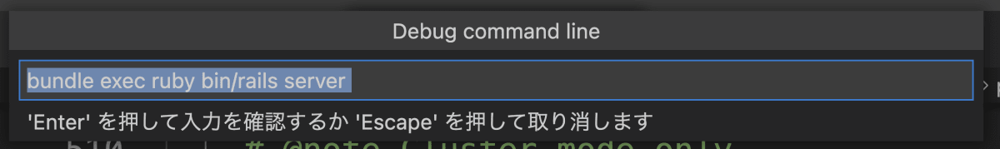

# Ruby
使用`brew install ruby ` 安装Ruby,`ruby -v`可以查看当前Ruby版本。
```
ruby 3.1.0p0 (2021-12-25 revision fb4df44d16) [arm64-darwin20]
```

与⼤多数的编程语⾔⼀样，Ruby 也受益于海量的第三⽅代码库。这些代码库⼤部分都以 Gem 形式发布。 RubyGems 是设计⽤来帮助创建，分享和安装 这些代码库的。
```markdown
* gem search -r/-f <gem>
* gem install <gem> --version <num>
* gem list
```

Bundler 能够跟踪并安装所需的特定版本的 gem，以此来为 Ruby 项⽬提供⼀
致的运⾏环境。

```ruby
source 'https://rubygems.org'
gem 'rails', '4.1.0.rc2'
gem ‘debug'
gem 'nokogiri', '~> 1.6.1'
```

##  在 VSCode 中打开调试 Ruby 代码、Rails 代码
VSCode 需要安装的扩展:
* [Ruby](https://marketplace.visualstudio.com/items?itemName=rebornix.Ruby)
* [VSCode rdbg Ruby Debugger](https://marketplace.visualstudio.com/items?itemName=KoichiSasada.vscode-rdbg)
* [VSCode Ruby](https://marketplace.visualstudio.com/items?itemName=wingrunr21.vscode-ruby)

配置“开始调试”时行为的文件`.vscode/launch.json`. 如果该文件不存在，它将自动创建。`.vscode/launch.json` 如下：每个设置的含义在后面描述。

```json
.vscode/launch.json
{
  "version": "0.2.0",
  "configurations": [
    {
      "name": "Debug Rails",
      "type": "rdbg",
      "request": "launch",
      "cwd": "${workspaceRoot}",
      "script": "bin/rails server",
      "args": [],
      "askParameters": true,
      "useBundler": true,
    }
  ]
}
```

如果从 VSCode 菜单执行 `Run - Start Debugging` ，从现在开始要执行的命令将显示在对话框中，因此请选中并执行它。


实际执行的命令如下所示：
```
rdbg --command --open --stop-at-load --sock-path=/var/folders/tv/b9rpcj011w110tjd0kv0_8h80000gn/T/ruby-debug-sock-501/ruby-debug-igaiga-18173 -- bundle exec ruby bin/rails server
```

launch.json 中各项设置的含义如下。
```json
"name": "Debug Rails"此配置的名称
"type": "rdbg"此配置的类型（要使用的扩展）
"request": "launch"“开始调试”中的设置
"cwd": "${workspaceRoot}"当前目录设置
"script": "bin/rails server"命令运行
"args": []传递给命令的选项
"askParameters": true执行前用对话框确认执行命令
"useBundler": true授予捆绑执行
```

## CocoaPods源码调试
1. 创建一个新的iOS项目，创建一个Podfile文件
```ruby
  platform :ios, '11.0'
  source 'https://github.com/CocoaPods/Specs.git'
  target "DemoX" do
    use_frameworks!
    pod 'AFNetworking'
  end
```

2. [下载CocoaPods源码](https://github.com/CocoaPods/CocoaPods),将`CocoaPods`源码和iOS项目放到同一目录下，并在该目录下新建一个`Gemfile`文件,并运行`bundle install`。`Gemfile`文件内容
```ruby
  source 'https://rubygems.org'
  # 指定本地CocoaPods路径
  gem 'cocoapods', path: './CocoaPods'
```

3. 创建 `launch.json` 文件，调试 rb 文件时可以选择是否创建 `launch.json`文件，修改部分内容
```json
  {
      // 悬停以查看现有属性的描述。欲了解更多信息，请访问: https://marketplace.visualstudio.com/items?itemName=KoichiSasada.vscode-rdbg
      "version": "0.2.0",
      "configurations": [
          {
              "type": "rdbg",
              "name": "Debug current file with rdbg",
              "request": "launch",
              // 指定使用的pod解释文件。
              "script": "${workspaceRoot}/CocoaPods/bin/pod",
              // pod 命令执行的路径。会在该路径下寻找Podfile文件。
              "cwd": "${workspaceFolder}/DemoX",
              // 执行的命令参数，在这里执行的是 pod install
              "args": ["install"],
              "askParameters": true
          },
          {
              "type": "rdbg",
              "name": "Attach with rdbg",
              "request": "attach"
          }
      ]
  }
```

4. 在`CocoaPods -> lib -> cocoapods -> command -> install.rb`文件中打断点,进行调试即可

5. iOS项目中的`Podfile`文件内容使用的也是ruby语法,也可以在`pod xxx`中打断点进行调试。

## Ruby修改Mach-O文件
Ruby 修改 MachO 文件需要用到第三方`ruby-macho`,[仓库地址](https://github.com/Homebrew/ruby-macho)。
1. 创建 gem 文件
```ruby
source 'https://rubygems.org'
gem 'ruby-macho'
```
2. 创建rb文件,将rb文件和gem文件放在同一文件夹下,VSCode 打开文件夹，创建`launch.json` 文件,调用`bundle install`加载ruby-macho
3. `ruby-macho`的一些方法
```ruby
require 'macho'
macho_path_exec = '../ipas/Cat' #可执行文件路径
file_exec = MachO::MachOFile.new(macho_path_exec)
# 确认Mach-O是否是可执行文件
puts file_exec.executable?
# 查看MachO文件的header信息
puts file_exec.header.to_h
# 查看commands段
file_exec.load_commands.each do |lc|
    puts "#{lc.type}: offset #{lc.offset}, size: #{lc.cmdsize}"
end
# 查看某个段的个数
puts file_exec[:LC_LOAD_DYLIB].count
## 添加rpath
lc_rpath = MachO::LoadCommands::LoadCommand.create(:LC_RPATH,"test")
file_exec.add_command lc_rpath
file_exec.write! # 调用后会修改源文件
## 移除 LC_LOAD_DYLIB 段
file_exec.delete_command file_exec[:LC_LOAD_DYLIB].first until file_exec[:LC_LOAD_DYLIB].empty?    
```

#### Ruby修改动态库
ruby 在修改可执行文件时，是对二进制直接做修改。`tools.rb`方法中可以对 Mach-O 文件进行
```ruby
require 'macho'
require 'fileutils'

macho_path_exec = '../ipas/Alamofire'
macho_copy_path_exec = '../ipas/Alamofire_copy'

#拷贝可执行文件
FileUtils.cp macho_path_exec, macho_copy_path_exec

# ruby是直接修改的二进制文件
file_dylibs = MachO::Tools.dylibs(macho_path_exec)
file_dylibs.each do |dylib|
    puts dylib
end

puts "--------"

# 修改dylib_id
MachO::Tools.change_dylib_id(macho_copy_path_exec,"test_copy")
# 记载Mach-O文件
copy = MachO::MachOFile.new(macho_copy_path_exec)
origin = MachO::MachOFile.new(macho_path_exec)
# 打印 dylib_id
puts "copy dylib_id: #{copy.dylib_id}    ---origin---: #{origin.dylib_id}"

puts "--------"

## 添加rpath
puts "copy rpath: #{copy.rpaths}    ---origin---: #{origin.rpaths}"
MachO::Tools.add_rpath(macho_copy_path_exec, '@loader_path/Frameworks/cat/cat')
copy = MachO::MachOFile.new(macho_copy_path_exec)
puts "copy rpath: #{copy.rpaths}    ---origin---: #{origin.rpaths}"

puts "--------"

# 删除rpath
MachO::Tools.delete_rpath(macho_copy_path_exec, '@loader_path/Frameworks/cat/cat')
copy = MachO::MachOFile.new(macho_copy_path_exec)
puts "copy rpath: #{copy.rpaths}    ---origin---: #{origin.rpaths}"
```

#### 合并Mach-O
```ruby
require 'macho'

# armV7 arm64
macho_path_arm_dylib = './bin/libAFNetworking_arm.dylib'
# x86_64
macho_path_dylib = './bin/libAFNetworking.dylib'

# 合并后的文件
macho_path_merge_dylib = './bin/libAFNetworking_copy_merge.dylib'
# 合并之后动态库 macho headers 
filenames = [macho_path_dylib, macho_path_arm_dylib]
MachO::Tools.merge_machos(macho_path_merge_dylib, *filenames)

# 打印 Mach-O 支持的架构类型 cputype
file = MachO::FatFile.new(macho_path_merge_dylib)
file.machos.each { |macho|
    puts macho.cputype
}
puts file.header.to_h
```

## xcodeproj
xcodeproj是 CocoaPods 官方开发用来管理Xcode项目的，
使用`gem info xcodeproj`查看详情，[源码地址](https://github.com/CocoaPods/Xcodeproj)
```ruby
xcodeproj (1.22.0, 1.21.0, 1.19.0)
    Author: Eloy Duran
    Homepage: https://github.com/cocoapods/xcodeproj
    License: MIT
    Installed at (1.22.0): /opt/homebrew/lib/ruby/gems/3.1.0
                 (1.21.0): /opt/homebrew/lib/ruby/gems/3.1.0
                 (1.19.0): /opt/homebrew/lib/ruby/gems/3.1.0

    Create and modify Xcode projects from Ruby.
```

xcodeproj的用法,[查看相关API](https://www.rubydoc.info/gems/xcodeproj/Xcodeproj/Constants)
```ruby
require 'xcodeproj'

app_project_path = './DemoX/DemoX.xcodeproj'
app_workspace_path = './DemoX/DemoX.xcworkspace'

# 生成workspace对象
workspace = Xcodeproj::Workspace.new_from_xcworkspace(app_workspace_path)
puts workspace

# workspace管理schemes
workspace.schemes.each do |s|
    puts s
end

# 生成project对象
project = Xcodeproj::Project.open(app_project_path)
# project管理target
project.targets.each do |target|
    puts target.name
end

puts "------"

# 查看 项目中可编译的文件，只查找.m .mm .swift文件
files = project.targets.first.source_build_phase.files.to_a.map do |pbx_build_file|
    pbx_build_file.file_ref.real_path.to_s
end.select do |path|
    path.end_with?('.m', '.mm', '.swift')
end
puts files

# 生成 xcconfig 文件
ab_path = File.dirname(__FILE__) + './DemoX/Test.release.xcconfig'
xc_ref = project.new_file(ab_path)
## 使用 xcconfig 文件
project.targets.first.build_configurations.first.base_configuration_reference = xc_ref
puts project.targets.first.build_configurations.first.base_configuration_reference
# 项目保存
project.save

# 修改bundle id
project.targets.each do |target|
    target.build_configurations.each do |config|
       config.build_settings["PRODUCT_BUNDLE_IDENTIFIER"] = "com.test.test" if name = "DEBUG"
    end
end
project.save
```


## Symbol
Ruby 是⼀个强⼤的⾯向对象脚本语⾔，⼀切皆是对象。 在 Ruby 中 `Symbol` 表示“名字”，⽐如字符串的名字，标识符的名字。
```markdown
* 创建⼀个 Symbol 对象的⽅法是在名字或者字符串前⾯加上冒号：
* 在 Ruby 中每⼀个对象都有唯⼀的对象标识符（Object Identifier）
* 对于 Symbol 对象，⼀个名字唯⼀确定⼀个 Symbol 对象
* Ruby 内部⼀直在使⽤ Symbol，Ruby内部也存在符号表
* Symbol 本质上是⼀个数字，这个数字和创建 Symbol 的名字形成⼀对⼀的映射；⽽String 对象是⼀个重量级的。(**⽤C结构体表示的家伙，因此使⽤ Symbol 和 String 的开销相差很⼤。**)
* 符号表是⼀个全局数据结构，它存放了所有 Symbol 的（数字ID，名字）。 
``` 

> Ruby 不会从中删除 `Symbol` ，因此当你创建⼀个 `Symbol` 对象后，它将⼀直存在，直到程序结束

## 01-注释
```ruby
=begin
这是一个多行注释。
可扩展至任意数量的行。
但 =begin 和 =end 只能出现在第一行和最后一行。
=end

#打印并且换行
puts "Hello Hank!"
#打印不换行
print "Hello Cat!"
```

## 02-Rudy对象&符号&变量
```ruby
puts 3.class
puts 'Hello'.class

puts nil.class #=> NilClass
puts true.class #=> TrueClass
puts false.class #=> FalseClass

placeholder = 'use string interpolation'
puts "I can #{placeholder} when using double quoted strings"
puts 'I can #{placeholder} when using double quoted strings'

# q 使用的是单引号引用规则，而 %Q 是双引号引用规则
puts %Q{I can #{placeholder} when using double quoted strings。}
puts %q{I can #{placeholder} when using double quoted strings。}
# 在一个双引号括起的字符串内，转义字符会被解析。在一个单引号括起的字符串内，转义字符不会被解析，原样输出。
puts %q{I can \n。}
puts %q{I can \n。}
puts %Q{I can \n。}

hank = cat = 'Cat1237'
puts hank
puts cat

path_to_project_root = '/good/name/'
puts path_to_project_root

str = 'Won\'t you read O\'Reilly\'s book?'
puts str

# Symbol
:pending.class #=> Symbol
status = :pending

puts status == :pending
puts status == 'pending'
puts status == :cat 

puts status.to_s #=> "pending"
puts 'argon'.to_sym #=> :argon

puts :foo.object_id
puts :foo.object_id
puts :"foo".object_id
puts "foo".object_id
puts "foo".object_id
puts "foo".object_id
puts "foo".object_id

puts 'Hello'.method(:upcase).class

5.even? #=> false
5.odd? #=> true
```

## 03-Rudy中的操作符
```ruby
puts 1 + 1 #=> 2
puts 8 - 1 #=> 7
puts 10 * 2 #=> 20
puts 35 / 5 #=> 7
puts 2**5 #=> 32
puts 5 % 3 #=> 2

puts 3 & 5 #=> 1
puts 3 | 5 #=> 7
puts 3 ^ 5 #=> 6

puts 1.+(3) #=> 4
puts 10.* 5 #=> 50
# 示一个方法返回一个布尔值
puts 100.methods.include?(:/) #=> true

puts !!nil   #=> false
puts !!false #=> false
puts !!0     #=> true
puts !!""    #=> true

# 组合比较运算符
# 返回1，第一个参数大
# 返回0，两个参数相等
# 返回-1，右边参数大
puts 1 <=> 10 #=> -1 (1 < 10)
puts 10 <=> 1 #=> 1 (10 > 1)
puts 1 <=> 1 #=> 0 (1 == 1)

# and 左侧执行成功，继续执行右侧
(1 < 0) and (puts "mm")
# or 左侧执行失败，继续执行右侧
(1 < 0) or (puts "cc")
```

## 04-Rudy中的String
```ruby
cat = 'cat'

puts cat.encoding.name

cat.force_encoding('ISO-8859-1')
puts cat.encoding.name

newStr = cat.encode('ISO-8859-1')
puts newStr.encoding.name

newStr.each_byte do |byte|
  puts byte
end

# 拼接字符串
puts 'hello ' + 'world' #=> "hello world"
puts 'hello ' + 3.to_s #=> "hello 3"
# 拼接一个对象
puts 'hello' << ' world'
puts 'hello' << newStr

# 重复输出指定字符串n次
puts 'hello ' * 3 #=> "hello hello hello "

# =~ 返回匹配到到字符的索引（如果没有匹配，则返回nil）
puts 'Cat' =~ /t/

# 格式化字符串
puts format('%05d', 123)
puts format("%-5s: %08x #{cat}", 'ID', 44)

# 首字母大写
puts cat.capitalize
puts cat.empty?
puts "123" == "123"
puts "123".eql?("123")

puts cat.sub(/[a]/, "b")
```

## 05-Rudy中的分支判断&循环&集合类型
```ruby
# Arrays

puts `ruby -v`

array = [1, 2, 3, 4, 5] #=> [1, 2, 3, 4, 5]

# u数组可以包含多种数据类型
puts [1, 'hello', false] #=> [1, "hello", false]
# %r() 是写正则表达式的另一种方式。
# %q() 是写单引号字符串的另一种方式（可以是多行，这很有用）
# %Q() 给出双引号字符串
# %x() 是一个shell命令
# %i() 给出一个符号数组（Ruby> = 2.0.0）
# %s()变成foo符号（:foo）
# %w写一个用空格而不是逗号分隔且不带引号的字符串数组
puts %w(1 2 3)


puts array[0] #=> 1
puts array.first #=> 1
puts array[12] #=> nil


puts array[-1] #=> 5
puts array.last #=> 5

# 指定 index 和 length...
puts array[2, 3] #=> [3, 4, 5]

# 指定range
puts array[1..3] #=> [2, 3, 4]

# 逆转数组
puts [1,2,3].reverse #=> [3,2,1]

# 万物皆是对象
array.[] 0 #=> 1
array.[] 12 #=> nil

# 添加到数组
array << 6 #=> [1, 2, 3, 4, 5, 6]
array.push(6) #=> [1, 2, 3, 4, 5, 6]

# 判断数据是否存在？
array.include?(1) #=> true

# dictionary
hash = { 'color' => 'green', 'number' => 5 }

hash.keys #=> ['color', 'number']


hash['color'] #=> "green"
hash['number'] #=> 5
hash = { :defcon => 3, :action => true }
hash.keys #=> [:defcon, :action]

hash = { defcon: 3, action: true }
hash.keys #=> [:defcon, :action]

# 是否存在key和value
hash.key?(:defcon) #=> true
hash.value?(3) #=> true

if true
    puts 'if statement'
  elsif false
    puts 'else if, optional'
  else
    puts 'else, also optional'
end
  
warnings = ['Patronimic is missing', 'Address too short']
# 一行
puts("Some warnings occurred:\n" + warnings.join("\n"))  if !warnings.empty?

puts("Some warnings occurred:\n" + warnings.join("\n"))  unless warnings.empty?
   

# 循环
# 在ruby中，for循环不常见
for counter in 1..5
    puts "iteration #{counter}"
end
# block 闭包
(1..5).each do |counter|
    puts "iteration #{counter}"
end


(1..5).each { |counter| puts "iteration #{counter}" }

array.each do |element|
    puts "#{element} is part of the array"
end

hash.each do |key, value|
    puts "#{key} is #{value}"
end

# 需要index和value同时存在
array.each_with_index do |element, index|
    puts "#{element} is number #{index} in the array"
end
array.each_with_index { |element, index|
    puts "#{element} is number #{index} in the array"
}

counter = 1
while counter <= 5 do
    puts "iteration #{counter}"
    counter += 1
end

#  'map', 'reduce'等
array = [1,2,3,4,5]

doubled = array.map { |element|
     element * 2
}

puts doubled
#=> [2,4,6,8,10]
puts array
#=> [1,2,3,4,5]

# 通过&符号控制对每个元素执行等方法
a = ["FOO", "BAR", "BAZ"]
a.map { |s| s.downcase } #=> ["foo", "bar", "baz"]
a.map(&:downcase) #=> ["foo", "bar", "baz"]

upcased = ['Watch', 'these', 'words', 'get', 'upcased'].map(&:upcase)
puts upcased
#=> ["WATCH", "THESE", "WORDS", "GET", "UPCASED"]

sum = [1, 2, 3, 4, 5].reduce(&:+)
puts sum

# 分支
grade = 'B'

case grade
when 'A'
    puts 'Way to go kiddo'
when 'B'
    puts 'Better luck next time'
when 'C'
    puts 'You can do better'
when 'D'
    puts 'Scraping through'
when 'F'
    puts 'You failed!'
else
    puts 'Alternative grading system, eh?'
end

# 分支和range
grade = 82
case grade
when 90..100
    puts 'Hooray!'
when 80...90
    puts 'OK job'
else
    puts 'You failed!'
end
```

## 06-Rudy中的异常处理
```ruby
# Exception handling
begin
  # Code here that might raise an exception
  raise NoMemoryError, '内存异常.'
rescue RuntimeError => other_exception_variable
  puts 'RuntimeError异常'
else
  puts '没有异常'
ensure
  puts '不管有没有异常'
end
```

## 07-Rudy中的方法与闭包
```ruby
# Methods

# 没有return关键字，传递参数可以使用括号，也可以不用
def double(x)
    x * 2
end

puts double(2) #=> 4
puts double 3 #=> 6
puts double double 3 #=> 12

def sum(x, y)
    x + y
end

# 多参数通过,分割
sum 3, 4 #=> 7

puts sum sum(3, 4), 5 #=> 12

# yield
#传递一个block
def surround
    puts '{'
    yield
    puts '}'
end
   
puts surround { puts 'hello world' }
   


# Block可以被包装成一个`Proc`对象
def guests(&block)
    puts block.class #=> Proc
    puts block.call(4)
end

guests { |n| "You have #{n} guests." }
# => "You have 4 guests."

# 传递一组参数
def guess(*arr)
    arr.each { |guest| puts guest }
end

guess ["Cat", "Kody", "cooci"]

#=> 15

# 根据数组自动创建对象
a, b, c = ["Cat", "Kody", "Cooci"]
puts a
puts b
puts c

# 通过*获取指定数组
ranked_competitors = ["John", "Sally", "Dingus", "Moe", "Marcy"]

def best(first, second, third)
    puts "Winners are #{first}, #{second}, and #{third}."
end

best *ranked_competitors.first(3) #=> Winners are John, Sally, and Dingus.

# 多参数
def best1(first, second, third, *others)
    puts "Winners are #{first}, #{second}, and #{third}."
    puts "There were #{others.count} other participants."
end
   
best1 *ranked_competitors 

# !具有跑坏性，可以修改原始值
company_name = "Dunder Mifflin"
company_name.upcase #=> "DUNDER MIFFLIN"
company_name #=> "Dunder Mifflin"

# We're mutating company_name this time.
company_name.upcase! #=> "DUNDER MIFFLIN"
company_name #=> "DUNDER MIFFLIN"
```

## 08-Rudy中的类与继承
```ruby
# Classes

class Human
    ​# 类变量
    ​@@species = 'H. sapiens'
    ​# init方法
    ​def initialize(name, age = 0)
      ​#初始化
      ​@name = name
      ​@age = age
    ​end
   
    ​# setter
    ​def name=(name)
      ​@name = name
    ​end
   
    ​# getter
    ​def name
      ​@name
    ​end
   
    ​# The above functionality can be encapsulated using the attr_accessor method as follows.
    ​attr_accessor :name
   
    ​# Getter/setter 
    ​attr_reader :name
    ​attr_writer :name
   
    ​# 类方法要以self开头
    ​def self.say(msg)
      puts msg
    ​end
   
    ​def species
      ​@@species
    ​end
end

# 初始化
jim = Human.new('Jim Halpert')
dwight = Human.new('Dwight K. Schrute')

jim.species #=> "H. sapiens"
jim.name #=> "Jim Halpert"
jim.name = "Jim Halpert II" #=> "Jim Halpert II"
jim.name #=> "Jim Halpert II"
dwight.species #=> "H. sapiens"
dwight.name #=> "Dwight K. Schrute"

Human.say('Hi') #=> "Hi"


#  $ 全局变量
$var = "I'm a global var"
defined? $var #=> "global-variable"

# 实例变量
@var = "I'm an instance var"
defined? @var #=> "instance-variable"

# 类实例变量
@@var = "I'm a class var"
defined? @@var #=> "class variable"

# 以大写字母开头的变量是常量。
Var = "I'm a constant"
defined? Var #=> "constant"

#类变量在类及其所有后代之间共享
class Human
    ​@@foo = 0
   
    ​def self.foo
      ​@@foo
    ​end
   
    ​def self.foo=(value)
      ​@@foo = value
    ​end
end
   
# 派生类
class Worker < Human
end
   
Human.foo #=> 0
Worker.foo #=> 0

Human.foo = 2
Worker.foo #=> 2

# 实例变量不共享
class Human
    ​@bar = 0
   
    ​def self.bar
      ​@bar
    ​end
   
    ​def self.bar=(value)
      ​@bar = value
    ​end
end
   
class Doctor < Human
end
   
Human.bar #=> 0
Doctor.bar #=> nil

module ModuleExample
    ​def foo
      ​'foo'
    ​end
end

# Including modules 绑定到类的实例
# Extending modules 绑定到类本身
class Person
    ​include ModuleExample
end

Person.foo     #=> NoMethodError: undefined method `foo' for Person:Class
Person.new.foo #=> "foo"
Book.foo       #=> "foo"
Book.new.foo   #=> NoMethodError: undefined method `foo'

# Callbacks are executed when including and extending a module
module ConcernExample
    ​def self.included(base)
      ​base.extend(ClassMethods)
      ​base.send(:include, InstanceMethods)
    ​end
   
    ​module ClassMethods
      ​def bar
        ​'bar'
      ​end
    ​end
   
    ​module InstanceMethods
      ​def qux
        ​'qux'
      ​end
    ​end
end
   
class Something
​   include ConcernExample
end
   
Something.bar     #=> "bar"
Something.qux     #=> NoMethodError: undefined method `qux'
Something.new.bar #=> NoMethodError: undefined method `bar'
Something.new.qux #=> "qux
```

# 参考文档
* [Ruby 基础文档](https://zenn.dev/igaiga/books/rails-practice-note/viewer/ruby_debug_gem)