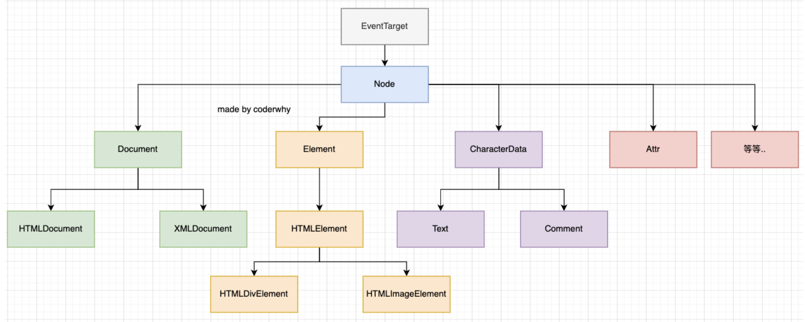

# Document
`DOM (Document Object Model)` 译为文档对象模型，是 `HTML` 和 `XML` 文档的编程接口。`Document`是指当前窗口对象，标签也称为 `Dom` 元素。Dom获取元素后使用 style 修改 HTML 样式。

DOM的继承关系


## 节点 - 不常用
根据 W3C 的 HTML DOM 标准，HTML 文档中的所有内容都是节点,整个文档是一个文档节点，每个 HTML 元素是元素节点，HTML 元素内的文本是文本节点，每个 HTML 属性是属性节点，注释是注释节点。如下图：


如果我们获取到一个节点（Node）后，可以根据这个节点去获取其他的节点，我们称之为节点之间的导航。

属性 | 含义
------- | -------
`parentNode` | 父节点
`previousSibling` | 前兄弟节点
`nextSibling` | 后兄弟节点
`childNodes` | 子节点
`firstChild` | 第一个子节点
`lastChild` | 最后一子节点
`createTextNode()` | 创建文本节点


```javascript
// childNodes 以树的形式获取所有节点，节点由（标签，文本，属性，注释）组成
let divs = document.querySelector("div")
for (let node of divs.childNodes) {
    if (node.nodeType == Node.ELEMENT_NODE) {
        console.log(node)
    }
}
```

## Element常用属性

属性 | 含义
------- | -------
`innerHTML` | 将元素中的 HTML 获取为字符串形式
`innerText` | 获取节点包含的文本值
`parentNode` | 获取节点（元素）的父节点
`childNodes` | 获取节点（元素）的子节点
`attributes` | 节点（元素）的属性节点
`nodeName` | 元素节点的 nodeName 与标签名相同,属性节点的 nodeName 与属性名相同
`nodeValue` | 元素节点返回 undefined 或者 null，文本节点返回文本本身，属性节点是属性值
`nodeType` | 1:元素、2:属性、3:文本、8:注释、9:文档
`createElement()` | 创建元素节点

## 元素之间的关系
HTML 元素指的是从**开始标签（start tag）到结束标签（end tag）的所有代码**。比如`<a>百度一下</a>`。 如果我们获取到一个元素（Element）后，可以根据这个元素去获取其他的元素，我们称之为元素之间的导航。节点之间存在如下的关系：

属性 | 含义
------- | -------
`parentElement` | 父节点
`previousElementSibling` | 前兄弟节点
`nextElementSibling` | 后兄弟节点
`children` | 子节点
`firstElementChild` | 第一个子节点
`lastElementChild` | 最后一子节点
`append(...nodes or strings)` | 在 node 末尾 插入节点或字符串
`prepend(...nodes or strings)` | 在 node 开头 插入节点或字符串
`before(...nodes or strings)` | 在 node 前面 插入节点或字符串
`after(...nodes or strings)` | 在 node 后面 插入节点或字符串
`replaceWith(...nodes or strings)` | 将 node 替换为给定的节点或字符串
`remove()` | 移除元素
`cloneNode()` | 复制元素


* **查找元素的方法**

方法 | 描述
------- | -------
`querySelector()` | 根据`指定选择器`返回找到的第一个元素
`querySelectorAll()` | 根据`指定选择器`返回找到所有元素
`getElementsByClassName()` | 通过`class名称`获取标签,返回一个数组。
`getElementById()` | 通过`id`获取标签。
`getElementsByTagName()` | 通过`标签名称`获取标签,返回一个数组。
`getElementsByName()` |  通过`name名称`获取标签,返回一个数组。

* **获取对应的元素**
```javascript
// 通过`选择器`获取标签,querySelector只会根据指定选择器返回找到的第一个元素
document.querySelector("#box")
// querySelectorAll会根据指定选择器返回所有找到的元素
document.querySelectorAll("div")
// 根据`children`获取当前元素下所有的子元素
let divs = document.querySelector("div")
console.log(divs.children)
// 修改元素css样式
div.style.width = "100px";
div.style.height = "100px";
div.style.backgroundColor = "red";
// 添加点击方法
div.onclick = function(){
    this.style.backgroundColor = "green";
}
```

## 元素属性attribute
属性attribute的分为标准的attribute和非标准的attribute：
* 标准的attribute：某些attribute属性是标准的，比如id、class、href、type、value等；
* 非标准的attribute：某些attribute属性是自定义的，比如abc、age、height等；

方法 | 描述
------- | -------
`createAttribute()` | 创建属性节点
`hasAttribute()` | 检查特性是否存在
`getAttribute()` | 返回指定的属性值
`setAttribute()` | 把指定属性设置或修改为指定的值


标准的attribute可以直接通过.语法进行获取，非标准的attribute只能通过`getAttribute()`进行获取
```javascript
// 获取元素属性时，非标准的attribute使用`.`方式无法获取自定义属性
let img = document.querySelector("img")
console.log(img.alt)
console.log(img.getAttribute("alt"));
// attr对象的集合，具有name、value属性；
for (const attr of img.attributes) {
    console.log(attr.name,attr.value);
}
// 修改元素属性
img.title = "新的title"
img.setAttribute("title","新的title")
// 新增元素属性,`setAttribute`如果属性不存在新增，如果属性存在就修改
img.setAttribute("test","新的title")
// 删除元素属性
img.removeAttribute("title")
```

HTML5的`data-*`自定义属性,可以在`dataset`属性中获取到的：

```html
<div class="box" data-name="why" data-age="18"></div>
<script>
    var boxEl = document.querySelector(".box")
    console.log(boxEl.dataset.name,boxEl.dataset.age,);
</script>
```

## 元素内容
* `innerHTML` 获取的内容带标签
* `innerText` 获取的内容会去除空格
* `textContent`  获取的内容不去除两端空格
```javascript
// 获取元素内容
let div = document.querySelector("div")
console.log(div.innerHTML);
console.log(div.innerText);
console.log(div.textContent);

// 设置元素内容 
// innerHTML 设置的内容如果含有标签会转换成标签元素
// innerText 内容不会转化成标签元素
// textContent  内容不会转化成标签元素
let div = document.querySelector("div")
div.innerHTML = "<span>我是span</span>"
div.innerText = "<span>我是span</span>"
div.textContent ="<span>我是span</span>"
```

## 动态修改元素样式

```javascript
let div = document.querySelector("div")
// 第一种方式，通过预先写好的样式，把类名赋值给他
div.className = "box"

// 第二种方式，通过这种方式设置的是行内样式
div.style.width = "200px";
div.style.height = "300px";
div.style.backgroundColor = "red";

// 获取div的样式
let style = window.getComputedStyle(div);
console.log(style.width);
// 直接通过div.style.width获取的只能是行内样式的宽度
console.log(div.style.width);
```

##  元素的大小、滚动
* clientWidth：contentWith+padding（不包含滚动条）
* clientHeight：contentHeight+padding
* clientTop：border-top的宽度
* clientLeft：border-left的宽度
* offsetWidth：元素完整的宽度
* offsetHeight：元素完整的高度
* offsetLeft：距离父元素的x
* offsetHeight：距离父元素的y
* scrollHeight：整个可滚动的区域高度
* scrollTop：滚动部分的高度

## window的大小、滚动
* window的width和height
    * innerWidth、innerHeight：获取window窗口的宽度和高度（包含滚动条）
    * outerWidth、outerHeight：获取window窗口的整个宽度和高度（包括调试工具、工具栏）
    * documentElement.clientHeight、documentElement.clientWidth：获取html的宽度和高度（不包含滚动条）
* window的滚动位置：
    * scrollX：X轴滚动的位置（别名pageXOffset）
    * scrollY：Y轴滚动的位置（别名pageYOffset）
* 也有提供对应的滚动方法：
    * 方法 scrollBy(x,y) ：将页面滚动至 相对于当前位置的 (x, y) 位置；
    * 方法 scrollTo(pageX,pageY) 将页面滚动至 绝对坐标；

```html
<script>
    console.log(window.outerWidth,outerHeight);
    console.log(window.innerWidth,innerHeight);
    console.log(window.documentElement.clientHeight,documentElement.clientWidth);
    // 监听window滚动
    window.onscroll = function(){
        
    }
</script>
```