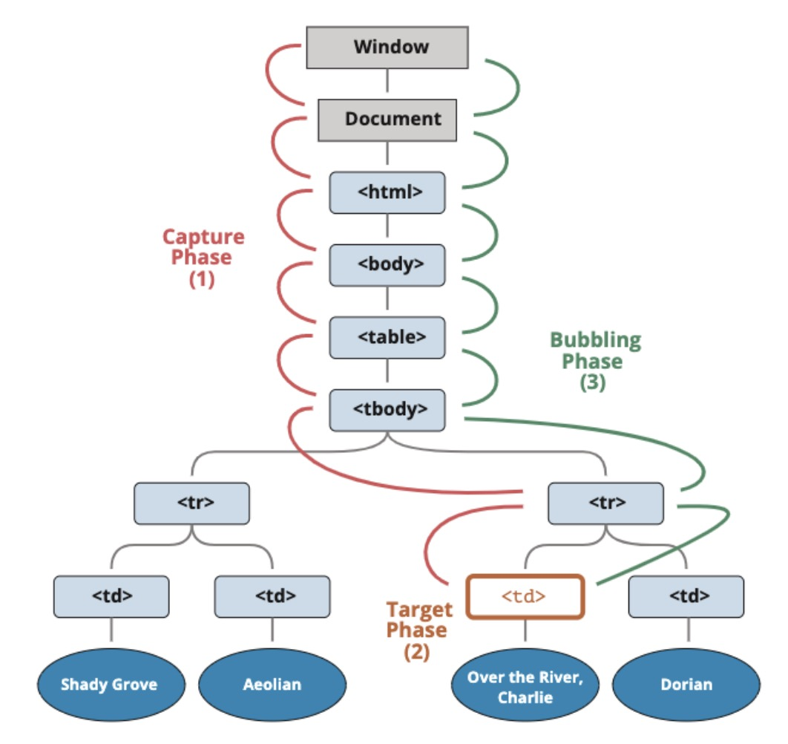

# 事件处理
当用户点击鼠标时会有`onclick`事件，当一张页面或一幅图像完成加载会有`onload`事件,用户退出界面会有`onunload`事件，鼠标移动到元素上时会有`onmouseover`事件，鼠标移开时会有`onmouseout`事件,当输入字段被改变时会有`onchange`事件...等等。事件的监听方式有以下几种:
```html
<!-- 直接监听 -->
<div class="box" onclick="alert('div被点击')"></div>
<script>
    // 
    var boxEl = document.body.querySelector(".box")
    boxEl.onclick=function(){
        console.log("------onclick-----");
    }

    boxEl.addEventListener("click",function(){
        console.log("-----addEventListener-----");
    })
</script>
```

* [点击查看所有事件](https://www.w3school.com.cn/jsref/dom_obj_event.asp)
* [MDN 事件类型](https://developer.mozilla.org/zh-CN/docs/Web/Events)

## 事件流
当有多个元素在同一个位置，点击最上层元素时，它的事件传递分为两个阶段，捕获阶段和冒泡阶段
* 捕获阶段（Capturing phase）: 事件从window向下接近元素
* 冒泡阶段（Bubbling phase）: 事件到达目标元素后，事件从元素向上开始冒泡，

类似人潜水的一个过程，先下沉到底之后在往上飘


默认情况下事件是从最内层的span向外依次传递的顺序，这个顺序我们称之为`事件冒泡（Event Bubble）`。还有另外一种监听事件流的方式就是从外层到内层（body -> span），这种称之为`事件捕获（Event Capture）`,这种现在很少使用。

* 事件冒泡 -  打印顺序 span -> div -> body
```html
    <div class="box">
        <span class="word">哈哈哈哈</span>
    </div>

    <script>
        var spanEl = document.body.querySelector(".word")
        var divEl = document.body.querySelector(".box")
        var bodyEl = document.body
        // 添加监听
        bodyEl.addEventListener('click',function(){
            console.log("body被点击");
        })
        spanEl.addEventListener('click',function(){
            console.log("span被点击");
        })
        divEl.addEventListener('click',function(){
            console.log("div被点击");
        })
    </script>
```

## 事件对象
当一个事件发生时，就会有和这个事件相关的很多信息，比如事件的类型是什么，你点击的是哪一个元素，点击的位置是哪里等等相关的信息。那么这些信息会被封装到一个Event对象中，这个对象由浏览器创建，称之为event对象。

* 获取event对象
```html
    <script>
        var divEl = document.body.querySelector(".box")
        divEl.onclick = function(event){
            console.log(event);
        }
        divEl.addEventListener('click',function(event){
            console.log("div被点击",event);
        })
    </script>
```
* event属性，**`target`和`currentTarget`一定要区分好，一个是当前事件发生的元素，一个是当前处理事件的元素**

属性 | 含义
------- | -------
type | 事件的类型；
target | 当前事件发生的元素；
currentTarget | 当前处理事件的元素；
eventPhase | 事件所处的阶段；
offsetX、offsetY | 事件发生在元素内的位置；
clientX、clientY | 事件发生在客户端内的位置；
pageX、pageY | 事件发生在客户端相对于document的位置；
screenX、screenY | 事件发生相对于屏幕的位置；

* event方法

方法 | 含义
------- | -------
preventDefault | 取消事件的默认行为；
stopPropagation | 阻止事件的进一步传递（冒泡或者捕获都可以阻止）；

**在函数中，也可以通过`this`来获取当前的发生元素**
```javascript
divEl.addEventListener('click',function(event){
    console.log(this == event.target);
})
```

## EventTarget类
`EventTarget`是一个DOM接口，主要用于`添加、删除、派发Event事件`。所有的节点、元素都继承自`EventTarget`，事实上Window也继承自`EventTarget`。

EventTarget常见的方法：
* `addEventListener`：注册某个事件类型以及事件处理函数；
* `removeEventListener`：移除某个事件类型以及事件处理函数；
* `dispatchEvent`：派发某个事件类型到EventTarget上,主要用于自定义事件

```javascript
var divEl = document.querySelector("div")
divEl.onclick = function(){
    // 派发事件
    window.dispatchEvent(new Event("why"))
}
// 监听派发的事件
window.addEventListener("why",function(){
    console.log("监听到why事件");
})
```

## 事件委托（event delegation）
事件冒泡在某种情况下可以帮助我们实现强大的事件处理模式 – 事件委托模式。为当子元素被点击时，父元素可以通过冒泡可以监听到子元素的点击，并且可以通过`event.target`获取到当前监听的元素。

```html
<head>
    <style>
        .active{
            color: red;
            font-size: 20px;
            background-color: yellow;
        }
    </style>
</head>
<body>
    <ul class="list">
        <li >123456</li>
        <li >123456</li>
        <li >123456</li>
    </ul>
    <script>
        // 每个li添加点击方法
        var liEls = document.querySelectorAll("li")
        for (var item in liEls) {
            item.onclick = function(event){
                // 通过classList添加属性
                event.currentTarget.classList.add("active")
            }
        }
        //  通过冒泡让父类进行监听
        var ulEl = document.querySelector("ul")
        ulEl.onclick = function(event){
            console.log("点击到了li",event.target);
            event.target.classList.add("active")
        }
        // 点击其他li时，移除已添加样式的li
        var currentActive = null
        ulEl.addEventListener("click",function (evengt) {
            if(currentActive) currentActive.classList.remove("active")
            event.target.classList.add("active")
            currentActive = evengt.target
        })
    </script>
</body>
```
某些事件委托可能需要对具体的子组件进行区分，这个时候我们可以使用`data-*`对其进行标记。比如多个按钮的点击，区分点击了哪一个按钮：
```html
<div class="list">
    <button data-action="new">新建</button>
    <button data-action="search">搜索</button>
    <button data-action="delete">删除</button>
</div>
<script>
    // 每个li添加点击方法
    var btnsEls = document.querySelector(".list")
    btnsEls.addEventListener("click",function (svent) {
        var action = event.target.dataset.action
        switch (action) {
            case "new":
                console.log("点击了新建按钮");
                break;
            case "search":
                console.log("点击了搜索按钮");
                break;
            case "delete":
                console.log("点击了删除按钮");
                break;
            default:
                console.log("点击了其他");
        }
    })
</script>
```

## 常见的事件

* 常见的一些鼠标事件

    属性 | 描述
    ------- | -------
    click | 当用户点击某个对象时调用的事件句柄。
    contextmenu | 在用户点击鼠标右键打开上下文菜单时触发
    dblclick | 当用户双击某个对象时调用的事件句柄。
    mousedown | 鼠标按钮被按下。
    mouseup | 鼠标按键被松开。
    mouseover | 鼠标移到某元素之上。（支持冒泡）
    mouseout | 鼠标从某元素移开。（支持冒泡）
    mouseenter | 当鼠标指针移动到元素上时触发。（不支持冒泡）
    mouseleave | 当鼠标指针移出元素时触发。（不支持冒泡）
    mousemove | 鼠标被移动。

* mouseover和mouseenter的区别
    * mouseenter 和 mouseleave不支持冒泡,进入子元素依然属于在该元素内，没有任何反应。
    * mouseover 和 mouseou 支持冒泡，进入元素的子元素时
        1. 先调用父元素的mouseout
        2. 再调用子元素的mouseover
        3. 因为支持冒泡，所以会将mouseover传递到父元素中；

* 常见的键盘事件

    属性 | 描述
    ------- | -------
    onkeydown | 某个键盘按键被按下。
    onkeypress | 某个键盘按键被按下。
    onkeyup | 某个键盘按键被松开。

* 常见的表单事件

    属性 | 描述
    ------- | -------
    onchange | 该事件在表单元素的内容改变时触发`( <input>, <keygen>,<select>, 和 <textarea>)`
    oninput | 元素获取用户输入时触发
    onfocus | 元素获取焦点时触发
    onblur | 元素失去焦点时触发
    onreset | 表单重置时触发
    onsubmit | 表单提交时触发


## 文档加载事件
* `DOMContentLoaded`：浏览器已完全加载 HTML，并构建了 DOM 树，但像  和样式表之类的外部资源可能尚未加载
完成。
* `load`：浏览器不仅加载完成了 HTML，还加载完成了所有外部资源：图片，样式等

```html


<script>
    window.addEventListener("DOMContentLoaded",function(){
        var imgEl = document.querySelector("img")
        console.log("页面内容加载完毕",imgEl.offsetWidth,imgEl.offsetHeight);
    })
    window.addEventListener("load",function(){
        var imgEl = document.querySelector("img")
        console.log("页面所有内容加载完毕",imgEl.offsetWidth,imgEl.offsetHeight);
    })
</script>
```