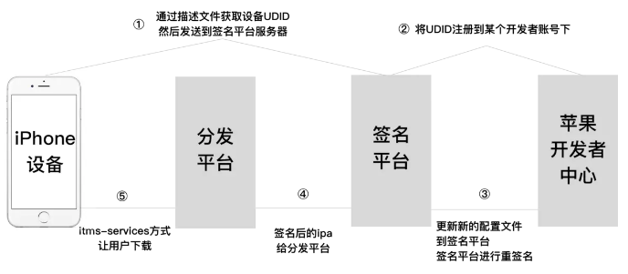

iOS做了好几年了，最近越发感觉移动端的的发展已经到了瓶颈，需求正在慢慢饱和，也许是时候转型了。

### 马甲包经验
1. 苹果账号登录ip跟上架地址最好再同一处 （比如在泰国上架，苹果账号最好在泰国登录，可以通过服务器进行登录）
2. 使用远程登录的方式，在Windows虚拟机使用`Appuploader`软件申请iOS开发证书，导出 p12 文件供开发电脑调试，上传IPA时也通过 Windows电脑进行上传。(注意苹果账号不要到处登录，只在同一个ip登录)
3. 最好使用新的测试设备进行开发，不要在苹果账号中添加相同的测试设备
4. 使用工具修改类名、方法名，添加垃圾属性和垃圾方法
5. 修改图片MD5的值,使用`LSUnusedResources`删除不使用的图片修改MD5的值也可以通过将空格写入图片的方式 `echo " " >> ~/Desktop/test/abc.png`
6. 使用 `ImageMagick` 对png图片做轻量压缩
7. 也可以将关键代码封装成 静态库的方式规避掉审核，主要是账号问题，防止被关联被怀疑。
8. 收款银行卡不要使用同一张银行卡


### iOS相关分发渠道
iOS分发渠道目前有下面四种: AppStore、 企业包、 Testflight、 超级签名。AppStore没什么好说的，只要上架到AppStore，用户就可以通过AppStore正常下载。

关于企业包:
```markdown
企业包 是使用企业账号进行分发，不能上架苹果商店。原来的目的是为了让一些大厂在内部使用一些APP的时候，不需要上架苹果店就可以安装。后来被广泛用于一些违规APP分发，导致企业账号很难申请。 
* 优点: 不需要通过苹果商店进行下载，用户可以通过`itms-services`的方式进行安装
* 缺点: 证书一年需要重签一次，安装之后需要信任对应的证书。有时候会掉签，证书被封的情况,在重签名的时候，对方注入一些库造成闪退从而达到对APP的使用时间限制
```

关于Testflight:
```markdown
Testflight 分内部测试和外部测试:
* 内部测试主要主要针对于开发人员内部测试需要添加对应的邮箱到开发者账号，苹果向该邮箱发送邀请码，登录TestFlight之后，使用邀请码进行下载。
* 外部测试被用于分发，可以通过邀请链接邀请用户下载，最多添加一万个测试设备，用户安装之后，从testFlight删除邀请的用户，从而达到设备无限制,目前已经苹果已经对此作出了限制

使用Testflight分发的优缺点:
* 优点: 不需要通过苹果商店进行下载，用户可以通过`Testflight`软件进行安装
* 缺点也有很多
    * 1. 有时间限制，最长90天，根据上传时间进行计算
    * 2. 苹果会对Testflight的包进行审核，如果是马甲包被查会导致主包下架
    * 3. 需要在手机中安装 TestFlight 的APP，造成一定用户安装难度
```

关于超级签名:
```markdown
能想到超级签名的人真他娘是个人才！！！[苹果无线配置文件交付和配置文档](https://developer.apple.com/library/archive/documentation/NetworkingInternet/Conceptual/iPhoneOTAConfiguration/Introduction/Introduction.html#//apple_ref/doc/uid/TP40009505-CH1-SW1)
它的原理简单的说，就是将真机测试的过程自动化。利用了苹果提供的Ad-Hoc分发通道，把这一百台安装设备当做开发设备来进行分发。流程是:获取用户设备的UDID→UDID添加到开发者后台→用已添加过的UDID的证书对IPA进行重签名→传到serve→使用`itms-services`的方式实现用户的下载。
超级签名需要用到个人或者公司的苹果开发者账号。

* 优点
    * 1. 相对稳定，因为它的原理是使用个人开发者账号，。不会像企业证书签名容易掉签问题
    * 2. 不用像企业包一样信任证书，安装后直接可以启动
    * 3. 包的有效期为1年,时间
* 缺点就是贵，真的贵，一个开发者账号99美金,一个账号最多安装100个测试设备
```


----

### 马甲包辅助工具
* [LSUnusedResources](https://github.com/tinymind/LSUnusedResources) 清除没有使用的图片
* [imageoptim](https://imageoptim.com/mac) 图片压缩工具
* [ChangeInterfaceBuilderColor](https://github.com/fabcz/ChangeInterfaceBuilderColor) 一键替换 Xib 颜色
* [MD5Change app](https://pan.baidu.com/s/1OALSZfFssUPXOSsXhJXgYw)  批量修改图片的MD5，上传到自己的百度云盘了`6hs1`
* [Images Extractor](https://github.com/devcxm/iOS-Images-Extractor/releases) 从 IPA 中读取图片
* [Apple Configurator 2](https://apps.apple.com/us/app/apple-configurator-2/id1037126344?mt=12) 获取手机上安装的IPA
* [ipatool](https://github.com/majd/ipatool) 获取手机上安装过的IPA，直接与 iTunes 和 App Store 通信。
* [Microsoft Remote Desktop Beta](https://docs.microsoft.com/en-us/windows-server/remote/remote-desktop-services/clients/remote-desktop-mac)  连接远程window的工具，点击文档中的`Microsoft Remote Desktop for Mac`进行下载


---- 

* [屏幕分辨率备忘单](https://devhints.io/resolutions)
* [iPhone备忘单](https://www.ios-resolution.com/)
* [蓝奏云](https://pandaboy.lanzoub.com/) 蓝奏云可以直接安装IPA