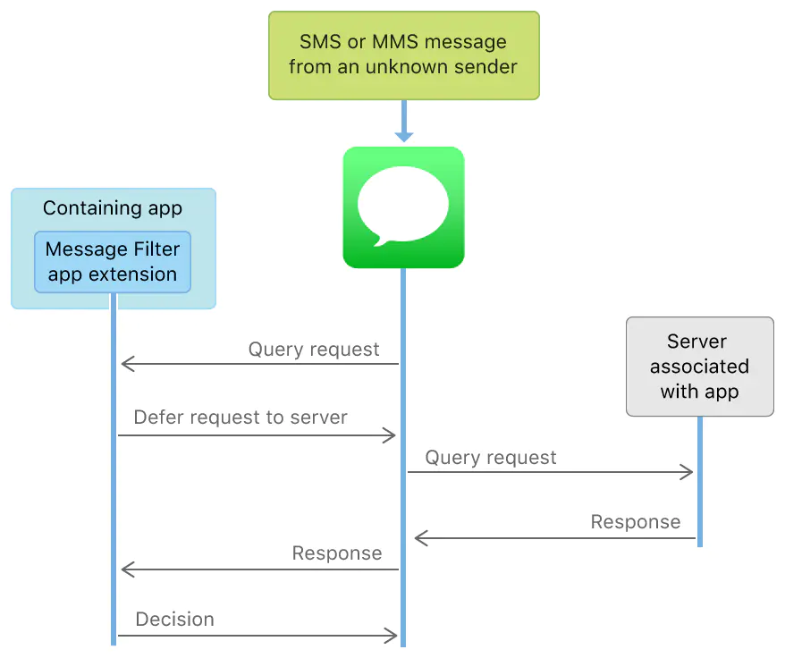

# iOS 11 短信过滤扩展
在iOS11的时候，苹果推出了`SMS fraud extension`（恶意短信拦截插件），属于`IdentityLookup`矿建。就是安卓常用的垃圾短信过滤。

当用户收到来自未知发件人的SMS或MMS消息时，`Messages App`可以要求您的`Message Filter Extension`应用程序扩展来确定该消息是主动还是不需要的。 您的应用扩展程序可以通过使用自己的内置数据和逻辑，或者推迟到您的关联服务器完成的分析来做出决定。

短信过滤的注意点:
```markdown
1. 需要开启用户权限：设置->信息->未知与过滤信息->过滤未知发件人->选择对应的应用
2. 通讯录里的联系人发来的短信不会被拦截；回复会话达到 3 次也不会被拦截
3. `SMS fraud extension`可以获取到的内容包括短信发送方和短信内容，不包含收件人手机号
4. 扩展内不允许用户发起网络请求，无法存储数据，所以不能将短信内容和用户进行匹配。
```

## 实现过程

```markdown
1. 信息app（用户）收到一条SMS或者MMS
2. 信息app将短信的发送号码和短信内容发给`SMS fraud extension`进行检测
3. `SMS fraud extension`可以使用本地数据进行离线检测，也可以线上实时检测。如果实时检测的话，由于`SMS fraud extension`没有网络请求的权限，只能委托信息app将短信相关内容发往`SMS fraud extension`对应的后台server。
4. `SMS fraud extension`后台server检测短信的安全性并将结果返回给信息app
5. 信息app将服务器结果转发回`SMS fraud extension`
6. `SMS fraud extension`解析服务器返回内容，确定短信安全性，将action返回信息app
7. 信息app根据`SMS fraud extension`返回的action来决定放行或过滤该信息
```

## 苹果的隐私保护
既然我们可以获取到短信，那么苹果为什么不怕我们传给服务端将用户信息存储起来呢？他通过以下的限制保证了该短信内容无法跟用户对应起来。

```markdown
1. `SMS fraud extension`写入的本地存储不能与`containing app`共享，也就是说`containing app`无法拿到短信相关内容并上传或分析。
2. `SMS fraud extension`本身不可以发起网络请求，与服务端的唯一交互必须委托信息app来完成，信息app在发起请求的时候不会携带任何用户和机器相关的信息。服务端拿到的唯一用户环境相关信息只有IP，而单靠IP是无法跟用户对应起来的。
3. 信息app发起请求时访问的URL要求必须配置是存放在`SMS fraud extension`的`info.plist`里，这就保证了`SMS fraud extension`和`containing app`都不能动态地修改该URL，不能通过给每一个用户配一个特殊的URL的方式来跟踪用户。**我们还可以通过用户IP的形式进行绑定，当然这种情况并不是特别精准**
```

## Xcode实现
1. 在项目中添加扩展 `TARGETS` -> `Message Filter Extension`,项目新增`MessageFilterExtension`文件
2. App添加`Associated Domains`权限,比如: `messagefilter:www.atmd7.xx`
3. 服务端配置相应的 `Shared Web Credentials`
4. `SMS fraud extension` 的 plist文件里提前写好 `ILMessageFilterExtensionNetworkURL`来指定接口地址

## 服务端配置`Shared Web Credentials`
1. 需要一个配置有https的服务器，在host域名对应的服务器`.well-known`目录下面新建一个json文件，命名为`apple-app-site-association`，不需要.json后缀名。

测试办法：例如你的{host}是www.hongyantu.com，浏览器打开https://www.hongyantu.com/.well-known/apple-app-site-association可以下载该文件即可

`apple-app-site-association` 文件内容如下,注意apps里面是`团队ID + 包名`，团队ID通常是`Apple Development`开发证书的团队名称,这里内容如果出现错误也会造成不显示:
```
{
    "messagefilter": {
        "apps": ["5Z7333xxN6.com.sms.demo.filter",
                 "5Z7333xxN6.com.sms.demo"]
    }
}
```

2. 需要一个post接口地址，传过去的短信json内容如下：
```
{
    "_version": 1,
    "app": {
        "version": "1"
    },
    "query": {
        "sender": "+8615312345678",
        "message": {
            "text": "测试服务端数据"
        }
    }
}
```

3. 服务端配置好之后通常需要一段时间，**如果要验证链接有没有生效，使用`https://app-site-association.cdn-apple.com/a/v1/` + 你的域名就可以了，比如`https://app-site-association.cdn-apple.com/a/v1/spotify.com`**


## 推荐阅读
* [iOS Extension 入门（一）：基础 & 分享扩展](https://toutiao.io/posts/dfgt1z/preview)
* [苹果官方视频](https://developer.apple.com/videos/play/wwdc2017/249/)
* [iOS 11 短信过滤扩展简介](https://zhuanlan.zhihu.com/p/27560301)
* [MessageJudge](https://github.com/Bynil/MessageJudge#%E4%B8%AD%E6%96%87%E4%BB%8B%E7%BB%8D)
* [iOS 11 短信拦截功能初探](https://developer.aliyun.com/article/98864)
* [IdentityLookup框架详细解析](https://www.jianshu.com/p/4ee8f37b0a86?utm_campaign=maleskine&utm_content=note&utm_medium=seo_notes&utm_source=recommendation )
* [iOS配置Universal Links](https://www.jianshu.com/p/1910ea1fe8f6)
* [iOS 唤起APP之Universal Link(通用链接)](https://juejin.cn/post/6844903988526055437)

https://www.jianshu.com/p/4251b89f2afd    iOS Xcode 最新构建版本缺少合规证明

## 获取手机短信
测试时，可以通过注册账号获取拉进短信
* [淘米游戏账号注册](https://account.61.com/main)
* [跳跃账号注册](https://passport.jumpw.com/views/register.jsp)
* [网易账号注册](https://sf.163.com/zonghe/solution?opener=https%3A%2F%2Fsf.163.com%2Fhelp%2Fdocuments%2F360870483649024000)
* [乐都账号注册](https://www.ledu.com/reg_account.html)
* [搜狐账号注册](http://news.sohu.com/a/564908006_120150037)

