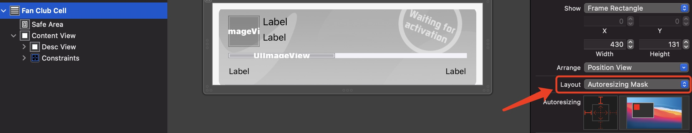

# Storyboard
本章主要记录可视化编程的一些问题，以及如何解决这些问题。附带可视化编程的一些技巧。

## 添加自定义颜色
选择自定义颜色`Custom`，在第二个选项"颜色滑块"中选择`RGB Sliders`，在底部可以输入十六进制颜色


## 在xib中添加自定义属性
`@IBDesignable`和`@IBInspectable`是iOS8的新特性，可以实时渲染在`interface builder`上，直接对值进行修改视能实时发生变化。`layer.borderWidth、borderColor、cornerRadius`这些属性在xib上是不能直接设置的，@IBDesignable和@IBInspectable利用运行时机制，可以把这些属性映射到xib上，同时还可以映射自定义的属性。

## XIB创建TableViewCell
```oc
// 创建cell
[_tableView registerNib:[UINib nibWithNibName:@"PersonMessageCell" bundle:nil] forCellReuseIdentifier:@"PersonMessageCell"];

// 使用
- (UITableViewCell *)tableView:(UITableView *)tableView cellForRowAtIndexPath:(NSIndexPath *)indexPath{
    PersonMessageCell *cell = [tableView dequeueReusableCellWithIdentifier:@"PersonMessageCell"];
    return cell;
}
```

## UIScrollView
在Xib中使用UIScrollView的时候，需要注意在iOS11之后，UIScrollView增加了`framelayoutGuide`和`contentLayoutGuide`.
```markdown
* `framelayoutGuide:` 框架布局指南，就是指框架本身，这里的框架就是UIScrollView
* `contentLayoutGuide:` 内容布局指南，滚动视图内容的布局指南，指的UIScrollView里面的布局
```


如果是 iOS11 以下在XIB中使用UIScrollView按照以下的步骤:

```markdown
1. xib中添加scrollview，添加对父控件约束
2. scrollview取消 Content Layout Guides 按钮，取消后，不再使用 framelayoutGuide 和 contentLayoutGuide
3. scrollview内部添加UIview，设置四周边距，如果上下滑动设置跟scrollview等宽，这个时候还会报错，不管它
4. 在UIview上 设置 我们想要添加的控件，注意要设置顶部跟底部跟UIview的约束
5. 注意CongtentView的宽度，设置跟ScrollView的宽度一致，
6. 删除ContentView约束上的固定宽高约束
```


## 遇到的问题
1. 在使用xib编程，给对应的View设置圆角时，`遇到只有左边是圆角，右边不显示圆角的情况`，这是因为你在设置圆角的时候，**View的宽度还是你在xib中使用模拟器的宽度，并不是它真实屏幕的宽度。**


## 在Xcode，手机iOS15中，遇到过的适配问题
1. Must translate autoresizing mask into constraints to have _setHostsLayoutEngine:YES Xcode 13

仅在 iOS 15 上的 Xcode 13.0 也发生了同样的事情，需要将cell视图设置为Layout: `Autoresizing Mask `，如下图：



2. 仅在 iOS 15 上的 Xcode 13.0 ，使用stacke时，需要注意它默认是有背景的。