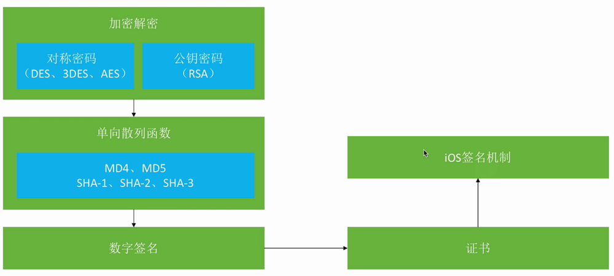

# iOS签名
为什么iOS会需要各种证书呢？为什么真机调试要用`.mobileprovision`文件呢？为什么只能调试在苹果账号中注册的设备上呢？这就要说到iOS的签名机制。

**学习路线:** 加密解密 -> 单向散列函数 -> 数字签名 -> 证书 -> iOS签名机制


## 加密解密
加密主要是为了防止别人窃听到通讯内容。加密解密中常见的几个英文单词`encrypt-加密`、`decrypt-解密`、`plaintext-明文`、`ciphertext-密文`。为了方便我们学习，设计了4个虚拟人物: 
1. Alice、Bob: 互相通信
2. Eve: 窃听者
3. Mallory: 主动攻击者

Alice 为了防止通讯内容被 Eve 监听，在发送消息时，对消息内容使用密钥进行加密，Bob 接收到消息之后，使用密钥进行解密。这样 Eve 即使监听到消息，没有密钥也不能知道消息内容，达到了防止别人窃听的效果。

**根据密钥的使用方法，密码可以分为两种加密：**
* `对称密码:` 加密解密使用的密钥是相同的。缺点：因为密钥是相同的，存在密钥配送问题
* `公钥密码(也称为非对称密码):`加密用的密钥和解密用的密钥是不同的。 缺点：加密解密速度慢

> 常见的对称密码算法: DES、3DES、AES

1. `DES加密：` DES是一种将64bit明文加密成64bit密文的对称密码算法，密钥长度是56bit。规格上来说，密钥长度是64bit，但每隔7bit会设置一个用于错误检查的bit,因此密钥长度实质是56bit，DES每次只能加密64bit的数据，遇到比较大的数据，需要对DES加密进行迭代。目前可以在短时间内破解，不建议使用。
2. `3DES:`  就是使用DES算法用不同的密钥加密三次,解密时使用相反的顺序解密三次
3. `AES:` 选择Rijindael算法作为AES的实现，是目前首选的对称密码算法。

在使用对称密码时，因为加密和解密使用的是同一个密钥，一定会遇到密钥配送问题。解决密钥配送问题的方法：
1. 事先共享密钥
2. 密钥分配中心
3. Diffie-Hellman密钥交换
4. 使用公钥密码

> 常见的公钥密码算法: RSA
 
公钥密码也称为`非对称密码`,密钥分为`加密密钥`和`解密密钥`,也叫`公钥和私钥`。公钥和私钥是一一对应的，不能单独生成。公钥任何人都可以持有，私钥只有消息接收者自己持有。**可以使用公钥加密数据使用私钥解密，也可以使用私钥加密数据使用公钥解密。**

> 混合密码系统

对称密码的缺点是不能很好的解决密钥配送问题，而公钥密码的缺点是加密解密速度比较慢，将这两种加密方法相结合能很好的解决这两个问题。网络上的密码通信所用的SSL/TLS都运用了混合密码系统。

例如下面这张图，Alice 向 Bob 发送消息:
1. Alice 使用伪随机数生成器生成本次会话秘钥
2. 使用对称密码将明文加密成密文，密钥为随机数生成的会话秘钥
3. Alice 使用 Bob 的公钥对会话秘钥进行加密
4. 将加密后的会话秘钥和密文消息进行组合发送给 Bob


Bob收到消息:
1. 使用私钥解密出会话秘钥
2. 使用会话秘钥解密消息内容

## 单向散列函数
单向散列函数也被称为消息摘要函数/哈希函数，输出的散列值，也被称为消息摘要/指纹，可以根据消息内容计算出散列值，散列值的长度和消息的长度无关，无论消息是1bit、10M还是100G，单向散列函数都会计算出固定长度的散列值。
单向散列函数的特点:
1. 根据任意长度的消息，计算出固定长度的散列值
2. 计算速度快
3. 消息不同，散列值不同
4. 具备单向性，根据散列值，无法推算出消息内容

**常见的几种单向散列函数：**
1. MD4、MD5: 产生128bit的散列值(目前已不安全)
2. SHA-1: 产生160bit位的散列值目前已不安全)
3. SHA-2: 分别有SHA-256、SHA-384、SHA-512,散列值长度分别是256bit、384bit、512it

**单向散列函数的使用场景**
1. 利用单向散列函数的特点，可以防止数据被篡改。比如有一些网站，会将软件的散列值公布出来。用户可以通过对比散列值确定文件是否被篡改
2. 存储用户密码，防止被窃取，将用户的密码使用单向散列函数的方式存储在数据库。

## 数字签名
Alice 向 Bob 发送了一条消息，Bob 如何确定消息内容没有被篡改、伪装、如何确定这就是 Alice发送的消息防止他否认呢？这就要用到了数字签名。 

使用签名首先需要消息发送者生成签名，消息接收者来验证签名。**如何保证签名是消息发送者自己签的，很简单，使用消息发送者的私钥进行签名即可。**

在学加密解密的时候，我们知道公钥密码算法分公钥和私钥，公钥所有人都可以拥有，私钥只有本人才拥有。加密的流程是拿消息接收者的公钥进行加密，消息接收者收到消息之后使用私钥进行解密。

而签名则相反，签名需要消息发送者使用私钥进行加密生成签名，消息接收者收到签名之后，使用发送者的公钥进行解密。例如下面这张图：

> 数字签名的过程

1. Alice 生成秘钥对 
2. Alice 将自己的公钥发送给 Bob
3. Alice 用私钥进行加密，生成签名。（这里使用单向散列函数对消息内容生成散列值，是为了减小传输数据。因为单向散列函数的特点是唯一和不可逆。消息接收者拿到消息之后，只要生成对应的散列值对比就知道消息内容有没有被篡改）
4. 将加密后的消息和签名发送给 Bob
5. Bob拿到签名后的消息，使用 Alice 的公钥验证签名，获取到散列值和消息内容，将消息内容使用单向散列函数生成散列值，对比解密之后的散列值，一致则签名正确


> 数字签名不能解决的问题

**数字签名不能保证机密性，数字签名仅仅是为了能够识别内容有没有被篡改。**不能解决中间人攻击的问题。比如下面这张图：

当 Alice 和 Bob 发送消息时，中间人 Mallory 监听两人的通讯，分别拦截对方的消息，向对方发送自己的公钥和签名。这样就可以随意监听和篡改消息内容。这就是中间人攻击。


正确使用签名的前提是:**用于验证签名的公钥必须属于真正的发送者**，所以在验证签名之前，首先需要验证公钥的合法性。怎么才能验证公钥的合法性呢？证书就要随之而来了。

## 证书
密码学中的证书叫公钥证书，里面包含姓名、邮箱等个人信息以及此人的公钥。由认证机构施加数字签名。可以提供数字签名的个人和组织有:
1. 国际性组织和政府设立的组织
2. 通过提供认证服务来盈利的企业
3. 个人也可以成立认证机构。

> 证书的使用方法


简化流程:
1. Bob 将自己的公钥提供给第三方机构
2. 第三方机构使用自己的私钥对 Bob 的公钥进行签名，生成证书
3. Alcie从第三方机构的公钥验证数字签名，确认 Bob 公钥的合法性。
4. 利用 Bob 的公钥加密消息发送给 Bob

## iOS签名机制
iOS签名机制的作用是为了保证安装到用户手机上的APP都是经过Apple官方允许的。不管我们是真机调试还是发布APP，都需要经过这些步骤：
1. 生成`CertificateSigningRequest.certSigningRequest`文件
2. 获取`ios_development.cer\ios_distribution.cer`文件
3. 注册device、添加App ID
4. 获取`.mobileprovision`文件

iOS的签名机制流程：
```
.certSigningRequest文件 -> Mac公钥
.cer文件 -> 利用Apple私钥(CA)，对Mac公钥生成了数字签名
.mobileprovision -> 利用Apple私钥，对[.cer证书+devices+AppID+entitlements]进行数字签名
苹果的每台手机都有Apple的公钥，安装到手机上的包会使用苹果公钥进行验证。
```

如果软件是从App Store中下载安装的，将没有`.mobileprovision`文件。因为App Store下载渠道本身就是合法的。上传到App Store的包，苹果会通过它的私钥进行签名，安装时直接使用Apple公钥验证签名就可以了。


## 总结
*  加密解密算法: 分为 对称密码 和 非对称密码
   * 对称密码 加密解密使用同一个密钥，加密解密速度快，无法解决密钥配送问题
   * 公钥密码 加密解密使用不同的密钥，加密解密速度慢，可以解决密钥配送问题
* 单向散列函数： 根据消息生成对应的固定长度的散列值，作用是防止数据被篡改  
* 数字签名：用私钥加密消息的散列值生成的密文
* 证书： 用 CA机构 的私钥，对其他人的公钥生成数字签名。