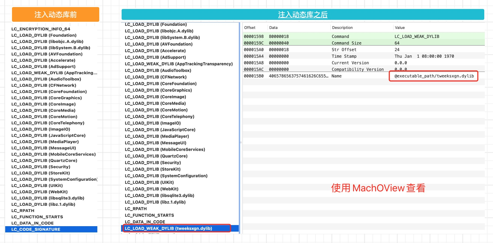
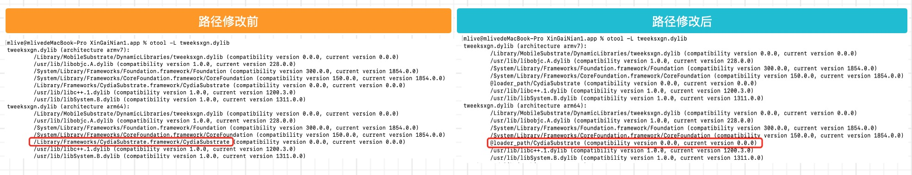
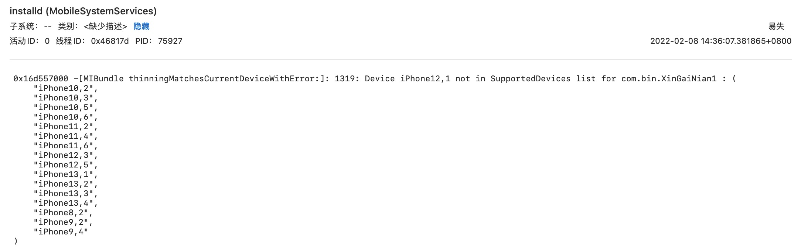

# IPA重签名
IPA其实是一个`Payload`文件,压缩之后将后缀改为IPA而已。使用`file`命令可以查看它的文件的本质:
```shell
MacBook-Pro ~ % file ~/Desktop/123.ipa 
~/Desktop/123.ipa: Zip archive data, at least v2.0 to extract
```
可以看到它本质还是一个压缩文件。在项目中，我们编译之后在`Product`文件下就有一个`xxx.app`的文件，创建一个 `Payload`文件夹，将xxx.app放到`Payload`文件夹中，将`Payload`文件夹进行压缩之后将后缀名 zip 改成 ipa 即可。

>注意: 安装包中的可执行文件必须是经过脱壳的，重签名才会有效。重签名后，在安装过程中，可以通过Mac电脑中的控制台查看安装中的出错信息。

如果是使用超级签的方式分发APP，可以使用一个未付费的苹果账号，手动将`xxx.app`转成`xxx.ipa`,超级签需要对IPA进行重签名，这样就省一个苹果账号😁。

## 重签名原理
重签名的原理是将IPA安装包内原有的签名进行删除,使用`codesign`签名工具对项目资源、权限文件、静态库 使用自己的证书进行重新签名。需要修改的文件有`_CodeSignature`文件、`embedded.mobileprovision`文件。需要重签名的有**所有的动态库(.framework/.dyllib)、AppExtension(PlugIns文件夹，扩展名是appex)、WatchApp(Watch文件夹)都需要重新签名**
```markdown
* `_CodeSignature/CodeResources`是一个plist文件，可用文本查看，内容就是程序包中（不包括Frameworks）所有文件的签名。注意是所有文件。意味着你的程序一旦签名，就不能更改其中任何的东西，包括资源文件和可执行文件本身。iOS系统会检查这些签名
* `embedded.mobileprovision`文件包含`.cer证书 + devices + AppID + entitlements权限`信息
```
IPA重签名是将原有的签名文件替换成自己证书的签名文件，这样就可以安装到自己的测试设备上，或者使用企业证书进行重签名进行分发。GUI重签名工具[iOS App Signer 点击下载](https://github.com/DanTheMan827/ios-app-signer/tags)

## 重签名的准备工作:
1. 需要一个有效的证书和对应的描述文件(xxx.mobileprovision文件)，注意：**必须将描述文件命名为`embedded.mobileprovision`,否则即使签名成功也不能安装成功**
2. 需要从描述文件中导出`entitlements.plist`文件

#### 获取证书ID
我们可以使用`security find-identity -p codesigning -v ` 命令列出所有的开发者证书，如下:
```shell
MacBook-Pro ~ % security find-identity -p codesigning -v
  1) 6BE061DD73BEA789127562257EA740BB4537353F "Apple Development: xxx xxx (xxxx)"
  2) A3FF22C8B6F0CC62BE54968E5EFD19A5B6225A04 "Apple Distribution: xxx xxx (xxxxx)"
```
其中`6BE061DD73BEA789127562257EA740BB4537353F` 是证书ID，`Apple Distribution: xxx xxx (xxxxx)`是证书名称。重签名时选择证书ID或者证书名称都可以。

#### 获取 entitlements.plist 文件
`entitlements.plist`文件可以从`embedded.mobileprovision`描述文件中获取。首先需要将描述文件生成plist文件，然后从生成的plist文件中抽取出关于权限的信息，生成一个新的plist文件。步骤如下:
```markdown
1. 使用 `security cms -D -i embedded.mobileprovision > embedded.plist` 命令将  `embedded.mobileprovision`文件生成一个`embedded.plist`文件
2. 使用`/usr/libexec/PlistBuddy -x -c 'Print:Entitlements'  embedded.plist > entitlements.plist` 命令从生成的plist文件中导出key为`Entitlements`的部分，命名为`entitlements.plist`文件 
```

## 对IPA进行重签名
准备工作完成后，可以开始对IPA文件进行重签名，签名分为以下步,首先对ipa文件进行解压,删除原有的签名文件`_CodeSignature`,替换原来的描述文件，使用`codesign -f -s`命令进行重签名，最后进行打包。如下:
```markdown
1. 解压ipa包 : `unzip xxx.ipa`
2. 删除签名文件 : `rm -rf Payload/xxx.app/_CodeSignature/`
3. 替换`mobileprovision`文件 : `cp embedded.mobileprovision Payload/xxx.app/`
4. 使用codesign进行重签名 : `codesign -f -s "证书ID或者证书名称" --entitlements entitlements.plist Payload/xxx.app`。需要注意的是项目中的静态库也需要重新签名，在下面的shell中有讲
5. 重新打包 : `zip -r resign_xxx.ipa Payload/`
```
如果项目中有使用到动态库和推送扩展时，也需要对它们进行重新签名，比如声网的动态库。签名的步骤是一样的,删除掉原来的签名文件，使用`codesign -fs "证书ID或者证书名称"  xxx.framework`对库进行重签名。步骤如下:
```markdown
1. 查看framework的签名证书命令:  `codesign -d -vv xxxxx.framework`
2. 删除原有的签名: 进入到xx.framwork文件夹内，删除`_CodeSignature`文件
3. 查看本机可用的签名文件:  `security find-identity -v` 
4. 使用签名文件签名命令: `codesign -fs "iPhone Developer: ... (...)"  xxx.framework`
```

## 使用shell脚本进行重签名
我们可以通过 shell 脚本执行重签名操作,将`embedded.mobileprovision`、`entitlements.plist`、ipa、shell文件放到同一个目录下。cd 到对应文件下，输入`sh xxx.sh xx.ipa`运行脚本即可。

如果项目内有多个动态库和扩展库的签名文件，都会进行重新签名。相关的shell脚本代码如下:
```shell
#!/bin/sh

if ! ([ -f "$1" ]); then
echo ----- \"${1}\"IPA文件不存在
exit
fi

ipaName=${1%.ipa}

if [ "$ipaName" = "$1" ]; then
echo ----- \"${1}\"error 不是ipa文件
exit
fi

## 证书名称
signName="iPhone Distribution: Hirich xxx Company Limited"

## step 1 解压ipa
echo "step 1 解压ipa"
unzip ${ipaName}.ipa

## step 2 删除旧签名文件
echo "step 2 删除旧签名文件 $app_path"
rm -rf Payload/*.app/_CodeSignature/

## step 3 拷贝证书配置和权限文件
echo "step 3 拷贝证书配置和权限文件"
cp embedded.mobileprovision Payload/*.app/embedded.mobileprovision

## step 4  重签frammework
echo "step 4 重签frammework"
framework_path=Payload/*.app/Frameworks
#判断有没有这个文件夹
if [ -e $framework_path ]
then
    for f in ${framework_path}/*
    do
        codesign -fs "${signName}" "${f}"
    done
fi

## step 5  重签 推送扩展
echo "step 5 重签 推送扩展"
extension_path=Payload/*.app/PlugIns
#判断有没有这个文件夹
if [ -e $extension_path ]
then
    for f in ${extension_path}/*
    do
        codesign -fs "${signName}" "${f}"
    done
fi

## step 6 重签名,这里要用到entitlements.plist文件，签名不对会安装失败
echo "step 6 重签名整个包"
/usr/bin/codesign -f -s "$signName" --entitlements entitlements.plist Payload/*.app/

## step 7 打包
echo --- "开始打包"
zip -r ${ipaName}_resign.ipa Payload/
rm -rf Payload/
rm -rf __MACOSX/
```

## Plist管理工具 - PlistBuddy
PlistBuddy 是 Mac电脑自带的操作 plist 文件的工具,文件路径`/usr/libexec/PlistBuddy`,使用方式:` /usr/libexec/PlistBuddy -c "Set key value" plist文件路径`

假设我们有一个plist文件如下,对其进行添加、修改、删除操作,每一个节点使用`:`号进行操作
```xml
<?xml version="1.0" encoding="UTF-8"?>
<!DOCTYPE plist PUBLIC "-//Apple//DTD PLIST 1.0//EN" "http://www.apple.com/DTDs/PropertyList-1.0.dtd">
<plist version="1.0">
<dict>
	<key>Platform</key>
	<dict>
		<key>item</key>
		<string>iOS</string>
	</dict>
	<key>Version</key>
	<string>1.0</string>
</dict>
</plist>
```

1. 添加
```shell
#  在 Platform下进行添加item1
/usr/libexec/PlistBuddy -c 'Add :Platform:item1 string "android"' ~/Desktop/example.plist
#  在根路径下添加name键
/usr/libexec/PlistBuddy -c 'Add :name string "example"' ~/Desktop/example.plist
```

2. 打印plist文件
```shell
# 打印plist文件
/usr/libexec/PlistBuddy -c "Print" ~/Desktop/example.plist
# 打印plist文件下的 Platform
/usr/libexec/PlistBuddy -c "Print:Platform" ~/Desktop/example.plist
# 打印plist文件 并且根据 Platform 生成新的plist文件,注意多了-x -c
/usr/libexec/PlistBuddy -x -c 'Print:Platform' ~/Desktop/example.plist > ~/Desktop/example1.plist
```

3. 修改
```shell
# 修改Version为1.1
/usr/libexec/PlistBuddy -c 'Set :Version "1.1"' ~/Desktop/example.plist
```

4. 删除
```shell
/usr/libexec/PlistBuddy -c 'Delete :Version' ~/Desktop/example.plist
```

5. 合并两个plist文件
```shell
# 需要先切换到对应的目录下
/usr/libexec/PlistBuddy  -c 'Merge a.plist' example.plist 
```

## 重签名tweak项目
tweak别人项目的代码如果想安装在非越狱的设备上，也需要对动态库进行签名。比现在的重签名多了注入动态库和修改动态库中的依赖路径。

我们知道tweak的原理是在程序启动时，Cydia 在`/Devcie/Library/MobileSubstrate/DynamicLibraries/xxx`路径下加载对应的tweak动态库。如果是非越狱手机，本身就没有 Cydia 商店，应该怎么弄呢？

可以通过对可执行文件注入tweak动态库，并且重新签名的方式安装。步骤如下:
```markdown
1. 首先需要通过`otool -l | grep cry`确定应用是否需要脱壳，应用重签名必须脱壳。
2. 开发tweak代码，`make package && make install`安装tweak动态库,使用 iFunbox 将动态库从手机拷贝到Mac设备上。路径是`Devcie/Library/MobileSubstrate/DynamicLibraries/xxx`
3. 使用`otool -L xxx.dylib`查看tweak动态库依赖的其他动态库,将手机中的`CydiaSubstrate`和`CydiaSubstrate`依赖的`libsubstitute.0.dylib`动态库都复制到Mac中。
4. 将tweek动态库、`CydiaSubstrate`、`libsubstitute.0.dylib`放在应用中的`xxx.app`文件夹中
5. 使用`insert_dylib @executable_path/xxx.dylib Mach-O文件 --all-yes --weak`指令将tweak动态库注入到应用的可执行文件中
6. 使用`install_name_tool -change  旧地址  新地址  Mach-O文件`指令修改tweek动态库依赖的其他动态库路径，同样需要修改`CydiaSubstrate`依赖的动态库路径。
7. 使用`codesign -fs  证书ID  动态库`指令对动态库进行重新签名
8. 对IPA进行重新签名
```
在 注入动态库 和 修改动态库中的其他动态库路径时，用到了`@executable_path` 和 `@loader_path`，它们分别表示不同的含义:
```markdown
* `@executable_path`: 代表可执行文件所在的目录
* `@loader_path`: 代表动态库所在的目录
```

#### tweak动态库重签名详细过程
1. 通过`otool -l | grep cry`确定应用是否需要脱壳，重签名应用必须脱壳。脱壳工具可以使用 frida。步骤如下:
```markdown
   1. 手机打开应用,使用`frida-ps -Ua`查看应用的`Bundle ID`
   2. 开启端口映射，将手机通过usb连接到电脑，使用`iproxy 2222 22`进行端口映射
   3. 使用`python3 dump.py -H 127.0.0.1 -p 2222 -u root -P alpine com.bigo.live`指令对应用进行脱壳
```
2. 开发应用tweak代码，使用`make clean && make && make package && make install`安装tweak动态库。通过 iFunBox 在手机路径`Devcie/Library/MobileSubstrate/DynamicLibraries/xxx`下将动态库复制到Mac电脑中。
    
3. 使用`otool -L xxx.dylib`查看tweak动态库依赖的其他动态库。如下图:
   
   tweek动态库依赖`CydiaSubstrate`动态库,`CydiaSubstrate`依赖`libsubstitute.0.dylib`动态库,将它们都复制到Mac设备中。
4. 将tweek动态库、`CydiaSubstrate`、`libsubstitute.0.dylib`这三个动态库放在应用中的`xxx.app`文件夹中,跟APP可执行文件在同一个目录下.
5. [点击下载insert_dylib](https://github.com/Tyilo/insert_dylib),编译之后将`insert_dylib`命令行工具放在`/usr/local/bin`目录下,通过`insert_dylib`指令将tweak动态库注入到应用的可执行文件中
```shell
cd XinGaiNian1.app 
insert_dylib @executable_path/tweeksxgn.dylib XinGaiNian1 --all-yes --weak 
```
回车后会发现重新生成一个新的可执行文件,文件名为`xxx_patched`，如果你不希望生成一个新的文件，在指令后添加可执行文件的名字,比如:
```shell
insert_dylib  @executable_path/tweeksxgn.dylib  XinGaiNian1  --all-yes --weak XinGaiNian1
```
指令后可选参数代表的含义是:
```markdown
    * `--all-yes` : 指令敲出后全部选择yes
    * `--weak` : 弱引用动态库，当注入的动态库找不到时不至于崩溃
```
我们通过 MachOView 或者`otool -L`指令对比注入前后的可执行文件，会发现可执行文件多了一个`tweeksxgn.dylib`动态库，如下图:




6. 我们在第三步的时候通过`otool - L`指令知道tweak动态库依赖于`CydiaSubstrate`,我们将它们拷贝到`xxx.app`包中,现在需要修改tweak动态库中的依赖路径,使用`install_name_tool -change  旧地址  新地址  Mach-O文件`指令进行修改:
```shell
install_name_tool -change /Library/Frameworks/CydiaSubstrate.framework/CydiaSubstrate @loader_path/CydiaSubstrate  tweeksxgn.dylib
```
修改前后的路径对比，如下图:

同样,我们也需要修改`CydiaSubstrate`动态库中关于`libsubstitute.0.dylib`的依赖路径
```shell
install_name_tool -change /usr/lib/libsubstitute.0.dylib @loader_path/libsubstitute.0.dylib CydiaSubstrate 
```
7. 使用`codesign -fs  证书ID  动态库`指令对动态库进行重新签名
```markdown
    1. 使用`security find-identity -p codesigning -v` 命令查看有效的开发者证书
    2. `codesign -fs 证书ID  tweeksxgn.dylib`对tweek动态库进行签名
    3. `codesign -fs 证书ID  CydiaSubstrate` 对CydiaSubstrate动态库进行签名
    4. `codesign -fs 证书ID  libsubstitute.0.dylib` 对libsubstitute.0.dylib动态库进行签名
```
8. 通过上面的 shell 脚本对IPA进行重新签名,使用 iFunBox 安装过程中可以通过控制台查看安装信息

#### tweak动态库重签名可能出现的问题
1. 在重签名后,使用 iFunBox 依旧不能安装IPA,这时我们可以通过Mac中的控制台查看安装错误信息,打开控制台，搜索`installd`。如果出现安装错误时，挨个查看控制台中的installd信息，可以看到错误信息，如下图:
    
如果出现上面的安装错误时，说明在设备列表不支持当前设置，删除`info.plist`文件中的`UISupportedDevices`信息,对IPA进行重新签名。
2. IPA可以安装成功，但是打开APP就会出现闪退.可以通过`Xcode -> Window -> Devices and Simulators -> View Device Logs`查看手机的崩溃日志，确定崩溃原因。如下图:
    

## 参考网址
* [iOS软件包ipa重签名详解](https://www.jianshu.com/p/609109d41628)
* [ipa重签名](https://segmentfault.com/a/1190000023388431)
* [PlistBuddy](https://www.jianshu.com/p/e0d254ce9340)
* [ios-app-signer 重签名工具](https://github.com/DanTheMan827/ios-app-signer/releases/tag/1.13.1)